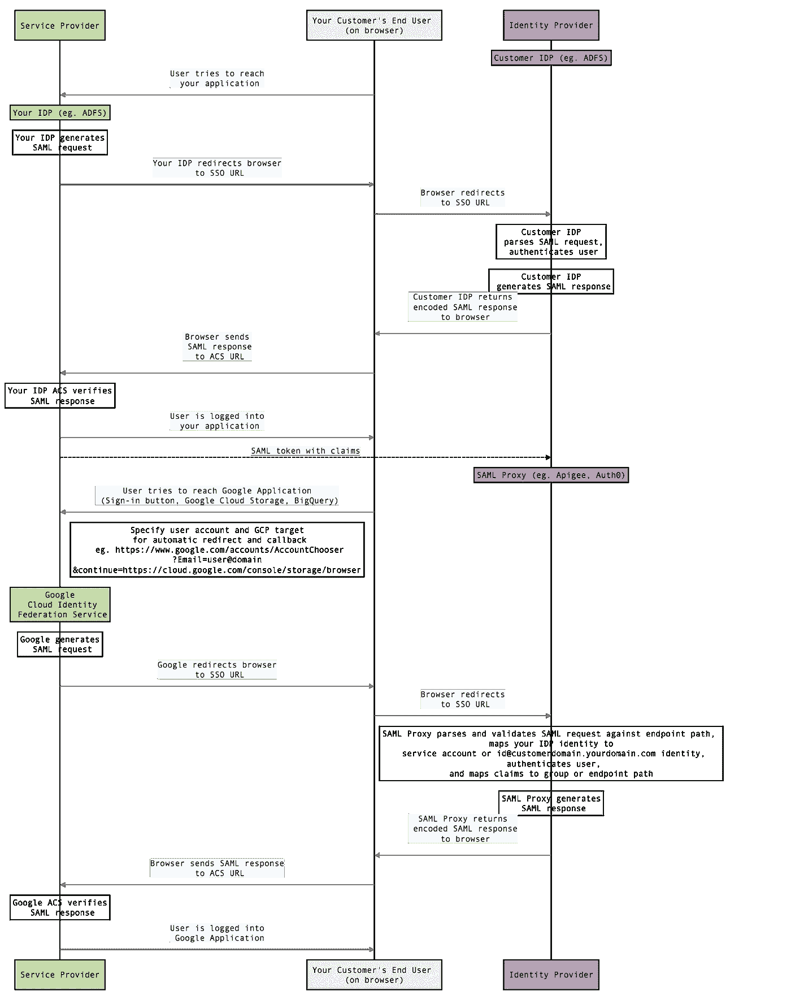

# 多租户谷歌云平台 B2B SaaS 应用指南

> 原文：<https://medium.com/google-cloud/multi-tenant-google-cloud-platform-saas-applications-how-to-fbd16c8a9766?source=collection_archive---------2----------------------->

## 认证和授权

# 概观

本文解决了在[概念文章](https://medium.com/p/f40cd9ae72a0/edit)中描述的认证和授权挑战。

身份验证和授权本质上都与身份紧密相关。

谷歌云平台中有许多身份机制，所有这些机制都可以[作为授权策略的委托人](https://cloud.google.com/iam/docs/overview#concepts_related_identity):

*   云身份代表用户身份，也可用于身份验证。
*   Google Groups 代表用户身份的分组。谷歌群组有几种类型；我们将关注[管理控制台组](https://support.google.com/a/answer/33329)。
*   [服务账户](https://cloud.google.com/iam/docs/understanding-service-accounts)主要用于代表应用程序，通常通过基于 OAuth 的认证。
*   谷歌域名；我们将在 [How to: Isolation](https://medium.com/p/3fc48162ef39/edit) 一文中更深入地讨论这些问题。
*   [签名 URL](https://cloud.google.com/storage/docs/access-control/signed-urls)是授权 Google 云存储上传和下载的有时间限制的令牌。

# **认证**

## 云身份

如前所述，云身份是主要的用户认证机制。身份可以通过 SAML 和 OpenID Connect 进行联合[；这意味着您的客户可以直接与谷歌云平台联合他们的用户，或者如果他们已经与您建立了联合关系，您可以代表他们联合您客户的用户，例如通过](https://cloud.google.com/identity/solutions/enable-sso) [AD FS](https://msdn.microsoft.com/en-us/library/bb897402.aspx) 。

Google Cloud SAML 服务提供商支持单个 SAML IDP，因此要支持多个客户租户，您需要采取以下方法之一:

*   使用 SAML 代理，如 [Apigee](https://docs.apigee.com/api-platform/system-administration/enabling-saml-authentication-edge) 或 [Auth0](https://auth0.com/docs/protocols/saml/saml-configuration) 。
*   如果您要为客户提供最终用户管理功能，请为每个客户分配一个域或子域(请参阅隔离文章了解更多相关信息)。

注意，谷歌云联盟不支持动态 SAML(即。认证时身份的创建)；必须使用以下受支持的机制之一提前调配用户的云身份:

*   身份管理解决方案，如 [Oracle Identity Manager](https://docs.oracle.com/cd/E22999_01/doc.111/e18798.pdf) 、[ping federal](https://docs.pingidentity.com/bundle/googleAppsConn31_sm_quickConnect/page/googleAppsConn_c_pingFederateGoogleAppsConnector.html)或 [Okta](https://saml-doc.okta.com/Provisioning_Docs/G_Suite_Provisioning.html) (忽略遗留的 Google Apps 和 G Suite 品牌；这些也适用于云身份)。
*   [谷歌云目录同步](https://support.google.com/a/answer/106368) (GCDS)。
*   [Admin SDK 目录 API](https://developers.google.com/admin-sdk/directory/) (忽略遗留 G Suite 品牌；这也适用于云身份)。
*   [电子表格上传](https://support.google.com/a/answer/40057?hl=en)(忽略传统 G 套件品牌；这也适用于云身份)。对于试用你的服务的客户来说，这是一个很好的匹配。

在某些情况下，您可能希望为客户的用户提供自助式用户资源调配门户。以下 Python 代码片段演示了如何针对此用例利用[管理 SDK 目录 API](https://developers.google.com/admin-sdk/directory/) :

```
# List users on the domainfrom googleapiclient import discovery
from google.oauth2 import service_accountSCOPES = ("[https://www.googleapis.com/auth/admin.directory.group](https://www.googleapis.com/auth/admin.directory.group)","[https://www.googleapis.com/auth/admin.directory.user](https://www.googleapis.com/auth/admin.directory.user)")
SUBJECT = '[SERVICE_USER@DOMAIN]'target_key_file = '[YOUR_KEY_FILE.JSON]'
credentials = service_account.Credentials.from_service_account_file(target_key_file)
scoped_credentials = credentials.with_scopes(SCOPES)
delegated_credentials = scoped_credentials.with_subject(SUBJECT)admin_client = discovery.build('admin', 'directory_v1', credentials=delegated_credentials)
req = admin_client.users().list(domain='[CUSTOMER_DOMAIN]')
resp = req.execute()
users = resp['users']print users
```

有关更全面的实现，请参见[这个示例应用](https://github.com/demoforwork/public/tree/master/SelfServiceProvisioning)。

## Google 登录

对于那些不适合使用基于单点登录的解决方案的客户来说， [Google Sign-In](https://developers.google.com/identity/sign-in/web/sign-in) 提供了一种简单的方式来为您的 SaaS 应用程序利用 Google 的认证基础设施。它提供了以下[密码控制](https://support.google.com/a/answer/139399?hl=en):

*   长度和强度加强
*   轮换执行
*   重复使用预防

它还通过 [2FA 实施](https://support.google.com/a/answer/2548882?hl=en)和基于 API 的[密码重置](https://developers.google.com/admin-sdk/directory/v1/reference/users/update)提供强大的网络钓鱼保护(下面是示例 Python 片段)

```
# Reset passwordfrom googleapiclient import discovery
from google.oauth2 import service_accountdomain = '[YOUR_DOMAIN]'
delegated_admin = '[YOUR_SERVICE_ADMIN]' # id only (ie. without [@domain](http://twitter.com/domain))
key_file = '[SERVICE_ACCOUNT_JSON_KEY_FILE]'
user = ''.join(['YOUR_USER','@',domain])
password = 'NEW_PASSWORD'scope = ("[https://www.googleapis.com/auth/admin.directory.user](https://www.googleapis.com/auth/admin.directory.user)",)
subject = ''.join([delegated_admin,'@',domain]);
delegated_credentials = service_account.Credentials.from_service_account_file(key_file, scopes=scope, subject=subject)authorized_service = discovery.build('admin', 'directory_v1', credentials=delegated_credentials)
req = authorized_service.users().update(userKey=user,body={"password":password, "changePasswordAtNextLogin":True})
resp = req.execute()print resp
```

## 服务帐户

[服务账户](https://cloud.google.com/iam/docs/understanding-service-accounts)主要用于表示应用程序；这为通过 [OAuth](https://oauth.net/2/) 授权您的客户提供了一个自然的机制。

典型的模式是您或您的客户发布一个服务帐户，另一方作为委托人授权。这有几个优点:

*   如果您的客户发布服务帐户，他们可以完全负责管理对该帐户的访问，因此作为 SaaS 提供商，您不需要向您的客户提供最终用户管理或联合功能。
*   它支持对合资企业的授权，在合资企业中，数据访问 a)受时间限制，b)受商业实体限制，而不是受用户限制。
*   谷歌云平台日志和审计将反映服务账户，简化计费和收费。

这种模式也有一些限制:

*   它没有提供对终端用户进行身份验证的机制
*   服务帐户必须按照所需的授权、计费和收费级别进行授权和管理，这可能会导致服务帐户激增以及随之而来的生命周期管理挑战。可以通过[服务帐户令牌创建者角色](https://cloud.google.com/iam/docs/service-accounts#the_service_account_token_creator_role)来缓解这种激增，该角色允许模拟服务帐户来创建 OAuth2 访问令牌并签署 blobs 或 jwt。您可以利用这一功能使用户能够根据需要制造令牌，或者将客户服务帐户映射到您的应用程序服务帐户。

当然，服务帐户也是您自己的 SaaS 微服务应用程序的服务间通信的组成部分(参见[本文](https://cloud.google.com/appengine/docs/standard/python/microservices-on-app-engine)中的示例应用程序引擎实现)。

# **授权**

关键的授权挑战之一是将客户的用户策略映射到您的 GCP 应用程序用户策略。

这里有几种方法:您选择哪一个将在很大程度上取决于用例。

*   SAML 声称:您的客户完全负责管理哪些用户被允许访问哪些服务和数据；您可以将这些映射到[管理控制台组](https://support.google.com/a/answer/33329)(见下文)或服务帐户，以利用 Cloud IAM 对这些的本机支持。
*   [管理控制台组](https://support.google.com/a/answer/33329)或服务帐户:您提供一个管理控制台，您的客户通过它来定义用户授权。

## SAML 索赔

谷歌云平台 IAM 不直接支持 SAML 声明，所以你需要在你的应用程序或 SAML 代理中解释声明，比如 [Apigee](https://docs.apigee.com/api-platform/system-administration/enabling-saml-authentication-edge) 或 [Auth0](https://auth0.com/docs/protocols/saml/saml-configuration) 。



Google 帐户的第三方 SAML 授权流

Apigee 支持许多[现成的安全策略](https://docs.apigee.com/api-platform/reference/policies/reference-overview-policy)的策略注入，以及脚本定制策略(例如，在其 SAML 断言中具有 customer=MySecureCustomer 属性的用户可以使用？customer=MySecureCustomer 参数)

[这个 SAML IDP/服务提供者示例](https://github.com/salrashid123/googlapps-sso)提供解码的响应信息，是一个很好的测试平台。

## 管理控制台组

[管理控制台组](https://support.google.com/a/answer/33329)由云身份域管理员(而不是任意终端用户)管理，并且可以通过 [API](https://developers.google.com/admin-sdk/directory/v1/guides/manage-groups) 进行调配和配置(忽略传统的 G Suite 品牌；这也适用于云身份)。

有两种方法可以利用组进行授权

*   授予谷歌集团云平台 IAM 角色。
*   您的应用程序可以利用 [Admin SDK Groups API](https://developers.google.com/admin-sdk/directory/v1/reference/groups) (忽略遗留的 G Suite 品牌；这也适用于云身份)来发现哪些用户是组的成员，成员属于哪些组，以及嵌套组层次结构中组的直接父组(将[用户键](https://developers.google.com/admin-sdk/directory/v1/reference/groups/list)设置为您希望找到其父组的用户或组)。

请注意，您的应用程序只能看到属于其域的管理控制台组，除非通过域范围的委托明确授予了额外的权限(有关这方面的更多信息，请参见隔离文章)；即。您的应用程序通常无法在主域中的用户所属的另一个域中找到父组。

## 用户模拟

您可以将服务帐户与云身份结合起来，使服务帐户能够代表域中的用户，即。通过[域范围的授权](https://developers.google.com/admin-sdk/directory/v1/guides/delegation)来模拟用户(忽略遗留的 G 套件品牌；这也适用于云身份 API)。这对于解决几个用例非常有帮助:

*   您的应用程序创建的资产(如 GCS 对象)需要向客户的最终用户授予 ACL。您可以通过 IAM APIs 手动管理它，但是用户模拟会自动处理它。
*   您的应用程序需要根据客户的用户的身份向他们公开适当的资产。手动管理将需要您在应用程序中构建一个 ACL 层；用户模拟使它自动发生。

参见[本文](/@fargyle/impersonating-users-with-google-cloud-platform-service-accounts-ba762db09092)以了解更多关于这种方法及其局限性的信息，以及代码示例。

# 下一步是什么

在 [API 浏览器](https://developers.google.com/apis-explorer/#p/)中试用 API。

部署一个[自助式用户配置门户](https://github.com/demoforwork/public/tree/master/SelfServiceProvisioning)。

配置一个[SAML IDP/服务提供者示例](https://github.com/salrashid123/googlapps-sso)。

阅读以下指南，了解如何实施:

*   [多租户 B2B SaaS 隔离](/@fargyle/multi-tenant-google-cloud-platform-saas-applications-how-to-3fc48162ef39)。
*   [用户冒充](/@fargyle/impersonating-users-with-google-cloud-platform-service-accounts-ba762db09092)。

# 承认

非常感谢 Mike McDonald 作为多租户身份验证的顾问和倡导者。