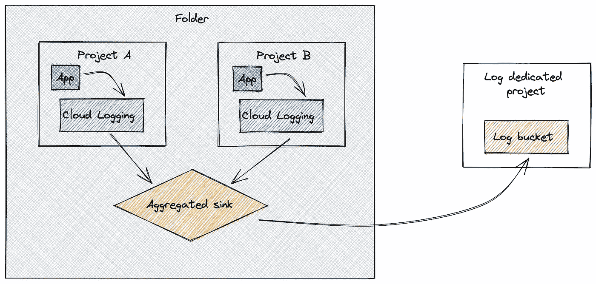
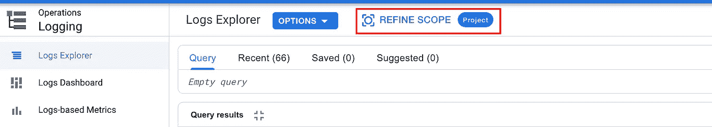
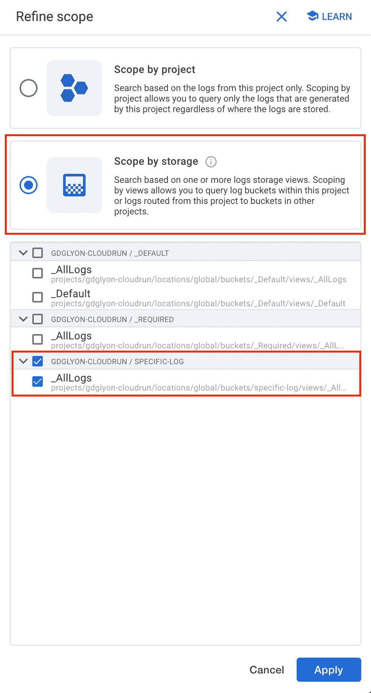

# 集中式多项目日志监控

> 原文：<https://medium.com/google-cloud/multiple-projects-log-monitoring-in-a-single-place-59f1156721bb?source=collection_archive---------0----------------------->


在云环境中，根据需要创建和销毁资源是很常见的。出于**安全或保密**的原因，**强烈分离资源**也很常见；或者在发生事故时简单地用**限制爆炸半径**。
在 Google Cloud 上，创建**几个项目，每个客户一个**，每个项目部署相同的应用程序是一种常见的模式，尤其是当您拥有**依赖于项目的资源**时，例如[应用程序引擎](https://cloud.google.com/appengine)或[Firestore](https://cloud.google.com/firestore)/[Datastore](https://cloud.google.com/datastore)。

> 您最终会得到一个部署在几个单租户项目中的多租户服务

那是为了设计，但是在 ***第二*** 天，你需要监控你的应用程序，**被分派到不同的项目**。

在我的例子中，为了跟踪错误，我习惯于**定义几个** [**基于日志的度量**](https://cloud.google.com/logging/docs/logs-based-metrics) 来过滤与我的错误案例相关的日志。然后，我在这些指标上添加了一个 [**云监控警报**](https://cloud.google.com/logging/docs/logs-based-metrics/charts-and-alerts#alert-on-lbm) **，以向团队通知错误(使用电子邮件、PubSub 等)**

# 多个项目日志

当你有多个项目时的问题是你有**几个** [**云日志**](https://cloud.google.com/logging/docs) **实例**，每个项目一个，并且**很难在同一时间**，在同一地点监控所有的项目。

此外，当您设置一个**基于日志的指标**时，您只能在当前项目中**进行过滤，而不能在文件夹或组织级别设置过滤器。**

因为不同项目中部署的代码是相同的，所以**不必在每个项目中复制基于日志的指标**和警报。在一个地方这样做更有效率和一致性！

# 文件夹和组织级别的接收器

令人欣慰的是，可以用一个水槽在文件夹和组织级别过滤日志。这里的技巧是***在文件夹和组织级别包含子节点*** 。
*文件夹和组织的子节点是文件夹和项目。因此，如果您在 sink 中包含了孩子，那么您也添加了所有的文件夹和项目* ***(递归)。***

该特征被**命名为** [**聚合汇**](https://cloud.google.com/logging/docs/export/aggregated_sinks) **。**你可以从所有子节点获取过滤后的日志，然后**将它们放入 BigQuery、PubSub、云存储和日志桶中。**

遗憾的是，这只是一个日志转发，您不能在聚合的 sink 上定义基于日志的指标。你还需要补充点什么！

# 云日志桶

解决方案来自云日志服务本身。你现在可以用**定义** [**日志桶**](https://cloud.google.com/logging/docs/buckets) 。这是一个用户定义的日志存储，您可以在其中**路由日志**并**将它们保留一段用户定义的保留期**(以天为单位)。

这个特性对于将日志保留一段合法的时间(例如 3 年)很有意义。在我们的例子中，保留并不是很重要，我们只希望把日志放在一个地方。请记住，你保存日志的时间越长，你使用的存储空间就越多，你支付的费用也就越多。

# 沉入云日志记录日志桶

聚合接收器和日志存储桶的组合是关键。



以下是如何让他们行动起来。

*   首先**创建你需要的资源组织**，例如，创建一个包含两个项目的文件夹。
*   然后，**在两个项目中创建一个类似的日志条目**，例如运行一个失败的 BigQuery 查询

```
SELECT * FROM 'bigquery-public-data.austin_311.311_service_requests' where unique_key=3
```

要查看日志中的错误，请转到云日志记录并使用此过滤器。

```
resource.type="bigquery_resource"
severity=ERROR
protoPayload.methodName="jobservice.jobcompleted"
```

*稍后获取此日志过滤器。*

*   选择一个**日志专用的项目**。它可以是两个项目中的一个，也可以在另一个项目中。然后，创建一个日志存储桶

```
gcloud logging buckets create --location=global \
  --retention-days=7 --project=LOG_PROJECT_ID specific-log
```

*   然后**在你的文件夹** *上创建一个聚合的 sink(这也与* `*--organization*` *参数一起在组织级别创建它)*

```
gcloud logging sinks create --folder=<FOLDER_ID> \
  --log-filter='resource.type="bigquery_resource"
   AND severity=ERROR
   AND protoPayload.methodName="jobservice.jobcompleted"'\
  --include-children sink-specific-logs \
logging.googleapis.com/projects/<LOG_BUCKET_PROJECT_ID>/locations/global/buckets/specific-log
```

*   最后，再次运行错误的 BigQuery 查询。

现在，**检查云日志记录桶中的新日志条目**。为了实现这一目标

*   进入云日志页面，点击`refine scope`



*   选择`scope by storage`选项，并且只选择你的`specific-logs`圆木桶



**什么也没发生**，没有日志记录，也没有错误，*很烦人…*

实际上，这是一个安全问题:在文件夹级别创建的**聚合接收器没有权限将**写入日志桶！

为了解决这个问题，我们需要**获取聚合接收器**的 `**writerIdentity**`

```
gcloud logging sinks describe --folder=<FOLDER_ID>\
 --format='value(writerIdentity)' sink-specific-logs
```

**最后授予`writerIdentity`服务帐户作为日志专用项目上的**日志桶写者**。**

```
gcloud projects add-iam-policy-binding <PROJECT_ID> \
  --member=<WRITER_IDENTITY> --role=roles/logging.bucketWriter
```

**再次尝试您的 BigQuery 查询，然后**嘣！！T21，你的圆木桶里有你的圆木。****

# **把你的日志集中起来，然后一起玩**

**现在，你可以在一个地方拥有你所有相关的日志，所有应用的租户**，你可以用它们做你想做的事情****

*   **保留一段**长时间/法定时间****
*   ****授予团队仅访问此*日志专用*项目**的权限，以访问日志，但不访问租户项目(和数据)**
*   **在单个聚合位置创建**基于日志的指标**。**

**你呢，你的用例是什么，把所有的日志放在同一个地方？**