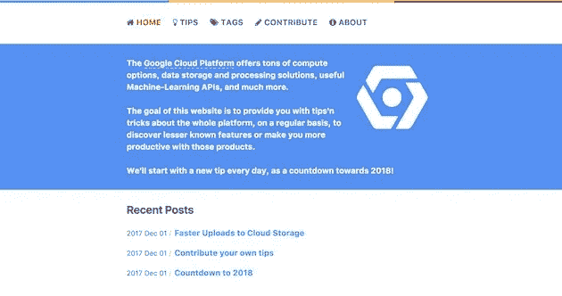
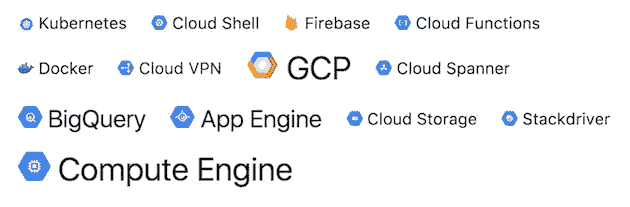

# 我的 2018 倒计时，每天一个关于谷歌云平台的提示

> 原文：<https://medium.com/google-cloud/my-2018-countdown-with-a-tip-a-day-about-google-cloud-platform-2261161cb37?source=collection_archive---------2----------------------->

几周前，我开了一个新的博客，专门讨论**谷歌云平台**，与**分享我在探索平台、了解新产品或体验我一直在使用的某项服务时遇到的技巧和窍门**:

随着假期的到来，我采用了“ **2018 倒计时**”的方式(就像一本没有宗教内涵的“降临节日历”)，在 12 月的每一天，我都会发布**一条提示。**

截至今天，12 月 18 日，我们已经有了 [18 个可用的技巧](https://googlecloud.tips/categories/tip/)！

这些技巧跨越了大约十几项技术！(您也可以通过“标签”来浏览提示，每个标签代表一项技术/服务/ API /产品)

最初，我认为每天撰写技巧是一个挑战(甚至没有想到你必须在周末、假日或假期发布技巧)，但实际上有很多技巧可以分享。此外，我[开放了博客来投稿](https://googlecloud.tips/posts/contribute/):欢迎任何想贡献一两个技巧的人，并且应该与我分享描述技巧的快速要点。我已经收到了来自 8 位不同作者的一堆投稿。非常感谢亚历山大，巴斯蒂安，杨奇煜，格雷厄姆，吉姆，马克，维克多，或瓦西姆！

虽然这一切都始于 2018 年倒计时的一天，但它不会就此停止。也许频率会低一点(一周一次？更多？)，但我绝对打算在明年**及以后继续定期分享技巧！**

如果你想帮忙，请**传个话**！**告诉你的朋友和同事**关于这个地点:[https://googlecloud.tips/](https://googlecloud.tips/)。

另外，请**关注**[@ gcptips](https://twitter.com/gcptips)Twitter 账户，那里会公布新的技巧。

如果你有时间，不要犹豫**分享你自己的技巧**！欢迎所有帮助:-)