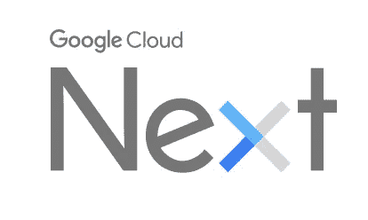
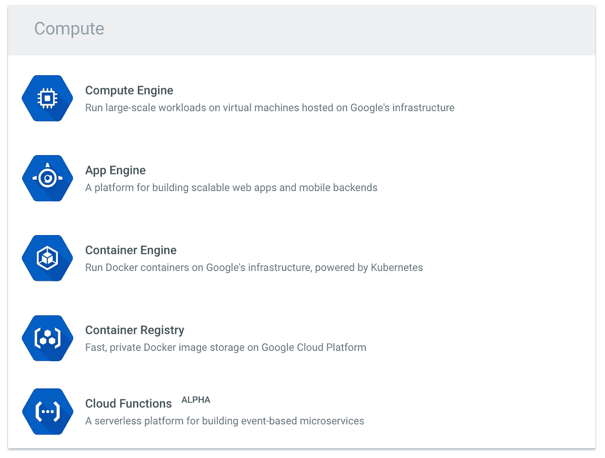

# 我最喜欢的云下一个会话

> 原文：<https://medium.com/google-cloud/my-favorite-cloud-next-sessions-309d1d2701e1?source=collection_archive---------0----------------------->

谷歌[云 Next](https://cloudnext.withgoogle.com/) 的[时间表](https://cloudnext.withgoogle.com/schedule)于本周公布，有很多有趣的会议可以参加。有许多平行的轨道，很难做出选择，但我想突出一些我想看的谈话！

谷歌云平台是一个非常丰富的平台，有很多选项可以满足你的计算需求。你如何选择哪一个最适合你的用例？Brian Dorsey 在本次会议中详细介绍了这一点: [**“我应该在哪里运行我的代码？”在计算引擎、容器引擎、应用引擎等之间做出选择**](https://cloudnext.withgoogle.com/schedule#target=where-should-i-run-my-code-deciding-between-compute-engine-container-engine-app-engine-and-more-91e716a3-813e-43c9-a513-27d3365a449b)

为了更深入地探索一些计算选项，我建议查看 Piotr Szczesniak 的《Google 容器引擎的 [**基础知识:提示和最佳实践**】和 Justin Beckwith 的](https://cloudnext.withgoogle.com/schedule#target=abcs-of-google-container-engine-tips-and-best-practices-03ed20df-b6c9-4e0a-911f-b33017f53477) [**超越 PaaS 和应用引擎灵活环境**](https://cloudnext.withgoogle.com/schedule#target=go-beyond-paas-with-app-engine-flexible-environment-89abaf38-fce4-451c-b0e3-7726013300df) 。

如今，无服务器趋势非常强劲，在这个领域，我发现了两个具有 Firebase 和云功能的插槽:Mike McDonald、Jen Tong、Frank van Puffelen 的 [**使用 Firebase 和 Google 云平台实时编写无服务器应用程序**、Bret McGowen 的](https://cloudnext.withgoogle.com/schedule#target=live-coding-a-serverless-app-with-firebase-and-google-cloud-platform-d9026f62-4bfe-4087-b2d8-ffacd52222a2) [**使用 Google 云平台的无服务器计算选项**](https://cloudnext.withgoogle.com/schedule#target=serverless-computing-options-with-google-cloud-platform-1beab0c1-740e-4ee5-82f7-2fc020cdb295) 。

我以前写过关于云端点的博客，因为我对[Web API](http://glaforge.appspot.com/category/Web%20APIs)的世界很感兴趣，我想参加这方面的两个讲座:[谷歌**云端点:向世界提供你的 API**](https://cloudnext.withgoogle.com/schedule#target=google-cloud-endpoints-serving-your-api-to-the-world-8eaeb271-f0ea-4638-af94-16c0b2b80bf6)Francesc Campoy Flores 和 [**使用谷歌云端点授权服务到服务调用**](https://cloudnext.withgoogle.com/schedule#target=authorizing-service-to-service-calls-with-google-cloud-endpoints-24f2852c-e586-4fe9-8eb6-0e13e8585800) 丹·奇鲁利，Sep 易卜拉欣扎代。

在我的杂项类别中，我想在 G Suite 的 API 上强调这一点: [**用 Ritcha Ranjan 的 Google Docs、Slides、Sheets 和 Sites API**](https://cloudnext.withgoogle.com/schedule#target=developing-new-apps-built-for-your-organization-with-google-docs-slides-sheets-and-sites-apis-bc17ab71-ce12-4057-bcc6-7fe536f67490)为您的组织开发新的应用程序。谈大规模并行数据处理与 [**使用 Apache Beam 进行并行数据处理**](https://cloudnext.withgoogle.com/schedule#target=using-apache-beam-for-parallel-data-processing-a7a06ee0-7b93-4559-82e0-1a8dfd515771)Frances Perry。

最后，我不得不提到我自己的演讲，我将和 Brad Abrams 一起演讲: [**和你的用户交谈:为谷歌助手**](https://cloudnext.withgoogle.com/schedule#target=talking-to-your-users-build-conversational-actions-for-google-assistant-5a780cf1-4cc2-4ce4-824d-4ff7b7c7a14c) 建立对话行为。应该很好玩吧！

你要参加什么会谈？

*原载于*[*glaforge.appspot.com*](http://glaforge.appspot.com/article/my-favorite-cloud-next-sessions)*。*