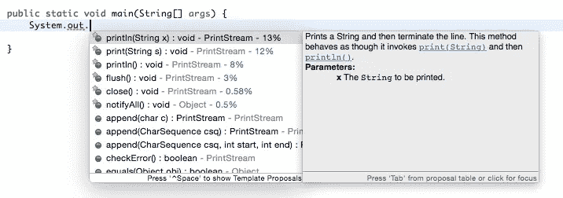
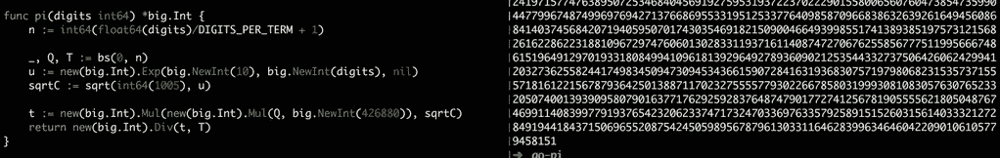
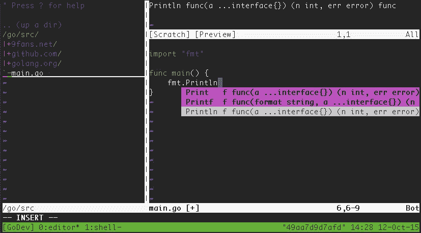

# 我放在一个容器里

> 原文：<https://medium.com/google-cloud/my-ide-in-a-container-49d4f177de?source=collection_archive---------1----------------------->

我是一名 Java 开发人员，我喜欢使用 IDE。具体来说，当我写代码时，我喜欢语法高亮、自动补全/建议和访问开发人员文档。



Eclipse IDE for Java —自动完成和文档

我也开始学习写围棋。我在 Go 中写了一些东西，因为我喜欢它编译成本地代码的能力。我编写的一个实用程序是一个命令行 [OAuth 2.0 实用程序](https://github.com/saturnism/oauth2util)，它允许您生成离线刷新令牌，最近，我编写了一个 Go 程序，它使用带有二进制拆分的 Chudnovsky 方法计算圆周率的位数。



最初，我在没有任何语言支持的情况下用 Vi 编写 Go。但是我认为获得一些我作为 Java 开发人员所熟悉的特性会很好。我最终找到了一个名为 [Vim-Go](https://github.com/fatih/vim-go) 的插件。它看起来像我想要的一切，除了它不容易安装:

*   它需要其他几个插件才能工作
*   一些插件需要我的 Vim 安装中没有的特性，比如 python2 支持
*   它需要许多 Go 实用程序才能工作，比如 goimport、godef 和 golint 等等
*   它不包括您可能也想拥有的其他组件，如 NERDTree

当我设置 Vim-Go 时，我有点担心在我的笔记本电脑上安装一堆插件和组件，如果我转移到另一个环境，我以后需要重新安装它们。(作为一名 Java 开发人员，我安装了无数次 Eclipse IDE，安装了无数个插件，很多次都是因为换过电脑。)与其在基于 Vim 的 IDE 中辛苦地完成类似的过程，我想也许我可以在一个容器映像中构建整个过程。

为此使用容器有几个好处:

1.  安装说明是自文档化的——docker 文件有我安装 IDE 环境所需的确切步骤。
2.  我不需要安装本地包/依赖项——我只需要将它们安装在 Docker 映像中！
3.  我可以在任何地方运行它——不管我使用什么环境，我都可以启动“docker run -ti saturnism/go-ide ”,它会把我带到一个我熟悉的环境中。
4.  它是可定制的——不喜欢容器里的东西？在 Dockerfile 文件中自定义它，其他人也可以使用它。
5.  我可以在容器中安装本地库依赖项，而不是在我的笔记本电脑上。



简而言之，我构建了一个容器映像，用于安装和配置:

*   [Zsh](http://zsh.sourceforge.net/) 和[哦我的 Zsh](https://github.com/robbyrussell/oh-my-zsh)
*   [Tmux](https://tmux.github.io/) 和 [Tmuxinator](https://github.com/tmuxinator/tmuxinator)
*   Vim 插件比如 [YouCompleteMe](https://github.com/Valloric/YouCompleteMe) 、 [Sensible](https://github.com/tpope/vim-sensible) 、 [Go Explorer](https://github.com/garyburd/go-explorer) 、 [NERDTree](https://github.com/scrooloose/nerdtree) ，当然还有 Vim-Go。

您可以通过运行以下命令来试用 IDE:

```
docker run --rm -ti saturnism/go-ide
```

注意:一旦你离开容器，你所有的文件都将被删除！哦，不。没有人愿意丢掉工作。这里有两个技巧，你可以用来确保你的工作被保存！

您可以装载一个宗卷来储存您的文件:

```
docker run --rm -ti -v /mysource:/go/src
```

或者，您可以将文件保存在持久容器卷中:

```
docker create -v /go/src --name myproject saturnism/go-ide /bin/true
docker run -d --volumes-from myproject saturnism/go-ide
```

这在 Docker 机器上也能很好地工作。如果你没有读过我以前的文章，我已经在谷歌云平台上使用 Docker Machine 好几个月了——我也有很多关于这个主题的技巧和诀窍可以分享。

**更新**:果不其然，在我把我的 Go IDE 装箱后不久，我不得不切换我的工作笔记本电脑。我很高兴我做到了！

**更新**:也可以挂载$GOPATH 到/go，但是需要手动运行 Vi 中的:GoInstallBinaries。还有一个名为 [atocker](https://github.com/ulrichSchreiner/atocker) 的 Atom 容器！参见 Reddit 帖子。

喜欢这个主意吗？在 GitHub 上的 saturnism/go-ide 下找到[源代码，并对其进行更多的定制，以适应您特定的 go 开发偏好！](https://github.com/saturnism/go-ide)