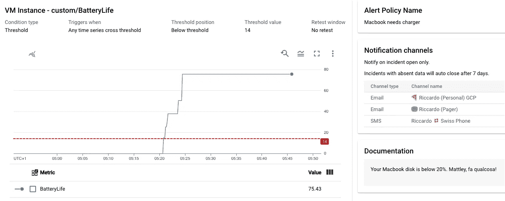

# 我的 Mac 的电池🔋在谷歌云监控上——如果🪫低，发送短信

> 原文：<https://medium.com/google-cloud/my-macs-battery-on-google-cloud-monitoring-with-sms-if-its-low-a1ccd70485fe?source=collection_archive---------1----------------------->

> *这篇文章展示了如何轻松地将一个通用键/值注入到 Google 云监控中，并在其上设置警报。我用它来提醒磁盘空间，现在也低电池！*

今天早上我在伦敦，我把充电器忘在家里了。不过🪫没什么电池，时间充裕，我心想:*嘿！我需要一种方法来预测我的电池何时会没电！我需要用一种完全矫枉过正的方式去做！*


赶早班火车从圣潘克拉斯到斯特拉特福德国际机场，然后到伦敦城市机场。

我的电池电量为 42%**，这似乎是一个微妙的迹象，表明我的想法值得写博客。四处搜索，我找到了[一篇文章](https://www.iphonetricks.org/check-battery-health-on-mac-using-terminal/)，它给了我如何编写 Mac 电池脚本的提示(注意这只适用于 **Macbook** )。**

**丑码[这里](https://github.com/palladius/sakura/blob/master/bin/macbook-battery#L107-L150)(哎！我在一个没有充电器的机场，你也想要单元测试吗？！？)**

**我知道，我调用相同的命令 10 次，我可以缓存它。这是为了下一次迭代！**

**最棒的是，它不仅延长了我的电池寿命，还提高了我的电池耐用性——所以当我需要更换电池时。呜哇！**

**好了，让我们试一试，让我把线拔掉，这样你就不会 100%无聊了。**

****

**电池电量为 98%。不幸的是，我 14%的电池电量似乎没有了😢**

**电池是 98%，耶！不幸的是，我的电池好像只剩 14%了。幸好我不支付它的修理费:)**

## **步骤 2:将此指标推送到☁ ️(GCP)**

**现在，我想要一个从 CLI 发出我的指标的脚本。所以我可以说类似`push-to-gcp <METRIC_NAME> <METRIC_VALUE>`的话。**

**一个月前我已经对我的磁盘空间进行了编码，让我把它抽象成一些更可重用的代码(总是 Ruby):[palladius/sakura/GCP-write-metric](https://github.com/palladius/sakura/blob/master/bin/gcp-write-metric)。**

**好吧！现在让我们试一试。**

****

**创建了时间序列' **prova** '(意大利语测试)和有意义的数字 **123** ！哇！**

**注意，您需要通过 ENV var 指定 project_id(即将推出的`— project`选项，或者更好的是从`gcloud`配置中自动推断出 project_id)。**

**现在，让我们将两个脚本粘在一起，上传两个 Macbook 信息，并在开发控制台上看到:**

**这个脚本需要 ARGV 中的 project_id，然后它会为您完成工作，知道`macbook-battery`中有用的字段来自值 3 和 5(是的，JSON 编码/解析不容易出错！).姑且称之为:**

****

**与此同时，我回到家，在我的另一台 M1 Mac 电脑上启动了这个程序。总是，无聊地，附在水流上。注定了 99%到 100%之间的无限生命。等等——这台 Mac 虽然已经充电，但电量一直保持到 80%。也许细胞优化？我印象深刻。**

**一旦一切正常，您需要“生产化它”，这意味着建立一个 Cron 作业(实际上，`[launchd](https://www.launchd.info/)`)。我用。`bash -lc`利用我的`.bashrc`中的 PATH 和其他好东西，但我希望你是一个更好的脚本编写人员，可以在没有繁琐的导入的情况下工作。还要确保正确地添加路径(我通常要失败几次才能做对)。**

```
$ crontab -e […]
PATH=/sbin:/bin:/usr/sbin:/usr/bin:~/git/sakura/bin/3/5 * * * * bash -lc '/Users/ricc/path-to/sakura/bin/gcp-write-mac-battery-values-on-project your-project-id'
[…]
```

# **步骤 3:查看指标并创建仪表板**

**现在让我们转到这里的指标浏览器，检查一个假的 GCE 指标:**

*   **前往[https://console . cloud . Google . com/monitoring/metrics-explorer](https://console.cloud.google.com/monitoring/metrics-explorer?project=ric-cccwiki)**
*   **在“Select a metric”>中，键入“Battery ”,您会看到选项从多个减少到两个:**

****

**这是我的两个度量标准，也是驼峰式的！**

*   **选择**电池寿命**。这将把您带到一个漂亮的仪表板(如果您刚刚创建它，可能是空的，请耐心等待)。使用时间控件返回时间或缩放，直到获得所需的视图。**
*   **由于这个信号来自(可能)多台 MAC，所以选择“分组依据”-> **主机名**。你会看到这样的东西:**

****

**查看最后一天的电池。我家里的 Mac 电脑(3)总是插着电源，工作时的 Mac 电脑(42)经常去会议室。老实说，我拔了两次插头只是为了得到一个漂亮的截图——骗子！**

*   **现在点击**保存图表**开始享受吧。**

**答对了。你可以在仪表盘上看到并排的电池寿命和电池健康。**

## **第四步。设置电池电量低时的提醒**

**现在，当电池电量低于 14% (42 除以π)时，我们会收到警报。**

*   **打开[https://console.cloud.google.com/monitoring/alerting](https://console.cloud.google.com/monitoring/alerting?project=ric-cccwiki)**
*   **点击“ **+创建策略**”(参见[示例 JSON 输出](https://gist.github.com/palladius/5c109015324fc6bffbfce2f58525760f))**
*   ****如上选择公制**(型号*电池寿命*)**
*   ***【可选】您可以在您关心的电脑上添加过滤器:hostname = "my-favorite-mac"***
*   ***如果需要，调整 TransformData 参数。***
*   **点击**创建策略**->配置预警触发**
*   ****条件类型**:阈值**
*   ****位置**:低于阈值**
*   ****阈值** : 14(或者你选择的值，比如 20)。**
*   **点击**创建策略****
*   **最后，配置您的**通知渠道** ( [文档](https://cloud.google.com/monitoring/support/notification-options))，我之前已经在这里设置了我的电子邮件和瑞士电话:**

****

**没有表情符号的生活会是什么样？**

*   **[可选]您可以添加一些**策略用户标签**。我喜欢一直使用标签(例如 env=prod，scope=personal，..).**
*   **[可选]您可以像填写剧本一样填写**文档**。我总是试着写一些有意义的东西，作为 SRE 方法论的一部分。这里的操作是将您的 Mac 连接到电源。**
*   **最后查看数值并点击**查看警报**:**

****

## **结论**

**在这篇简短的文章中，我们看到了如何从您的机器上编写一个有意义的指标，并从命令行将其注入到云监控中。**

**很容易对这些值进行分割(在本例中是通过`hostname`进行聚合)，然后对它们进行显示和警告。**

****

**插上它就有电池了还是拔下它就能看到好看的图形了？**

**天空才是现在的极限。你可以做一些愚蠢的事情，比如数你的 Chrome 标签，当它们超过 42 个时，用一些愚蠢的消息发出警告，比如“*来自银河系的消息:重启 Chrome！*”**

```
brew install chrome-cli # only-once install
PROJECT_ID=my-project-123 gcp-write-metric mac-chrome-cli-ntabs $(chrome-cli list tabs | wc -l)
```

***注意:在代码中我使用了“gce_instance”，而实际上我应该使用“全局”指标(*[*docs*](https://cloud.google.com/monitoring/api/resources)*)。我喜欢 GCE 实例，因为它已经包含了主机名和 GCP 区域，但这是不正确的(我告诉 GCP 那是云中的虚拟机，而不是)。支持这一点的新代码正在这个惊人的脚本中开发:*🌸*[GCP-写-度量-做-好](https://github.com/palladius/sakura/blob/master/bin/gcp-write-metric-done-well)***