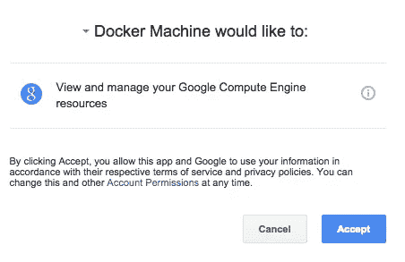
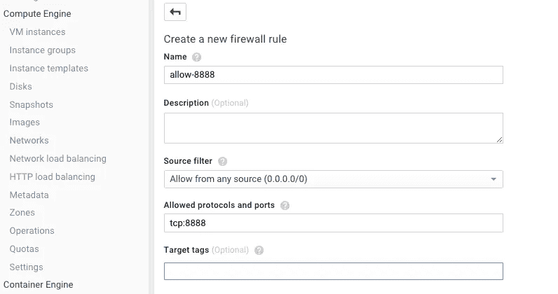

# 我的慢速互联网 vs Docker

> 原文：<https://medium.com/google-cloud/my-slow-internet-vs-docker-7678ae1cae72?source=collection_archive---------1----------------------->

我在纽约工作，住在一个微型工作室里。公寓提供 Wi-Fi，但不幸的是，它的带宽非常低，而且经常不可靠。我也经常旅行，我花很多时间在火车上、飞机上和酒店里，这些地方的互联网接入速度慢且不可靠。

我经常构建 Docker 映像——为了工作，为了[演示](https://github.com/saturnism/spring-boot-docker)，为了[云旋转](https://twitter.com/googlecloudspin)！

我了解到通过低带宽连接下载 Docker 图像和推送图像是令人不快的。

# 码头机器来救援了

在过去的几个月里，我一直在使用[谷歌计算引擎](https://cloud.google.com/compute/)上的 [Docker 机器](https://docs.docker.com/machine/)，而不是使用 [boot2docker](http://boot2docker.io/) 在本地构建和推送 Docker 图像。这在很多情况下都非常有效——在我的公寓里，在酒店里，在火车上，甚至在飞机上。

使用 Docker Machine 有几个好处:

*   快速网络—快速容器映像下载和快速推送至容器存储库，如 Docker Hub
*   当你在谷歌计算引擎上托管 Docker 机器时，访问私有的[谷歌容器注册表](https://cloud.google.com/tools/container-registry/)(甚至更快的图像下载和推送)
*   容器映像存储在 Docker 机器实例上，而不是您的本地台式机/笔记本电脑上
*   我可以释放我的笔记本电脑资源(包括磁盘、CPU，甚至带宽)

# 怎么会？

在谷歌计算引擎上设置 Docker 机器很简单！

1.  [注册](https://cloud.google.com/)使用谷歌云平台并创建一个新项目(记住项目 ID)
2.  安装 [Docker](https://docs.docker.com/installation/) 命令行工具
3.  安装[对接机](https://docs.docker.com/machine/)

在这个动画 GIF(时间压缩)中可以看到在 Google Compute Engine 上提供 Docker Machine 实例的过程:


见[原推文](https://twitter.com/saturnism/status/620715664609804289)。

但是，这里有详细的说明(2017 年 8 月 30 日更新，感谢古斯塔夫·马斯科维茨):

*   如果你在 Mac 上，安装 Docker Machine 最简单的方法就是使用 Brew。

```
$ brew install docker docker-machine
```

*   要使用 Docker 机器搭配 Google 云平台，[安装 Google Cloud SDK](https://cloud.google.com/sdk/downloads) 。是 Google 云平台的 CLI 工具。
*   使用 Google Cloud SDK 验证您的帐户。您可能需要对常规登录和应用程序登录进行身份验证

```
$ gcloud auth login
$ gcloud auth application-default login
```

*   创建一个 docker 机器实例(在本例中，该实例名为“Docker”)。你可以为你的用例确定一个合适的[机器类型](https://cloud.google.com/compute/pricing#machinetypes)，但是我推荐一个至少有两个 CPU 的。

```
$ docker-machine create docker -d google --google-project=PROJECT_ID --google-machine-type n1-highcpu-4 --google-open-port 22
```

*   该命令将提示您授权 Docker Machine 访问您的 Google 云平台项目。



*   授权后，将临时授权码复制并粘贴回命令行提示符:

```
Enter code: [PASTE YOUR TEMPORARY CODE HERE]
```

*   Docker Machine 将在 Google Compute Engine 中创建一个虚拟机实例，并设置所有必要的组件和密钥来安全地访问 Docker Machine 实例。
*   最后，您需要设置环境变量来告诉 Docker 使用新创建的 Docker 机器实例:

```
$ eval $(docker-machine env docker)
```

*   考虑将这一行添加到~/。bash_profile 或您选择的 shell 初始化脚本，使 Docker 机器成为默认选择。

您可以做几件事来验证 Docker 机器实例是否正在运行:

您应该能够列出它:

```
$ docker-machine ls
NAME             ACTIVE   DRIVER   STATE     URL                         SWARM
docker   *        google   Running   tcp://...
```

您应该能够通过 SSH 进入机器:

```
$ docker-machine ssh docker
Welcome to Ubuntu 14.04.1 LTS (GNU/Linux 3.16.0-30-generic x86_64)
...
docker-user@docker:~$
```

当然，Docker 应该能够连接到 Docker 机器实例:

```
$ docker ps
CONTAINER ID        IMAGE                    COMMAND             CREATED             STATUS              PORTS                    NAMES
```

最后，最终测试是在 Docker 机器实例中运行一个容器:

```
$ docker run busybox echo hello world
Unable to find image 'busybox:latest' locally
latest: Pulling from busybox
cf2616975b4a: Pull complete 
6ce2e90b0bc7: Pull complete 
8c2e06607696: Already exists 
busybox:latest: The image you are pulling has been verified. Important: image verification is a tech preview feature and should not be relied on to provide security.
Digest: sha256:38a203e1986cf79639cfb9b2e1d6e773de84002feea2d4eb006b52004ee8502d
Status: Downloaded newer image for busybox:latest
hello world
```

# 提示和技巧

我学到了一些东西，而使用 Docker 机器的低带宽互联网连接，可能会节省你一些麻烦！

## 从 Dockerfile 文件下载所有内容

添加/复制指令会通过网络将文件从本地机器复制到 Docker 机器实例。不要使用 ADD/COPY 指令将大文件复制到 Docker 映像中，而是尽可能从互联网上下载，包括:

*   代码(例如，使用“git clone ”)
*   二进制文件(使用 wget/curl 下载大型二进制文件)

我将直接的源代码复制到 Docker 机器中，以便用新代码快速测试容器。但是我试图从互联网上下载尽可能多的依赖项(源代码和二进制文件)。

如果你需要的东西在网上找不到，试着把它储存在[谷歌云存储](https://cloud.google.com/storage/)，然后从那里下载。

## 使用 ONBUILD

使用 [ONBUILD](https://docs.docker.com/reference/builder/#onbuild) 指令下载任何构建依赖项，并编译您的源代码。例如，如果您使用 Maven 构建 Java 应用程序，请查看 [maven:onbuild](https://registry.hub.docker.com/_/maven/) 基础映像。这将下载所有 Maven 依赖项来构建您的项目。当与 Docker Machine 一起使用时，所有依赖项都将从 Docker Machine 下载，因为 Docker Machine 可能具有更快的互联网连接。

*6 月 16 日更新:ONBUILD 可能会产生非常大的图像，既有源代码又有编译后的二进制文件。使用多阶段构建，见下文！*

## 使用多阶段构建

从 Docker 17.05 开始，可以使用[多级构建](https://docs.docker.com/engine/userguide/eng-image/multistage-build/)。这允许您有一个获取源代码并编译代码的构建阶段。然后，将工件复制到最终的运行时容器中。Java 构建的一个示例:

```
FROM maven:3.5-jdk-8 as BUILDCOPY . /src
RUN mvn -f /src/pom.xml packageFROM openjdk:8COPY --from=BUILD /src/target/lib /app/lib
COPY --from=BUILD /src/target/artifact.jar /app/artifact.jarEXPOSE 8080
ENTRYPOINT ["java", "-jar", "/app/artifact.jar"]
```

## 使用压缩

当 Docker 上下文被发送到远程 Docker 守护进程时，您可以对其进行压缩:

```
$ docker build --compress ...
```

## 该卷安装在哪里？

当使用 Docker Machine 并将卷装载到容器中时，卷是根据虚拟机本身的目录装载的，而不是您的本地台式机/笔记本电脑。

```
$ docker run -ti -v /myfiles:/data busybox
```

这将把虚拟机的/myfiles 目录绑定到容器的/data 目录中。

这也意味着您需要将希望与容器共享的任何文件复制到 Docker 机器实例中:

*   首先，SSH 进入 Docker 机器实例以创建目录结构

```
$ docker-machine ssh docker
...
Last login: Thu Jul 16 03:18:20 2015 from ...docker-user@docker:~$ sudo mkdir -p /myfiles
```

*   然后使用“docker-machine scp”命令:

```
$ docker-machine scp somefile docker:/myfiles
```

## 从容器下载输出

有时候，你的容器可能会产生输出，比如二进制构建，或者从[深度梦境容器](https://github.com/saturnism/deepdream-docker)生成的图像。您可以通过几种方式获取数据:

使用“docker cp ”(这适用于正在运行的容器和已退出的容器):

```
$ docker ps
CONTAINER ID        IMAGE                    COMMAND             CREATED             STATUS              PORTS                    NAMES
0dc6f3c9c399        deepdream:latest   "/bin/bash"         2 days ago          Up 2 days           8888/tcp                 nostalgic_almeida$ docker cp 0dc6f3c9c399:/deepdream/deepdream/frames/0001.jpg .
```

如果您安装了一个卷来存储输出，请使用“docker-machine scp ”:

```
$ docker run -ti -v /output:/output mycontainer
$ docker-machine scp docker:/output/myfile .
```

我最喜欢的一种技术是将输出直接通过管道传输到 STDOUT。为此，请查看我用 Go 编写的 [oauth2util](https://github.com/saturnism/oauth2util) 。它可以使用一个容器为多个平台构建二进制文件。

[构建脚本](https://github.com/saturnism/oauth2util/blob/master/script/build)做两件事:

*   在容器中，对所有构建工件进行处理，并通过管道将其传输到 STDOUT

```
tar -czf — oauth2util-*”
```

*   在容器外部，展开输出:

```
tar -xzf -
```

将它们放在一起:

```
docker run -e GOOS=$GOOS -e GOARCH=$GOARCH oauth2util /bin/bash -c “go build -o oauth2util-$GOOS-$GOARCH$SUFFIX 1>&2 && tar -czf — oauth2util-*” | tar -xzf -
```

最后，您还可以将输入通过管道传输到 Docker 容器进程的 STDIN 中，而不是将输入复制到文件系统中:

```
$ cat myimage.jpg | docker -i mycontainer > output.jpg
```

## 暴露端口

如果您需要将容器端口绑定到主机上，它将绑定到 Docker 机器实例，而不是您的本地机器。因此，您需要配置防火墙规则以允许访问该端口。例如，如果您将一个端口绑定到主机端口 8888:

```
$ docker run -p 8888:80 nginx
```

…然后你需要配置防火墙。首先登录[谷歌开发者控制台](http://console.developers.google.com)，然后:

*   导航到**计算引擎>网络**
*   点击**默认**网络


*   点击**添加防火墙规则**


*   允许来自任何来源，并允许协议和端口(例如，tcp:8888)



*   点击**创建**

最后，找出 Docker 机器实例的 IP 地址:

```
$ docker-machine ls
NAME             ACTIVE   DRIVER   STATE     URL                         SWARM
docker   *        google   Running   tcp://xxx.xxx.xxx.xxx:2376
```

并导航到[http://xxx.xxx.xxx.xxx:8888/](http://xxx.xxx.xxx.xxx:8888/)以访问端口。

## 停止/启动码头机器

当您使用完 Docker 机器时，您可以将其关闭以降低成本:

```
$ docker-machine stop docker
```

并且，当您需要再次使用它时开始:

```
$ docker-machine start docker
```