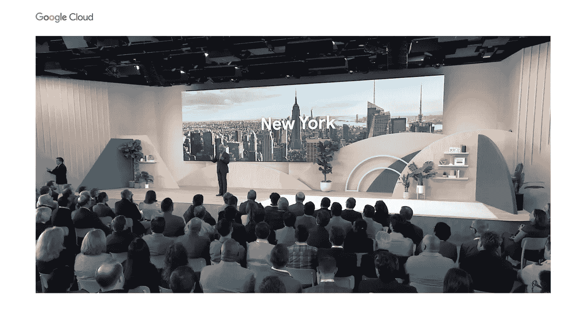
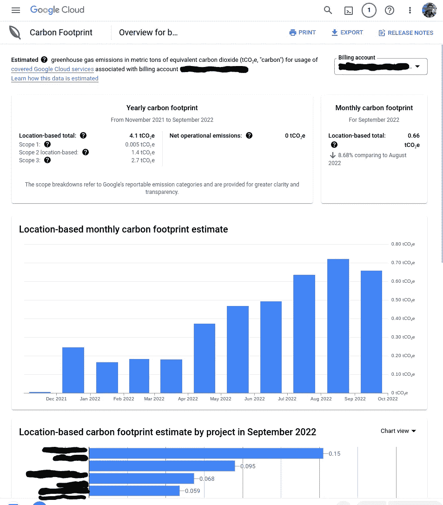

# 我对 Google Cloud Next 2022 的看法

> 原文：<https://medium.com/google-cloud/my-thoughts-on-google-cloud-next-2022-e0d83b66f00f?source=collection_archive---------2----------------------->

上周，谷歌云在 [Next 2022](https://cloud.withgoogle.com/next) 发布了许多不同的产品。这些声明涵盖了所有的产品组，而且有[难以置信的大量材料需要仔细阅读](https://cloud.google.com/blog/topics/google-cloud-next/google-cloud-next22-wrap-up)。我制作了一个我对感兴趣的会议的[播放列表，它们仍然值得观看，但我也想花一些时间谈谈引起我注意的一些与数据相关的公告。](https://cloud.withgoogle.com/next/playlists?playlist=a1ddab5e0427238e)

# 大扩展(大查询更新)

## 非结构化数据

最近，增加了一些功能，试图包含更多非表格数据。早在一月份，本地 JSON 类型的引入，以及 Google 对 [BigQuery GIS](https://cloud.google.com/bigquery/docs/geospatial-intro) 的不断改进就是其中的例子。这一次，Google 已经[宣布支持非结构化数据](https://cloud.google.com/blog/products/data-analytics/how-to-manage-and-process-unstructured-data-in-bigquery)。考虑能够利用 [VertexAI 和 BigQuery](https://cloud.google.com/blog/products/ai-machine-learning/five-integrations-between-vertex-ai-and-bigquery) 来创建对象表，让您能够跨图像、音频文件和视频文件等进行查询。将 BigQuery ML 加入其中，可能性开始变得非常有趣。Google 已经发布了他们的客户演示，我很高兴看到其他用例的出现。

## 无服务器火花

这是今年早些时候推出的一个产品，在扩展谷歌云的 Spark 功能方面非常关键，包括在计算引擎上推出集群，以及 T2 的 data proc T3。 [Dataproc Serverless](https://cloud.google.com/dataproc-serverless/docs/overview) 允许您提交工作负载，而无需管理自己的集群，这符合让用户专注于工作负载本身的更广泛愿景，即减少管理基础设施的时间。宣布的下一件事是，它现在与 BigQuery 集成在一起，因此您不必使用多个平台来计算同一份数据。点击[了解关于通过 BigQuery](https://cloud.google.com/solutions/spark#section-3) 使用无服务器 Spark 的更多信息，点击[了解关于允许您为 Spark](https://cloud.google.com/blog/products/data-analytics/build-limitless-workloads-on-bigquery) 创建 BigQuery 存储过程的新特性的更多信息。

# Looker 工作室高级版

您可能已经看到的一个公告是，Data Studio 已被重新命名为 Looker Studio。作为标准化投资组合努力的一部分，Data Studio 已被纳入 Looker 旗下。作为 Data Studio 的超级粉丝，我很高兴这一切发生，因为它开始调整品牌，帮助客户了解它现在是单一分析平台的一部分，最重要的是，这[引入了 Looker Studio Pro](https://cloud.google.com/blog/products/data-analytics/looker-next-evolution-business-intelligence-data-studio) 。虽然引入了一些技术集成，但 Pro 版本带来的关键之一是支持。这是企业客户采用产品所需的一个关键方面，因此让谷歌云客户服务支持[Looker Studio Pro](https://support.google.com/looker-studio/answer/12671821?hl=en)消除了一个关键障碍。

# 碳足迹

我个人最期待的是碳足迹工具的[正式发布。](https://cloud.google.com/carbon-footprint/docs/release-notes#October_11_2022)

碳足迹仪表板的一个例子。

这是一个工具，我是的长期粉丝，很高兴看到这个发布会取得成果。我肯定是有点偏颇，所以不要只信我的话，[别人也同意很好](https://www.lastweekinaws.com/blog/how-google-cloud-and-aws-approach-customer-carbon-emissions/)。这一点很重要，因为组织不断设定碳减排目标，可持续发展主题获得了更多的关注，因此拥有这个仪表板和在 BigQuery 中分析历史数据的能力可以让用户平衡他们的工程和平台需求以及可持续发展需求。再加上[在美国的可能监管要求](https://www.sec.gov/news/press-release/2022-46)和[在欧盟的现有要求](https://climate.ec.europa.eu/eu-action/climate-strategies-targets/progress-made-cutting-emissions/emissions-monitoring-reporting_en)，这样的工具变得更加重要。

## 奖励积分，带 BigQuery 的地球引擎

虽然这不是一个产品发布会，但我想补充一点。谷歌地球引擎一直吸引着我的注意力，尤其是关于可持续发展的用例。利用 BigQuery 的向量数据处理能力是人们一直追求的，谷歌工程师已经发布了一个使用云函数整合两个的[示例。这真的很有趣，值得一读，如果你处理这类数据的话！](https://cloud.google.com/blog/products/data-analytics/analyzing-satellite-images-in-google-earth-engine-with-bigquery-sql)

# 多了去了！

同样，[在下一个 2022 年](https://cloud.google.com/blog/topics/google-cloud-next/google-cloud-next22-wrap-up)会有大量的产品和功能消失。对于分析，我甚至还没有触及 BigLake、Dataplex、VertexAI 平台和 AlloyDB 所发生的所有很酷的事情，只是发生了太多事情，但我确实想花几分钟时间，围绕一些引起我注意的事情添加一些我的想法。我很想听听你对哪些公告感兴趣，以及你希望解决哪些很酷的用例，我一直希望与你讨论使用谷歌云的新方法！