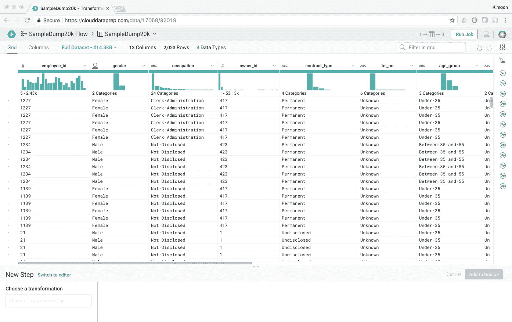

# 我对 Google Cloud Dataprep 的看法

> 原文：<https://medium.com/google-cloud/my-views-on-google-cloud-dataprep-59938f7ad690?source=collection_archive---------0----------------------->

进行数据清理、数据清理、数据准备、数据变更等。想起来了吗？如果是的话，这篇文章是给你的！我知道你的痛苦，因为我是你的一员。这是一个令人痛苦的过程，在准备和管理用于分析的数据时，要花费将近 80%的时间。

> *您为什么不使用像 Cloud Dataflow 这样的 ETL 工具来清理和准备数据呢？*

对于那些不熟悉云数据流的人来说，它是谷歌的一项数据处理服务，使用管道来摄取、转换和分析批处理和实时数据。当然，你可以使用云数据流，但是在纠正数据中的错误、遗漏或不一致时，你想编码吗？我当然不知道。

有很多数据清理工具，比如 Trifacta 和 OpenRefine(正式的 Google Refine)，但是它们不适合我的用例场景。Trifacta Wrangler(免费版)看起来很有前途，拥有我需要的所有功能，但我被限制在 100 MB 的文件大小。我拥有的最小的 CSV 文件大约是 150 MB，因此我必须将文件分割成更小的部分，并对它们执行相同的转换，这非常令人沮丧。有时我甚至会忘记我做了什么样的转变，而不得不重新开始。升级到企业版对我的用例来说毫无意义，所以我最终停止了使用它们。与牧马人相比，开源软件 OpenRefine 既古老又漏洞百出。那么我最终用了什么呢？MATLAB。

因此，当我听说 Trifacta 将会有一个来自谷歌的名为**云数据准备**的完全托管服务时，我变得异常兴奋。

**TL；DW** (太长；没看)——Google Cloud data prep 是一款来自 GCP 的智能数据服务，可以让你可视化地探索、清理和准备那些还没有准备好进行即时分析的数据。

我立即注册了一个私人测试版，并于上周获得了访问权限。你们也可以点击下面的链接。

 [## 云数据准备-数据准备和数据清理|谷歌云平台

### Google Cloud Dataprep 是一个智能数据准备和清理服务，用于可视化探索、清理和…

cloud.google.com](https://cloud.google.com/dataprep/) 

**谷歌数据准备**

**Trifacta 牧马人**

我兴奋的原因是，我可以使用一项服务，它可以很容易地与谷歌云平台上的所有其他工具集成。

*   我可以轻松地导入我的谷歌云存储桶中的结构化/非结构化数据，以探索、清理和准备数据进行分析。
*   使用直观、可视化的界面可以轻松清理和丰富多个数据源。
*   我可以从 BigQuery 导入表进行进一步的分析！
*   我可以清理和准备数据，以便我可以使用谷歌云 ML 引擎来训练机器学习模型。

用例是无穷无尽的…但是我很担心，因为 **100 MB** 的文件大小限制使我停止使用 Trifacta。Google 网站上的文档声明没有文件大小限制。

> *“轻松准备任何规模的数据集，从兆字节到兆兆兆字节。”*

我进行了测试，看看这是不是真的，并试图直接上传一个文件，收到了以下消息！

好吧…直接上传文件不行，不过，**用谷歌云存储**可以！这个产品正是我所需要的！除此之外，Cloud Dataprep 还有许多很酷的功能，包括[异常检测、拖放开发和与 GCP 的开箱即用集成](https://cloud.google.com/blog/big-data/2017/03/google-cloud-platform-adds-new-tools-for-easy-data-preparation-and-integration)，这些功能都是完全托管的。

产品发布后，我会使用它吗？**是**

好用吗？**是**

我会把它推荐给那些花费 80%时间清理数据的可怜灵魂吗？**是**

# 后续步骤

*   访问 Cloud Dataprep 并尝试“[Google Cloud data prep 简介](https://codelabs.developers.google.com/codelabs/cloud-dataprep-intro/#0)”实验室。
*   有关谷歌云平台的更多信息，请联系 [Siatik 团队](https://siatik.com/)，他们会很乐意提供帮助。

金蒙