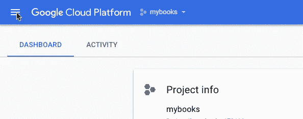
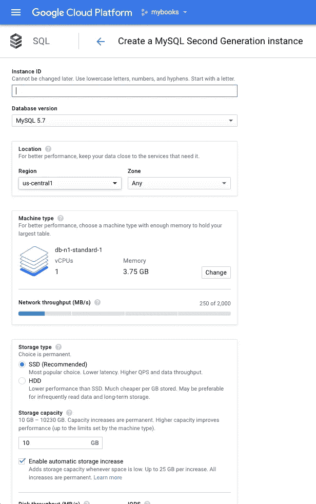

# MyBooks: Google Cloud MySQL 设置

> 原文：<https://medium.com/google-cloud/mybooks-google-cloud-mysql-setup-bc85d471c4b?source=collection_archive---------0----------------------->

## 创建软件生态圈:MyBooks 教程:步骤 1——Google Cloud MySQL 设置

今天我们将在谷歌云平台上建立我们的数据库。我们将使用 MySQL。如果您还没有设置 GCP 帐户，您需要先进行设置。幸运的是，谷歌提供一次性 300 美元/12 个月的信用免费试用，见常见问题解答。我很久以前就用完了我的试用版，所以我已经设置了我的付费账户。如果你不能使用免费试用版，在前面提到的 FAQ 上有设置你的付费账户的信息。

如果你是 read first 类型的人，请随意阅读 [GCP MySQL 文档](https://cloud.google.com/sql/docs/mysql/)。

让我们直接进入

。在项目页面上，我们创建一个项目，并将其命名为 **mybooks** 。创建项目后，GCP 需要一分钟左右的时间来完成设置。当工具栏上的通知图标切换到消息计数时，您就知道它完成了。您可以点击通知消息，或者[导航到控制台](https://console.cloud.google.com/)，如果您有其他项目，您可能需要从工具栏上的项目下拉列表中选择 **mybooks** (在 Google Cloud Platform 标签旁边)。

我已经设置了我的账单，所以我将跳过这一步，但如果你还没有设置，你需要这样做。更多信息参见[常见问题](https://cloud.google.com/free/docs/frequently-asked-questions)或 [GCP MySQL 文档](https://cloud.google.com/sql/docs/mysql/)。此外，如果您已经关闭了我稍后使用的卡，您可以通过选项卡栏右侧的**自定义**操作将其重新打开。

从“产品和服务”下拉列表中(图中光标下的汉堡按钮):

选择 **SQL** 然后**创建实例**。选择 MySQL 作为你的数据库引擎。在实例类型选择中，**选择第二代**，您应该会到达生成实例页面:

这里发生了很多有趣的事情，但是如果我们一头扎进每一件有趣的事情中，我们将一事无成。所以开始吧:

*   **实例 ID** :这将影响我们以后如何连接到数据库，我的偏好是说明它是一个 db 实例，以使它从项目中脱颖而出，所以我们将其命名为 **mybooks-db** 。
*   **数据库版本**:我们将**留在 MySQL 5.7** 。
*   **位置** : **保留谷歌默认的位置。根据你的位置和情况，你的价值很可能与我的不同。由于这只是一个教程，所以没什么关系，但是在生产环境中，它可能会有一些相当大的延迟影响。希望到那时你已经对 GCP 更加熟悉了**
*   **机种**:既然这只是一个教程，那我们就把这个改成 **db-f1-micro** 。我们将部署的 web 服务和数据非常少，所以这应该足够了，并为我们节省了一些钱。
*   **存储类型**:同样，我们试图为生活中重要的东西省钱，所以选择 **HDD** 。
*   **存储容量**:默认的 **10GB** 对于我们将要使用的最少量的数据来说已经足够了。
*   启用自动存储增加:如果这不是一个教程，我会允许自动存储增加，但是为了我们的目的(金钱，亲爱的)，我们将**关闭自动存储增加**。闲暇时多学习
*   **磁盘吞吐量和 IOPS** :如果您担心磁盘吞吐量和 IOPS，不必担心。这是我们将支持的一个简单的 web 服务，IOPS 计算是假设每个操作 16KB 完成的。我们会比这少得多。
*   **备份和二进制日志**:默认为好(自动备份**选中**，启用二进制日志**选中**，创建故障转移副本**未选中**)。
*   **维护窗口和定时**:同样默认为好(**任何窗口**，以及**任何**定时)。
*   **根密码** : [别](https://www.theinquirer.net/inquirer/feature/2460556/top-6-dumb-passwords-from-the-linkedin-hack) [挑](https://bizcircle.att.com/small-business-cyber-security-resources/dont-make-these-4-stupid-password-mistakes/) [点什么](https://www.geekwire.com/2015/worst-passwords-2014-just-stupid-think/) [傻](https://gizmodo.com/the-25-most-popular-passwords-of-2015-were-all-such-id-1753591514)。使用生成器或找到一个安全的密码管理器。安全地储存它，你会需要它。
*   目前，我们不会添加任何云 SQL 标志或授权网络。

**创建**！

明天我们将把我们的工具连接到数据库，创建模式，并插入一些测试数据。

这篇文章是我写的，已经发布在 [LinkedIn](https://www.linkedin.com/pulse/creating-software-ecosphere-mybooks-tutorial-step-1-randy-carver) 和[蓝獭软件博客](http://blueottersoftware.com/2017/06/14/mybooks-tutorial-001/)上