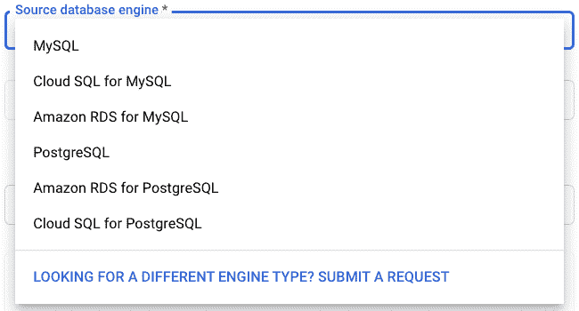
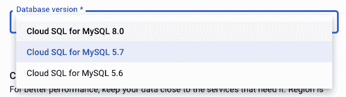
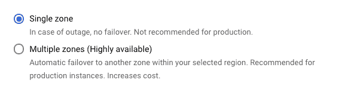

# MySQL 的主要版本升级与谷歌的数据库迁移服务

> 原文：<https://medium.com/google-cloud/mysql-major-version-upgrade-with-googles-database-migration-service-744cf8478e26?source=collection_archive---------1----------------------->

希望你们现在都知道，去年 11 月，当谷歌的数据库迁移服务面向 MySQL 正式发布时，[迁移 SQL 数据库](https://cloud.google.com/blog/products/databases/database-migration-service-now-available-for-cloud-sql-and-more)变得更加容易。如果您不知道，将您的 SQL 数据库迁移到云 SQL 现在更容易了！您可能已经注意到了，或者如果您没有注意到，我会很高兴地指出，数据库迁移服务允许您从许多不同的来源获取数据，包括内部资源、AWS，甚至用于 MySQL 的云 SQL。

侧面插件——我们刚刚宣布 [DMS 支持云 SQL for PostgreSQL](https://cloud.google.com/architecture/postgresql-migration-with-database-migration-service) 作为源，因此您也可以使用 DMS 进行 PostgreSQL 主版本升级。但是这个帖子是关于 MySQL 的…

因为我还想说点别的……请注意，它出现在 DMS 流程的“创建目的地”页面上:

所以，如果你一直在这里，我告诉你，你也可以使用 DMS 来做你的 MySQL 数据库的主要版本升级。当然，我们仍然会屏住呼吸等待就地升级，但是当我们等待的时候，这是一个很好的选择。

这里面有猫腻，因为当然有。这里的关键是，因为我们使用迁移工具来升级，所以有两个方面的复杂性需要处理。我们有迁移部分和升级部分。DMS 有助于管理大量此类问题，但仍有一些事情需要考虑。在这篇文章中，我将把你需要考虑的所有问题集中在一起，并链接到你需要使用数据库迁移服务对 MySQL 进行主要版本升级的所有内容。

# 我们为什么在这里？

只是为了解释为什么你可能想首先升级 MySQL。在性能升级和功能更新之间，有很多理由这样做。如果你需要说服力，这里有一个 MySQL 8.0 中[增强的好列表。房间里还有一只大象:今年二月，官方宣布 5.6 已经过时了。您可能在过去的 8 年里一直使用 5.6，今年看到它正式停止使用，并有点恐慌。这里的好消息是，云 SQL 将在更长时间内支持 5.6，但这并不意味着现在不是升级的好时机。](https://dev.mysql.com/doc/refman/8.0/en/mysql-nutshell.html)

# 版本兼容性

首先要看的是你要在哪个版本之间升级。所以 5.6 到 5.7 或者 5.7 到 8.0。5.6 到 8.0 就出来了。MySQL 在主要版本之间有很大的变化，这些变化可能会破坏兼容性，因此您需要对数据库进行三重检查，以发现一些不兼容的变化。

例如，在 5.6 和 5.7 之间，您需要留意 5.6 数据库中“INFORMATION_SCHEMA”表中的任何系统或状态变量。这些都被 5.7.6 中的性能模式表所取代。还有很多小问题，比如如果您有一个数据类型为 YEAR(2)的列，您需要将所有这些值更新为一个 4 位数的 YEAR 列，然后才能再次使用这些列。如果你要从 5.6 升级到 5.7，你可以在这里查看完整的变化列表。

在 5.7 和 8.0 之间，当然还会有更多的变化需要关注。对我来说，最大的问题是默认标志在两者之间改变了很多。虽然它们中的许多可能不会因为分段错误而导致问题，但是它们可能会在您的应用程序中导致一些意外的行为。此外，您可能想要查看一下 AUTO_INCREMENT 列。对于 FLOAT 和 DOUBLE 类型，不赞成使用它。要查看这两个版本之间变化的完整列表，请点击这里查看。

# 将这些点连接起来

如果您计划从一个云 SQL 实例到另一个云 SQL 实例进行主要版本升级，您可以跳过这一部分，因为您已经完成了我将要谈到的内容。但是，如果您正在从内部数据库，或者在一些小的边缘情况下，从 GCE(虚拟机)实例转换到云 SQL，那么需要注意一些额外的事情。

第一件事是延迟。如果您已经习惯了从数据库获得近乎即时的响应，因为它就在您的应用程序旁边，那么请做好被唤醒的准备。除非您的应用程序也位于云中，否则现在会有一些额外的时间在您的应用程序和数据库之间传递。这可能完全没问题！或者，它可能会在应用程序中引入一些很难调试的重入错误。我的一个同事写了一篇很棒的帖子，涵盖了当你将数据库迁移到另一个来源的云 SQL 时需要注意的所有事情和潜在的变化[这里](https://cloud.google.com/blog/topics/developers-practitioners/preparing-your-mysql-database-migration-database-migration-service)。

第二个问题是，我现在如何访问我的数据库？！网络连接可能非常困难。防火墙、路由和 DNS 都可能会带来麻烦。在此之前，您已经很好地连接了所有的东西，而现在，突然之间，您的数据库(可能)位于互联网上完全不同的地方，有着不同的连接需求。这个特别的兔子洞我已经挖得很深了。我在这里写了一篇关于使用数据库迁移服务[将源实例连接到目标实例的深度博文。如果你遇到了连接问题，这篇文章应该涵盖了大多数情况。](https://cloud.google.com/blog/topics/developers-practitioners/database-migration-service-connectivity-technical-introspective)

# 更多迁徙！

DMS 使移动过程中的数据变得容易，但是由于我们依赖于数据库引擎的本机迁移机制，我们也受到它的限制。这意味着一旦您完成了数据库的迁移，无论它来自哪里，都有一些步骤需要完成。比如你知道，你的 IP 地址会变。因为我们使用迁移方法来升级我们的版本，所以我们实例化了一个新的实例。一旦我们进行了就地升级，这就不是问题了，但同时我们必须记住更新任何应用程序、负载平衡器等指向旧 IP 地址的应用程序。

另一件事是，不要忘记，您的用户存储在系统表中，也不会被迁移。一旦 DMS 部分完成，就需要将它们带过来。还有一些零碎的东西，这里有一个完整的帖子，列出了在你的新实例可以使用之前你需要完成的事情。

# 下一步是什么？

现在您已经设置好了新升级的实例，是时候为生产做准备了。在云 SQL 实例完全上线之前，您可能需要设置一些东西。

例如，默认情况下，仅 SSL 连接是关闭的，我们知道许多组织都强制使用仅 SSL 连接。这需要在服务器上启用，并且需要设置证书。这可以在数据迁移之后、DMS 目标实例升级之前完成。

灾难恢复是生产实例的另一个必备组件。这也是我们保证正常运行时间的 SLA 的要求。绝对需要设置这个。如果您编辑您的实例，它将出现在主概览页面上:

设置为“多个区域”可启用此功能。

读取副本也属于这一类别。优化您的数据基础架构以支持您的应用至关重要，这是其中不可或缺的一部分。如果您有一个读取量很大的应用程序，那么您也需要在游戏的这个阶段设置读取副本。

只有在 DMS 流程结束时提升实例后，才能设置高可用性和读取副本。

在我离开你之前还有最后一点。您已经完成了将实例升级到下一版本的所有工作。您已经设置了所有需要的额外部分。您已经连接了您的应用程序，它完全可以与您的数据库对话。现在不是按下按钮的时候。这对于许多阅读这篇文章的人来说可能是显而易见的。但我还是要说。测试！测试所有的东西。测试所有你能想到的边缘案例。测试任意增加系统的延迟，以确保您可以处理应用程序和数据库之间的随机互联网延迟峰值。高可用性特性一旦启用，您就可以[测试自动故障转移](https://cloud.google.com/blog/topics/developers-practitioners/testing-cloud-sql-failover-where-begin)来模拟您的主实例停止运行，回退实例接管。所以测试一下。测试所有这些场景，以确保您可以顺利启动新的主要版本 SQL 实例。

希望这些都有助于指导您成功地使用数据库迁移服务将您的 MySQL 实例升级到新版本！如果您有问题或意见，请随时在下面评论或在[推特](https://www.twitter.com/GabeWeiss_)上联系我，我的 DMs 是开放的！感谢阅读。