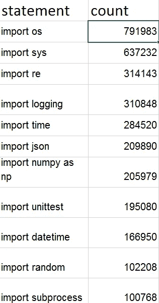
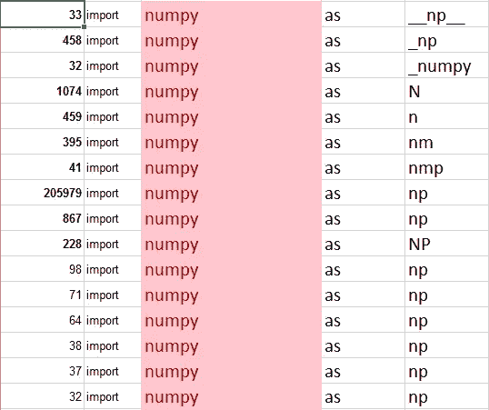
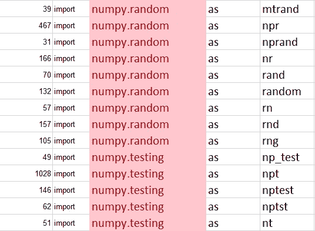
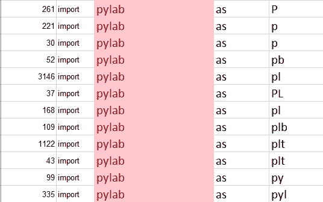
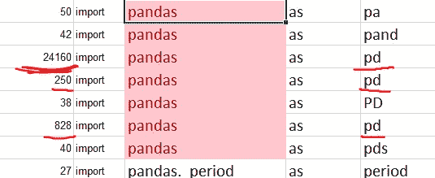
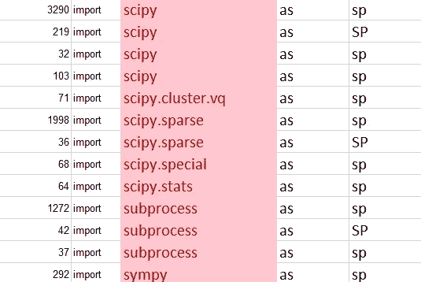

# Python 导入语句中的命名约定。使用 Github 数据库转储的 BigQuery 冒险。

> 原文：<https://medium.com/google-cloud/naming-conventions-in-python-import-statements-a-bigquery-adventure-using-the-github-db-dump-d900159ab680?source=collection_archive---------7----------------------->

六月 [Felipe Hoffa](https://medium.com/u/279fe54c149a?source=post_page-----d900159ab680--------------------------------) 发表了一篇描述谷歌和 GitHub 合作关系的文章，它允许你查询所有发布在 [GitHub](https://medium.com/u/d18563e4f2b9?source=post_page-----d900159ab680--------------------------------) 上的公开代码

[](/google-cloud/github-on-bigquery-analyze-all-the-code-b3576fd2b150) [## GitHub 中的所有开源代码现在都在 BigQuery 内共享:分析所有代码！

### GitHub 中的所有开源代码现在都可以在 BigQuery 中获得。

medium.com](/google-cloud/github-on-bigquery-analyze-all-the-code-b3576fd2b150) 

看帖子，我看到过没有关于 Python 的帖子。

所以我做了一个查询，在 6 秒和 32GB 的处理之后，我得到了一个显示所有导入语句的计数列表的结果。

总共有 300，000 多种不同的导入语句，使用最多的是导入操作系统和导入系统。



我更感兴趣的是人们如何在 python 中重命名这些模块。

我们可以把 import **numpy** 的例子看做 **np**

206K 项目使用这个命名约定。

大约有 2000 个项目使用其他命名约定，比如 import numpy as N



如果我们深入研究一下，当用户只导入 numpy 模块的一部分时，我们会发现没有开发人员使用的命名约定



对于 pylab 模块也可以观察到同样的情况。



当您看到 PyLab 如何在网站上宣传该模块时，这一点就变得很明显了。

```
from pylab import *
```

 [## PyLab - SciPy wiki 转储

### 目前，Python、NumPy、SciPy、Matplotlib 和 IPython 的当前组合提供了一个引人注目的…

scipy.github.io](https://scipy.github.io/old-wiki/pages/PyLab) 

如果我们看看另一个 Python 模块 Pandas，我们会发现它们在文档中提供了一致的命名模式。

```
**import** **pandas** **as** **pd**
```

 [## 熊猫 10 分钟-熊猫 0.19.1 文档

### 编辑描述

pandas.pydata.org](http://pandas.pydata.org/pandas-docs/stable/10min.html) 

这反映在数据中，除了 50 个使用 pa 的项目，42 个使用 pand 的项目和 40 个使用 pds 的项目之外，几乎每个人都使用了这个约定。



我们可以看到的另一件事是 sp 的意思是

在 3290 项目中，sp 指的是 scipy 模块。

在 1998 年，projects sp 指的是 scipy.sparse。

在 1272 项目中，sp 指的是子过程模块。

在 292 项目中，sp 指的是 sumpy 模块。



我无法创建表格，所以我用这个[谷歌电子表格链接](https://docs.google.com/spreadsheets/d/1S_Oz8__ROqoR5O-nlThzd-b1qvwQVcmUA2JduKI0wn0/edit?usp=sharing)分享前 10000 个请求

使用的代码是这样的。

```
SELECT line as n
FROM (
 SELECT SPLIT(content, ‘\n’) as line
 FROM [fh-bigquery:github_extracts.contents_py]
 HAVING LEFT(line, 7) = ‘import ‘
)
LIMIT 10
```

你可以做得更多，我们可以看到 **def 命名，类等等**

我鼓励你玩数据。

你可以在网上找我**上媒** [**弗罗林【巴迪塔】**](https://medium.com/u/3b723c70c152?source=post_page-----d900159ab680--------------------------------)**[**AngelList**](https://angel.co/florin-badita)**[**Twitter**](https://twitter.com/baditaflorin)**，L** [**inkedin，**](http://linkedin.com/in/baditaflorin)**O**[**penstreetmap**](https://www.openstreetmap.org/user/baditaflorin/diary)**，G******

******有时候我会在博客上写**[**http://florinbadita.com/**](http://florinbadita.com/)****