# 使用 Debezium 进行近乎实时的数据复制

> 原文：<https://medium.com/google-cloud/near-real-time-data-replication-using-debezium-4da77cef67ab?source=collection_archive---------0----------------------->

## 第 2 部分:构建从 GCP CloudSQL Postgres 到 GCP BigQuery 的数据复制管道的详细指南

在本系列的第 1 部分中，我们以分布式的方式实现了 Debezium。在第 2 部分中，我们将安装和配置源和接收器连接器，以将数据从 CloudSQL Postgres 复制到 BigQuery。

# 什么是 CloudSQL Postgres？

PostgreSQL 是业界领先的开源关系数据库，拥有活跃且不断发展的开发者和工具生态系统。借助 Cloud SQL for PostgreSQL，您现在可以在 PostgreSQL 数据库操作上花费更少的时间，而在应用程序上花费更多的时间。

## CloudSQL Postgres 特性:

> 与您的 PostgreSQL 应用程序在主要版本上完全兼容:14、13、12、11、10、9.6
> 支持最流行的 PostgreSQL 扩展和超过 100 个数据库标志
> 集成了数据库可观察性的 DevOps 与云 SQL Insights
> 与 Google Kubernetes Engine (GKE)、BigQuery 和 Cloud Run 等关键服务集成
> 通过数据库迁移服务简化和安全迁移

# 什么是 BigQuery？

**BigQuery** 是一个无服务器、经济高效的多云数据仓库，旨在帮助您将大数据转化为有价值的商业见解。

## BigQuery 特性:

> 借助具有内置机器学习功能的安全、可扩展平台使见解大众化
> 借助灵活的多云分析解决方案从跨云数据中做出业务决策
> 以比云数据仓库替代方案低 26%–34%的三年总拥有成本运行大规模分析
> 适应从字节到 Pb 的任何规模的数据，零运营开销

# 为什么需要将数据从 Postgres 等 OLTP 数据库复制到 BigQuery 等 DWH 数据库？

一个组织的运营数据需求由在线事务处理(OLTP)系统来满足，这对其日常业务运营非常重要。然而，它们并不完全适合于支持决策支持查询或经理通常需要解决的业务问题。此类问题涉及分析，包括数据的
汇总、钻取和切片/切块，这些最好由在线分析处理(OLAP)系统支持。像 BigQuery 这样的数据仓库通过以多维格式存储和维护数据来支持 OLAP 应用程序。OLAP 仓库中的数据是从多个 OLTP 数据源(包括 Postgres、MySQL、DB2、Oracle、SQL Server 和平面文件)中提取和加载的。

# 建筑:

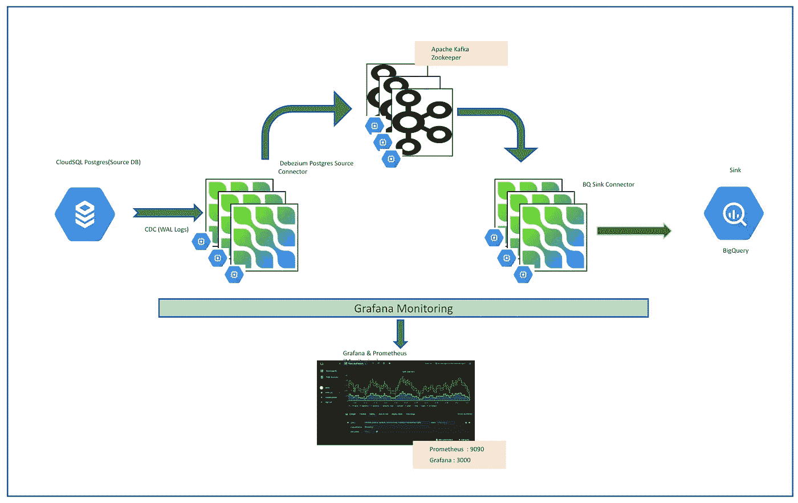

# 要求:

> CloudSQL Postgres 实例

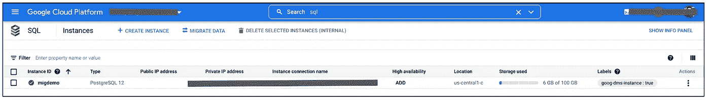

> BigQuery 实例

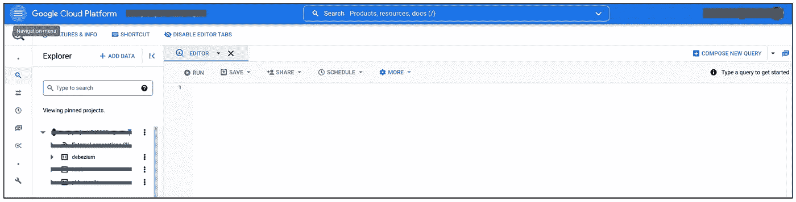

> Debezium 服务【详见[第 1 部分](/@saurabhgupt_85545/near-real-time-data-replication-using-debezium-fd32be6d192a)

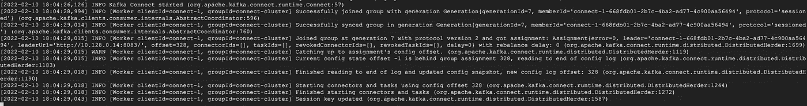

# 连接器安装

在所有 3 个 Debezium 节点上执行以下安装步骤:

## 安装源连接器:Debezium Postgres 到 Kafka 连接器

> 合流-集线器安装 debezium/debezium-连接器-postgres:最新

## 安装接收器连接器:Kafka 到 BigQuery 连接器

> 合流-集线器安装 wepay/kafka-connect-bigquery:最新

# 连接器配置

## 源连接器配置— CloudSQL Postgres

> cat ~/source.json
> 
> {
> "name": "sourcecloudsqlpg "，
> " config ":{
> " connector . class ":" io . debezium . connector . PostgreSQL . postgresconnector "，
> "database.hostname": "XX。XX.XX.XX "、
> "database.port": "5432 "、
> "database.user": "postgres "、
> "database.password": "*** "、
> " database . dbname ":" dvdrental "、
> " database . server . name ":" my-server "、
> "transforms": "route "、
> " transforms . route . type ":" org . Apache . Kafka . connect . transforms . regex router "]+)\\.([^.]+)\\.([^.]+)"、
> " transforms . route . replacement ":" $ 3 "、
> "plugin.name": "wal2json "、
> " transforms . unwrap . add . source . fields ":" ts _ ms "、
> " tombstones . on . delete ":" false "、
> " include . schema . changes ":" true "、
> " consistent . schema . handling . mode ":" warn "、
> " database . history . skip . un parse .

## 目标连接器配置— BigQuery

> cat ~/target.json
> 
> {
> "name": "targetbigquery "，
> " config ":{
> " connector . class ":" com . wepay . Kafka . connect . bigquery . bigquerysinkconnector "，
> "tasks.max" : "1 "，
> "errors.log.enable": true，
> " errors . log . include . messages ":true，
> "topics" : "accounts "，
> " sanitietopics ":" true "，【T33hoistfieldkey . type ":" org . Apache . Kafka . connect . transforms . hoistfield $ Key "，
> "transforms。HoistFieldKey.field": "user_id "、
> " allowNewBigQueryFields ":" true "、
> " allowbigqueryrequiredfieldlaxation ":" true "、
> " schemaRetriever ":" com . wepay . Kafka . connect . big query . retrieve . identityschemaretriever "、
> " key . converter ":" org . Apache . Kafka . connect . storage . string converter "、
> "

## BQ 服务帐户和密钥创建步骤:

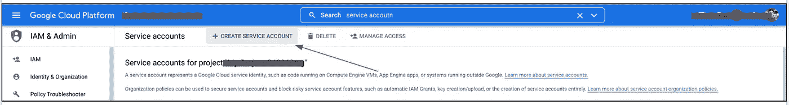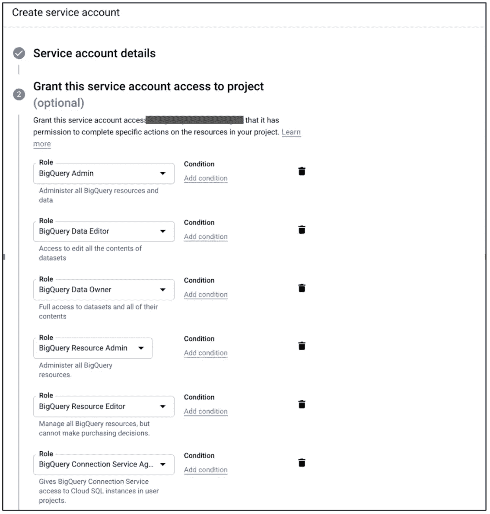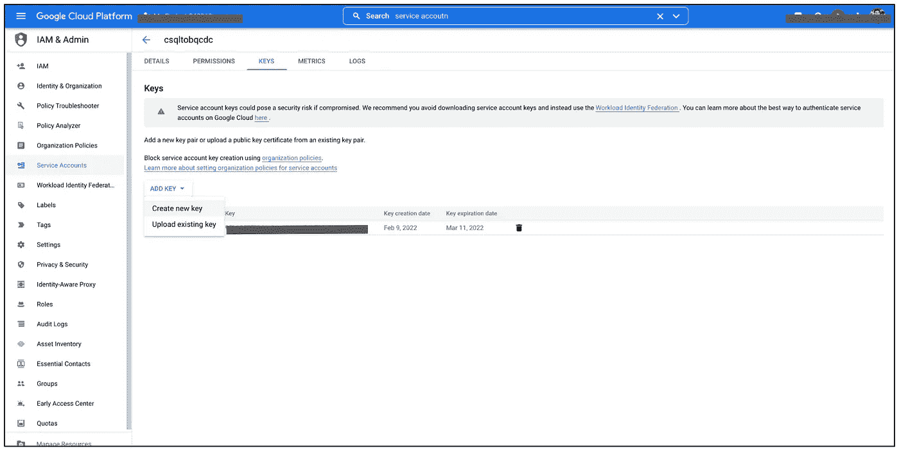

下载并粘贴 BigQuery 接收器连接器配置文件 keyfile 中定义的密钥。

# 连接器注册:

## 注册并启动源 CloudSQL PG 连接器:

> curl-l-X POST-H " Accept:application/JSON "-H " Content-Type:application/JSON " localhost:8083/connectors/-d[@](http://twitter.com/bt)source . JSON

上面的命令将注册并启动源 CloudSQL PG 连接器。一旦连接器启动，它就与源(即 CloudSQL PG)连接，并获取连接器配置文件中定义的白名单表的快照，并推送 kafka 主题中与数据库表名同名的所有记录。根据上面的配置文件，获取**账户**表的快照，并将所有 58 条记录推送到名为**账户**的 kafka 主题。快照完成后，已更改记录的流式传输会自动开始。

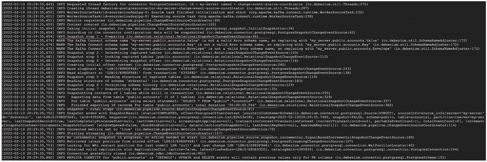

debezium 日志的快照

列出 kafka 主题，并确保创建了与正在复制的 postgres 表同名的 kafka 主题。

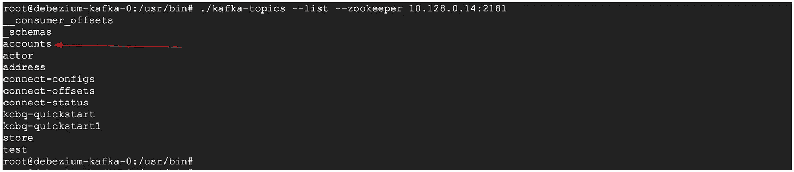

创建与 Postgres 表名同名的 Kafka 主题

列出 kafka 主题的内容，并确保将记录流式传输到 kafka 主题。kafka 主题中的记录数应该等于 postgres 表中的记录数。

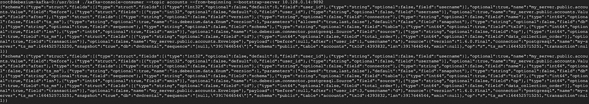

## 注册并启动 BigQuery 接收器连接器:

> curl-l-X POST-H " Accept:application/JSON "-H " Content-Type:application/JSON " localhost:8083/connectors/-d[@](http://twitter.com/bt)target . JSON

以上命令将注册并启动接收器 BigQuery 连接器。一旦连接器启动，它就与 kafka schema registry 连接，获取源表(即 accounts)的模式，并在 BQ 数据集中创建该表。BQ sink connector 还创建了一个 account_tmp*表。从 kafka topic 中读取的所有记录首先被推送到 account_temp* table 中，然后与父 account 表合并。

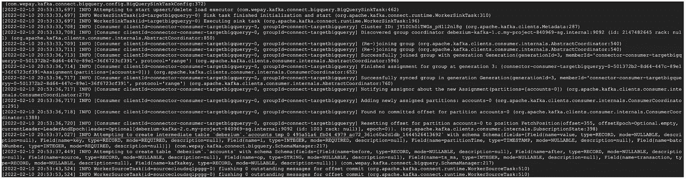

BQ 中自动创建的账户表

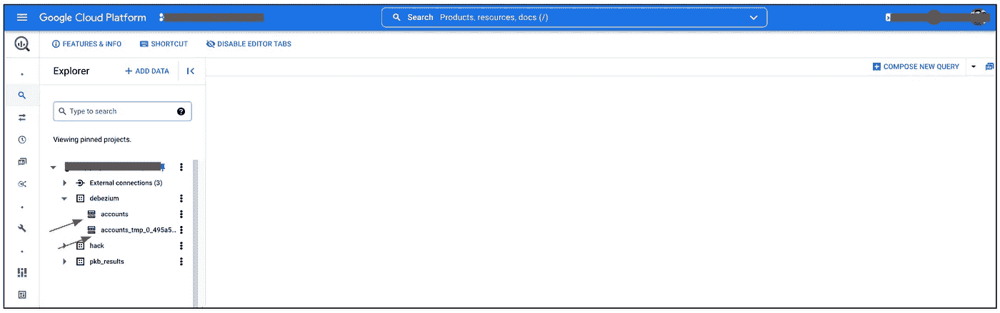

BQ 中 Debezium 数据集中创建的 Accounts 和 Accounts_tmp*表

# 数据有效性

## 初始快照验证
更改数据复制验证

> 案例 1:插入一条记录
> 
> 案例 2:删除 2 条记录
> 
> 案例 3:更新记录
> 
> 案例 4:修改表以添加一列并插入一条具有新结构的记录
> 
> 案例 5:修改表，删除一列，插入一条新结构的记录

## 初始快照验证

> 来源:CloudSQL Postgres 表—账户[58 条记录]:

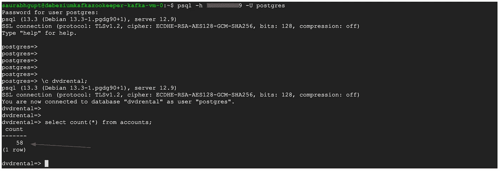

> 卡夫卡主题—账户[58 个记录]

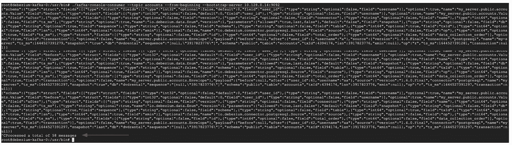

> 大查询表-帐户[58 条记录]

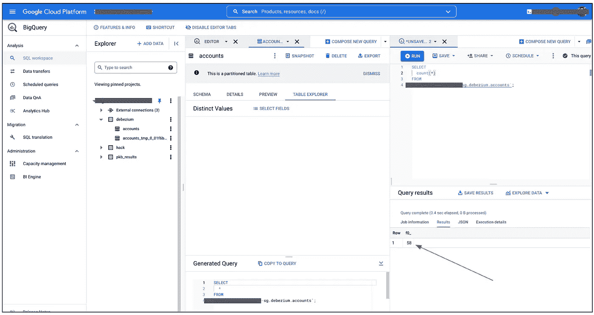

## 更改数据复制验证

> 案例 1:插入一条记录

在源 cloudsql pg accounts 表中插入记录。[59 项记录]

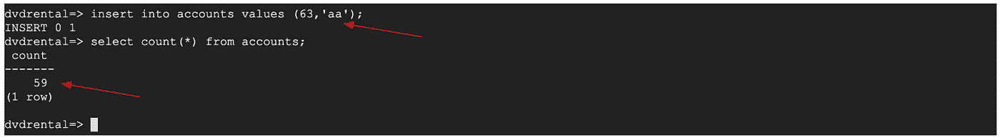

卡夫卡专题——账户【59 条记录】。最后一行显示的值与插入的值相同。

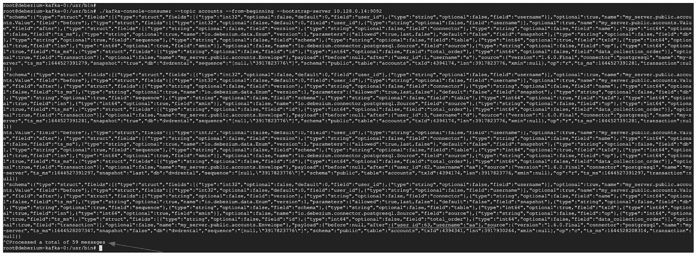

BigQuery 表-帐户[59 条记录]。最后一行显示的值与插入的值相同。

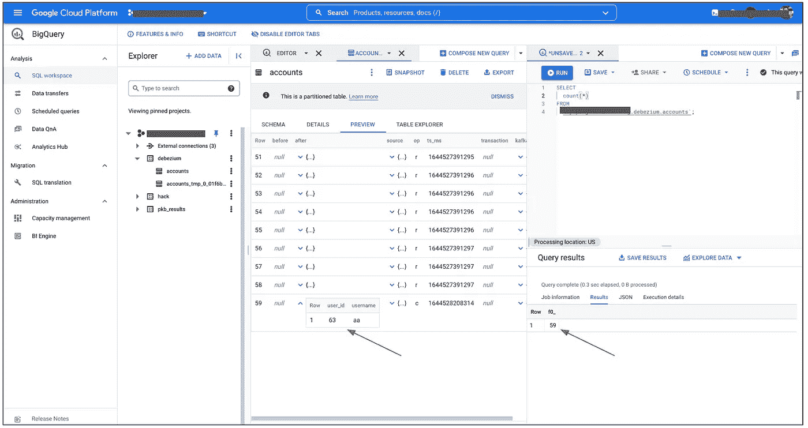

> 案例 2:更新记录

从源 cloudsql pg 帐户表中删除 2 条记录。[57 项记录]

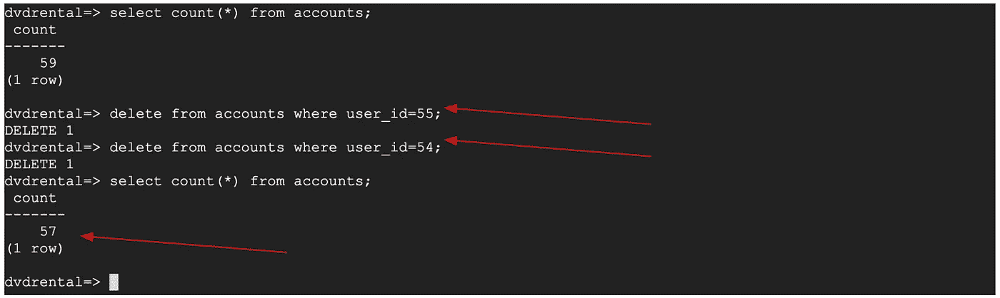

Kafka topic [61 条记录，最新条目为删除操作]

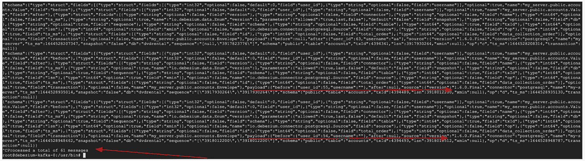

BigQuery 表-帐户[57 条记录]。在 BQ 中，删除被视为软删除，因此在获取总计数时，在 SQL 语句的 where 子句中使用 op <> 'd'。

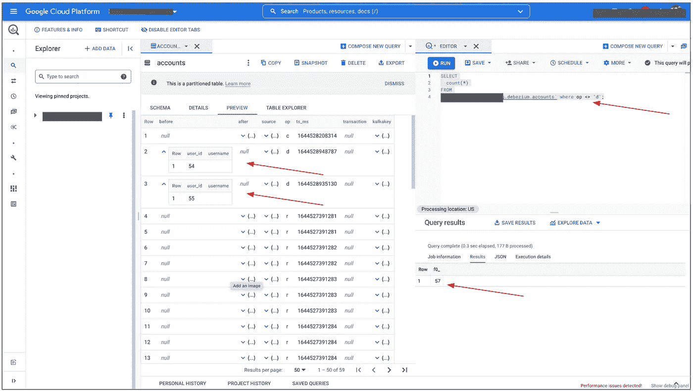

> 案例 3:更新记录

更新源 cloudsql Postgres 中的一条记录[57 条记录]

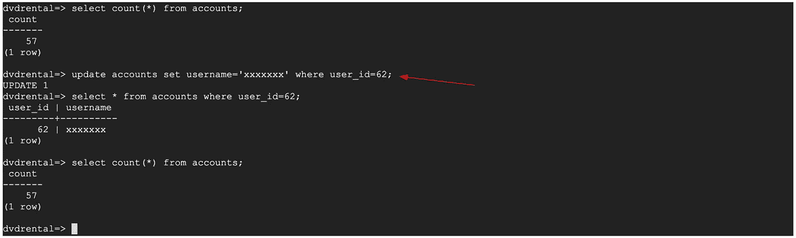

Kafka topic [以最新条目作为更新操作的 62 条记录]

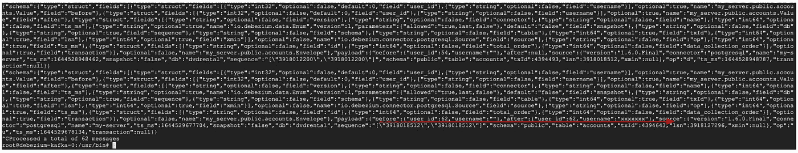

BigQuery 表[包含更新数据的 62 条记录]

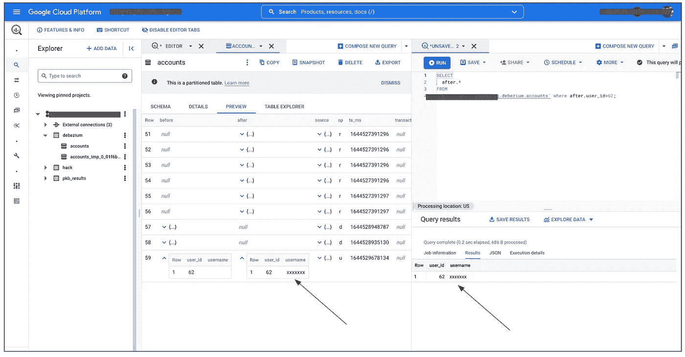

> 案例 4:修改表以添加一列并插入一条具有新结构的记录

通过添加列来改变表结构。在 cloudsql PG account 表中增加一列**城市**，并插入一条记录。

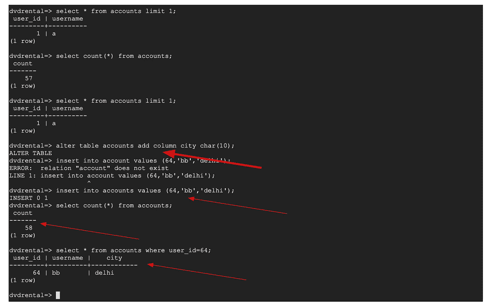

卡夫卡专题【新记录新栏目】

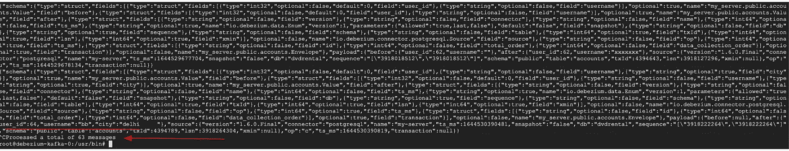

Debezium 日志指示自动模式更改

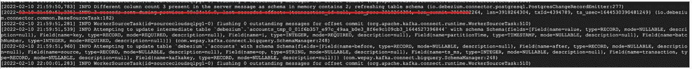

Bigquery 表[具有最新记录的新列]:

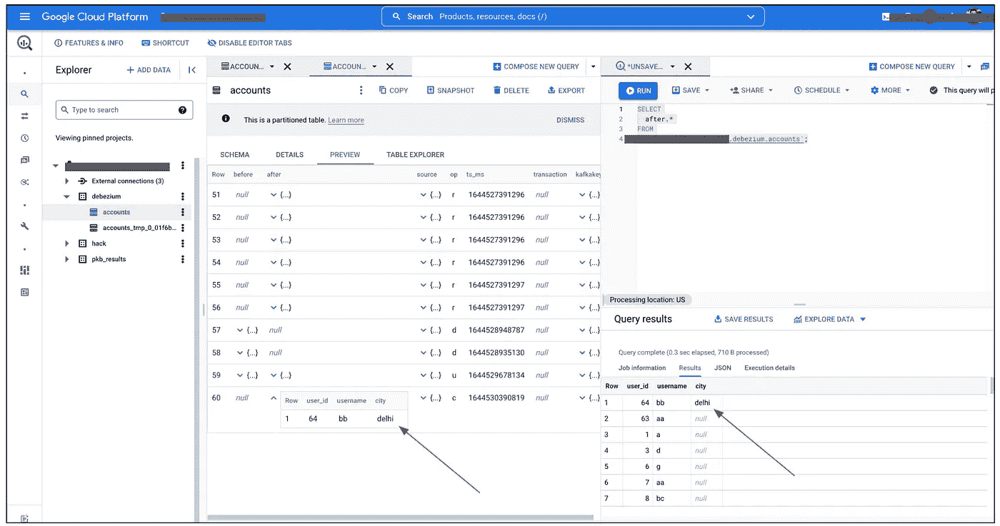

> 案例 5:修改表，删除一列，插入一条新结构的记录

通过删除一列来改变表结构。在 cloudsql pg 表中删除列**城市**，并插入一条记录。

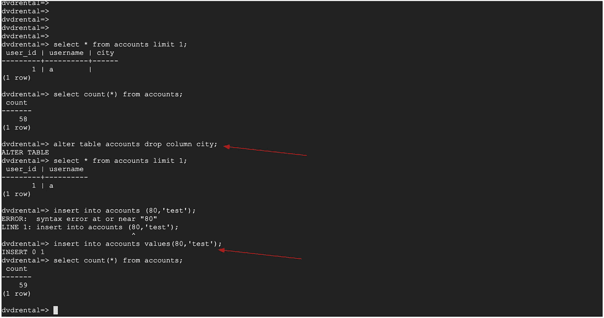

Debezium 日志指示自动模式更改

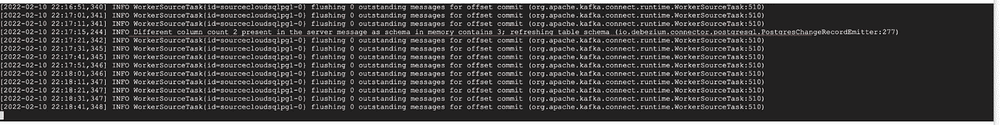

卡夫卡专题卡夫卡专题[新记录带掉栏]:

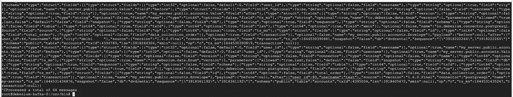

Bigquery 表[删除 City 列，用新结构添加最新记录]:

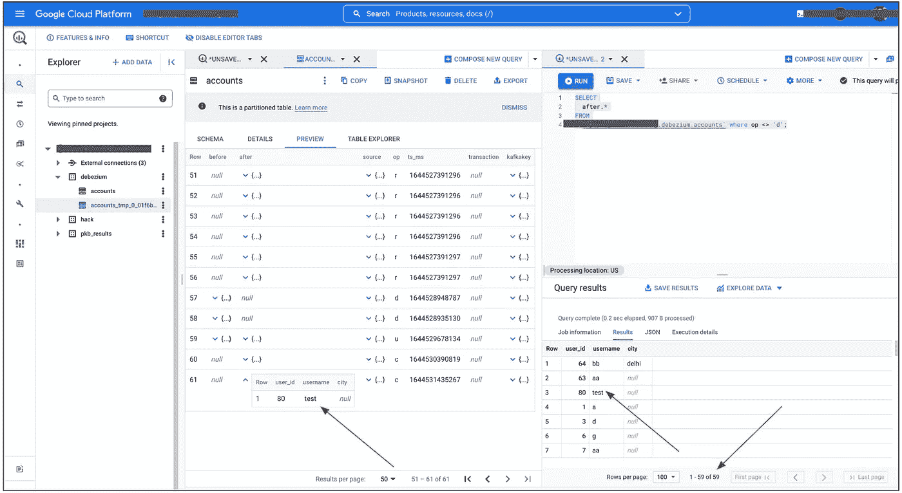

我们已经成功地安装和配置了源和接收器连接器，并且通过无缝的模式进化复制了数据。

## 有用的命令

> 连接器注册验证:
> 
> curl-k-H " Content-Type:application/JSON "[http://localhost:8083/connectors/](https://ssh.cloud.google.com/devshell/proxy?authuser=0&devshellProxyPath=%2Fconnectors%2F&port=8083&environment_name&environment_id)
> 
> ["sourcecloudsqlpg "，" targetbigquery"]
> 
> 列出卡夫卡主题
> 
> usr/bin/Kafka-主题-列表-动物园管理员 10.128.0.14:2181
> 
> 读一个卡夫卡的话题
> 
> /usr/bin/Kafka-控制台-消费者-主题帐户-从头开始-引导-服务器 10.128.0.14:9092
> 
> 从 Debezium 中删除连接器
> 
> curl-X DELETE[http://localhost:8083/connectors/](http://localhost:8083/connectors/sourcecloudsqlpggg)<connector name>

我们能够成功地建立从 CloudSQL PG 到 BigQuery 的数据复制管道。这个数据复制管道还无缝地将模式更改从源数据库[CloudSQL PG]推到目标数据库[BQ]。

看到你就看到你，快乐学习！

索拉博。