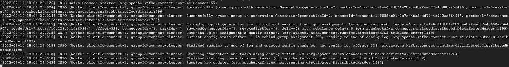

# 使用 Debezium 进行近乎实时的数据复制

> 原文：<https://medium.com/google-cloud/near-real-time-data-replication-using-debezium-fd32be6d192a?source=collection_archive---------0----------------------->

## 第 1 部分:[介绍和实现](/@saurabhgupt_85545/near-real-time-data-replication-using-debezium-fd32be6d192a)
第 2 部分:[构建从 GCP CloudSQL Postgres 到 BigQuery](/@saurabhgupt_85545/near-real-time-data-replication-using-debezium-4da77cef67ab) 的数据复制管道的详细指南

## **什么是 Debezium？**

Debezium 是一个用于变更数据捕获的开源分布式平台。启动它，将它指向您的数据库，您的应用程序就可以开始响应其他应用程序提交到您的数据库的所有插入、更新和删除操作。Debezium 持久而快速，因此您的应用程序可以快速响应，不会错过任何事件。Debezium 持续监控您的数据库，并让您的任何应用程序以提交到数据库的相同顺序传输每个行级别的更改。

## 它是做什么的？

配置完成后，Debezium 会连接到源数据库，并对所有表或选择的表进行一致的快照。快照完成后，连接器会连续捕获行级更改，这些更改会插入、更新和删除提交给源数据库的数据库内容。连接器生成数据变更事件记录，并将它们传输到 Kafka 主题。对于每个表，默认行为是连接器将所有生成的事件流式传输到该表的一个单独的 Kafka 主题。应用程序和服务可以使用该主题的数据更改事件记录。

## 好处:

> 经济高效的
> 支持复制 DDL 语句*
> 选择性复制
> 异构数据库之间的数据复制

## 使用案例:

> AWS RDS 到 GCP CloudSQL 连续复制
> Azure [MySQL 或 Postgres]到 GCP CloudSQL [MySQL 或 Postgres]复制
> 跨云灾难恢复设置:从孟买的 RDS Postgres 复制到德里地区的 CloudSQL Postgres

# **架构:**

## **硬件要求**

> 托管 4 个 GCE 实例:
> Zookeeper
> Kafka
> 带有源和接收器 debezium 连接器的汇合平台
> 带有 Grafana + Prometheus 的监控设置

## 端口配置

以下端口必须打开:

# **安装:**

## 安装 JRE

> sudo apt-get -y 安装默认值-jre

## 使用融合的 kafka 平台安装 Kafka 和 Zookeeper

安装融合公钥。这个密钥用于对 APT 存储库中的包进行签名。

> https://packages.confluent.io/deb/4.0/archive.key| sudo apt-key add-

通过运行以下命令，将存储库添加到/etc/apt/sources.list 中:

> sudo apt 安装软件-属性-通用
> $ sudo add-apt-repository " deb[arch = amd64][https://packages.confluent.io/deb/4.0](https://packages.confluent.io/deb/4.0)稳定主"

更新 apt-get 并安装融合平台平台。

> sudo apt-get 更新&& sudo apt-get 安装融合平台

仅使用融合社区组件的融合平台:

> $ sudo apt-get 更新&& sudo apt-get 安装汇合平台 oss-2.11
> 
> sudo apt-get 更新&& sudo apt-get 安装汇合-集线器-客户端汇合-公共汇合-kafka-2.11

# **配置**

## 配置 Zookeeper:

建议以复制模式实现 ZooKeeper。复制模式至少需要三台服务器，并且必须有奇数台服务器用于故障转移。更多信息，请参见 [ZooKeeper 文档](https://zookeeper.apache.org/doc/current/zookeeperStarted.html#sc_RunningReplicatedZooKeeper)。

导航到 ZooKeeper 属性文件(/etc/Kafka/ZooKeeper . properties)并进行修改，如图所示。

## 节点 1: 10.128.0.14

> tick time = 2000
> dataDir =/var/lib/zookeeper/
> client port = 2181
> init limit = 5
> sync limit = 2
> server . 1 = 10 . 128 . 0 . 14:2888:3888
> server . 2 = 10 . 128 . 15 . 236:2888:3888
> server . 3 = 10 . 128 . 0 . 14

## 节点 2: 10.128.15.236

> tick time = 2000
> dataDir =/var/lib/zookeeper/
> client port = 2181
> init limit = 5
> sync limit = 2
> server . 1 = 10 . 128 . 0 . 14:2888:3888
> server . 2 = 10 . 128 . 15 . 236:2888:3888
> server . 3 = 10 . 128 . 0 . 14

## 节点 3: 10.128.0.13

> tick time = 2000
> dataDir =/var/lib/zookeeper/
> client port = 2181
> init limit = 5
> sync limit = 2
> server . 1 = 10 . 128 . 0 . 14:2888:3888
> server . 2 = 10 . 128 . 15 . 236:2888:3888
> server . 3 = 10 . 128 . 0

这种配置用于三节点集合。该配置文件在集合中的所有节点上应该是相同的。

导航到 ZooKeeper 日志目录(例如/var/lib/zookeeper/)并创建一个名为 myid 的文件。myid 文件由一行组成，包含格式为<machine-id>的机器 id。当 ZooKeeper 服务器启动时，它通过引用 myid 文件知道它是哪个服务器。例如，服务器 1 的 myid 值为 1。</machine-id>

## 节点 1: 10.128.0.14

> echo " 1 " >/var/lib/zookeeper/myid

## 节点 2: 10.128.15.236

> echo " 2 " >/var/lib/zookeeper/myid

## 节点 3: 10.128.0.13

> echo " 3 " >/var/lib/zookeeper/myid

## 配置 Kafka

导航到 Apache Kafka 属性文件(/etc/kafka/server.properties)并定制以下内容:

## 节点 1: 10.128.0.14

> broker . id . generation . enable = true
> delete . topic . enable = true
> listeners = PLAINTEXT://:9092
> zookeeper . connect = 10 . 128 . 0 . 14:2181，10.128.15.236:2181，10 . 128 . 0 . 13:2181
> log . dirs =/var/lib/Kafka
> log . retention . hours = 168
> num . partitions = 1

## 节点 2: 10.128.15.236

> broker . id . generation . enable = true
> delete . topic . enable = true
> listeners = PLAINTEXT://:9092
> zookeeper . connect = 10 . 128 . 0 . 14:2181，10.128.15.236:2181，10 . 128 . 0 . 13:2181
> log . dirs =/var/lib/Kafka
> log . retention . hours = 168

## 节点 3: 10.128.0.13

> broker . id . generation . enable = true
> delete . topic . enable = true
> listeners = PLAINTEXT://:9092
> zookeeper . connect = 10 . 128 . 0 . 14:2181，10.128.15.236:2181，10 . 128 . 0 . 13:2181
> log . dirs =/var/lib/Kafka
> log . retention . hours = 168【T16

# 启动汇流平台

## 启用并启动 ZooKeeper

> sudo 系统 ctl 启用合流-动物园管理员
> sudo 系统 ctl 启动合流-动物园管理员
> 
> sudo 系统状态汇流-动物园管理员

## 启用并启动 Kafka

> sudo 系统 ctl 开始汇合-卡夫卡
> sudo 系统 ctl 启用汇合-卡夫卡

## 启用并启动架构注册表

> sudo 系统 ctl 启动汇合模式注册表
> sudo 系统 ctl 启用汇合模式注册表

## 验证服务已启动并正在运行

> sudo 系统状态汇流-动物园管理员

> sudo 系统 ctl 状态汇流-卡夫卡

> sudo 系统状态汇合-架构-注册表

## 以分布式模式配置 Debezium 服务

导航到以下文件(/etc/Kafka/connect-distributed . properties)并定制以下内容:

—在所有三个节点上:

> bootstrap . servers = 10 . 128 . 0 . 14:9092，10.128.15.236:9092，10 . 128 . 0 . 13:9092
> group . id = connect-cluster
> plugin . path =/usr/share/Java，/usr/share/confluent-hub-components

## 手动启动 Debezium 服务:

> /usr/bin/connect-distributed/etc/Kafka/connect-distributed . properties 和

我们已经成功地在 3 个节点上以分布式模式安装了 debezium。

[**Part2**](/@saurabhgupt_85545/near-real-time-data-replication-using-debezium-4da77cef67ab) 构建从 GCP CloudSQL Postgres 到 BigQuery 的数据复制管道的详细指南

## 参考资料:

> [安装合流平台](https://docs.confluent.io/4.0.3/installation/installing_cp.html)

下次再见，学习愉快！

索拉博。