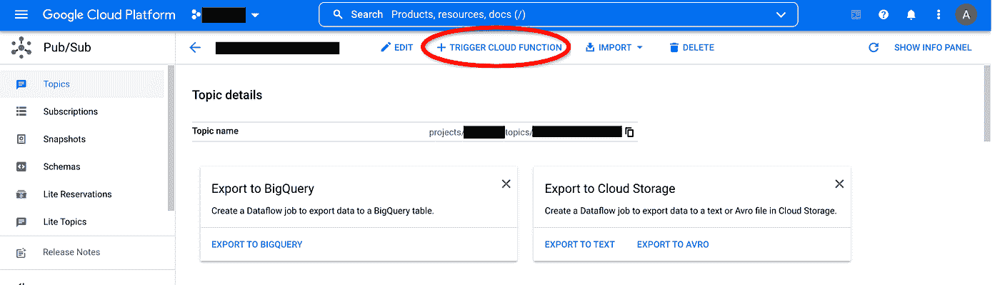
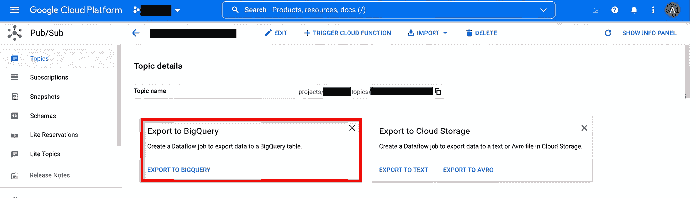
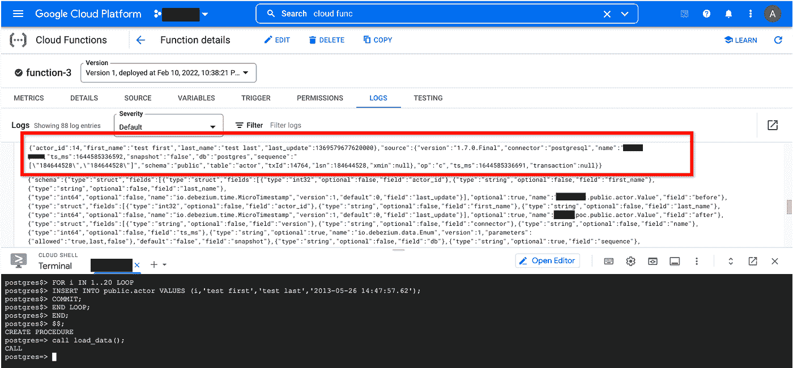

# 在 GKE 上使用 Debezium 进行近实时数据复制

> 原文：<https://medium.com/google-cloud/near-real-time-data-replication-using-debezium-on-gke-634ee1d3e1aa?source=collection_archive---------1----------------------->

在本帖中，我们将使用部署在 GKE 上的 Debezium 将实时数据从 Postgres 实例传输到 Google Pub/Sub。


体系结构

设置完成后，您可以使用任何下游工具。一个广泛使用的用例是将流量从发布/订阅传输到数据流，在其上运行一些转换，然后导出到 BigQuery 进行分析。

# 所需的基础设施:

我们将在基础架构下进行配置

1.  CloudSQL 上的 Postgres DB
2.  GKE 的 Debezium
3.  云发布/订阅
4.  一个附属于 Pub/Sub 的云功能-只是为了确保流到达 GCP

# **1。CloudSQL 上的 postgres DB**

1.使用下面的命令创建一个 Postgres DB，确保添加了" ***—数据库标志 cloudsql . logical _ decoding = on***"

```
gcloud sql instances create debezium-db — database-version=POSTGRES_12 — tier=db-g1-small — region=asia-south1 — database-flags cloudsql.logical_decoding=on
```

2.接下来，在创建数据库之后——连接到 Postgres 并创建一个数据库用户“debezium_user ”,它具有复制属性。

```
CREATE USER debezium_user WITH REPLICATION IN ROLE cloudsqlsuperuser LOGIN PASSWORD admin;
```

3.创建一个我们将用于测试的表。

```
CREATE TABLE public.actor (actor_id integer NOT NULL,first_name character varying(45) NOT NULL,last_name character varying(45) NOT NULL,last_update timestamp without time zone DEFAULT now() NOT NULL);
```

# 2.创建发布/订阅主题

创建一个名为< CloudSQL Server Name >的 [GCP 发布/订阅](https://cloud.google.com/pubsub)主题。<模式名>。<表>跟随[创建发布/订阅](https://cloud.google.com/pubsub/docs/quickstart-console)。对于我们的例子，它应该是**debezium-db . public . actor**。

为了使用发布/订阅，我们还需要添加一些配置。我们将在 Debezium 配置文件中添加以下配置参数

> debezium.sink.type=pubsub
> 
> debezium . sink . pub sub . project . id =
> 
> debezium . sink . pub sub . ordering . enabled = true

# 3.GKE 的 Debezium

要在 GKE 上部署 Debezium，我们需要创建一个打开了工作负载身份的 Kubernetes 集群

1.  在[创建 GKE 集群](https://cloud.google.com/kubernetes-engine/docs/how-to/workload-identity)之后创建 GKE 集群(确保您为服务帐户分配了访问发布/订阅的角色)
2.  在集群上部署以下文件，我们正在部署一个带有开源 Debezium 映像的[有状态集](https://kubernetes.io/docs/concepts/workloads/controllers/statefulset/)。唯一增加的是 Debezium 容器中使用的命令，它将使用 [GCP 云代理](https://cloud.google.com/sql/docs/mysql/sql-proxy)连接到数据库。

您可以在以下位置找到代码库

[](https://github.com/ajiteshk-G/Near-Real-Time-Streaming-using-Debezium-on-GKE) [## GitHub-ajiteshk-G/GKE 河畔使用 Debezium 的近实时流

### 此时您不能执行该操作。您已使用另一个标签页或窗口登录。您已在另一个选项卡中注销，或者…

github.com](https://github.com/ajiteshk-G/Near-Real-Time-Streaming-using-Debezium-on-GKE) 

确保将这些文件部署在创建 GKE 集群时设置服务帐户的同一名称空间中。

# 4.创建云函数

转到发布/订阅主题，然后单击创建云函数。



# 5.导出到 BigQuery(可选)

您可以通过创建一个数据流作业将流导出到 BigQuery，但是我们将在第 4 步结束这篇文章。



# 测试-

现在我们已经完成了所有的设置，但是我们如何测试呢？转到 CloudFunction 并打开已创建的云函数的 logs 选项卡。接下来，在 Postgres 实例上运行下面的存储过程，然后调用方法。

```
CREATE OR REPLACE PROCEDURE load_data()LANGUAGE plpgsqlAS $$DECLAREBEGINFOR i IN 1..20 LOOPINSERT INTO public.actor VALUES (i,’test first’,’test last’,’2013–05–26 14:47:57.62');COMMIT;END LOOP;END;$$;
```

现在，您应该可以在云函数中看到日志流。

