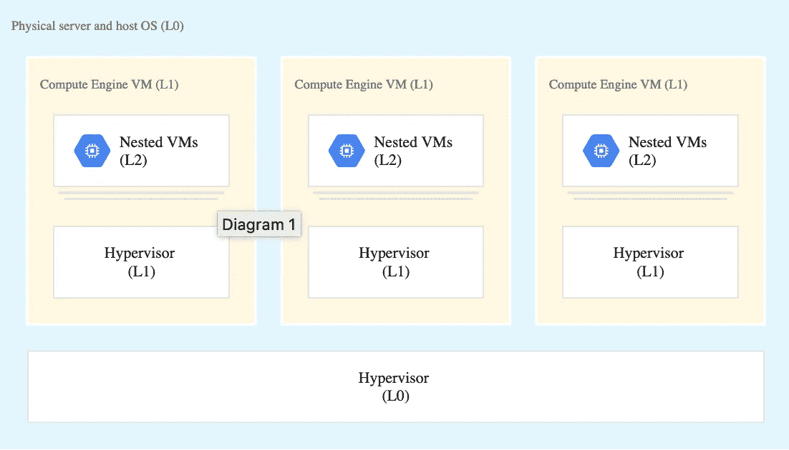
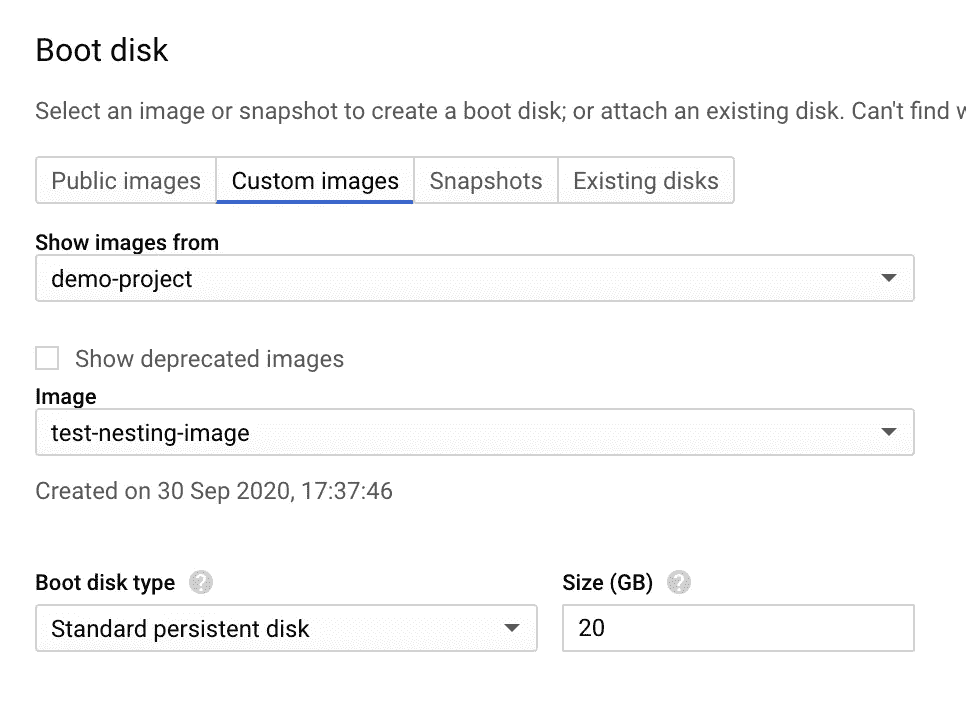

# GCP:centos 8 上的嵌套虚拟化

> 原文：<https://medium.com/google-cloud/nested-virtualization-can-you-run-a-vm-inside-another-vm-c969afe0738f?source=collection_archive---------1----------------------->



*图片由* [*谷歌*](https://cloud.google.com/compute/images/nested-virtualization-diagram.svg) 提供

> 我可以在虚拟机中运行虚拟机吗？

这个更哲学的问题已经成为许多争论的主题。然而事实证明，这样做是完全可能的。事实上，如果你在谷歌上搜索，实际上有一个术语来描述它— **嵌套虚拟化**。

这听起来有点像《盗梦空间》(电影)，但就虚拟化而言，这确实是一种不可避免的邪恶。随着当前云计算的发展，运行裸机实例变得越来越不重要。

然而，小众场景仍然存在，它们继续需要支持虚拟化的环境，即使是在云环境中。一个典型的例子是，如果您尝试使用 GCP 来设置混合云环境。

现在，GCP 在这方面有一系列选项，其中大部分都是特定于场景的，但对于已经预构建并且依赖 KVM 的工作负载，您需要跨越一系列障碍才能将它们迁移到云。

仔细想想，有时甚至不值得这么麻烦，因为这种需求可能只是暂时的，也许只是为了短暂的故障转移。因此，嵌套虚拟机允许您将实例从本地迁移到云中，反之亦然。

还有许多其他利基场景。事实上，既然你在这里，你可能正在处理其中的一个。

因此，让我们来看一下如何启动和运行嵌套的虚拟机。

# **先决条件**

1.在[谷歌云平台控制台](https://console.cloud.google.com/)中创建一个项目。
2。为您的项目启用计费。
3。设置[区域和地区详情](https://cloud.google.com/compute/docs/gcloud-compute#set_default_zone_and_region_in_your_local_client)

# **入门**

1.首先创建一个标准的 VM 实例。请记住，我们将使用这个实例来构建引导映像，因此您可能希望将配置与您想要的最终结果相匹配。在我的例子中，我希望以一个带有`2CPU and 8GB memory`的嵌套 VM 结束。如果你愿意，你可以把这个换一下。

```
gcloud compute instances create testing-nesting --zone=us-central1-a --machine-type=n2-standard-2 --image=centos-8-v20200910 --image-project=centos-cloud --boot-disk-size=20GB --boot-disk-type=pd-standard --boot-disk-device-name=testing-nesting
```

您可以进入虚拟机，通过运行该命令查看嵌套虚拟化是否启用。零响应确认其未启用。

```
grep -cw vmx /proc/cpuinfo
```

2.关闭虚拟机实例。

3.基于刚刚为虚拟机实例创建的磁盘，创建一个自定义映像。请注意，下面的命令使用您创建的磁盘作为源磁盘。您也可以使用您已经创建的任何其他磁盘。

```
gcloud compute images create test-nesting-image --source-disk testing-nesting --source-disk-zone us-central1-a --licenses "https://www.googleapis.com/compute/v1/projects/vm-options/global/licenses/enable-vmx"
```

这个新图像现在应该出现在您的图像列表中，您可以通过检查[计算机图像列表](https://console.cloud.google.com/compute/images)来确认。

现在，您的映像已经准备好了，您可以创建嵌套的 VM 实例了。

如果您使用控制台 GUI 来构建新的实例，那么应该可以在 Custom Images 下找到新的映像。



在命令行上，您的`gcloud`命令看起来像这样

```
gcloud compute instances create testing-nested-vm --zone=us-central1-a --machine-type=n2-standard-2 --image=test-nesting-image --boot-disk-size=20GB --boot-disk-type=pd-standard --boot-disk-device-name=new-nested-disk
```

一旦您的虚拟机实例启动，登录并检查嵌套虚拟化是否已启用。非零响应意味着它已被启用。

```
grep -cw vmx /proc/cpuinfo
```

通过这些简单的步骤，您现在有了一个可以工作的嵌套实例，此时您甚至可以继续为您的工作负载设置虚拟机管理程序。