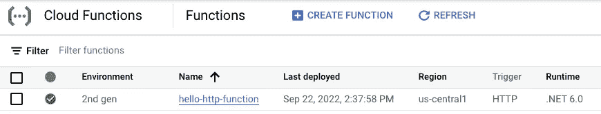
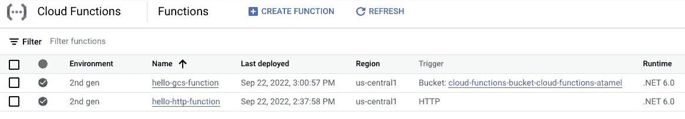

# 。关于云功能的 NET 6(第二代)

> 原文：<https://medium.com/google-cloud/net-6-on-cloud-functions-2nd-gen-32e844ce9828?source=collection_archive---------1----------------------->

回到八月份，我们[宣布了](https://cloud.google.com/blog/products/serverless/cloud-functions-2nd-generation-now-generally-available)第二代云函数，具有更长的请求处理时间、更大的实例、带有 Eventarc 的新事件源等等。

几周前。NET 6 支持(公开预览版)被默默添加到云功能中。

让我们看看如何部署一些。NET 6 函数到云函数第二代。

# 的功能框架。网

[职能框架为。NET](https://github.com/GoogleCloudPlatform/functions-framework-dotnet) 是最简单的创建方式。使用 HTTP 或 CloudEvent 请求的. NET 函数。

将模板包安装到。网络工具:

```
dotnet new -i Google.Cloud.Functions.Templates
```

这将为. NET 安装三个模板。您可以通过运行以下命令来验证模板是否已安装:

```
dotnet new --listTemplates                                            Short Name
--------------------------------------------------------------------
Google Cloud Functions CloudEvent Function           gcf-event
Google Cloud Functions CloudEvent Function (Untyped) gcf-untyped-event
Google Cloud Functions HttpFunction                  gcf-http
```

**注**:功能框架。NET 当前支持。网芯 3.1，但是。NET 6.0 支持即将推出。您需要将生成项目的目标框架更改为。NET 6.0 以后(见下文)。

# HTTP 功能

使用`gcf-http`模板创建一个处理 HTTP 请求的函数:

```
mkdir HelloHttp 
cd HelloHttp 
dotnet new gcf-http
```

这将创建一个项目和一个用于响应 HTTP 请求的 [Function.cs](https://github.com/meteatamel/cloud-functions-dotnet/blob/master/HelloHttp/Function.cs) 文件。

将目标框架更改为`.csproj`文件中的`net6.0`:

```
<TargetFramework>net6.0</TargetFramework>
```

使用`--trigger-http` `--gen2`标志和`dotnet6`运行时部署到云功能:

```
gcloud functions deploy hello-http-function \
    --allow-unauthenticated \
    --entry-point HelloHttp.Function \
    --gen2 \
    --region us-central1 \
    --runtime dotnet6 \
    --trigger-http
```

一两分钟后，您应该会看到云控制台中部署的云功能:



您可以通过使用`gcloud`发送 HTTP 请求来调用该函数:

```
gcloud functions call hello-http-function \
    --gen2 \
    --region us-central1
```

# CloudEvent 函数

或者，您可以使用`gcf-event`模板创建一个使用 CloudEvent 请求的函数:

```
mkdir HelloGcs
cd HelloGcs
dotnet new gcf-event
```

这将创建一个项目和一个 [Function.cs](https://github.com/meteatamel/cloud-functions-dotnet/blob/master/HelloGcs/Function.cs) 文件来响应 CloudEvent 请求。该函数还将 CloudEvent 的数据解析到`StorageObjectData`中。

将目标框架更改为`.csproj`文件中的`net6.0`:

```
<TargetFramework>net6.0</TargetFramework>
```

使用`--trigger-event` `--gen2`标志和`dotnet6`运行时部署到云功能:

```
gcloud functions deploy hello-gcs-function \
    --allow-unauthenticated \
    --entry-point HelloGcs.Function \
    --gen2 \
    --region us-central1 \
    --runtime dotnet6 \
    --trigger-event google.storage.object.finalize \
    --trigger-resource ${BUCKET_NAME}
```

在这种情况下，您在`--trigger-event`中指定`google.storage.object.finalize`，在`--trigger-resource`中指定桶名，以监听桶中的新文件创建。

几分钟后，该功能应该在云控制台中可见:



您可以通过将文件上传到存储桶来触发该功能:

```
echo "Hello from Storage" > random.txt
gsutil cp random.txt gs://${BUCKET_NAME}
```

如果你想了解更多。NET 6 和云函数，你可以在我们的[中找到更多示例。NET 上的 Google Cloud Functions](https://github.com/meteatamel/cloud-functions-dotnet) repo 上的 GitHub，并在 C# codelab 中试用 [Google Cloud Functions。](https://codelabs.developers.google.com/codelabs/cloud-functions-csharp)

如有任何问题或反馈，请随时在 Twitter [@meteatamel](https://twitter.com/meteatamel) 上联系我。

*原发布于*[*https://atamel . dev*](https://atamel.dev/posts/2022/10-03_dotnet6_cloud_functions/)*。*