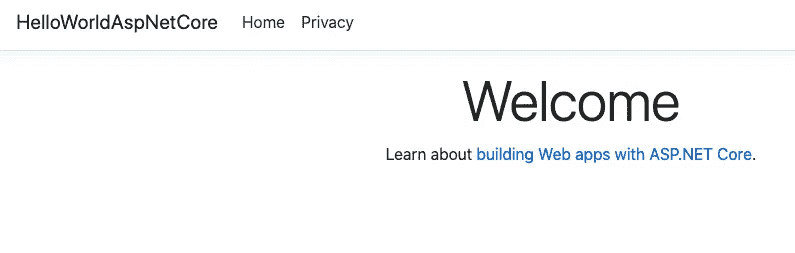
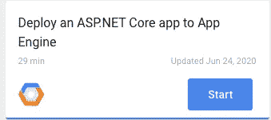

# 。云壳和 App Engine 灵活环境下的 NET Core 3.1 更新

> 原文：<https://medium.com/google-cloud/net-core-3-1-updates-in-cloud-shell-and-app-engine-flexible-environment-8714e345af32?source=collection_archive---------3----------------------->

。NET Core 3.1 于 2019 年 12 月 3 日发布，为 LTS 版本，支持三年。

在谷歌云中，你已经可以部署。NET Core 3.1 容器在云运行(参见 [cloud-run-dotnetcore-31](https://github.com/meteatamel/cloud-run-dotnetcore-31) )中，也在 App Engine 灵活环境中使用[自定义运行时](https://cloud.google.com/appengine/docs/flexible/custom-runtimes)。

我们最近扩展了。NET Core 3.1 以多种方式提供支持:

1.  云壳现在支持。网芯 3.1。
2.  App Engine 灵活环境运行时现在支持。网芯 3.1。

# 。云壳中的网芯 3.1

在云壳内部，可以看到最新的`3.1.301`版本:

创建 ASP.NET 核心 MVC 应用程序:

```
$ dotnet new mvc -o HelloWorldAspNetCore Running 'dotnet restore' on HelloWorldAspNetCore/HelloWorldAspNetCore.csproj... Determining projects to restore... Restored /home/atameldev/HelloWorldAspNetCore/HelloWorldAspNetCore.csproj (in 221 ms). Restore succeeded.
```

在云壳中运行它:

```
$ dotnet run --urls=http://localhost:8080 info: Microsoft.Hosting.Lifetime[ 0 ] Now listening on: [http://localhost:8080](http://localhost:8080)
```

# 。App Engine 灵活环境下的 NET Core 3.1

您现在可以部署了。NET Core 3.1 应用程序到应用程序引擎的灵活环境，而无需创建自定义运行时。

首先，发布一个发布版本:

```
$ dotnet publish -c ReleaseHelloWorldAspNetCore -> /home/atameldev/HelloWorldAspNetCore/bin/Release/netcoreapp3.1/HelloWorldAspNetCore.dll HelloWorldAspNetCore -> /home/atameldev/HelloWorldAspNetCore/bin/Release/netcoreapp3.1/HelloWorldAspNetCore.Views.dll HelloWorldAspNetCore -> /home/atameldev/HelloWorldAspNetCore/bin/Release/netcoreapp3.1/publish/
```

在`publish`文件夹中创建一个包含以下内容的`app.yaml`文件:

```
cat>bin/Release/netcoreapp3.1/publish/app.yaml<<EOF
env:flex
runtime:aspnetcore
EOF
```

部署到应用引擎:

```
gcloud app deploy bin/Release/netcoreapp3.1/publish/app.yaml
```

然后，您可以使用`gcloud app browse`浏览应用程序，并查看默认页面:



# Codelab 和 GitHub Repo

如果您想亲自体验一下，我们还更新了[部署 ASP.NET 核心应用程序到应用引擎](https://codelabs.developers.google.com/codelabs/cloud-app-engine-aspnetcore)代码实验室的最新信息:



我还创建了一个 GitHub repo，[app engine-flex-dotnetcore](https://github.com/meteatamel/appengine-flex-dotnetcore)，上面有代码和指令。

如果你有问题/评论，欢迎在 Twitter 上联系我( [@meteatamel](https://twitter.com/meteatamel) )。

*原发布于*[*https://atamel . dev*](https://atamel.dev/posts/2020/06-29_dotnetcore31-cloudshell-appengine-flex/)*。*