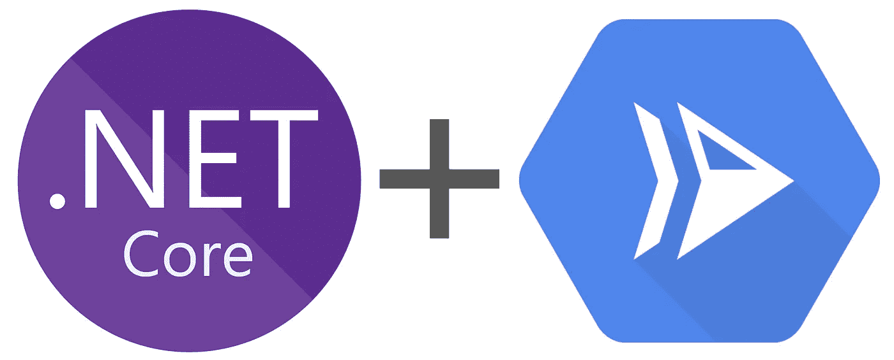

# 。网络功能框架

> 原文：<https://medium.com/google-cloud/net-functions-framework-a039d6d38348?source=collection_archive---------2----------------------->



。网芯+云跑

介绍。NET 函数框架。

在这篇博文中，我们将介绍。NET Functions Framework，并向您展示如何在 Google Cloud 上轻松部署安全的功能。

# 设置

安装[。网芯 SDK 3.1](https://dotnet.microsoft.com/download) 。

安装后，您应该可以访问 CLI，包括 handy。NET 模板来快速入门。

# 快速入门

将 Google Cloud Functions 模板包安装到。网络工具:

```
dotnet new -i Google.Cloud.Functions.Templates::1.0.0-alpha07
```

然后使用。网络模板:

```
mkdir HelloFunctions
cd HelloFunctions
dotnet new gcf-http
```

这将在当前目录中创建`HelloFunctions.csproj`和`Function.cs`。

## 本地测试

在本地运行该功能:

```
dotnet run
```

进入`*127.0.0.1:8080*`调用该功能。

您现在使用。NET 函数框架！

# 添加 Dockerfile 文件

要在容器中运行这个应用程序，我们需要一个新文件，`Dockerfile`:

Dockerfile 文件

这个 docker 文件声明我们希望我们的容器使用。NET 核心，安装依赖项和应用程序代码，构建并运行我们的 dll。

# 部署到云运行

部署您的功能 Google Cloud 并不太难。在我们的终端中，我们将指示`gcloud`执行 to 命令:

1.  使用*云构建*来构建容器
2.  使用*云运行*运行容器

为了简单起见，我们将当前项目存储在 bash 变量`GCP_PROJECT`中。

让我们构建并部署*安全*容器，确保我们使用相同的项目:

设置项目，构建，然后运行。

## 发送经过身份验证的 HTTP 请求

我们部署了一个拒绝未授权请求的安全 web 服务。这对于像内部 API 和云发布/订阅处理程序这样的服务来说非常好。

如果我们试图卷曲我们的服务的 URL，我们将得到一个`Error: Forbidden`消息。

那么我们如何调用我们的服务呢？

我们可以简单地将 HTTP 头中的授权承载令牌传递给我们的云运行服务:

获取 Run 服务的 URL，然后用您的 gcloud ID 令牌将其卷曲。

卷曲网址，你会看到回应:

```
Hello, Functions Framework.
```

## 感谢阅读

感谢您快速了解。NET 函数框架。

您现在可能有兴趣在上注册 Google Cloud 功能的早期访问计划。网络:

*   [💜谷歌表单:谷歌云功能开启。净](https://docs.google.com/forms/d/e/1FAIpQLSe7qB5vNrgFtZZ3ZUfIwkbsDMGsA1fXY52GzmGmnhwdReHuOQ/viewform)

或者，您可能有兴趣浏览源代码或为。网络功能框架:

*   [📂github.com/GoogleCloudPlatform/functions-framework-dotnet](https://github.com/GoogleCloudPlatform/functions-framework-dotnet)