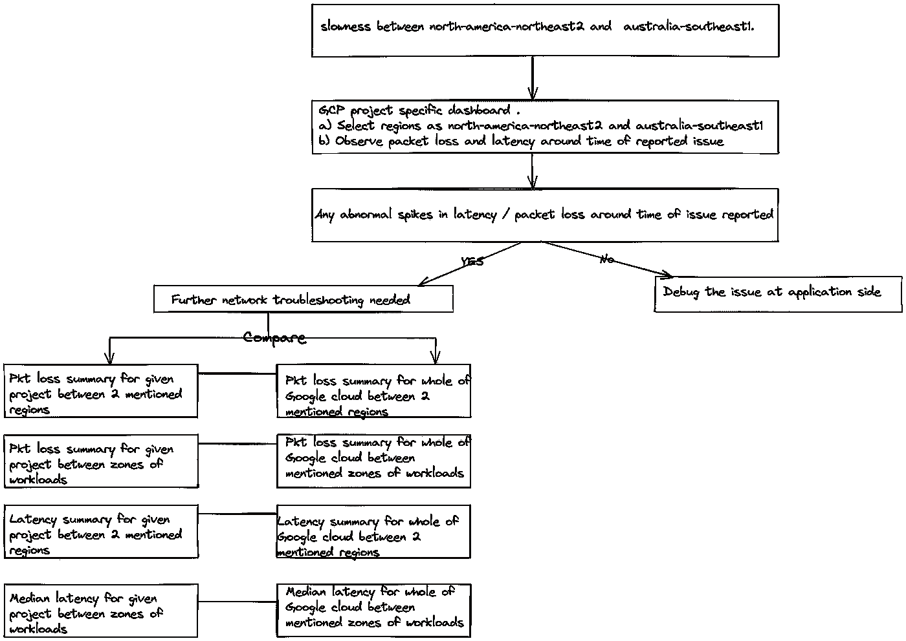

# 使用 GCP“性能仪表板”进行网络性能诊断

> 原文：<https://medium.com/google-cloud/network-performance-diagnostics-with-gcp-performance-dashboard-52d93bc85a02?source=collection_archive---------0----------------------->

网络是公共云中每个部署的主干。因此，毫不奇怪，网络性能对于每个在公共云中运行工作负载的组织来说都至关重要。网络性能管理是重中之重，以确保高质量的最终用户体验，并避免因次优网络性能或停机造成的任何经济损失。由于在确保网络健康方面扮演着如此重要的角色，网络运营商经常在其日常工作流程中利用多种工具来监控网络的运行情况。因此，我们经常看到网络运营商花费大量资金购买网络性能工具&培训员工使用这些工具，这样他们就可以省去罚款。如果我们从不同的角度来看这个问题，性能工具也可以被视为证明网络清白的工具，证明客户的基础架构和应用环境中的每个问题都是无辜的。典型的网络运营商在试图解决与网络性能相关的问题时，发现自己处于以下问题的中间。

图 1:典型的网络性能困境

在我们深入探讨之前，让我们先了解一下网络性能在上下文中的含义。网络性能监控是收集和分析流经您环境的网络流量数据的过程。网络性能监控的主要目的是检索网络级别的遥测数据，以便采取有意义的措施来维护网络健康。云网络性能监控的重要参数是“延迟”和“数据包丢失”,这些将在本博客中讨论。

简单来说；“延迟”关注的是数据包在网络中从一点成功传输到另一点所花费的时间。“数据包丢失”指的是从网络中的一点成功发出，但从未到达目的地的数据包数量。此参数提供了一种确定网络监控性能的方法，因为丢失的数据包表示为已发送数据包总数的百分比

在谷歌云平台(GCP)中，网络情报中心下的模块被称为“性能仪表板”,该模块专门用于处理性能参数的可见性

目前，GCP 的性能仪表板仅涵盖“GCP 内部”的性能参数，这些参数有助于针对 Google Cloud 内部的区域内、区域间和区域间流量做出有关数据包丢失和延迟指标的明智决策

图 2:GCP“网络情报中心”现有的模块

在非常高的水平上；performance dashboard 的用户可以查看以下两大类别中的全部信息

1.  **根据项目仪表板**

Project Dashboard 仅显示您拥有 Project 虚拟机实例的区域的数据包丢失/延迟指标。

2.**全球仪表盘**

Global Dashboard 显示了跨所有 Google 云的分区数据包丢失和延迟指标

图 3:GCP“性能仪表板”下的选项

那么，在您排除网络故障的过程中，每个仪表板能为您提供什么帮助呢？

**项目专用仪表盘**

客户可以选择最多 5 个区域来部署工作负载。选择区域后，每个项目的控制面板允许客户直观了解

1.  数据包丢失摘要[可用的 6 周历史数据]
2.  所选区域的区域对之间的平均数据包丢失[当前统计]
3.  所选区域的区域对之间的平均数据包丢失[当前统计]
4.  延迟摘要[可用的 6 周历史数据]
5.  所选区域的区域对之间的中值延迟[当前统计]
6.  所选区域的区域对之间的中值延迟[当前统计]

**全球仪表盘**

客户可以选择任意数量的 GCP 地区。选择区域后，控制面板允许客户直观了解:

1.  数据包丢失摘要[可用的 6 周历史数据]。该视图能够显示多达 50 个分区对，在所有 Google Cloud 中存在虚拟机到虚拟机的数据包丢失。
2.  区域对之间的平均数据包丢失[当前统计]
3.  延迟摘要[可用的 6 周历史数据]。该视图能够显示多达 50 个分区对，以及所有 Google 云中虚拟机之间的往返时间(RTT)。
4.  区域对之间的中值延迟[当前统计]

现在我们知道了这些仪表板能告诉我们什么，让我们看看在哪里使用这两个视图，以及我们如何使它们在排除 GCP 网络相关问题时有用。

**用例# 1:隔离应用程序问题或网络问题**

假设网络运行中心正在对如下报告的问题进行故障排除

"*从上午 10 点开始，VM1 和 VM2 之间的通信速度变慢。VM1 位于美国中部，VM2 位于亚洲东部。*

让我采取系统的方法来解决这个问题-

图 4:解决报告的速度缓慢问题的方法

在故障排除的这个阶段，我们已经确定需要在应用层或网络层进行故障排除。如果需要在应用层进行故障排除，我们可以在此阶段后节省网络工程师的时间，因为我们已经得出结论，在报告问题时网络是干净的。以下证据可与应用团队分享，以帮助他们理解在网络端完成的故障排除-

图 5:上午 10 点项目中没有报告数据包丢失

图 6:上午 10 点左右没有报告异常的延迟峰值

**用例 2:隔离项目特定的网络问题与 Google cloud 网络问题**

我再举一个例子。假设网络运行中心正在对如下报告的问题进行故障排除

"*从上午 10 点开始，应用程序在 VM1 和 VM2 之间的通信中遇到了意外的数据包丢失。VM1 位于北美-东北 2，VM2 位于澳大利亚-东南 1* 。

处理该问题的工程师遵循了上述程序，并在事件报告期间发现 VM1 和 VM2 区域之间的数据包丢失数量出现异常峰值。对于他来说，这是一个很好的阶段，可以更深入地找出网络中的什么可能导致了这种情况。

随着他继续进行故障排除，他脑海中一个明显的问题是“这只是我的项目吗？或者其他项目报告了类似的峰值？”

我已经记下了一种方法，如果问题是特定于客户项目的，或者多个项目由于 Google cloud network 中的问题而受到影响，则可以采取这种方法进行隔离

图 7:解决特定项目与全球谷歌网络问题的方法

如果比较结果表明，在给定时间点，Google cloud 和特定客户项目的延迟或数据包丢失数量出现异常峰值；我们可以肯定地说，报告的问题不是由于客户项目的网络异常。这种等待时间/分组丢失的异常增加被认为是非常短暂的，并且系统应该自动从中恢复。

图 8:谷歌云的表现:两个选定地区之间的 pkt 损失峰值

图 Google cloud 在选定区域之间的数据包丢失

从上面 Google cloud performance dashboard 的报告中我们可以看到，两个地区之间的通信出现了丢包高峰。由于上述两个区域之间的整个 Google cloud 报告了超过 1%的数据包丢失，因此很明显，为这两个区域中的虚拟机之间的流量提供服务的所有项目都会受到影响。这是进一步停止任何网络故障诊断的正确阶段。因为这是 GCP 网络的一个间歇性问题，很快就自动修复了；所有报告通信中分组丢失的项目也应该已经从分组丢失情况中自动恢复。

提交问题的根本原因分析[RCA]报告时，上述报告图表应该足够好，可以使用

**用例# 3:工作负载放置的第 0 天计划**

客户需要在 GCP 部署一个基于微服务的应用程序，其中微服务 1 应该在 150 毫秒内与微服务 2 对话。他已经决定在亚洲-南方 1 主持微服务 1，并联系网络团队以了解他是否可以在欧洲主持微服务 2？

图 10:GCP 地区之间 6 周的延迟趋势

同样，如上述一些示例中所述，性能控制面板的全局 GCP 视图可以为我们提供长达 6 周的历史趋势，指示 GCP 的选定区域对之间的延迟/数据包丢失。

通过查看过去 6 周的延迟数字，我们可以排除欧洲地区，这些地区与亚洲-南方 1 地区的通信持续超过 150 毫秒，因此不适合我们的应用程序部署。

一旦我们完成了这一步，下一步将是查看区域对以更深入一层，并更准确地总结区域/区域选择

图 11:区域对延迟数字

在区域对和报告的延迟上多花一些时间，我们看到欧洲-西方 1-b 和亚洲-南方 1-a 之间的通信持续少于 150 毫秒。因此，该地区/区域可能适合我们的应用程序部署

图 12:选定区域之间 6 周的延迟趋势

**成交记录**

网络性能监控是任何网络运营团队为了支持业务和履行商定的 SLA 而必须承担的关键职能之一。因此；网络团队需要一种工具，能够在单一控制台中提供网络性能的实时和历史信息。GCP 性能仪表板提供了对整个谷歌云网络性能以及客户项目资源性能的强大可见性，这不仅有助于减少网络问题的 MTTR，还为第 0 天规划和决策(如应用放置位置)提供了巨大帮助。因此，GCP 性能仪表板应该是 GCP 客户和网络运营商管理 GCP 网络环境的“必备”工具集。

**免责声明**:这是为了告知读者，文中表达的观点、想法和意见仅属于作者，不一定属于作者的雇主、组织、委员会或其他团体或个人。