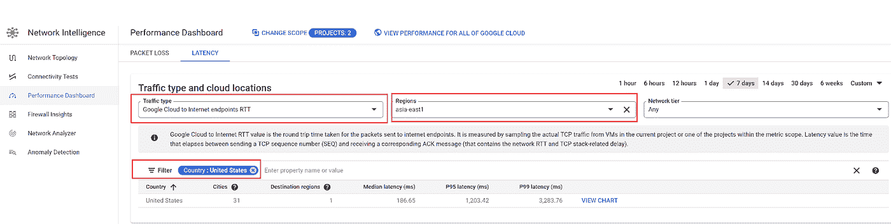
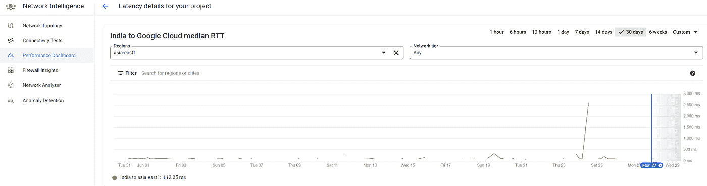

# 网络可见性:了解“GCP 到互联网”的延迟

> 原文：<https://medium.com/google-cloud/network-visibility-understanding-gcp-to-internet-latency-13bd9e60bc61?source=collection_archive---------1----------------------->

在云环境中运行和维护服务的一个最重要的方面是“网络”。尤其是现在，许多公司的收入比以往任何时候都更加依赖可靠的网络，网络延迟已经成为一个常见的话题。简单地说，延迟就是数据从网络上的一点传输到另一点所需的时间。通常，延迟是在用户设备(“客户端”设备)和托管服务器(通常在数据中心/公共云中)之间测量的。这种测量有助于应用程序开发人员了解网页或应用程序为用户加载的速度。从技术上讲，A 点和 B 点之间的延迟是基于光信号在光纤链路上的传播时间，以及可能由通信协议、路由、加密、数据转换等引入的额外延迟。

如果您想知道互联网延迟会如何影响您访问应用程序的用户体验，或者如果您是一名网络运营工程师，正在寻找一种工具/仪表板来报告云世界中的互联网延迟数字，或者如果您是一名应用程序开发人员，不确定在哪里托管应用程序，以便用户获得最佳的互联网体验；那么这篇博客将会是你的一篇好文章

对于像 GCP 这样的公共云，工作负载可以通过使用内部互连的私有网络进行访问，也可以通过互联网进行访问。由于不同地理位置的互联网的性质，通过开放互联网从源位置到工作负载位置的延迟数字总是在讨论中。谷歌云平台最近推出了一种出色的方式来报告在 GCP 托管的工作负载的“谷歌云到互联网端点”往返时间。该功能出现在“网络智能中心”→性能仪表板中，并在本博客中进行了解释。公共文档可以在[这个链接](https://cloud.google.com/network-intelligence-center/docs/performance-dashboard/concepts/overview#traffic_between_and_internet_locations)找到。让我们深入探讨一下这个问题。如果你错过了我上一篇关于“GCP 绩效仪表板”的博客，请随意看看[这个链接](/google-cloud/network-performance-diagnostics-with-gcp-performance-dashboard-52d93bc85a02)。

谷歌云到互联网端点 RTT 仪表板位于“网络智能”→性能仪表板→延迟下。浏览步骤如下所示-

图 1:在 GCP 仪表板上浏览“谷歌云到互联网端点 RTT”

“互联网到谷歌云”的延迟数字有两种变化

1.  特定于客户项目的统计数据
2.  所有谷歌云的统计数据

这两个仪表板[特定项目和所有谷歌云]允许用户选择

*   多达 5 个客户工作负载所在的区域
*   网络层:标准或高级
*   统计持续时间(最多可选择 6 周的历史持续时间)

因此，在项目特定选项下的“区域”下拉菜单中，客户只能看到部署了活动工作负载的区域。示例-

图 2:GCP 地区的客户工作负载

现在，假设我需要查看从美国和印度到我在“Asia-east1”中托管的工作负载的互联网延迟。我应该采取以下措施-

图 3:过滤 GCP 到美国互联网 RTT

图 4:过滤 GCP 到美国互联网 RTT

让我们更深入地了解一下国家=印度的数据

图 5:GCP 到印度互联网 RTT 的详细信息

上述快照反映了以下内容-

1.  在过去 7 天内，asia-east1 中的工作负载已收到来自印度的 TCP 类型的活动用户流量。如果不是这种情况；客户不会看到任何国家=印度的行
2.  从印度的 8 个城市访问工作负载。

让我们看看“查看图表”下显示的详细图表

图 6:GCP-亚洲-东方 1 和印度之间的 RTT 细节

上图显示了过去 30 天的延迟。由此我们可以看出，在一些持续时间内，工作负载没有接收到用户流量(因此没有记录延迟统计)。此外，我们可以看到，如果我们去除异常尖峰，大约延迟约为 100 毫秒。然而，在某一天报告了异常高的往返时间。

作为应用程序所有者，如果我需要了解哪些地理位置在过去几个小时内访问了我的工作负载，以及往返时间大约是多少，我可以快速使用以下仪表板-

图 7:西欧哪些国家访问了应用程序 1

**遵循的方法**

对于想知道 GCP 在报告这些统计数据时所使用的方法的读者；请阅读以下要点以获得您的答案

*   GCP 不会主动探测外部延迟，而是监控真实的客户流量(被动采样)。因此，地球上的点不是固定的，总是依赖于现有的连接。例如，如果有一个应用程序托管在亚洲-南方 2，并从全球 10 个位置访问；统计数据将报告从所有这 10 个位置到 GCP 的东南亚 2 地区的延迟数字
*   由于报告的数字是真实的用户流量，因此所选目的地 GCP 地区的“互联网到 GCP”延迟中的行数将表示访问您的应用程序的来源国家的数量。
*   对于互联网到 GCP 的延迟；GCP 被动地监控 **TCP 流量**。即，它依赖于端点之间 TCP 业务的存在来进行测量。因此，如果一个测试人员向 GCP 的一个网络服务器发送了很多 ping 包；“互联网到 GCP”延迟统计不会报告此类流量。
*   由于 RTT 测量是基于 TCP 流量的，为了报告等待时间，用户必须每分钟发送相当多的 TCP 数据包。发送一个或两个 TCP 包不会填充列表
*   报告的数字是从虚拟机->互联网->虚拟机的 RTT(往返时间)

让我们看看 GCP 性能仪表板报告的互联网延迟统计数据的主要客户使用案例

**用例#1:第 0 天:在标准网络和高级网络之间选择工作负载**

你们大多数人可能都知道，GCP 为其客户提供了在“高级网络”层和“标准网络”层之间进行选择的灵活性。网络服务层允许您优化互联网上的系统和您的 Google Cloud 实例之间的连接。高级层在 Google 的高级主干上提供流量，而标准层使用常规 ISP 网络。

可以在创建新的 GCP 项目时选择网络层，也可以在资源级别应用(如虚拟机、负载平衡器)。为资源指定的网络层始终优先于为项目定义的默认网络层。例如，如果项目的默认网络层是高级层，您仍然可以在标准层中创建实例或负载平衡器。

关于 GCP 网络层的更多细节可以在 https://cloud.google.com/network-tiers/docs/overview[找到](https://cloud.google.com/network-tiers/docs/overview)

图 8: GCP 标准路由路径

图 9: GCP 高级路由路径

有助于做出高级与标准对比决策的一个要点是，如果用户决定通过选择高级层来支付额外费用，响应会好多少(就延迟而言)。让我们看看性能仪表板→互联网到谷歌云延迟数字如何帮助做出这一决定。

我们举个例子。我假设我的客户托管 web 服务的工作负载将在欧洲-西方 2(伦敦)托管。客户试图在成本和性能之间取得平衡，因此在选择高级网络层而不是标准网络层时，他们会考虑延迟数字。展开这个故事；让我们看看“所有谷歌云”的性能数字。执行以下步骤

1.  选择性能仪表板。导航到延迟
2.  将范围更改为“整个谷歌云”
3.  流量类型= "谷歌云到互联网"
4.  Regions = "欧洲-西方 2 "
5.  选择网络层作为“高级”
6.  将源城市筛选为“新德里”(示例)

这反映了在过去 7 天里，从德里到伦敦的高级网络层的延迟数字约为 180 毫秒

图 10 : GCP 高级路由路径统计

现在让我们对标准层做同样的事情。统计数据如下

图 11 : GCP 标准路由路径统计

这反映出在过去的 7 天里，标准网络层上从德里到伦敦的延迟数字约为 200 毫秒以上

同样，客户可以从他们期待主要终端客户的城市看到结果。因此，这些统计数据有助于决定哪一层适合托管 web 服务虚拟机。

**用例 2:第 2 天:监控互联网用户和 GCP 工作负载之间的延迟问题并进行故障排除**

互联网到 GCP 延迟控制面板有两个很好的选择——

1.  用户可以选择你的项目或所有的谷歌云
2.  用户可以回顾历史，并检查这些统计数据在一天中的特定时间是否有明显的偏差

以下示例显示了**整个谷歌云**在过去一个小时内从两个国家到 GCP 美国中部 1 个地区的互联网延迟趋势

图 12:“整个谷歌云”的统计数据

**针对美国的项目特定统计数据**-从相同的 2 个国家访问中心 1 工作负载-

图 13:“项目特定”统计数据

将项目特定数据与所有 Google 数据进行比较，也有助于判断所报告的延迟是仅特定于客户项目，还是整个 Google 云项目都报告了类似的行为。看一下上面显示的美国中部的两个绩效控制面板，反映出全球 GCP 到互联网 RTT 的数字没有任何异常，客户特定项目报告的数字也相同。因此，如果网络管理员或网络运营中心正在解决报告互联网用户高延迟的问题；类似的图表有助于推断在报告的事件时间/日期是否存在明显偏离的情况

**用例 3:快速统计报告访问客户工作负载的地理位置**

正如本博客前面所讨论的；使用 TCP 数据包来测量延迟。对于每个项目的性能仪表板，延迟是基于您的实际流量样本。对于全局性能控制面板，延迟数据代表所有项目的中间值

因此，项目特定的数字也将是访问客户应用程序的地理位置的良好指标。参见下面的例子

图 14:通过互联网访问客户应用程序的所有地区的快照

这表明，在过去的 7 天里，我在“亚洲-东亚 1”的资源正在接收来自所示地理位置/城市的流量。因此，这对于应用程序所有者来说是一个很好的指示，以防他们想要使用其他 GCP 服务(如云装甲)来禁用/限制来自特定地理位置的访问

**结束语:**

从服务器到客户端的互联网往返时间在决定实际终端用户体验方面起着重要作用。并非每个人都在办公室工作，并使用私有/专用连接访问 GCP 工作负载，因此互联网 RTT 是一个关键因素，可帮助组织确定在哪里托管工作负载，以及多少往返时间可被称为“足够好”，以便应用程序提供预期的体验。GCP 网络情报中心的功能“Google Cloud to Internet endpoint RTT”提供了很好的见解，这不仅有助于网络管理员，也有助于开发人员、应用程序开发人员和云架构师。这个看起来简单的仪表板提供了强大的洞察力，在 GCP 旅程的每个阶段都有帮助。

**免责声明**:这是为了告知读者，文中表达的观点、想法、意见仅属于作者，不一定属于作者的雇主、组织、委员会或其他团体或个人。