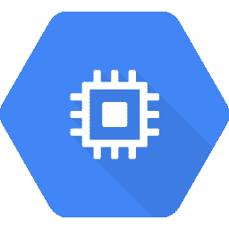
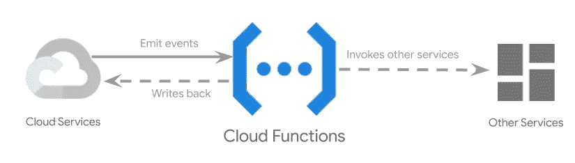
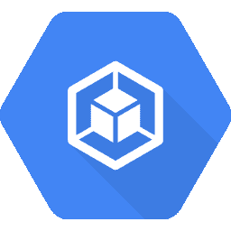

# GCP 要素— GCP 计算平台概述

> 原文：<https://medium.com/google-cloud/new-gcp-essentials-episode-gcp-compute-platform-overview-cc73d583d9d0?source=collection_archive---------0----------------------->

新一集“GCP 要点”现已推出，它简要概述了最常见的 GCP 计算选项:

可以说，云中的“Hello World”就是供应、启动和连接到虚拟机。[**Google Compute Engine**](http://cloud.google.com/compute)通过指定区域、机器类型、操作系统映像和其他可选参数，您可以从头开始创建单个虚拟机实例。

我真正想指出的几个选项是向实例添加 GPU 或 TPU 的能力；并且支持过多的操作系统映像(包括许多 linux 发行版和 MS Windows)。另外，支持使用自定义图像。

一旦您的实例启动，您就可以直接从浏览器 SSH 到它！

这些虚拟机位于谷歌网络上，这意味着它们将拥有最小的延迟和巨大的吞吐量，可以处理任何需要访问远程服务的事情。

“Hello World”的无服务器风格必须建立在 [**谷歌云功能**](http://cloud.google.com/functions) 之上。

例如，您可以提供一个简单的代码片段来监听上传到存储桶中的图像文件，以便动态地为每个图像文件创建缩略图；要触发此代码运行，只需将一个图像上传到您的 bucket，该函数将完成剩下的工作！

云函数支持许多触发器，例如数据库中的变化、来自发布/订阅的消息，甚至计算引擎实例改变状态。云函数也可以使用标准的 HTTP 请求来调用。

这些功能可以从单个项目部署到 GCP 的任何地区，并且它们通过了 GCP 的其他服务的认证，使得与来自该平台的其他产品和 API 的集成变得非常自然和容易。

当然，您不必配置集群或处理服务器配置，您只需为正在运行的代码付费。没有流量，没有成本！

容器世界中的 Hello World 是将 Docker 映像部署到 orchestrator！

自从 Google 开源 Kubernetes 以来，我们收到了很多关于部署容器的工作方式和挑战的反馈，这导致了“[**Google Kubernetes Engine**](http://cloud.google.com/kubernetes-engine/)”(或 GKE)的开发，这是 Kubernetes 的一个完全托管版本。

您可以将您的容器化应用程序部署到 GKE，它提供了一个生产基础架构来保证正常运行时间，同时提供丰富的仪表板指标和自动化操作—从自动扩展到节点修复，再到 Kubernetes 版本升级。

借助 GKE，您还可以连接持久存储，甚至运行数据库等有状态工作负载。还可以利用 GPU 和 TPU！

但最重要的是，您的 Kubernetes 工作负载可在所有 Kubernetes 实施中移植——从您的开发环境到 GKE，再到其他云或内部安装！

总之，GCP 支持所有类型的计算工作负载，它将在计算引擎上运行现有的 Linux 和 Windows 应用程序，在 Kubernetes 引擎上运行容器化的工作负载，在云功能和应用程序引擎上运行功能或应用程序。给我们您选择的工件，我们将提供一个快速可靠的底层基础设施！

考虑使用免费的 codelabs 来探索这些产品:[g.co/codelabs/cloud](http://g.co/codelabs/cloud)

请继续关注即将播出的剧集，包括一个关于无服务器计算选项的剧集，包括精彩的新[云运行](https://cloud.run)产品。