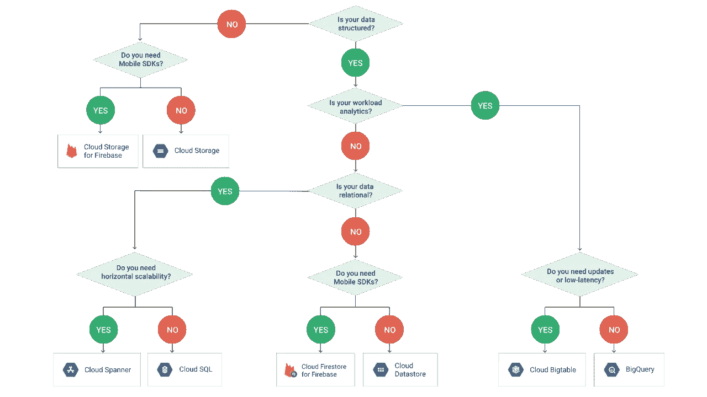

# 新 GCP 基础视频—数据和存储

> 原文：<https://medium.com/google-cloud/new-gcp-essentials-video-data-storage-656a9a480317?source=collection_archive---------2----------------------->

鉴于 GCP 提供的解决方案，这可能是我整理的最具挑战性的视频之一。嘿，我甚至不喜欢这个标题，因为它没有涵盖视频中的所有内容，但希望这可以让你知道在存储和处理数据时，你可以用 GCP 做什么。

[云存储](https://cloud.google.com/storage/)实际上是一个非常好的基本但可靠且灵活的服务，从 Coldline 到多区域的多个存储类别都有一个 API。

[谈到即时满足，BigQuery](https://cloud.google.com/bigquery/) 仍然是每个人的最爱。“数据+ SQL =洞察”是成功的一大秘诀，最近的 [BQML](https://cloud.google.com/bigquery-ml/docs/bigqueryml-intro/) 和 [GIS](https://cloud.google.com/bigquery/docs/gis-intro) 功能只是让它更棒。

SQL 即将迎来 50 岁生日，并且仍然保持强劲势头，而 [Cloud SQL](https://cloud.google.com/sql/) 是 MySQL 和 PostgreSQL 的完全托管关系数据库服务。可靠性、安全性、备份和扩展可以交给谷歌，让你专注于数据和使用它的应用程序。

谷歌还提供了云扳手(Cloud Spanner)服务，这是一种水平可伸缩的、高度一致的关系数据库服务。一定要看看这项真正创新的技术，它挑战了上限定理，许多 Google 服务都运行在这项技术上！

在 NoSQL 部门， [Cloud Firestore](https://cloud.google.com/firestore/) 是一个高可扩展性和强一致性的无模式数据库，为移动开发者提供实时更新和离线支持。

[云 Bigtable](https://cloud.google.com/bigtable/) 将为您的存储选项补充一个 Pb 级、完全托管的 NoSQL 数据库服务，适合高吞吐量工作负载，提供一致的低于 10ms 的延迟！

查看此[决策树](https://grumpygrace.dev/posts/gcp-flowcharts/#what-storage-type)以了解哪个数据库最适合您！

GCP 还有许多其他与数据相关的产品，有些特别有创意，所以一定要考虑:

*   [Pub/Sub](https://cloud.google.com/pubsub/) 用于在全球范围内，跨所有 GCP 地区和区域制作和消费消息。
*   [FileStore](https://cloud.google.com/filestore) 用于需要文件系统接口的应用程序。
*   “[用于 Redis 的 Cloud Memorystore】”提供完全托管的内存数据存储服务，非常适合构建具有亚毫秒级数据访问的应用程序缓存。](https://cloud.google.com/memorystore/)
*   [云数据流](https://cloud.google.com/dataflow/)使用 Apache Beam 编程模型构建和执行统一的批处理和流管道。
*   [Dataprep](https://cloud.google.com/dataprep/) 确保您的数据科学家不会花 90%的时间清理数据，而不是处理数据。
*   …以及用于交互式仪表盘和引人入胜的报告的 [DataStudio](https://datastudio.google.com/navigation/reporting) 。

点击查看完整的 [GCP 精华播放列表。](http://goo.gle/2w9xfHR)