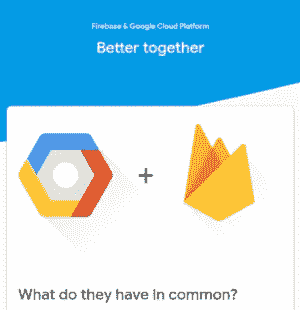
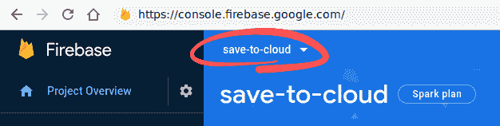
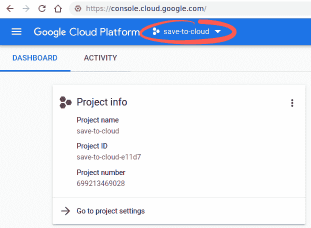
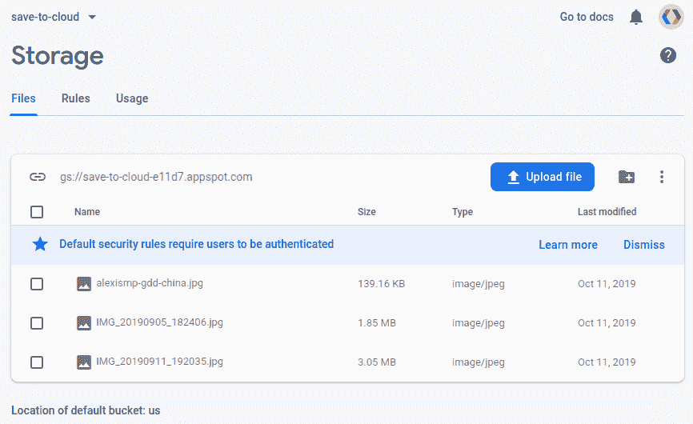
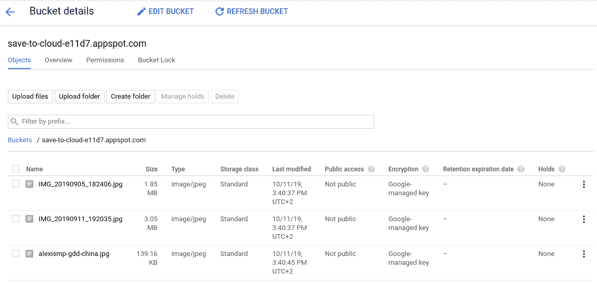

# 新 GCP 精华视频“GCP vs. Firebase —第 1 部分”

> 原文：<https://medium.com/google-cloud/new-gcp-essentials-video-gcp-vs-firebase-part-1-f6a0c73f680a?source=collection_archive---------1----------------------->

我经常推荐 [Firebase](http://firebase.google.com) 作为使用谷歌云的第一步，特别是对于那些不太想成为后端或云专家的移动和前端开发人员。

Firebase 的后端功能，如 Firestore、无服务器功能、云存储和 ML Kit，实际上是基于幕后的 Google Cloud 实现，该视频解释了如何利用这一点从小处着手，并根据需要扩展您的开发:

对于任何已经在使用 Firebase 的人来说，好消息是你实际上已经在使用 Google Cloud 了，一系列的附加功能离你只有一步之遥。对于任何谷歌云用户来说，好消息是 Firebase 提供了一个自然的工具集来构建现有服务的移动和 webapp 前端。

**普通项目定义**

事实上，当你创建一个 Firebase 项目时，它在每个方面都是一个 Google Cloud 项目:资源分组、身份管理和计费。虽然 Firebase 控制台和 Google Cloud 控制台的外观和感觉明显不同，但您可以用其中任何一个打开同一个项目。

上面的视频和即将发布的视频专注于 Firebase 和 Google Cloud 共有的三个主要产品:云存储、云功能和云 Firestore。

**云存储**

云控制台展示了云存储的全部功能，而 Firebase 控制台展示了那些更可能与 Firebase 开发人员相关的功能。

Firebase 开发人员使用云存储的典型用例是管理用户生成的内容。这就是 Firebase Android、iOS、web、Unity 和 c++ SDK 使直接从应用程序上传和下载图像等对象变得简单而安全的地方。

与使用 App Engine 的 Google 云项目类似，任何新的 Firebase 项目都带有默认的云存储桶。在大多数情况下，Firebase 开发人员也使用这个默认的存储位置，因此不需要通过名称来引用它。

由于到目前为止讨论的所有 Google 云和 Firebase 的共性，任何使用 Firebase 存储在云存储中的数据都可以在 Google Cloud 中进一步访问和处理，反之亦然！

最后，您需要注意的一点是云存储桶访问控制有何不同:

*   Cloud IAM 用于控制对来自其他 Google 云服务的桶和对象的访问
*   另一方面，Firebase 安全规则只控制来自使用 Firebase SDKs 的移动应用程序的访问

在接下来的视频中，我们将介绍云功能和云 Firestore。