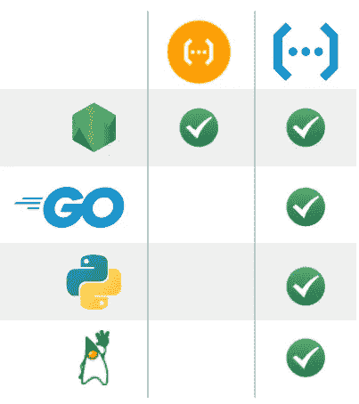
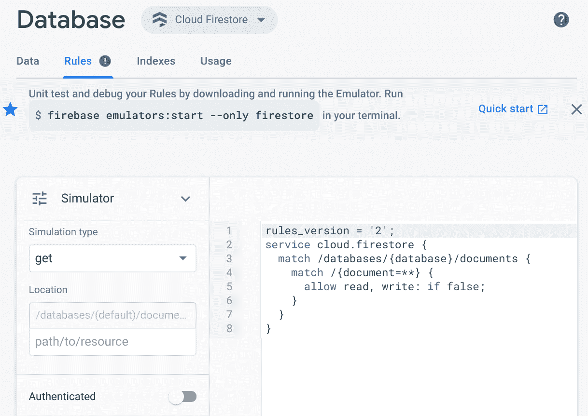
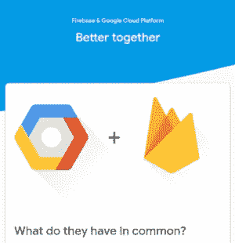

# 新 GCP 精华视频“GCP vs. Firebase —第 2 部分”

> 原文：<https://medium.com/google-cloud/new-gcp-essentials-video-gcp-vs-firebase-part-2-44bb09a20ff3?source=collection_archive---------2----------------------->

在[之前的帖子](/google-cloud/new-gcp-essentials-video-gcp-vs-firebase-part-1-f6a0c73f680a)中，我们讨论了 Firebase 项目实际上是一个 GCP 项目，存储在云存储中的数据可以通过 Firebase 支持的移动和网络客户端以及 GCP 托管的应用程序进行访问。

在本帖中，我们将探索另外两个产品:云功能和云 Firestore:

**云功能**

[云功能](http://cloud.google.com/functions)实际上是谷歌云产品，这也恰好可以从 Firebase 上看到。

云功能是功能即服务范式的一种流行实现，其中系统中的一个事件(比如一个 HTTP 调用或一个上传到 bucket 的文件)触发一小部分代码(一个功能)的执行。查看“[无服务器概述](/google-cloud/gcp-essentials-serverless-overview-4b5c14ec49c1)”一节，了解更多关于云功能的详细信息。

Firebase 和 GCP 云函数方法之间的一个重要架构差异是，Firebase 将把您的函数包装成可调用的函数。可以通过 Firebase SDK 调用这些函数，并将用户令牌和设备实例 id 直接传播给该函数。

另一个重要区别是支持的语言:

使用 Firestore 时，节点。当直接使用 GCP 时，支持 JS 和 TypeScript，而 Go、Python 和 Java 也是可用的。

在我们比较 web 控制台之前，您还可以使用命令行界面: **gcloud** 或**Firebase CLI**。两者都有自己的一套功能，我们建议你决定哪一个最适合你，并坚持下去。

要使用 Firebase 部署功能，您需要使用 npm 安装 Firebase 命令行工具，因为从 Firebase 控制台部署是不可能的。但是，您可以使用 API 进行事件的强类型处理，并且能够一次部署多个功能。

在 GCP，您可以直接从控制台部署功能，与源代码库集成，甚至可以内联输入功能源代码。

在 Firebase 项目中创建的功能也可以使用云控制台进行管理。Firebase 中的“详细使用统计”将带您到相同的功能，只是在云控制台中，您将获得额外的功能，如监控图形、测试功能的选项卡，以及设置功能的能力，如失败时重试、内存分配或超时。

**云火店**

Cloud Firestore 是谷歌最先进的 NoSQL 文档数据库。它是无模式的，可以在集合的层次结构中存储包含属性的文档。它速度快、支持事务、高度可用、高度一致，并且不需要管理任何类型的基础架构。

云 Firestore 的原生模式可以自动扩展到数百万个并发客户端，但更特别的是，它提供了近实时通知*。这就是支持跨设备同步数据的原因。借助内置的 ***离线支持*** ，您可以访问并更改您的数据，当客户端恢复在线时，这些更改将被同步到云端。*

*存储在云 Firestore 中的数据可以使用 Firebase SDKs 来访问，当然，您可以使用任何一个控制台来查看和编辑数据和索引，并监控数据库访问使用情况。*

****

*有了 Cloud Firestore，您可以直接从移动或 web 客户端查询数据库，而无需设置中间服务器来管理对数据的访问。这就是 Firebase 控制台有一个额外的安全访问规则选项卡的原因。*

**

*这些规则从非常简单到非常复杂，通常结合使用用户身份、新文档内容(发送的数据)和 Firestore 中存储的现有数据。如果你是一个 Firebase 用户，发布了一个访问 Firestore 的应用程序，那么你真的应该使用 Firebase 身份验证，并仔细考虑你的安全访问规则。*

*在 GCP 方面，没有等效的安全规则，因为您通常使用服务帐户访问 Firestore。一般来说，服务器端代码被认为是可信的，而不是来自移动应用程序的客户端代码。*

*最后，支持的 Firestore SDK 语言包括 Python、Node.js、Java、C#(。NET)、Go、PHP 和 Ruby，并添加了对 Web、Android 和 iOS 的支持。这些 mobile Firebase SDKs 包括本地缓存，这是一个独特的特性，有助于实现前面提到的离线功能。*

*所以，无论你是一个对用 Firebase 开发移动和网络应用感兴趣的 GCP 开发者，还是一个试图增加你对 GCP 服务使用的 Firebase 用户，你现在应该对什么是可能的有一个很好的感觉。*

**

*也可以看看 Doug 关于这些主题的帖子:*

*   *[Firebase 和 Google Cloud 是什么关系？](/google-developers/whats-the-relationship-between-firebase-and-google-cloud-57e268a7ff6f)*
*   *[Firebase &谷歌云:云功能有什么不同？](/google-developers/firebase-google-cloud-whats-different-with-cloud-functions-612d9e1e89cb)*
*   *[Firebase &谷歌云:云 Firestore 有什么不同？](/google-developers/firebase-google-cloud-whats-different-with-cloud-firestore-40f1fc3e6d1e)*