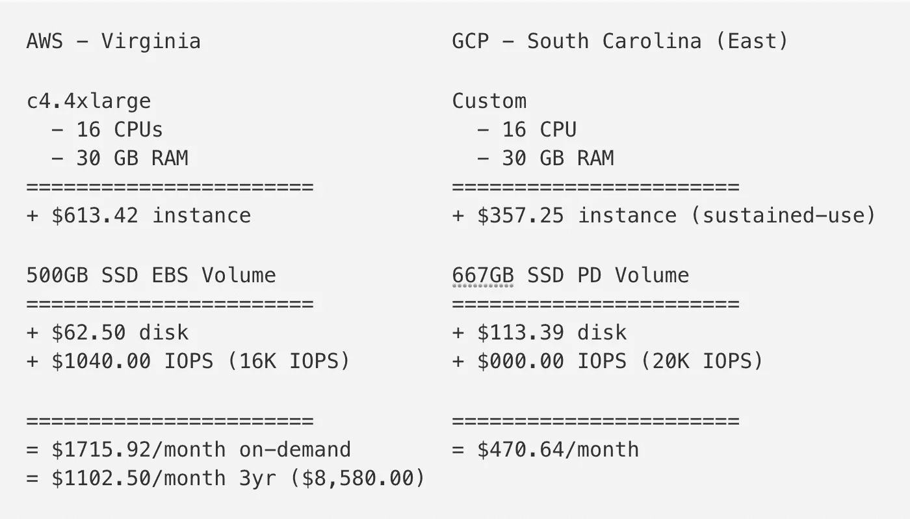
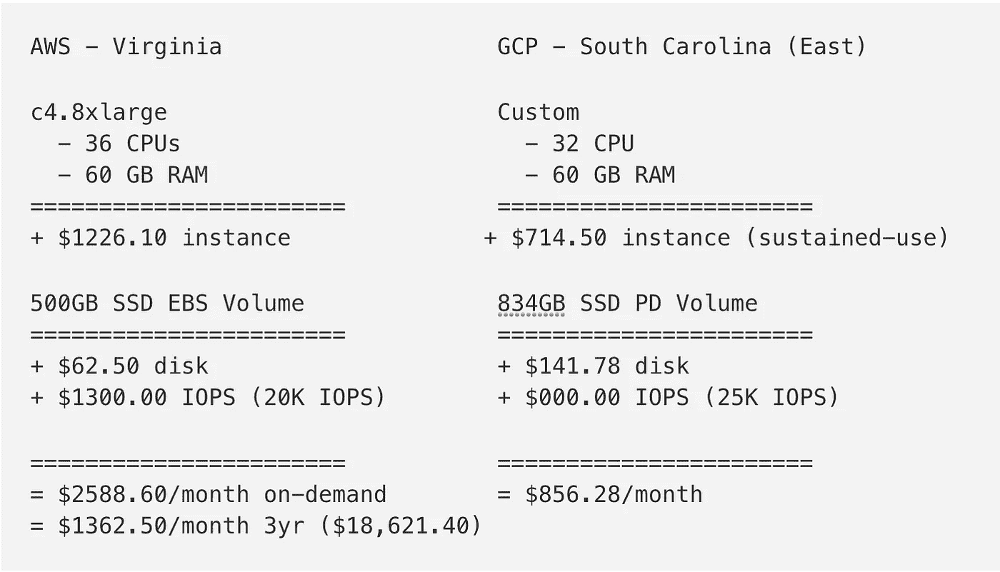
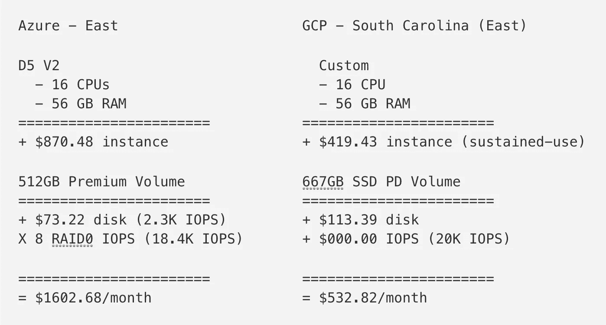

# 新的谷歌云固态硬盘具有惊人的性价比！

> 原文：<https://medium.com/google-cloud/new-google-cloud-ssds-have-amazing-price-to-performance-2a58e7d9b433?source=collection_archive---------0----------------------->

谷歌云刚刚宣布了大量新的数据库相关功能。 [Datastore](https://cloud.google.com/datastore/) 、 [BigTable](https://cloud.google.com/bigtable/) 、 [Cloud SQL](https://cloud.google.com/sql/) Gen 2 都出测试版了！

真正吸引我眼球的是，固态硬盘刚刚获得了巨大的*IOPS 提升，而没有额外的成本！在 25，000 IOPS 时，你基本上开始忘记这是一个具有内置冗余和超快速备份的网络连接磁盘。*

于是我开始思考:谷歌云 IOPS 与其他云，即 AWS 和 Azure 相比如何？

**剧透:谷歌云把他们打得落花流水！**

**披露:** *我超级有偏见，因为我在谷歌工作，但我尽量做到不偏不倚。此外，我使用的是网站上公布的数字。我自己没有做过任何基准测试。如果你能做出更好的 AWS 或 Azure 配置或者我做错了什么，请告诉我！*

# AWS vs GCP

亚马逊的 EBS 卷有多种口味。[配置的 IOPS 固态硬盘](https://aws.amazon.com/about-aws/whats-new/2012/07/31/announcing-provisioned-iops-for-amazon-ebs/)是我将要关注的内容。您可以调配的最大 IOPS 是每卷 20，000 个。

有了谷歌云持久盘，每卷可以获得 25000 IOPS。只要确保你有足够的 CPU 和磁盘空间来驱动 IOPS，你就可以开始了。

所以我们来看一些对比。我想要一个有 500GB 磁盘空间的强大的数据库服务器:

**哇。只是哇。**

***你用不到 1/3 的成本得到更多的 IOPS***！

你可以用 AWS 上一个实例的价格在 Google Cloud 上运行三个实例。

现在让我们突破限制，从每个提供商处获得最大 IOPS:

**再次！**

***你用不到 1/3 的成本得到更多的 IOPS***！

有了 AWS，实例确实多了 4 个 CPU 核心，但是同样的价格，你可以在 Google Cloud 上运行三个 32 核心的机器！

即使你预先支付了 18，000 美元(！！)，AWS 还是贵一点！太疯狂了！

## 谷歌云为什么便宜这么多？

两个原因:

1.  GCP 的实例成本更低。即使没有自动持续使用折扣，计算引擎也比 EC2 便宜
2.  AWS 上调配的 IOPS 非常昂贵。使用 Google Cloud，您的磁盘会根据磁盘大小自动获得 IOPS 配置。这就是我们不得不过度调配磁盘以获得目标 IOPS 的原因。然而，AWS 让你为 IOPS 支付额外的费用，这是显而易见的！

***编辑:*** 有人告诉我，与在 GCP 上相比，您可以将调配的 IOPS EBS 卷附加到较小的实例上。 [@fittedcloud](https://twitter.com/fittedcloud) 在一个 t2.small 实例上附加了一个 [20K 的 IOPS 磁盘，得到了全磁盘性能。这将花费每月 1，381.54 美元，而您的实例只能获得 1 个 CPU 和 2 GB RAM。同样，这是因为调配的 IOPS 非常昂贵！](https://twitter.com/fittedcloud/status/768205575020740608)

# 蓝色 vs GCP

每个 Azure 实例都有一个磁盘，但它是一个临时磁盘，如果实例被删除或移动，它将被擦除。相反，如果你想要 AWS 和 GCP 给你的相同类型的持久网络连接存储，你需要使用[高级 SSD 存储](https://azure.microsoft.com/en-us/documentation/articles/storage-premium-storage/)。

关于高级 SSD 存储的有趣之处在于，它是以预设的块来提供的。与 AWS 或 GCP 不同，你不能精确地指定你想要多少 IOPS 或磁盘空间。这也意味着你必须在 RAID 中对磁盘进行分条，以获得与 GCP 和 AWS 相同的 IOPS，这非常烦人。这也混淆了[哪个实例可以做什么](https://azure.microsoft.com/en-us/documentation/articles/storage-premium-storage/#using-linux-vms-with-premium-storage)以及如何设置它。

话虽如此，让我们来看看定价:

***更新:*** *Azure 定价有点离谱，总数应该是 1456.24 美元/月因为我们在 RAID 中使用的是 8 个磁盘，而不是 10 个。*

**又来了！**

***你为大约 1/3 的成本*** 得到更多的 IOPS！

我认为我们看到了一种趋势。

值得 Azure 称赞的是，它比我们在第一部分配置的 AWS 实例更便宜、更快。然而，谷歌云的价格低得太离谱了！

## 谷歌云为什么便宜这么多？

两个原因:

1.  GCP 的实例成本更低。即使没有自动持续使用折扣，计算引擎也比 Azure 虚拟机便宜
2.  让 IOPS 上 Azure 是笨拙的。Azure 让您将多个磁盘条带化在一起，以获得您需要的 IOPS 性能。这意味着您必须将 8 个卷一起条带化才能获得类似的性能。有了谷歌云，你可以自动获得大量 IOPS。无需对卷进行条带化(仅供参考，这对 GCP 没有任何帮助)。

# 结论

我觉得我在吃疯狂的药丸。谷歌云的价格始终是 AWS 和 Azure 的 1/3，同时提供相同或更好的 IOPS 性能！

我不是 AWS 或 Azure 方面的专家。如果你能在这些平台上配置更好的机器，请在评论中告诉我！

此外，GCP 并不完美。每个实例的最大持久磁盘 IOPS 是 25k。AWS 和 Azure 上有某些(非常昂贵的)实例可以更高。