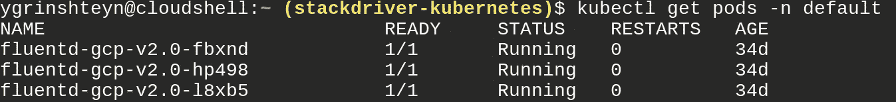
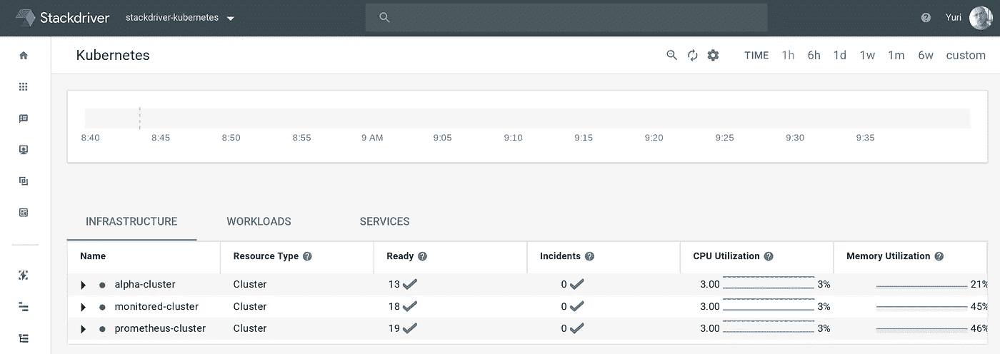
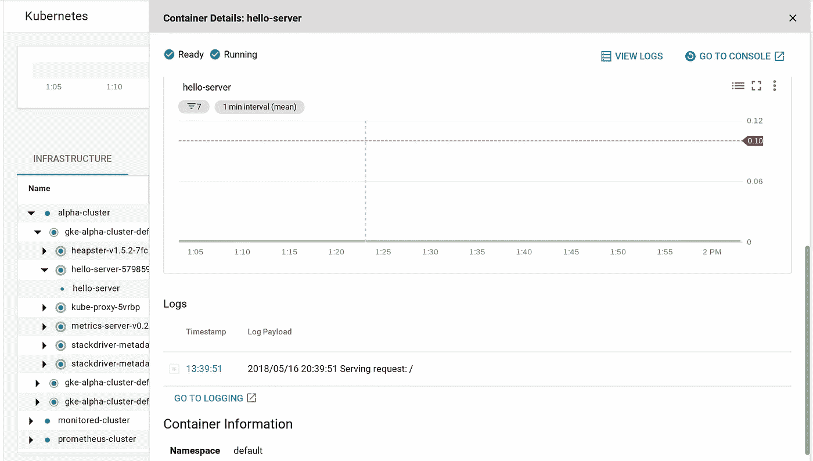

# Kubernetes 的新堆栈驱动程序监控(第 1 部分)

> 原文：<https://medium.com/google-cloud/new-stackdriver-monitoring-for-kubernetes-part-1-a296fa164694?source=collection_archive---------0----------------------->

**更新(2018 年 3 月 1 日)——你现在可以在这里看我走过这段:**

**更新(2018 年 10 月 16 日)——**创建具有新监控功能的集群和更新现有集群的说明已经发布，因为该工具目前处于测试阶段。你可以在这里找到安装说明。


崭新闪亮！

正如你可能已经看到的，Stackdriver 团队[几周前在 Kubecon 宣布了对 Kubernetes 监控的全新支持。显然，我不能不尽我最大的努力去探索它就让它过去。我希望在工作中看到三件主要事情——监控 GKE 集群上的工作负载、监控非 GKE 集群以及新的 Prometheus 集成。让我们进入第一部分——监视 GKE 集群！](https://cloudplatform.googleblog.com/2018/05/Announcing-Stackdriver-Kubernetes-Monitoring-Comprehensive-Kubernetes-observability-from-the-start.html)

谢天谢地，文档[中的说明](https://cloud.google.com/monitoring/kubernetes-engine/)非常清楚。

**监控 GKE(阿尔法)星团**


那看起来不一样！

在撰写本文时，这种支持仅适用于“alpha”集群，因为该集群需要安装在 Kubernetes 1.10 上。所以，让我们先创建我们的阿尔法集群。这是来自文档的 gcloud 命令——我使用的值在`#`之后。

```
CLOUDSDK_CONTAINER_USE_V1_API=false \
CLOUDSDK_API_CLIENT_OVERRIDES_CONTAINER=v1beta1 \
gcloud alpha container clusters create [CLUSTER_NAME] \ #(alpha-cluster)
  --zone=[ZONE_WITH_1.10.2-gke.0] \ #us-west1-a
  --project=[PROJECT_ID] \ #stackdriver-kubernetes
  --cluster-version=1.10.2-gke.0 \
  --enable-stackdriver-kubernetes \
  --enable-kubernetes-alpha
```

瞧啊。


我们有一个阿尔法星团！

其实就这么多了！让我们首先验证集群本身的安装。


它还活着！

我们让监控和日志代理、元数据代理和 heapster 都运行在`stackdriver-agents`名称空间中。让我们对比一下我运行的“旧”集群，


那里根本没有`stackdriver-agents`名称空间，



fluentd 运行在`default`名称空间中。所以，监控基础设施是不同的，这没什么。但是我们从中得到了什么呢？让我们进入 Stackdriver 并找出答案。


第一件显而易见的事情是，我们现在有了额外的资源，称为“Kubernetes 引擎 V2 测试版”。我想我可能在这里触发了一个 bug，因为它应该只出现一次——但是这两个都把我带到了同一个屏幕。



如您所见，我的“日志集群”使用的是“原始的”Kubernetes 监控，并没有出现在这个列表中。然而，我的阿尔法星团在这里。我们去看看吧！


从基础架构视图向下钻取

从“Infrastructure”选项卡开始，我们可以沿着“cluster -> node -> pod -> container”路线前进。



容器视图

我们可以选择一个容器来获取关于它的更多信息，比如 CPU 和内存利用率，甚至可以调出日志。


工作负载视图

如果愿意，我们可以选择工作负载路径，这将让我们进入集群->名称空间->工作负载-> pod ->容器。

最后，我们可以采用服务路径来执行集群->名称空间->服务-> pod ->容器。


这一切都很酷——而且它的工作不需要任何手动操作！回来阅读第 2 部分和第 3 部分，我将尝试在计算引擎上实现这一点，并查看 Prometheus 集成！