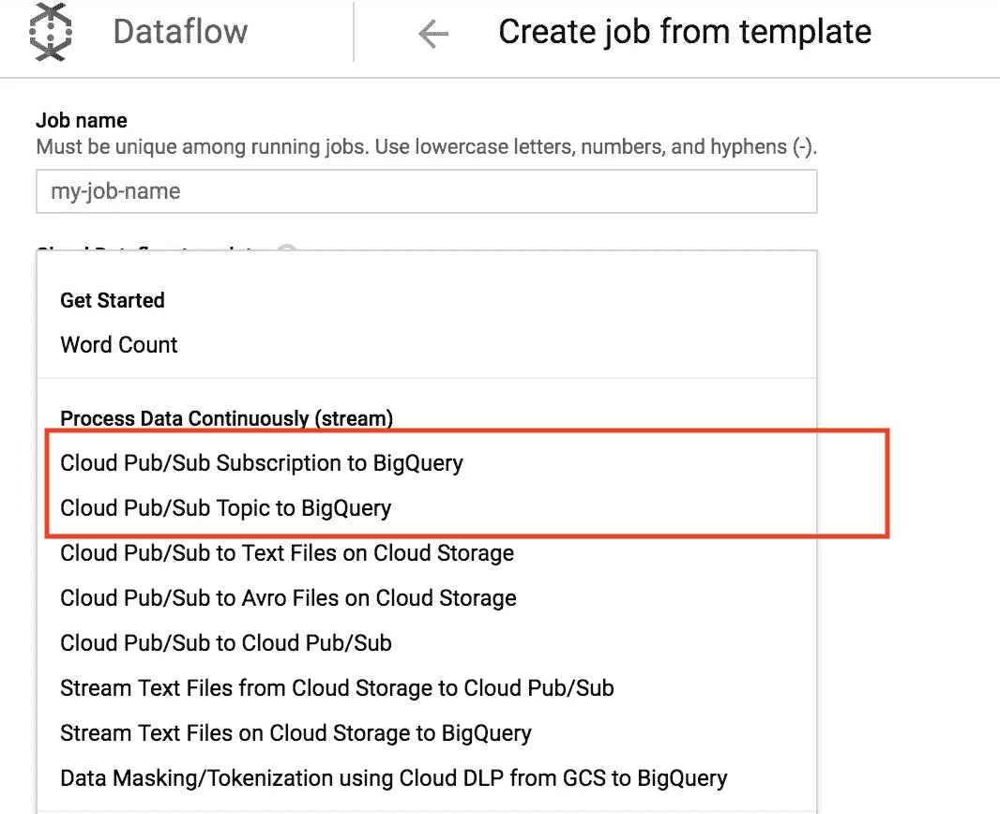
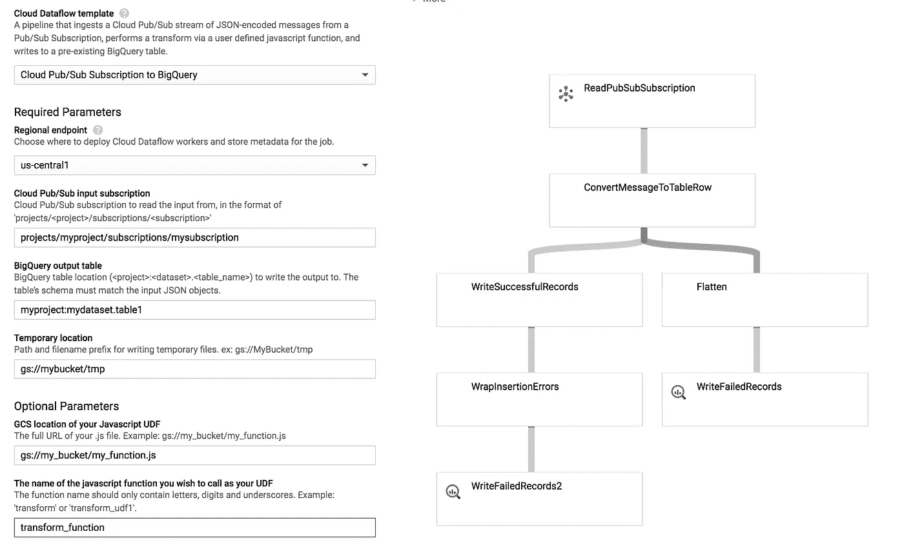

# 来自 GCP 的 BigQuery 数据流模板的发布/订阅的新更新

> 原文：<https://medium.com/google-cloud/new-updates-to-pub-sub-to-bigquery-templates-7844444e6068?source=collection_archive---------1----------------------->

**作者:**

我们很高兴地宣布 Cloud Pub/Sub to BigQuery 模板的几个新特性，包括对订阅(！idspnonenote)的支持。！！)以及一些错误处理方面的改进。我们将在下面详细介绍这些更新。

# 各位订阅！

过去，Pub/Sub to BigQuery 数据流模板只支持使用参数`inputTopic`从 Pub/Sub 主题中读取消息。我们已经创建了第二个数据流模板，它使用参数`inputSubscription`从发布/订阅订阅中读取消息。我们在数据流控制台的`CREATE JOB FROM TEMPLATE`按钮下将这两个模板描述为“BigQuery 的云发布/订阅”和“BigQuery 的云发布/订阅主题”。生成这两个模板的代码也可以在 [Github](https://github.com/GoogleCloudPlatform/DataflowTemplates/blob/master/src/main/java/com/google/cloud/teleport/templates/PubSubToBigQuery.java) 上找到。请注意，在主题上使用订阅的注意事项是，订阅只能读取一次，而主题可以读取多次。因此，订阅模板不能支持读取同一订阅的多个并发管道。

大查询模板的发布/订阅现在在订阅和主题之间进行了描述

从订阅或主题中读取消息后，其余的细节基本保持不变。

1.  用户为输入消息指定一个现有的 BigQuery 表。这是使用`outputTableSpec`参数指定的。与所有管道一样，用户需要指定一个 GCS 桶位置来写入/暂存临时文件。
2.  (可选)如果用户希望在插入 BigQuery 之前对他或她的消息做进一步的修改，他或她可以在 Google 云存储中包含一个 javascript 转换文件。这可以使用参数- `javascriptTextTransformGCSPath`来指定。然后使用属性- `javascriptTextTransformFunctionName`指定 JavaScript 文件中的实际函数名。
3.  死信 BigQuery 表是自动创建的，用于捕获由于各种原因失败的消息，这些原因包括:消息模式与 BigQuery 表模式不匹配、格式错误的 JSON 以及在通过 JavaScript 函数转换时抛出错误的消息。在我们最新的更新中，我们更有力地捕捉到了这样的错误——在过去，许多这样的错误会无休止地重试。用户也可以使用参数`outputDeadletterTable`指定他们自己的死信表(死信模式见 [Github](https://github.com/GoogleCloudPlatform/DataflowTemplates/blob/master/src/main/resources/schema/pubsubmessage_deadletter_table_schema.json) )。

BigQuery 数据流管道的 PubSub 订阅的示例模板设置，带有用于修改 pub sub 消息的可选 javascript 函数

# 未来数据流管道+功能

我们的数据流模板可以在数据流用户界面上的`CREATE JOB FROM TEMPLATE`按钮下访问，或者可以在 [Github](https://github.com/GoogleCloudPlatform/DataflowTemplates/tree/master/src/main/java/com/google/cloud/teleport/templates) 上找到开源的模板，以便根据用户的需要进行进一步定制(参见此[链接](https://github.com/GoogleCloudPlatform/DataflowTemplates/blob/master/src/main/java/com/google/cloud/teleport/templates/PubSubToBigQuery.java)获取 BigQuery 代码的云发布订阅)。请关注 GCP 团队在数据流模板方面的进一步努力。