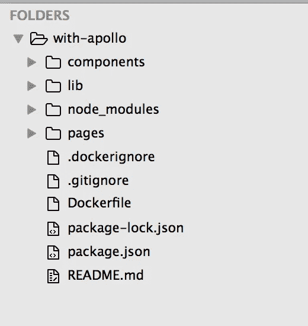
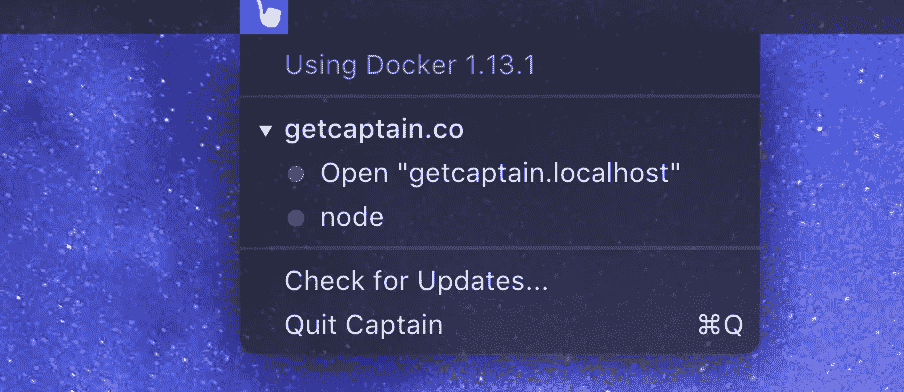

# Next.js 教程—部署到 Google 云容器引擎上的 Docker

> 原文：<https://medium.com/google-cloud/next-js-tutorial-deploy-to-docker-on-google-cloud-container-engine-6b0c19dd8ecb?source=collection_archive---------0----------------------->

这是一个关于如何将一个用 [Next.js](https://github.com/zeit/next.js) 构建的 app 从 [▲ **ZEIT**](https://zeit.co) 部署到运行在谷歌云平台容器[引擎](https://cloud.google.com/container-engine/)上的 Docker 的简要演练。我使用终端在 Macbook 上执行这些步骤。

> 注意—这只是针对开发而言的，对于生产而言，有更多的最佳实践，这些说明会略有不同。

关于将 node.js 应用程序部署到 GCP CE 的更多信息，一个很好的起点是这个[教程](https://cloud.google.com/container-engine/docs/tutorials/hello-node)。

1.  在 GCP 上创建一个帐户并启用计费。然后在您的笔记本电脑上安装 cli 工具。[此处说明](https://cloud.google.com/container-engine/docs/tutorials/hello-node#option_b_install_tools_on_your_workstation)。您将需要 gcloud cli 和 kubectl 包。你还需要安装[对接器](https://docs.docker.com/engine/installation/)。
2.  验证您的 gcloud cli，用您自己的 ID 替换 PROJECT_ID。

```
gcloud auth logingcloud config set project PROJECT_ID
gcloud config set compute/zone us-central1-b
```

3.从 next.js/examples,挑选一个例子[回购](https://github.com/zeit/next.js/tree/v3-beta/examples/)我在这里用 [**搭配——阿波罗**](https://github.com/zeit/next.js/tree/v3-beta/examples/with-apollo) 。运行下面的命令，然后打开浏览器到 http://localhost:3000 以确保一切正常。

```
curl https://codeload.github.com/zeit/next.js/tar.gz/master | tar -xz --strip=2 next.js-master/examples/with-apollocd with-apollonpm installnpm run dev
```

4.在根项目目录中创建 3 个新文件

```
.gitignore 
.dockerignore 
Dockerfile
```



在项目根目录下创建 3 个文件

**。gitignore** 内容—

```
node_modules
.next
.DS_Store
```

**。目录——**

```
node_modules
npm-debug.log
.next
```

**Dockerfile** 目录—

```
FROM node:alpine# Create app directory
RUN mkdir -p /usr/src/app
WORKDIR /usr/src/app# Install app dependencies
COPY package.json /usr/src/app/
RUN npm install# Bundle app source
COPY . /usr/src/appRUN npm run build
EXPOSE 3000CMD [ "npm", "start" ]
```

5.为了确保应用程序正常工作，您可以在笔记本电脑上本地构建并运行 docker 容器。我们将这个 docker 应用称为 **nextapollo** 。下面命令中的:v1 是您设置版本的方式，当您对应用程序进行更改时，它会递增。

```
docker build -t gcr.io/${PROJECT_ID}/nextapollo:v1 .
```

6.构建好 app 后，使用 docker 在本地启动，然后在你的浏览器中访问 [http://localhost:3000](http://localhost:3000) 进行测试。

```
docker run --rm -p 3000:3000 gcr.io/${PROJECT_ID}/nextapollo:v1
```

> 提示—查看 Captain，从 macOS 工具栏轻松启动/停止本地 Docker 应用程序。



[船长](https://getcaptain.co/)，一个免费的应用程序，可以在你的 Mac 上轻松启动/停止 docker 应用程序。

7.现在你已经准备好设置谷歌云了。首先，将我们构建的 docker 映像推送到您的 Google Cloud Container 私有注册表中。您推送的每个版本都将保留在您的注册表中，可供部署。

```
gcloud docker -- push gcr.io/${PROJECT_ID}/nextapollo:v1
```

8.您将需要设置一个容器集群。这将运行谷歌管理的 Kubernetes。您可以使用 GCP 控制台，但 cli 很简单。

```
## This will create a new cluster named 'next-cluster', with 3 Compute instances.gcloud container clusters create next-cluster --num-nodes=3 ## Wait and verify they were createdgcloud container clusters list
```

9.运行上面的 list 命令后，您会注意到一个 IP 地址，但这不是您将用于应用程序的地址。一旦集群准备就绪，我们将创建一个 [pod](https://kubernetes.io/docs/concepts/workloads/pods/pod/) ，它是 Next.js 应用程序的一个实例。

```
## This will create 1 pod using port 3000 within docker. kubectl run nextapollo --image=gcr.io/${PROJECT_ID}/nextapollo:v1 --port 3000 ## Wait a moment, then verifykubectl get pods
```

10.您将需要使用谷歌云负载平衡器向外界公开该应用程序。生成公共 ip 地址需要一些时间。

```
kubectl expose deployment nextapollo --type=LoadBalancer --port 3000## Wait a moment, then verifykubectl get services ## refresh this until you see the EXTERNAL-IP address
```

> N 注意——上面创建了一个简单的 TCP 负载均衡器，并公开了 3000 dev 端口，这样你就可以快速访问这个应用程序。您通常会想要配置一个入口 https 负载平衡器，见这里的，并且可能还想要使用 nginx。

11.该应用程序现在将在一个 3 实例集群中运行单个 pod。在浏览器中访问[http://](http://EXTERNAL-IP)External _ IP:3000/

12.您可以轻松扩展应用程序，让我们扩展到 6 个单元(6 个副本)，它们将自动实现负载平衡。

```
kubectl scale deployment nextapollo  --replicas=6## Verify it workedkubectl get pods ## You should see 6 copies running. 
```

基本配置到此结束。你有运行在谷歌云平台上的带有 Apollo GraphQL 的 Next.js。它在 Node.js 的 6 个副本上自动实现负载平衡，分布在 3 个不同的 Google Compute 实例上。当你推送新版本的应用时，它会自动处理滚动容器更新。以下是更新应用程序和管理部署的一些提示。

1.  使用-apollo 本地源代码对**进行任何更改。然后保存您的更改并执行以下命令**

```
## Notice the v2 increment at the enddocker build -t gcr.io/${PROJECT_ID}/nextapollo:v2 . ## Optional, if you want to test it locally before deployingdocker run --rm -p 3000:3000 gcr.io/${PROJECT_ID}/nextapollo:v2 ## Push the new version to your private registry at GCPgcloud docker -- push gcr.io/${PROJECT_ID}/nextapollo:v2 ## Tell Kubernetes to use the new version, this will start the rolling update of your containers (one line)kubectl set image deployment/nextapollo  nextapollo=gcr.io/${PROJECT_ID}/nextapollo:v2 ## Check your browser to see the updates
http://public_ip:3000/ ## Optional, revert back to v1 if any issue, by running set again with :v1kubectl set image deployment/nextapollo  nextapollo=gcr.io/${PROJECT_ID}/nextapollo:v1
```

实际部署到生产环境中还有更多的问题需要考虑——持续集成、SSL 证书、容器/pod 资源设置、适当的负载平衡器和代理设置，但这将是您的起步。它运行的是 Alpine Linux，这是一个更小的操作系统，适合容器。

> **2018 年 6 月 5 日更新**

当您厌倦了键入将新代码部署到 pods 所需的所有命令时，您可以在项目根目录中放置一个`deploy.sh`文件，它将自动完成所有工作。[我在这里写了一下](/google-cloud/easily-deploy-new-versions-of-code-to-kubernetes-on-gcp-with-a-single-command-ff920a367cf1)。