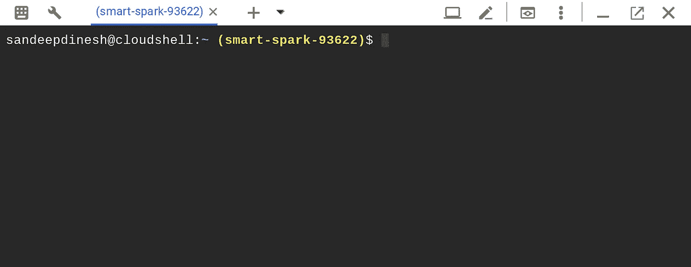
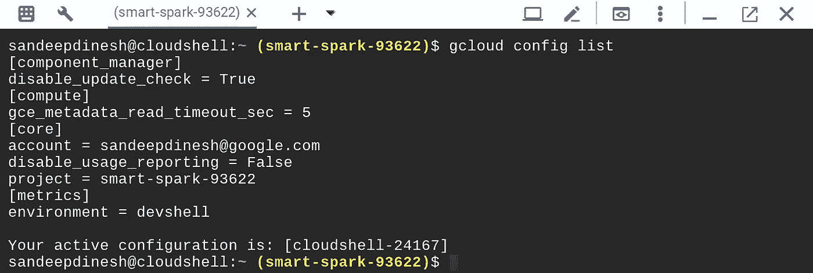
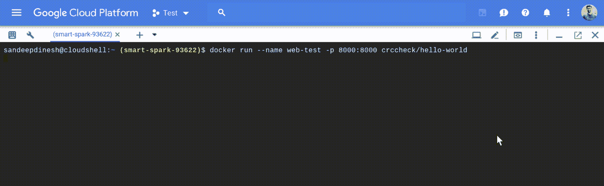
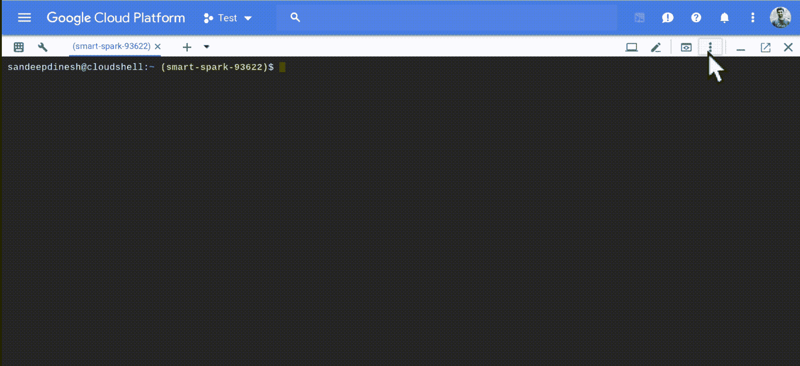
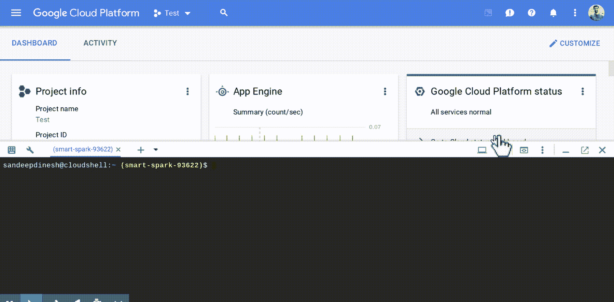
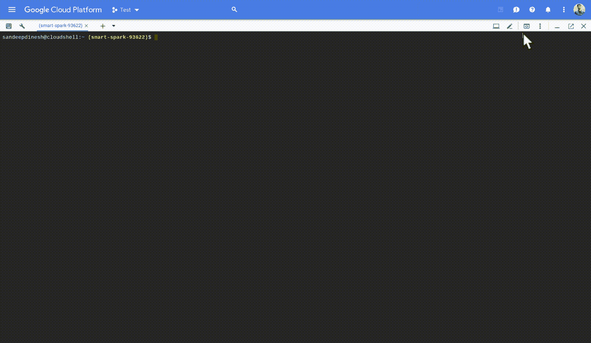

# 没有本地主机？没问题！使用 Google Cloud Shell 作为我的全职开发环境。

> 原文：<https://medium.com/google-cloud/no-localhost-no-problem-using-google-cloud-shell-as-my-full-time-development-environment-22d5a1942439?source=collection_archive---------0----------------------->

我最近全职换了一台 Chromebook(很棒的 [Pixelbook](https://store.google.com/product/google_pixelbook) )，我被问到的第一个问题是“你如何在它上面做开发工作？”

虽然 Chromebooks 正在进行更强大的本地开发(比如 T2 的克罗斯蒂尼的 T3 版本)，但我实际上一直在使用 T4 的谷歌云外壳 T5 作为我的主要开发环境。其实我现在已经好几个月没开本地壳了。

到目前为止，这种体验非常棒，一路上我学到了很多。我想分享一些建议，在这里！

# 什么是谷歌云壳

云壳是一个免费的终端，你可以用它做任何你想做的事情，它 100%运行在网页浏览器中。

> 点击此链接打开云壳:[https://console.cloud.google.com/cloudshell](https://console.cloud.google.com/cloudshell)

看到我的大部分工作都需要互联网，我完全可以依赖浏览器。



## 它配有什么？

Cloud Shell 自带了我日常使用的大部分工具。其中包括 **gcloud、node、kubectl、docker、go、python、git、vim** 等等。

有 5GB 的持久存储绑定到您的$HOME 目录，这也是完全免费的。

另一件很棒的事情是，你会自动通过当前正在进行的 Google Cloud 项目的认证。这使得设置超级简单，一切都正常工作！



# 提示和技巧

## 1.运行网络服务器(自动 HTTPS 免费！)

大多数开发云应用的人通常运行某种网络服务器。通常，您可以在本地运行它，只需在 web 浏览器中键入“localhost”即可访问它。

这在 Cloud Shell 中是不可能的，因此该团队创建了一个简洁的“web 预览”功能，它可以动态创建一个指向本地服务器的 URL。



你可以开放 2000 到 65000 的任意端口，你的 web 流量就通了！

> W **arning** :有一些透明的认证是在幕后完成的，所以如果你把云壳打开的 URL 给了别人，它可能就不起作用了。如果你想远程共享你的“本地主机”连接，我推荐一个像 ngrok 这样的工具。

## 2.通过“增强模式”获得额外的动力

默认情况下，Cloud Shell 运行在一个 g1-small 虚拟机上，对于某些任务来说，这个虚拟机可能会功率不足。您可以通过启用“增强模式”轻松升级到 n1-standard-1 这就像旧 PC 上的涡轮按钮，但这次它实际上是有效的:)



## 3.用图形用户界面编辑你的文件

是的是的，vim 和 emacs 和 nano 都很棒。但是有时你只是想要一个漂亮、舒适的 GUI 来工作。

Cloud Shell 附带了 Orion 编辑器的定制版本。



虽然它不如 VS Code 或 Eclipse 好，但它实际上是一个功能齐全的编辑器，我觉得用它很有效率！

## 4.上传/下载文件

如果你本地有文件想上传到云壳，只需点击菜单中的“上传”按钮，选择你的文件。



要下载文件，请在 Cloud Shell 中运行:

```
$ cloudshell dl <FILENAME>
```

它会下载文件！

## 5.持续二进制/程序安装

因为云壳只持久化你的$HOME 目录，所以如果你安装的东西不是云壳自带的，很有可能下次用的时候就没了。

如果用 **apt-get** 装东西，真的没有什么好的解决办法。但是，如果您直接下载二进制文件或者从源代码编译，您可以在＄HOME 目录中创建一个路径(例如/HOME/sandeedinesh/bin)并将其添加到您的路径中。该文件夹中的任何二进制文件都将正常运行，并且它们将在重新启动之间保持不变。

## 奖励:在云壳中打开

如果您在公共场所有一个 git 存储库(比如一个公共的 GitHub repo)，您实际上可以创建一个链接，该链接将打开最终用户的云 Shell，并自动将 repo 克隆到他们的$HOME 目录中。

 [## 在云壳中打开|云壳|谷歌云

### 要在 Cloud Shell 中提供一个打开示例 Git 存储库的链接，您需要使用 Markdown，如下所示…

cloud.google.com](https://cloud.google.com/shell/docs/open-in-cloud-shell) 

因为它是完全免费的，所以这是一个很好的方式让别人开始运行你的项目，而不用担心他们的本地机器！

# 结论

我使用 Cloud Shell 作为我的主要开发环境，取得了巨大的成功。如果你使用的是 Chromebook，或者你只是想要一个可以从任何浏览器访问的免费 Linux shell，我肯定会选择 Cloud Shell。

还有一大堆新功能即将推出，当它们推出时，我一定会谈论它们！