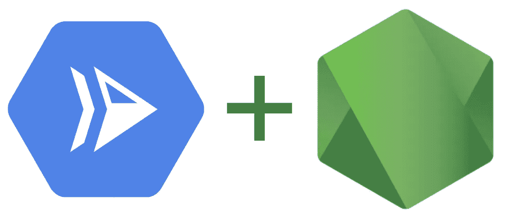
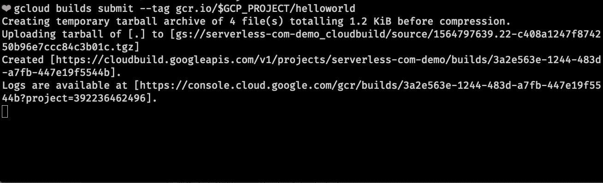
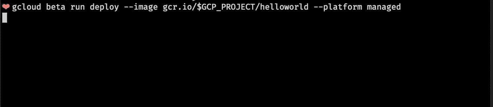

# 节点 12 在云上运行

> 原文：<https://medium.com/google-cloud/node-12-functions-on-cloud-run-d891dd93c7c8?source=collection_archive---------0----------------------->

⚡+☁️+👟!

在这篇文章中，我们将学习如何使用函数框架和云运行来部署 Node 12 应用程序。



云运行+节点

这么说吧。

*   你知道 Node Foundation 发布了尖端的 [Node 12](/@nodejs/introducing-node-js-12-76c41a1b3f3f) 。
*   它包括一些很酷的新特性，比如更高性能的异步/等待、更快的 HTTP 解析和私有字段。它仍在开发中，但您希望将其用于您的服务。
*   但是 Google Cloud Functions 还不支持 Node 12。😢

所以 whatchagunnado？

*   *关于它的博客？*

…也许吧

*   或者使用云运行💨👟

让我们来学习如何做到这一点！

# 将节点 12 功能部署到云运行

Node 是基于 Chrome 的 V8 引擎构建的 JavaScript 运行时。

cloud Run([http://cloud . Run](http://cloud.run))是一个托管的无服务器计算平台，它将基础设施管理抽象化，因此您可以专注于构建出色的应用程序。

总之，您可以在几分钟内基于 Google Cloud 构建可扩展的服务。

## 首先，安装节点 12

[TJ](http://github.com/tj) 有一个非常简单的节点模块，名为`n` ，用于管理节点版本(即在 10 和 12 之间切换)。安装名为`n`的全局 CLI:

```
sudo npm i n -g
```

然后将您的节点版本切换到节点 12:

```
sudo n 12
```

验证您的节点版本

```
node -v # v12.7.0
```

## 创建节点 12 函数

创建一个新的`package.json`:

很难比这更简单了！

在`greeter.js`中创建一个使用节点 12 私有字段的类:

#私有字段

创建一个`index.js`文件:

私有字段不可访问！

## 在本地测试功能框架

您需要在本地测试您的服务，以确保您的代码能够正常工作。

*   `npm i`安装[功能框架](https://github.com/GoogleCloudPlatform/functions-framework-nodejs)。
*   `npm start`启动框架
*   转到`[http://localhost:8080/](http://localhost:8080/)`查看本地的服务器响应。

所以我们让事情在本地进行。但是我们如何将它部署到 Google Cloud 上呢？请继续阅读！


接下来，我们将使用云构建+云运行

## 创建 Dockerfile 文件

> 好的。我实话实说。如果你 6 个月前问我码头工人是什么，我会咕哝一些关于箱子、集装箱船和蓝鲸的事情。但是…

Docker 真的没什么好怕的。它是一个开发和运行应用程序的开放平台。要运行一个应用程序，您需要为 Docker 创建一些指令来设置您的环境。

创建一个名为`Dockerfile`(无文件扩展名)的文件，如下所示:

节点应用程序的基本 docker 文件

我们会告诉 Docker，使用 Node 12，复制我们上面定义的`package.json`，安装，复制我们的文件，然后启动我们的服务器！

## 部署到云运行

要部署到 Google 的云运行，请遵循以下 3 个步骤:

1️⃣设置`gcloud`

```
# Install gcloud beta services
gcloud components install beta# Set env var "GCP_PROJECT" to our project name
GCP_PROJECT=$(gcloud config list --format 'value(core.project)' 2>/dev/null)# Set our Cloud Run region (so we aren't prompted)
gcloud config set run/region us-central1
```

2️⃣上传你的代码并构建容器

```
# Build and upload your image in Google Container Registry
gcloud builds submit --tag gcr.io/$GCP_PROJECT/helloworld
```



注意 Dockerfile 文件中的每个命令都会被执行(大约 30 秒)

3️⃣部署到云运行

```
# Deploy your container to Cloud Run
gcloud beta run deploy --image gcr.io/$GCP_PROJECT/helloworld --platform managed
```



将我们的容器部署到云上运行(大约 17 秒)

您将会看到一个如下所示的 URL:

```
[https://helloworld-q7vieseilq-uc.a.run.app](https://helloworld-q7vieseilq-uc.a.run.app/)
```

恭喜你。您将功能框架部署到了云运行。

# 后续步骤

感谢阅读！看看这些相关的帖子:

*   [云运行快速入门](https://cloud.google.com/run/docs/quickstarts/build-and-deploy)
*   [用 VS 代码调试节点功能](/google-cloud/debugging-node-google-cloud-functions-locally-in-vs-code-e6b912eb3f84)
*   [通过云运行设置连续部署](/google-cloud/simplifying-continuous-deployment-to-cloud-run-with-cloud-build-including-custom-domain-setup-ssl-22d23bed5cd6)