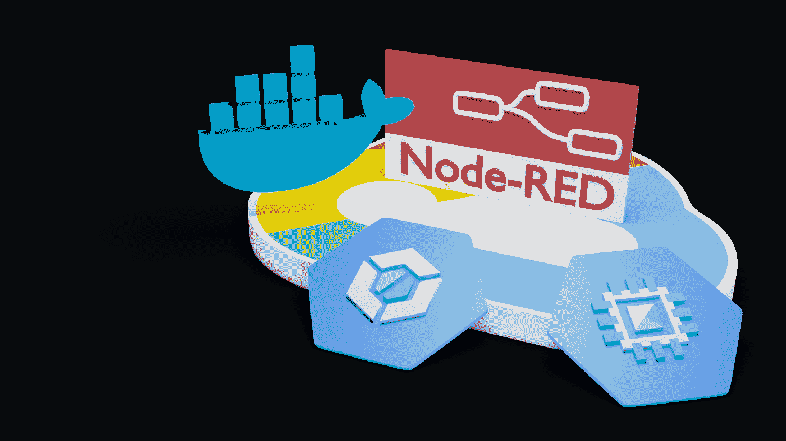
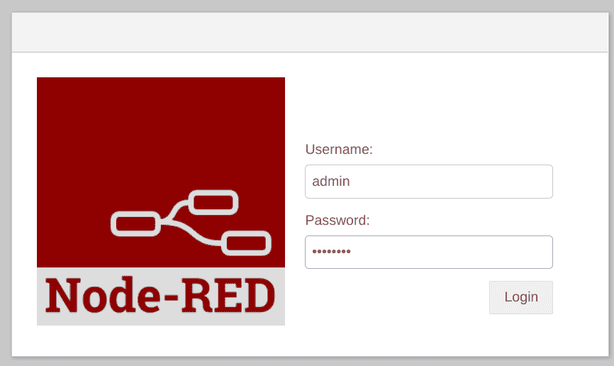

# GCP 上的节点红色解决方案部署

> 原文：<https://medium.com/google-cloud/node-red-solution-deployment-on-gcp-cb885e3528f9?source=collection_archive---------0----------------------->



在这个故事中，我们将假设你已经设计并实现了一个节点红色的解决方案，你希望把它放到谷歌云平台(GCP)上。在这里，我们将研究一些可以用来以安全的方式实现这一点的实践。

当我们部署节点红色解决方案时，我们实际上将部署两个部分。我们将配置 Node-RED 运行时，以及我们希望在该运行时托管的解决方案。我们将在此展示的技术是创建一个自定义 Docker 映像，该映像将打包在一起:

*   红色节点。
*   我们的解决方案依赖的任何自定义节点。
*   作为`flows.yaml`文件的解决方案。这是您开发的流程的描述文件。
*   我们的节点红色实例的配置设置。

让我们从基本的节点-红色环境开始。一个基本的 Docker 镜像由 Node-RED 项目团队分发，可以在 Docker Hub 上找到，名为 [nodered/node-red](https://hub.docker.com/r/nodered/node-red) 。这将是我们建设的基础。

接下来，我们将看看如何添加任何必需的依赖项。当我们使用 Node-RED 时，我们可以添加在 Node-RED 注册表中找到的包。例如，我们将包括在[node-red-contrib-Google-cloud](https://flows.nodered.org/node/node-red-contrib-google-cloud)包中找到的 GCP 节点。为了在我们的新 Docker 图像中包含这一点，我们将添加:

```
RUN npm install node-red-contrib-google-cloud
```

这将被插入我们的 docker 文件。这将使用 npm 执行依赖项的安装。我们将对我们依赖的每个包重复这个命令。

我们的 Node-RED 流在 JSON 中被描述在一个名为`flows.json`的文件中。当镜像开始执行时，它会在`/data`目录中寻找这个文件。这意味着我们应该将我们希望执行的`flows.json`插入到图像中。我们可以使用 Dockerfile 命令来做到这一点:

```
COPY flows.json /data
```

基本 Dockerfile 文件变成:

```
FROM nodered/node-red
RUN npm install node-red-contrib-google-cloud
COPY flows.json /data
```

有一个 Docker 文件是一个很好的开始，但我们需要一种方法来创建 Docker 图像。我们当然可以在本地工作站上使用 Docker，但由于这是一个 GCP 的故事，我们有一个更好的方法。首先，我们将在 GCP 工件注册中心创建一个存储库。这是图像将被存储的地方。

一旦创建了存储库，我们仍然需要构建映像并将其添加到那里。这就是 GCP 云构建发挥作用的地方。云构建是一个 GCP 解决方案，用于在云中构建应用程序，我们提供构建方法，GCP 完成其余工作。云构建的配置是通过一个名为 cloudbuild.yaml 的文件完成的。

```
steps:
- name: 'gcr.io/cloud-builders/docker'
  args: [ 'build', '-t', 'us-central1-docker.pkg.dev/$PROJECT_ID/${_REPOSITORY}/${_IMAGE}', '.' ]
images:
- 'us-central1-docker.pkg.dev/$PROJECT_ID/${_REPOSITORY}/${_IMAGE}'
```

解释这些指令的方式是，我们将执行一个涉及运行 Docker 的云构建步骤。这一步将提供我们当前目录的内容，其中包括我们的 docker 文件。然后，它将构建一个图像，并用我们的存储库的名称标记该图像。接下来，我们将把该映像推送到存储库，这样就完成了。

向云构建提交我们的请求的命令是:

```
gcloud builds submit \
  --config=cloudbuild.yaml \
  --substitutions=_REPOSITORY="repo1",_IMAGE="my-node-red" .
```

`_REPOSITORY`值是我们之前创建的工件存储库的名称。`_IMAGE`值是我们将作为输出创建的图像的名称。

最终结果将是存储库中的图像。剩下的工作是我们创建一个运行图像的计算引擎。

由于计算引擎通过图像在存储库中的名称来识别图像，因此每次计算引擎启动或重启时，它都会选取最新的图像。为了部署新版本的 Node-RED 流，我们将更新我们的`flows.json`文件，并重新运行云构建步骤，这将产生一个新的映像。

我们还需要介绍一些其他的项目。Node-RED 的核心操作在一个名为`settings.js`的文件中有描述。当我们构建自己的自定义节点红色映像时，我们很可能会想要提供一个修改后的版本，因为开箱即用的值对于启动和运行来说非常好，但从安全角度来看是完全开放的。

为了提供我们自己的版本，我们假设您有一个已经定制的文件的本地副本。然后，我们会将以下内容添加到 docker 文件中:

```
COPY settings.js .
```

`settings.js`文件是一个富含注释的 JavaScript 文件。在这里，我们将看看我们应该立即改变的一些关键组件。我们要研究的第一个项目是连接到 Node-RED 并执行开发任务的能力。在我们当前的故事中，真的没有必要这样做。我们已经在单独的 Node-RED 环境中构建并测试了我们的流，现在我们专注于在生产中运行 Node-RED。应该禁用直接登录和执行开发的功能。考虑一下负面影响，如果我们让它处于启用状态，一个坏的参与者设法登录并将他们自己的代码注入到环境中。

要禁用编辑器，在`settings.js`中设置以下内容:

```
httpAdminRoot: false,
```

在部署中，如果我们在禁用编辑器后尝试访问它，将会收到以下形式的消息:

```
Cannot GET /
```

如果我们查看 docker 日志，我们还会看到来自 Node-RED 的消息:

```
21 Mar 14:50:50 - [info] Admin UI disabled
```

如果出于某种原因，我们*确实*希望允许编辑流，我们应该定义一个 userid/password 对来提供认证和授权。密码被添加到我们的`settings.js`文件中，并以散列格式存储在其中。这意味着，如果有人得到了文件，他们仍然不知道密码。哈希密码是使用以下方法创建的:

```
node-red-admin hash-pw
```

然后，系统会提示我们输入密码，并返回密码的哈希值。一旦我们有了散列密码，我们可以将以下内容添加到我们的`settings.js`:

```
adminAuth: {
  type: "credentials",
  users: [{
    username: "admin",
    password: "$2b$08$awfc2.vPIIPniD/DfmgcFePfFGR9goVfOMXXcuyQnNG2xGXkBoX3O",
    permissions: "*"
  }]
},
```

在本例中，密码是哈希值。完成这些更改后，任何登录编辑器的尝试都将导致一个安全提示:



与安全性相关的最后一个领域是流量加密。默认情况下，Node-RED 可以通过 HTTP 访问。这不同于更安全的 HTTPS，后者使用 TLS 进行传输加密。我们可以设置 Node-RED 来使用 HTTPS。为了做到这一点，我们需要一些 TLS 证书。在开发过程中，您可以使用自己生成的证书。

我们可以通过进入`/data`目录并运行以下命令来设置 SSL 支持:

```
openssl req -x509 -newkey rsa:4096 -keyout privkey.pem -out cert.pem -days 365 -nodes -subj "/C=US/ST=Denial/L=Springfield/O=Dis/CN=[www.example.com](http://www.example.com)"
```

这将产生一个`privkey.pem`和一个`cert.pem`。这些应该复制到映像中。确保将文件设置为具有“node-red”的所有者和组:

```
COPY --chown=node-red:node-red privkey.pem /data
COPY --chown=node-red:node-red cert.pem /data
```

然后我们可以编辑`settings.js`并更改:

```
https: {
   key: require("fs").readFileSync('/data/privkey.pem'),
   cert: require("fs").readFileSync('/data/cert.pem')
},
```

我们配置的最终 docker 文件变成了:

```
FROM nodered/node-red
RUN npm install node-red-contrib-google-cloud
COPY --chown=node-red:node-red flows.json /data
COPY --chown=node-red:node-red settings.js /data
COPY --chown=node-red:node-red privkey.pem /data
COPY --chown=node-red:node-red cert.pem /data
```

如果部署没有正常工作，我们可能需要查看容器的日志。最简单的方法是 SSH 到计算引擎并运行:

```
docker ps
```

从这里我们将能够找到容器 ID，然后我们可以运行:

```
docker logs <ContainerID>
```

最后…这里有一个视频，演示了本文中描述的每个步骤。视频是为这篇文章设计的，所以请在观看视频前先阅读文章。

另请参见:

*   [节点-红色主页](https://nodered.org/)
*   [博客:Node-RED 低代码编程来到 GCP—2020–02](https://cloud.google.com/blog/products/application-development/using-node-red-with-google-cloud)
*   [文章:GCP 文档 AI 和 Node-RED](/google-cloud/gcp-document-ai-and-node-red-d062d7d7768e)