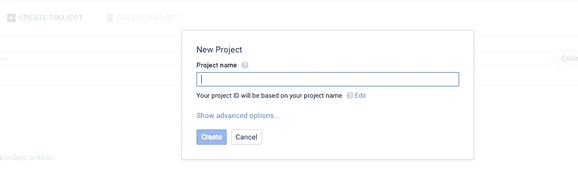
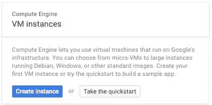
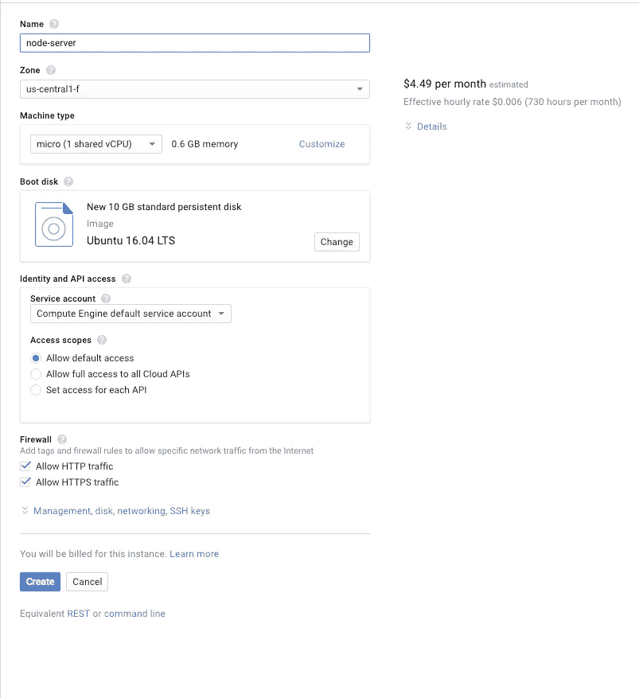
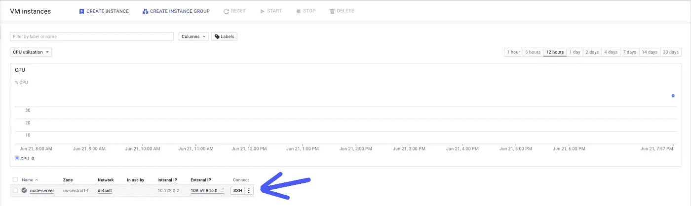
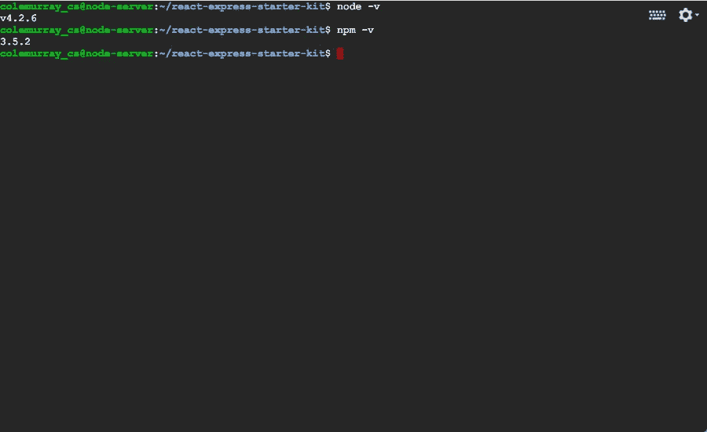
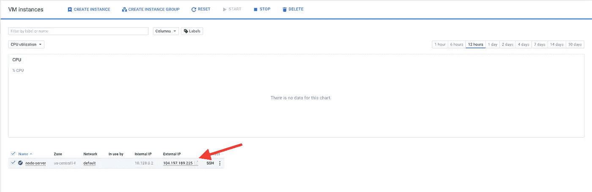
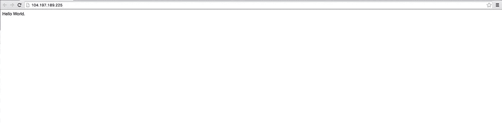
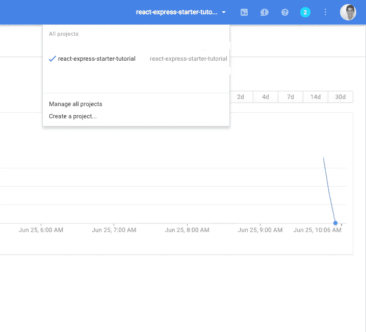
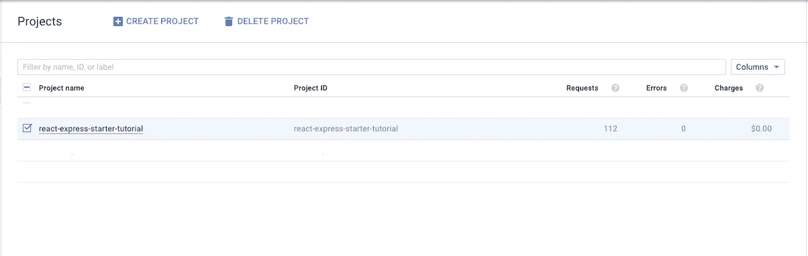

# 25 分钟内节点到谷歌云计算引擎

> 原文：<https://medium.com/google-cloud/node-to-google-cloud-compute-engine-in-25-minutes-7188830d884e?source=collection_archive---------0----------------------->

# 概观

*   介绍
*   设置计算引擎
*   生产中的节点
*   结束语+后续步骤

# 介绍

我将向您展示如何配置 Google 的计算引擎服务器，以便在不到 30 分钟的时间内运行您的 Node.js 项目。

## 先决条件:

*   一个谷歌云平台账号*(学生免费学分*[*【https://cloud.google.com/edu/*](https://cloud.google.com/edu/)*)*
*   Node.js 的基础知识

我不会演示的内容:

*   如何设置节点/反应项目
*   吞咽

对于本教程，我将使用我的初学者工具包。它已经配置了 react + express + es6。

> [https://github.com/ColeMurray/react-express-starter-kit.git](https://github.com/ColeMurray/react-express-starter-kit)

# 设置计算引擎

首先，让我们在计算引擎上创建一个新项目。

导航至:[https://console.cloud.google.com/iam-admin/projects](https://console.cloud.google.com/iam-admin/projects)

然后单击“创建新项目”

创建项目后，导航到菜单中的计算引擎。

这里，我们将创建我们的虚拟机。

配置:

太棒了。我们已经为我们的项目配置好了虚拟机。

## 安装节点

对于本教程，我将使用 web ssh 客户端。

我们需要安装 Node.js 和 Npm 来设置和运行我们的项目。SSH 进入我们的机器，输入以下命令:

> $ sudo apt-get -y 更新
> 
> $ sudo apt-get install -y nodejs npm
> 
> $ sudo ln-s/usr/bin/nodejs/usr/bin/node

安装后，确认一切安装正确。您应该会看到类似下面的输出。

## 克隆并设置我们的项目:

我们需要为我们的项目下载源代码和任务运行器。

> $ git 克隆[https://github.com/ColeMurray/react-express-starter-kit](https://github.com/ColeMurray/react-express-starter-kit)。饭桶
> 
> $ CD react-express-初学者工具包
> 
> $ npm 安装
> 
> $ sudo npm 安装-g 吞咽

一两分钟后，我们将安装好所有的依赖项和任务运行程序 gulp。Gulp 是我们正在运行的任务，我们将用它来创建我们的构建。在这里阅读更多[https://github.com/gulpjs/gulp](https://github.com/gulpjs/gulp)

## 配置 Nginx

Nginx 将作为我们的反向代理。这允许从端口 80 访问我们的节点应用程序

> $ sudo apt-get install -y nginx

我们可以通过以下操作来测试它是否安装正确

> $ curl localhost

我们现在需要配置 nginx 作为节点服务器的反向代理。

导航到 Nginx 的“站点-可用”文件夹。这个文件夹包含 nginx 的配置，我们将在这里创建新的配置。

> $ CD/etc/nginx/sites-可用

*可选:备份当前默认文件*

> $ sudo mv default default.bak

创建新的默认文件:

> $ sudo 触摸默认值

现在在我们的默认文件(/etc/nginx/sites-available/default)中:

重启 nginx

> $ sudo 服务 nginx 重新启动

很好，现在我们已经配置了 nginx。我们的下一步是为生产设置节点。

# 生产中的节点

我们希望我们的节点应用程序能够处理任何崩溃，并在发生崩溃时重启。为此，我们将配置 PM2。PM2 是一个进程管理器，它将使我们的应用程序永远存在。

导航回我们的项目:

> $ CD ~/react-express-初学者工具包

安装 PM2:

> $ sudo npm 安装-g pm2

我们将使用 pm2config 来启动我们的节点项目。注意生产和生产端口。

[**react-express-starter-kit**](https://github.com/ColeMurray/react-express-starter-kit)/**pm 2 config . JSON:**

# 最后一步:

我们已经设置了 nginx，设置了我们的依赖项，为 pm2 创建了一个配置文件。我们的最后一步:构建并启动节点应用程序。

> $ npm 运行构建-生产
> 
> $ pm2 start pm2config.json

导航到您的服务器的 IP 地址，如下所示:

在浏览器中导航到上面的 YOUR_SERVER_IP_Address，我们加载 Hello World 示例。：

> 现在您可能想知道，“如果我的节点服务器崩溃，Pm2 将重新启动我的进程，但是如果我的计算引擎实例崩溃呢？”

我们将再输入两个命令，允许我们的服务器在重启时重启:

> $ pm2 启动
> 
> 节省$ pm2

就是这样！我们完了。我们的服务器现已投入生产，将会经受住任何崩溃/重启。为了证实这一点，我们来测试一下:

> $ sudo shutdown -r 现在

在我们的服务器重新启动后，我们应该能够导航回我们的 IP 地址，并看到我们的节点服务器启动并运行。

# 打扫

为了避免计费，让我们清理一下这个示例项目。

导航到我们的菜单栏，然后单击管理所有项目:

选择我们的项目并删除它:

# 结束语:

在本教程中，我们学习了如何将节点应用程序部署到生产环境中。我们已经使用 Nginx 来反向代理我们的节点服务器和 PM2，以确保它在任何崩溃/重启中存活。

这是构建可伸缩的生产就绪应用程序的一个很好的起点。

## 接下来的潜在步骤:

**创建待办事宜 App 并部署:**

 [## ES6 中的反应和通量！(第 1/2 部分)

### 不久前我开始学习反应和流动。当我在网上搜索用 ES6 编写的 react、webpack 和 flux 时，我…

medium.com](/@ColeMurray/react-flux-in-es6-pt-1-2-e2a7b4aa074e) 

**设置一个数据库**:

 [## 巨大创意的 MongoDB

### MongoDB for GIANT Ideas——构建创新的现代应用程序，创造竞争优势。

mongodb.com](https://mongodb.com) 

**保护我们的生产应用:**

**SSL**:[https://www . digital ocean . com/community/tutorials/how-to-create-an-SSL-certificate-on-nginx-for-Ubuntu-14-04](https://www.digitalocean.com/community/tutorials/how-to-create-an-ssl-certificate-on-nginx-for-ubuntu-14-04)

头盔**:保护我们 Http 头的节点模块:[https://github.com/helmetjs/helmet](https://github.com/helmetjs/helmet)**

**Redux:**

 [## 与 React 一起使用

### 从一开始就编辑这个页面，我们需要强调 Redux 与 React 没有关系。您可以编写 Redux 应用程序…

redux.js.org](http://redux.js.org/docs/basics/UsageWithReact.html) 

> 如果你喜欢这个教程，请推荐，分享，或在下面**评论**！像往常一样，如果有任何问题、建议或闲聊，请随时在 Twitter 上联系我。

 [## 科尔·默里(@ _ 科尔·默里)|推特

### 科尔穆雷的最新推文(@_ColeMurray)。移动工程师@CreditKarma。兴趣:Android，React/flux…

twitter.com](https://twitter.com/_ColeMurray)