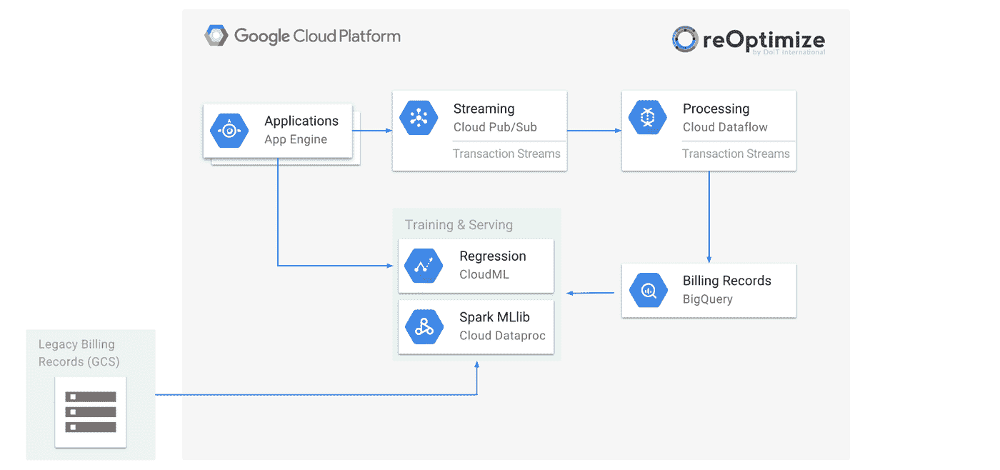

# 本周在谷歌云中——(不)记录所有的事情，来自谷歌/VMWare/Pivotal 的 Kubernetes，并预测你的 GCP 成本

> 原文：<https://medium.com/google-cloud/not-logging-all-the-things-kubernetes-from-google-vmware-pivotal-and-predicting-your-gcp-costs-b25637a2e7a0?source=collection_archive---------0----------------------->

在过去的一周，谷歌宣布了[新的 **Stackdriver Logging** 功能和扩展的免费日志限制](http://goo.gl/Z4tAMX)以及一个名为[日志排除过滤](http://goo.gl/JzuPWq)的新功能，以防止日志浪费。

我们还向**ASP.NET 核心** 开发人员提供了 [Stackdriver 诊断程序(NuGet 上提供了该软件包)。](http://goo.gl/AQkbsD)

当我们谈到日志的话题时，这里有一个新的教程:“为视觉效果和动画管道使用 Stackdriver 日志”——[goo.gl/jn4BdC](https://goo.gl/jn4BdC)

上周来自 VMworld 2017 的重要消息是，**谷歌、VMWare 和 Pivotal** 宣布了工程工作和商业产品:[“在企业中扩展 Kubernetes:**谷歌容器引擎+ Pivotal 容器服务**”](http://goo.gl/VG9vLf)。

如果你想深入了解公告和背景，我推荐你看一下[山姆·拉姆奇的采访](http://goo.gl/mUxpKh)并阅读《T21》杂志上的这篇[详细帖子。](http://goo.gl/814vDQ)

关于容器/Kubernetes 主题，这里有几个帖子:

*   [Kubernetes 豆荚到底是什么](http://goo.gl/YTUFEq)？(ianlewis.org)
*   [kubernetes 如何窃取 docker swarm 的话语权](http://goo.gl/LvCSc9) (fixate.io)

来自“张量流和机器学习”部门:

*   跳到机器学习和 Tensorflow，这里告诉你如何智能地路由来自客户的电子邮件投诉。
*   **AI 奇遇记**系列第二集《机器学习的 7 个步骤》已经出来了(medium.com)
*   **Kaldi** ，一个流行的语音识别工具包，现在[提供 TensorFlow 集成](http://goo.gl/oq8ryF)(developers.googleblog.com)
*   [如何**用 Google CloudML&big query**](http://goo.gl/E8Wcru)(blog.doit-intl.com)预测你的 Google 云平台月账单
*   第三篇也是最后一篇关于[“如何使用云机器学习 API 构建一个**对话应用**”的帖子](http://goo.gl/jaJADw)

与往常一样，本周的 BigData 部分非常全面:

*   [用阿帕奇波束进行及时(和有状态)处理](http://goo.gl/gyATHj)(beam.apache.org)
*   [关于流处理的规范新书](http://goo.gl/GdvWir)(cloud.google.com)
*   为什么 **Google PubSub** ？— [通过 PubSub 向 BigQuery 传输财务数据](http://goo.gl/HpbJGW)(medium.com)
*   Codelab: [使用 Google Maps API 在 BigQuery 中查询和可视化位置数据](http://goo.gl/bCuGkj)(codelabs.developers.google.com)
*   [一个人的经历**谷歌数据工程课程**](http://goo.gl/XrsenW)**(qa.com)**
*   **详细播客 EP . 31[“Dremel，Druid 和 Google BigQuery 上的数据建模”，特邀嘉宾 Dan McClary](http://goo.gl/j9CA77)(drilltodetail.com)**

**来自国际基督教青年会部门:**

*   **[选择谷歌云托管的 7 大优势](http://goo.gl/6enji1)(更新)(kinsta.com)**
*   **[建筑。面向 GCP 的 Visual Studio . NET 应用程序:比以往任何时候都好](http://goo.gl/K2ZJGt)**
*   **[无服务器花生酱和果冻——桑迪普·迪内什的《GCP 和火焰》](http://goo.gl/Lj2Trx)**
*   **《凤凰一号》与迈克尔·威尔的比赛(gcppodcast.com)**

**本周图像是 reOptimize 基于机器学习的预测架构，在详细且动手的 [*“如何预测你的谷歌云平台月账单”*](http://goo.gl/E8Wcru) 帖子中讨论:**

****

**这星期到此为止！**

**-亚历克西斯**