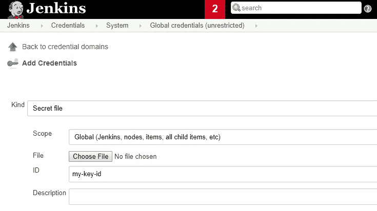

# 注意:云发布/订阅客户端库身份验证本地开发与 Jenkins

> 原文：<https://medium.com/google-cloud/note-cloud-pub-sub-client-libraries-authentication-local-development-vs-jenkins-bc27586ebc5e?source=collection_archive---------3----------------------->

我们在尝试对 Jenkins 运行本地发布/订阅测试时，在这方面有一些反复，所以我想在这里记下来。借助面向发布/订阅的云客户端库，您可以作为开发人员使用 gcloud 在本地进行身份验证:

```
gcloud auth application-default login
```

这将打开一个浏览器，我们打印一个网址，并提示输入验证码。这将适用于所有使用该库的 api 调用。现在，假设您的用户拥有适当的 IAM 角色，您将能够针对 Google Cloud 发布/订阅使用客户端库，并以与 CI 中相同的方式在本地测试您的工作。

对于我们的 CI 来说，詹金斯，我们必须做一些事情。我们在 Google Cloud 中创建了一个服务帐户，应用了正确的 IAM 角色，并下载了 json 密钥。在 Jenkins 中使用机密文件的凭据类型创建了凭据:



接下来，在 JenkinsFile 中，您将希望使用[凭证绑定插件](https://jenkins.io/doc/pipeline/steps/credentials-binding)创建一个变量。

```
stage('test') {
    steps{
      echo "Starting build ${BUILD_ID} for ${JOB_NAME}"
      withCredentials([[$class: 'FileBinding', credentialsId: 'my-key-id', variable: 'GOOGLE_APPLICATION_CREDENTIALS']]) {
          sh "gradle my-project:test"
      }
```

如果您在该绑定中包含使用客户端库的任何内容，应用程序默认凭据(ADC)将使用该变量。在我们的例子中，是一个 gradle 任务，用于测试主题和订阅的创建，以及一个 push/pull。例如，在您使用 App Engine Standard 的情况下，这应该适用于新旧客户端库。