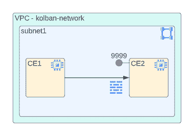
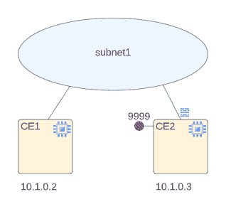
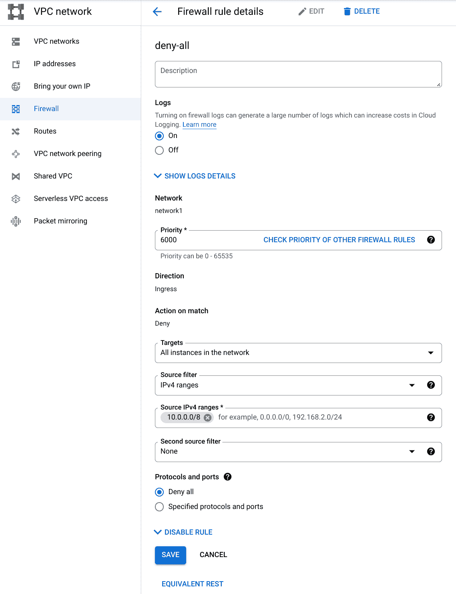
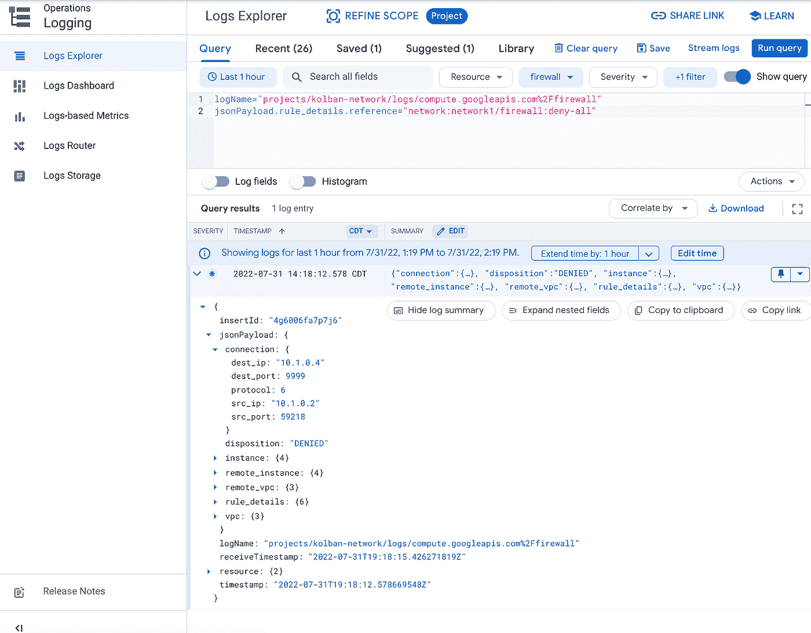
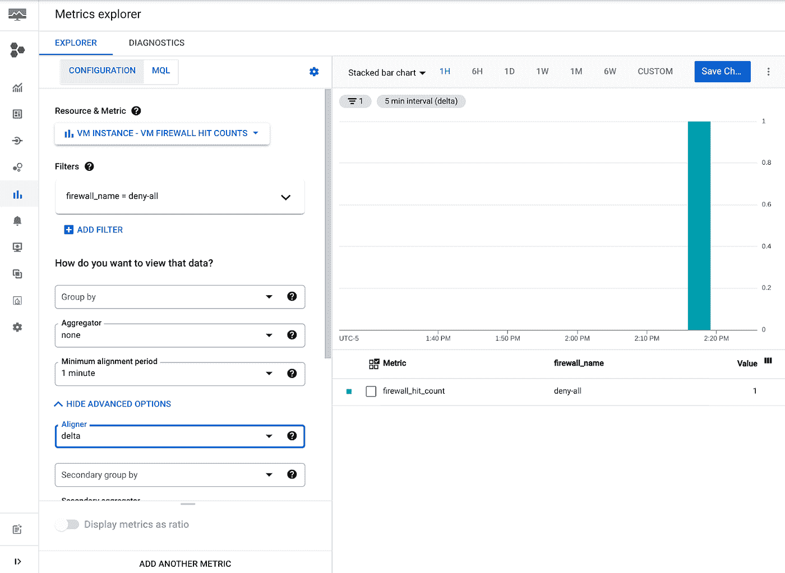
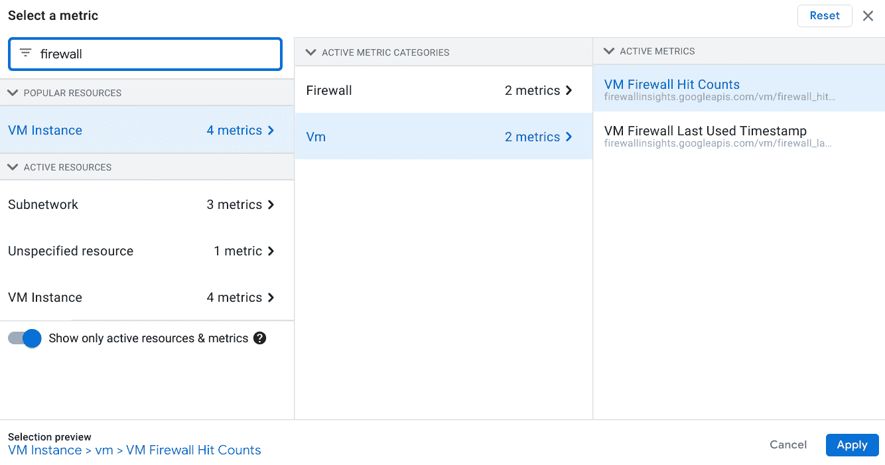
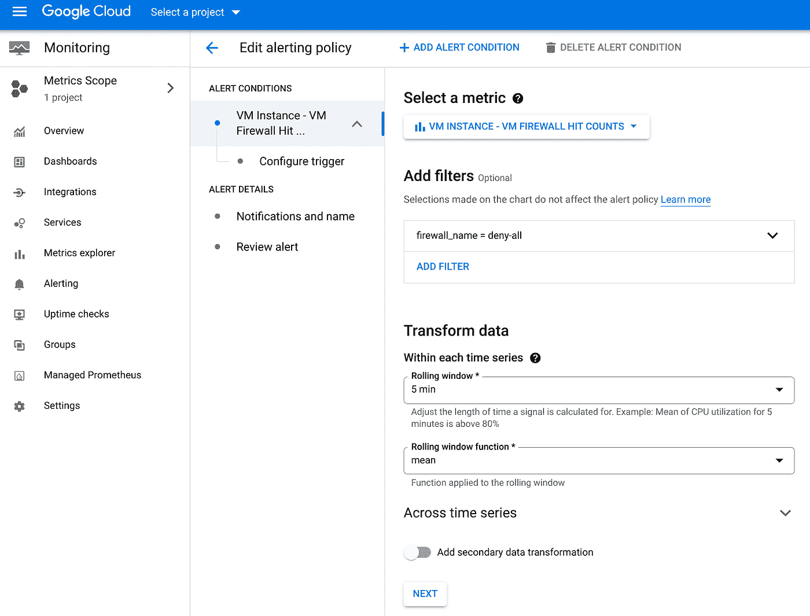
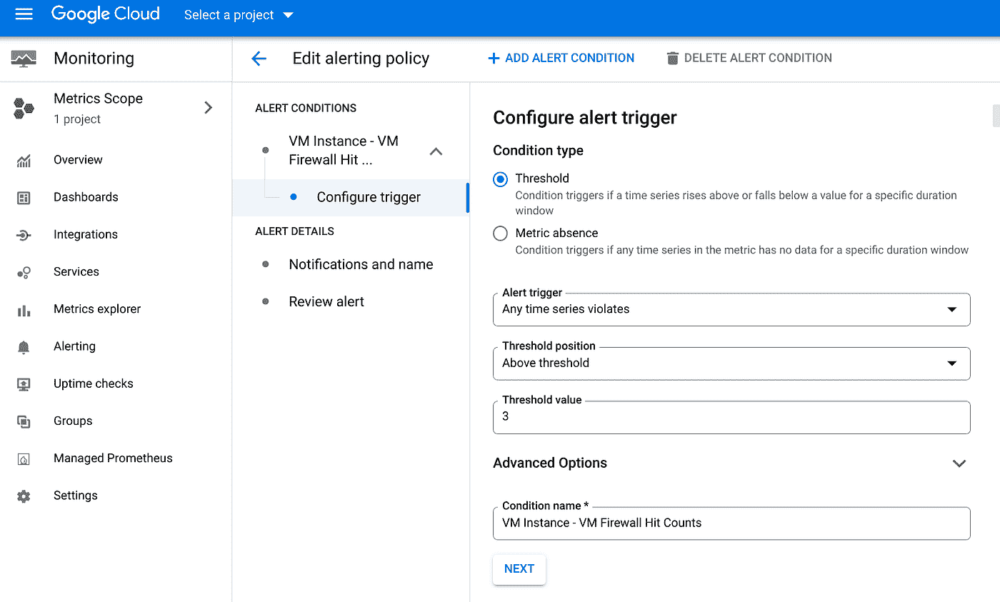
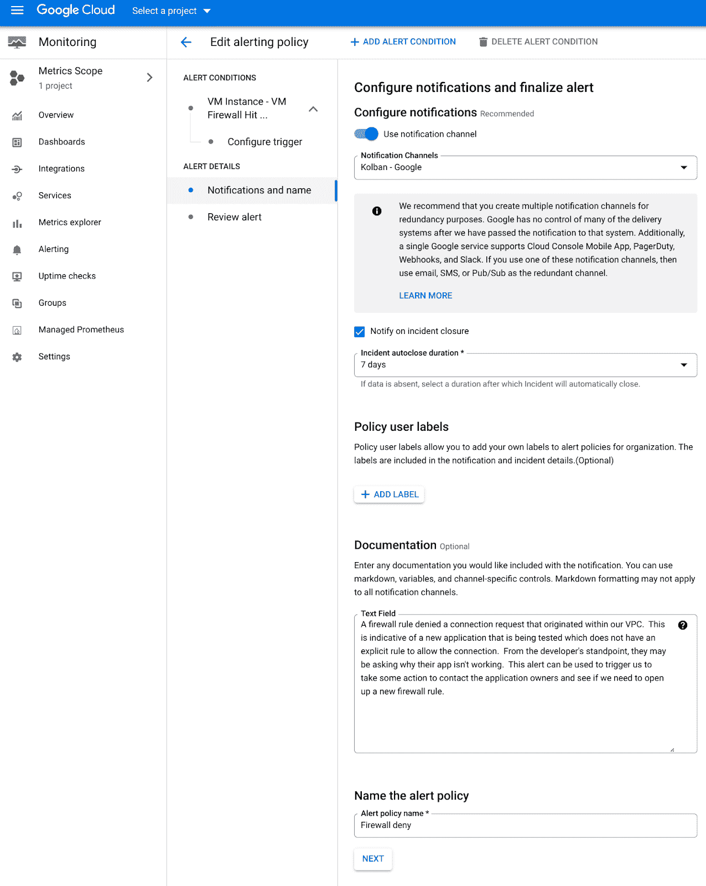
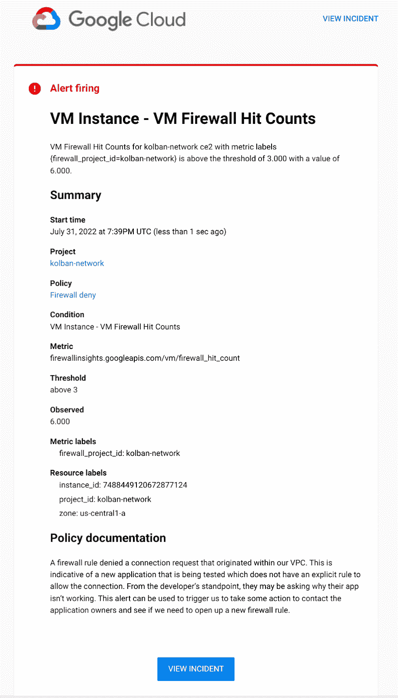

# 防火墙拒绝通知

> 原文：<https://medium.com/google-cloud/notification-of-firewall-denies-c3476a0ea79b?source=collection_archive---------2----------------------->

在与许多大型组织合作时，我发现 VPC 的网络管理员使用定制网络(与自动网络相反)锁定他们的 VPC，并且只允许在明确允许的端口上的 VPC 内的连接。这意味着，如果我们有一个在机器 A 上运行的应用程序试图向机器 B 上的服务发出网络请求(即使在同一个子网内)，如果没有*明确的*规则允许连接，连接将会失败，因为它被防火墙系统拒绝。从开发人员的角度来看，他们可能没有意识到是防火墙阻止了正确的操作。

在 VPC 网络中，有一条隐含的规则，拒绝所有进入机器的流量。因为这是一个隐式规则，所以它不会出现在防火墙规则列表中，并且对于我们的讨论，不会导致任何日志记录被写入云日志。这意味着，如果我们查看日志，我们不会有任何应用程序失败(或失败原因)的迹象。

这个隐式规则具有可能的最低优先级，这意味着如果有任何更高优先级的规则匹配，它将具有优先权。这个观点是这篇文章的关键。

我们可以创建一个*新的*防火墙规则，其优先级高于隐式拒绝规则**也**拒绝所有流量。实际上，这是一条与隐含规则完全相同的规则。这个新规则不会改变经营环境的结果。以前被允许的一切仍将被允许，以前被拒绝的一切仍将被拒绝。但是，因为这是一个自定义规则，我们可以完全控制它，我们可以对它进行一个重要的更改。我们可以启用防火墙日志。这意味着，如果规则被触发，一条日志记录将被写入云日志，解释连接失败以及失败的原因。日志记录还将为我们提供关于请求的来源和目标的信息，然后我们可以使用这些信息来追踪那些一直在挠头想知道为什么他们的应用程序不能工作的开发人员。

启用这个自定义规则还有一个好处。云监控是谷歌云的系统，用于记录运营指标以供分析。生成的指标之一是触发防火墙规则的频率。但是，对此有一个警告…如果防火墙规则启用了日志记录，则度量是*仅*记录*。因为拒绝所有人的隐式防火墙规则不允许*而不是*启用日志记录，所以通常没有度量写入云日志记录，我们可以使用它来进行监控。我们的优先级更高的自定义规则启用日志记录，从而使其可用于监控。由于防火墙拒绝连接现在会产生指标，我们可以利用云监控警报子系统来通知我们请求因防火墙规则而被拒绝，而无需我们持续查看图表。我们可以收到一封电子邮件，表明我们可能希望研究创建一个额外的允许规则。*

现在让我们看一些测试。在下文中，我们创建了一个定制的 VPC 网络(`kolban-network`)，它包含一个托管两个计算引擎(`CE1`和`CE2`)的子网(`subnet1`)。在第一张图中，我们从 Google 云资源的角度展示了环境，而在第二张图中，我们展示了一个经典的网络图。

现在让我们设置一个环境来测试我们的发现。在`CE2`上，我们安装`netcat`包:

`sudo apt-get install netcat`

然后跑

`nc -lk4 9999`

这使得`netcat`在端口`9999`上监听传入的连接请求。在`CE1`上，我们也安装`netcat`并运行:

`date | nc -w2 10.1.0.3 9999`

这使得从`CE1`到`CE2`的请求被尝试。我们会发现，在`CE2`时，没有接收到任何数据。这是因为没有防火墙规则允许来自端口`9999`上`subnet1`的传入连接。隐式规则防止*任何*流量到达(进入)到`CE2`中，这是某些规则没有明确允许的。运行该测试后，如果我们查看云日志记录，我们将看不到拒绝的证据，也不会在监控指标中看到任何指示。

现在，我们开始定义我们的覆盖防火墙条目，以创建一个新的 deny 规则，它优先于隐式 deny 规则。我们创建一个新规则，如下所示:

从这个定义中需要注意的重要事情是:

*   这个规则叫做`deny-all`。(这个名字没什么特别的，我们只要记住以后用就行了)
*   该规则启用了日志记录。
*   它的优先级高于(数值低于)优先级为 65535 的隐式规则。
*   它拒绝流量到达我们的 VPC 网络。
*   拒绝对规则匹配执行操作。
*   它拒绝所有流量(所有协议和端口)。

如果在添加此规则后，我们在`CE1`上重新运行数据发送命令来发送流量，我们再次*而不是*看到流量到达。除了使匹配的拒绝规则成为我们启用日志记录的显式规则之外，我们没有改变规则*。但是，如果我们检查我们的云日志记录，我们会看到一个新的日志记录被写入(放大以查看更多详细信息):*

日志记录包含丰富的信息，包括源 IP ( `CE1`)、目的 IP ( `CE2`)和试图在`CE2` ( `9999`)上到达的端口。还有很多其他细节我们没有展示。

我想让你意识到的是，现在**如果**你要检查云日志记录，你现在会有更丰富的信息供你使用。如果你在看，你可以立即了解到一些有趣的事情正在发生。您可以使用这些信息主动意识到可能有一个开发团队试图运行失败的应用程序。

任何人都不想持续查看日志，所以现在让我们将注意力转向云监控。

以下是 Metrics explorer 的屏幕截图(云监控的一部分)。这表明我们可以创建一个图表，显示拒绝所有防火墙规则被触发的次数。

如果我们在该图表中找到条目，我们可以使用云日志记录来查找该间隔的相应日志记录，以确定拒绝的性质。我们在这里看到的具体指标是

虚拟机实例->虚拟机->虚拟机防火墙命中计数。

我们可以在手册的`[firewallinsights](https://cloud.google.com/monitoring/api/metrics_gcp#gcp-firewallinsights)`部分找到这份公制文件，公制类型为`vm/firewall_hit_count`。

最后，通过使用云监控警报，我们可以创建一个警报策略，以便在发生防火墙阻塞时收到通知(通过电子邮件)。

监控警报电子邮件的一个示例可能是:

这就结束了关于检测防火墙拒绝和当太多防火墙拒绝发生时被提醒的帖子。