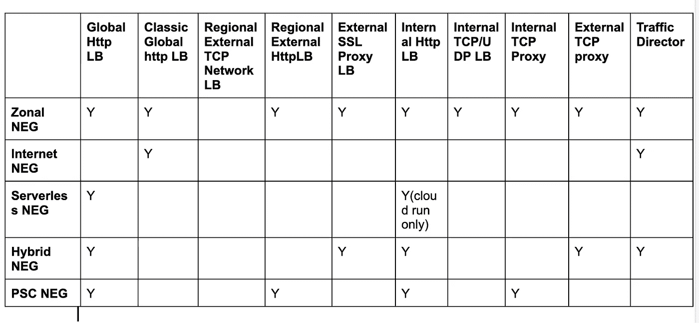
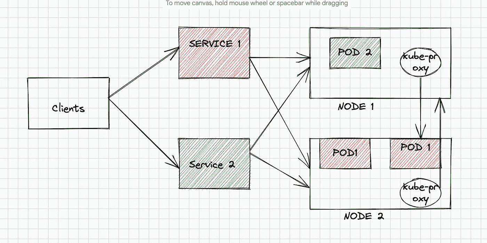
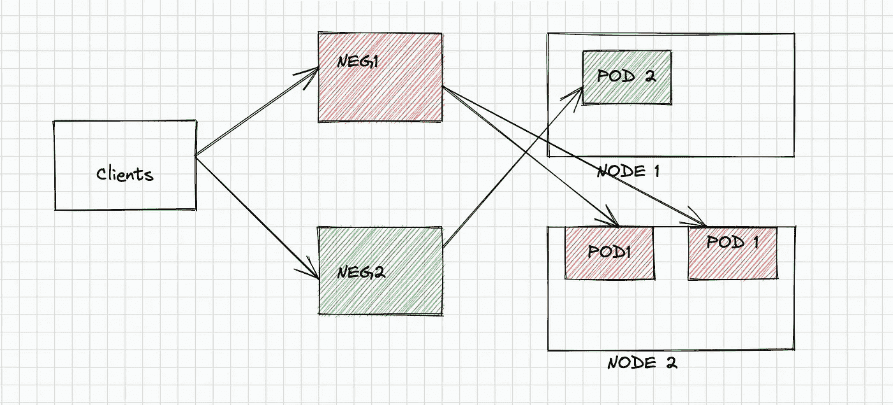
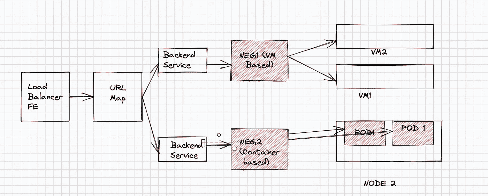
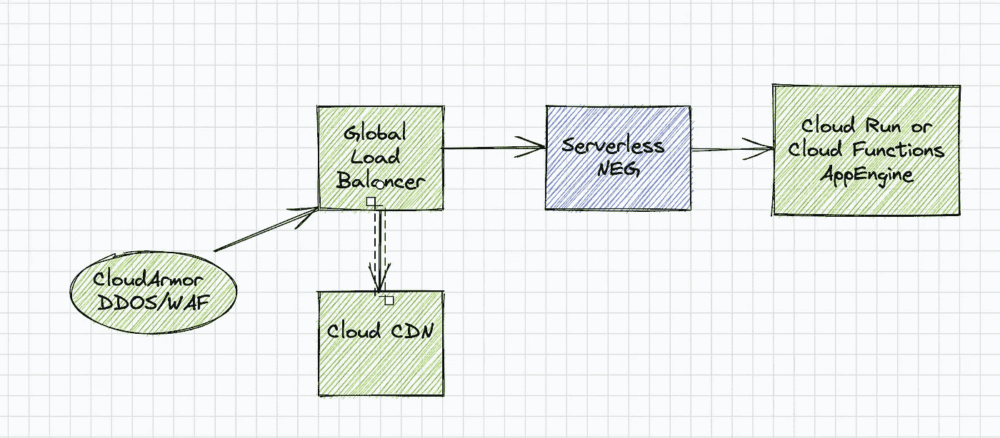
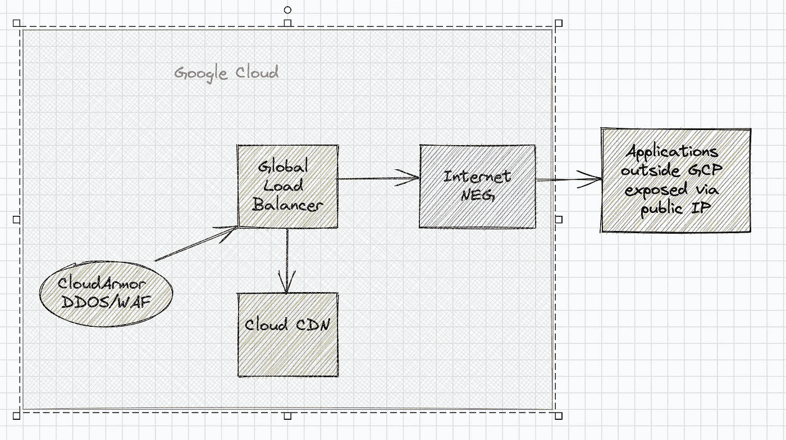
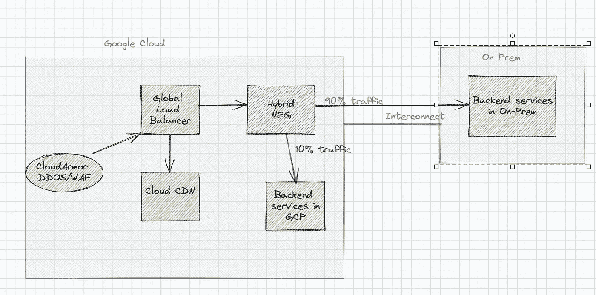
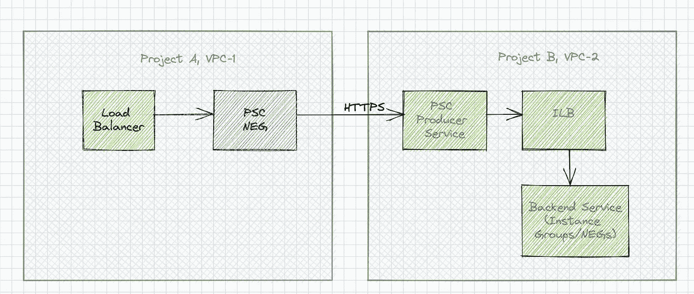

# GCP neg(网络端点组)的基本情况

> 原文：<https://medium.com/google-cloud/nuts-and-bolts-of-negs-network-endpoint-groups-in-gcp-35b0d06f4691?source=collection_archive---------0----------------------->

网络端点组将部署在多个环境中的后端服务聚合在谷歌云负载平衡器下，以利用谷歌提供的卓越网络性能和安全性。它们支持多种用例，并且对 NEGs 的良好理解对于构建您的服务部署非常重要。

# 介绍

传统上，负载平衡器跨实例分发和平衡请求。通常，负载平衡器会将一组运行在不同物理机或虚拟机上的类似服务置于前端，根据负载分配算法分配流量。这些负载平衡器假定每个实例有一个服务，直到容器时代都是如此。容器和基于容器的工作负载改变了应用服务的运行方式。整个应用程序服务可以打包成一个映像，并通过监听特定端口在任何地方运行。基于容器的服务的多个实例也可以扩展到在同一个实例上运行。随着基于容器的工作负载多年来越来越受欢迎和采用，支持可伸缩应用程序服务监听端口的概念变得至关重要，无论它们在哪个实例中运行。因此引入了网络端点组(也称为 NEGs)来代表一组监听端口的可伸缩服务。简而言之，NEG 使我们能够从基于实例的负载平衡跨越到基于服务的负载平衡器。

这些 neg 通常被配置为一组可扩展的服务，位于 GCP 的负载平衡器之后，以便可以通过单个端点到达它们。此外，这些 neg 支持在 GCP 之外运行的服务(内部或不同的云提供商)利用 Google 前端和 CDN 网络的卓越功能。GCP 支持不同类型的 neg，以支持不同的工作负载。

# GCP 的否定类型

让我们看看 GCP 不同类型的网络端点组。

**区域否定**:区域内虚拟机中运行的服务以及 GKE pod 的否定。

**无服务器否定**:启用云运行、云功能、API 网关等无服务器服务作为谷歌负载均衡器的后端。

**互联网 NEG** : NEG 从谷歌负载均衡器访问 GCP 以外的后端

混合否定:将部署在内部的服务配置为 Google 负载均衡器的后端。

PSC NEG :将跨网络和项目运行的服务配置为 Google 负载平衡器的后端。

# NEGs 支持 GCP 负载平衡器

下表列出了每个 GCP 负载平衡器支持的 neg。有关负载平衡器支持的最新信息，请参考 GCP 文档。

[](https://cloud.google.com/load-balancing/docs/negs) [## 网络端点组概述|负载平衡| Google 云

### 网络端点组(NEG)是指定一组后端端点或服务的配置对象。一个…

cloud.google.com](https://cloud.google.com/load-balancing/docs/negs) 

各种 GCP 负载平衡器支持 NEGs

# 细节

让我们通过讨论这些 neg 支持的目的和使用案例来深入了解网络端点组的细节。

**用例 1:直接连接到多个 GKE pod(GKE 的区域 NEG)**

在 Kubernetes 中，服务公开了一组在特定内部 pod-ip 和端口上提供特定功能的 pod。这些属于一个服务的 pod 可以扩大或缩小，它们通常在 GKE 集群节点中运行。这些服务本质上就像一个网络负载平衡器，并以一种特定的方式(循环、基于权重)将请求路由到与其连接的多个 pods。典型的 kubernetes 服务将入站请求分两步路由到 pod。请求最初被发送到 GKE 集群中的底层 VM 节点，该集群再次使用 kube-proxy 将请求路由到运行服务的特定 pod。因此，要连接到公开应用程序功能的特定 pod，需要两个跃点(服务->虚拟机-> pod)。

在下图中，来自客户端的请求到达 Kubernetes 服务，然后被发送到 GKE 集群中的一个后端实例(节点池)。每个节点中运行的“kube-proxy”服务通过 ip 表规则将请求重定向到正确的 pod。



基于 Kubernetes 服务的负载平衡

对于 NEGs，pod 通过“pod-ip:port”直接暴露。在这种情况下，客户端直接与 pods 通信，而无需在每个实例中联系 kube-proxy。这导致更低的延迟和更好的性能。此外，当您放大/缩小底层 pod 时，GKE 会自动管理负端点。因此，在放大过程中，新的端点被添加到 NEG，而在缩小过程中，现有的端点被移除



基于 NEG 的 kubernetes 服务负载均衡

“Kubernetes 服务”可以通过一个简单的注释在 GKE 公开为 NEG

```
annotations:
    cloud.google.com/neg: '{"exposed_ports": {"80":{"name": "NEG_NAME"}}}'
```

参考 GKE 文件:

[*单机 NEGs*](https://cloud.google.com/kubernetes-engine/docs/how-to/standalone-neg#create_a_service) *，* [*集装箱本地负载均衡*](https://cloud.google.com/kubernetes-engine/docs/how-to/container-native-load-balancing)

**用例 2:相同服务的基于容器和虚拟机的后端(区域否定)**



作为容器和虚拟机后端的区域负

区域 neg 支持在虚拟机中运行的一组应用程序作为负载平衡器后面的一组端点公开。让我们考虑一下从虚拟机过渡到容器的情况。在这种情况下，您的一些应用程序将被容器化，而一些应用程序可能会继续在虚拟机中运行。您可以使用基于分区虚拟机的 neg 来添加虚拟机，并使用基于 GKE 容器的 neg 作为 kubernetes pods 的后端。这样，一个负载均衡器就可以同时服务于基于虚拟机的工作负载和容器化的工作负载，如上图所示。

**用例 3:通过负载均衡器(无服务器 NEG)公开无服务器应用**



通过无服务器 NEG 连接到负载平衡器的无服务器应用程序

让我们考虑这样一种情况，您的应用程序部署在云运行、云功能或 App Engine 无服务器托管环境中。虽然无服务器端点可以直接暴露给外部世界供公众访问，但对于广泛使用的服务来说，安全性和性能可能是一个问题。这些服务可以附加为无服务器的 NEG 后端服务，并通过 GCP 的全局负载平衡器对外公开。全局负载平衡器通过 GFEs 接受更靠近用户的请求来提高性能，并通过高速 google 网络路由所有流量。此外，负载平衡器可以连接到云 CDN 来缓存静态图像/文件，并为来自缓存的请求提供服务，从而大幅提高性能。从安全角度来看，通过在负载平衡器上配置的“ [**【云甲】**](https://cloud.google.com/armor/docs/cloud-armor-overview) ”策略，可以保护全局负载平衡器免受各种 DDOS 和 WAF 攻击。因此，“无服务器 NEG”将 GCP 全球负载平衡器的性能和安全性带到了无服务器世界。

**用例 4:为 GCP 以外的应用利用谷歌网络、CDN 和 DDOS 保护(互联网阴性)**



GCP 负载均衡器在互联网中的应用

虽然无服务器 NEG 为无服务器世界带来了 GCP 负载平衡器的能力和力量，但 Internet NEG 允许通过负载平衡器暴露在 GCP 之外运行的后端。这些后端主要是在内部或不同的云提供商环境中运行的服务，并通过公共 IP 公开**。可以将多个端点添加到一个 Internet NEG，但是 ip 地址应该可以从 GCP 通过 Internet 公开到达。通常，互联网 neg 作为后端添加到 GCP 的全球负载平衡器，以利用 GCP 网络、CDN 的高性能，并通过云装甲防范 DDOS 和 WAF 攻击。因此，Internet NEGs 将 GCP 全球负载平衡器的性能和安全特性引入本地应用和非 GCP 云提供商(AWS/Azure)应用。**

**用例 5:在本地服务和 GCP 服务之间分流流量。(混合阴性)**



金丝雀发布本地迁移至 GCP 的策略

让我们考虑这样一种情况:当您将应用服务从内部(在组织中运行的传统内部数据中心)迁移到 GCP 时。迁移后，您希望在生产环境中采用 Canary 版本的 Devops 最佳实践。不用将所有用户和请求暴露给云中新迁移的服务，一小部分流量可以被定向到 GCP 的后端服务，而大部分流量被路由到本地。分配给迁移的 GCP 后端服务的请求流量部分可以逐渐增加。这确保了向 GCP 的迁移遵循故障安全金丝雀释放策略。

在 GCP，可以创建混合 neg 来实现这一战略。负载平衡器后端服务可以指向驻留在内部的端点(私有端点)。这样做的先决条件是，对于内部部署的私有端点，可以从 GCP 访问(互连连接)。后端服务可以将其中一个后端作为基于 GCP 的服务(实例组、节点等)，将另一个后端作为指向本地私有 ip 端点的混合 NEG。可以配置路由规则来实现后端之间流量的加权分配

**用例 6:通过负载均衡器公开运行在不同/网络中的服务。(PSC 阴性)**



跨网络边界的应用程序通过 PSC NEG 连接到负载平衡器

私有服务连接(又称 PSC)的一个重要特性是跨网络和项目边界消费服务，而无需 VPC 对等。PSC 允许您通过“PSC 发布服务”功能发布负载平衡器背后的服务。在生产者方面，任何 Https 服务都可以附加到内部负载平衡器，并作为服务发布。在消费者网络上(跨组织的相同或不同项目中)，您可以通过指定在不同网络/项目中运行的已发布服务的服务 url，创建 PSC 服务附件作为支持的负载平衡器上的后端服务(参见上表)。

这使得外部负载平衡器可以在不同于生产者服务的网络和项目中进行管理。注意:负载平衡器上的 PSC 后端服务目前仅支持 Https 协议(截至日期)。

# 结论

正如本文所讨论的，网络端点组是一个重要的概念，它支持 GCP 的各种用例。记住 NEG 的主要功能之一是公开一组服务。这些服务位于何处以及它们是如何公开的，决定了必须创建的 NEG 的类型。此外，请务必参考最新的 GCP 文档，了解不同负载平衡器对 NEGs 的最新支持，因为目前 PSC 中正在进行大量工作。

# 参考

[NEGs 概述](https://cloud.google.com/load-balancing/docs/negs)

[带状阴性](https://cloud.google.com/load-balancing/docs/negs/zonal-neg-concepts)

[网络负面](https://cloud.google.com/load-balancing/docs/negs/internet-neg-concepts)

[无服务器负号](https://cloud.google.com/load-balancing/docs/negs/serverless-neg-concepts)

[混合阴性](https://cloud.google.com/load-balancing/docs/negs/hybrid-neg-concepts)

[PSC 概述](https://cloud.google.com/vpc/docs/private-service-connect)

[PSC 阴性](https://cloud.google.com/vpc/docs/configure-private-service-connect-controls#create-neg)

[云甲](https://cloud.google.com/armor/docs/cloud-armor-overview)