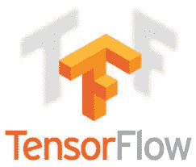
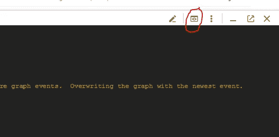

# 物体检测:Tensorflow 和 Google 云平台

> 原文：<https://medium.com/google-cloud/object-detection-tensorflow-and-google-cloud-platform-72e0a3f3bdd6?source=collection_archive---------0----------------------->



关于在 windows 10 和谷歌云平台(GCP)上运行[这个](https://github.com/tensorflow/models/blob/master/research/object_detection/g3doc/running_pets.md)物体检测模块/教程的快速说明，此前它让我费了很大劲来设置和运行。

完整的教程和学分可以在这里找到并关联到男生和女生:

[](https://github.com/tensorflow/models/blob/master/research/object_detection/g3doc/running_pets.md) [## 张量流/模型

### 模型-用 TensorFlow 构建的模型和示例

github.com](https://github.com/tensorflow/models/blob/master/research/object_detection/g3doc/running_pets.md) 

不过，我做了一些更新，可能有助于解决 GCP 和 tensorflow 之间的一些兼容性问题。主要是做 setup.py 文件！

提到的教程的目的是得到一个用于宠物的物体检测 ML 算法。为此，我们使用 tensorflow 对象检测模型，结合牛津可视化 pet 图像数据集。希望你能像我一样冷静地面对这个问题，并且更快地得到一个可用的版本。

# **克隆目标检测库:**

```
git clone[https://github.com/tensorflow/models.git](https://github.com/tensorflow/models.git)
```

由于对象检测模块最近的一些变化，GCP 仍然停留在 tensorflow 1.2，您需要检查模块的以下版本:

```
git reset — hard a4944a57ad
```

你现在应该有一个回购单*模型*文件夹，和随后的模块文件夹(即。对抗性 _ 加密，对抗性 _ 文本，…..物体探测…苗条等。)

# **安装张量流**

**修改后的步骤如下，完整的原安装步骤** [**此处**](https://github.com/tensorflow/models/blob/master/research/object_detection/g3doc/installation.md)

向 PYTHONPATH 系统变量添加两条路径:

1.  模型文件夹的位置—例如*C://location _ to _ models _ folder/models*
2.  models/slim 文件夹的位置—例如 C*://location _ to _ models _ folder/models/slim*

安装 tensorflow

(我使用了一个 anaconda 设置)——[完整的设置链接在这里](https://www.tensorflow.org/install/)

使用 anaconda 或本地 python，运行以下命令之一。

**安装张量流命令**

```
#CPU version
**pip install --ignore-installed --upgrade tensorflow**#GPU version -- need a NVIDIA graphics card with more than 2gb
**pip install --ignore-installed --upgrade tensorflow-gpu**
```

**安装依赖关系**

```
pip install pillow
pip install lxml
pip install jupyter
pip install matplotlib# or in onepip install pillow lxml jupyter matplotlib
```

**Protobuf 编译**

```
#From models directory
protoc object_detection/protos/*.proto --python_out=.
```

**测试安装**

运行以下代码，当您使用高于 3 的 python 版本运行它时，应该会出现两个错误——由于使用了 iteritems()函数，该函数在 python 3 中已被[弃用。不要担心这两个错误，这些都是意料之中的。](https://github.com/saltstack-formulas/vmbuilder-formula/issues/3)

```
python object_detection/builders/model_builder_test.py
```

# **建立物体检测模型**

从 http://www.robots.ox.ac.uk/~vgg/data/pets/下载数据集 ***标注*** 和 ***接地真相***

虽然这些都是下载(在澳大利亚，仍然吸 ADSL，这些花了很长时间！).所以与此同时:

1.  建立 GCP 项目和 bucket(给它起个有纪念意义的名字)——[注册](https://www.google.com.au/url?sa=t&rct=j&q=&esrc=s&source=web&cd=1&cad=rja&uact=8&ved=0ahUKEwjS1N3IiKHXAhXDn5QKHawnBGcQFggoMAA&url=https%3A%2F%2Fcloud.google.com%2Ffree%2F&usg=AOvVaw3PgoKGVJPPuiGeSj8cPDnR)，它应该会创建“你的第一个项目”，只需启用存储即可。
2.  启用机器学习(ML)引擎 API 应该在项目的左侧导航栏中
3.  安装 G [oogle Cloud SDK](https://cloud.google.com/sdk/downloads)

下载完数据集后，将它们移动到与 object_detection 文件夹相同的文件夹级别。

提取数据集文件夹。

现在我们需要转换成 tensorflow 可以读取的东西。

```
# From models directory
python object_detection/create_pet_tf_record.py \
    --label_map_path=object_detection/data/pet_label_map.pbtxt \
    --data_dir=`pwd` \
    --output_dir=`pwd`# From the source itself - Warnings are normal when you run the script, so don't worry
```

在 models 目录中应该有两个新文件， *pet_train.record* 和 *pet_val.record* 。

在*/models/object _ detection/data/*目录中应该有一个名为 *pet_label_map.pbtxt* 的新文件

在您的 GCP 存储桶中，创建一个名为 *data* 的文件夹，并将这些文件复制到其中。

**下载 COCO-pretrained 迁移学习模型**

预先训练的模型有助于一般对象检测:

“从头开始训练一个最先进的对象检测器可能需要几天时间，即使使用多个 GPU 也是如此！为了加快训练速度，我们将采用在不同数据集(COCO)上训练的对象检测器，并重用它的一些参数来初始化我们的新模型。”

1.  下载如下:[COCO-用 Resnet-101 模型预训练的更快的 R-CNN](http://storage.googleapis.com/download.tensorflow.org/models/object_detection/faster_rcnn_resnet101_coco_11_06_2017.tar.gz)
2.  提取
3.  将带有 */model.ckpt.** 图案的内容上传到数据文件夹下的 GCP 存储桶中

**配置对象检测管道**

1.  在*object _ detection/samples/configs*文件夹中，打开 faster _ rcnn _ resnet 101 _ pets . config
2.  用 GS://$ {您的 GCP 存储桶名称}/data/替换路径配置的所有实例
3.  将此文件上传到数据文件夹下的 GCP 桶中

**检查点**

您应该在数据文件夹下的 GCP 桶中有以下文件

```
+ ${YOUR_GCS_BUCKET}/
  + data/
    - faster_rcnn_resnet101_pets.config
    - model.ckpt.index
    - model.ckpt.meta
    - model.ckpt.data-00000-of-00001
    - pet_label_map.pbtxt
    - pet_train.record
    - pet_val.record
```

# 修改 setup.py 文件

在*模型*目录中，修改 *setup.py* 文件以反映以下内容。这是为了安装 object_detection 模块所需的一些依赖项，这些依赖项不是 GCP ML 环境中的预打包模块。

主要是 python-tk 和 Matplotlib。

```
"""Setup script for object_detection."""
import logging
import subprocess
from setuptools import find_packages
from setuptools import setup
from setuptools.command.install import installclass CustomCommands(install):
  """A setuptools Command class able to run arbitrary commands."""def RunCustomCommand(self, command_list):
    p = subprocess.Popen(
        command_list,
        stdin=subprocess.PIPE,
        stdout=subprocess.PIPE,
        stderr=subprocess.STDOUT)
    # Can use communicate(input='y\n'.encode()) if the command run requires
    # some confirmation.
    stdout_data, _ = p.communicate()
    logging.info('Log command output: %s', stdout_data)
    if p.returncode != 0:
      raise RuntimeError('Command %s failed: exit code: %s' %
                         (command_list, p.returncode))

  def run(self):
    self.RunCustomCommand(['apt-get', 'update'])
    self.RunCustomCommand(
          ['apt-get', 'install', '-y', 'python-tk']) install.run(self)REQUIRED_PACKAGES = ['Pillow>=1.0', 'Matplotlib>=2.1']setup(
    name='object_detection',
    version='0.1',
    install_requires=REQUIRED_PACKAGES,
    include_package_data=True,
    packages=[p for p in find_packages() if p.startswith('object_detection')],
    description='Tensorflow Object Detection Library',
 cmdclass={
        'install': CustomCommands,
    }
)
```

**修改云参数设置**

编辑以下文件:*object _ detection/samples/cloud/cloud . yml*

```
trainingInput:
  runtimeVersion: "1.2"
  scaleTier: CUSTOM
  masterType: standard_gpu
  workerCount: 5
  workerType: standard_gpu
  parameterServerCount: 3
  parameterServerType: standard
```

**开始训练**

修改了所有需要的参数文件后，我们现在可以构建并将其发送到 Google ML 进行处理:

构建包:

```
# From models directory
python setup.py sdist
(cd slim && python setup.py sdist)
```

**运行培训作业**

#注意:在澳大利亚，我们无法从我们当地的澳大利亚-东南 1 数据中心使用 ML，因此我们使用 us-central1。

确保 cd 回到模型目录

```
# From models directory
gcloud ml-engine jobs submit training object_detection_${version_unique_ID} \
    --job-dir=gs://${YOUR_GCS_BUCKET}/train \
    --packages dist/object_detection-0.1.tar.gz,slim/dist/slim-0.1.tar.gz \
    --module-name object_detection.train \
    --region us-central1 \
    --config object_detection/samples/cloud/cloud.yml \
    -- \
    --train_dir=gs://${YOUR_GCS_BUCKET}/train \
    --pipeline_config_path=gs://${YOUR_GCS_BUCKET}/data/faster_rcnn_resnet101_pets.config
```

**运行评估作业**

评估作业可以与培训一起运行。然而，你很有可能不得不增加分配给你的 ML 平台的资源量，以使它们串联运行。

```
# From models directory 
gcloud ml-engine jobs submit training object_detection_EVAL_${version_unique_ID} \
    --job-dir=gs://${YOUR_GCS_BUCKET}/train \
    --packages dist/object_detection-0.1.tar.gz,slim/dist/slim-0.1.tar.gz \
    --module-name object_detection.eval \
    --region us-central1 \
    --scale-tier BASIC_GPU \
    -- \
    --checkpoint_dir=gs://${YOUR_GCS_BUCKET}/train \
    --eval_dir=gs://${YOUR_GCS_BUCKET}/eval \
    --pipeline_config_path=gs://${YOUR_GCS_BUCKET}/data/faster_rcnn_resnet101_pets.config
```

# 使用 tensorboard 监控作业:

打开 GCP 右上角的 Google cloud SDK 外壳。


SDK 外壳，在浏览器控制台中

运行以下命令:

```
tensorboard --logdir=gs://${GCP_BUCKET_NAME} --port=8080
```

使用控制台中的预览功能打开张量板仪表板



网络预览— tensorboard

在处理培训和评估模型时，您应该能够检查它们。

如果这是您第一次运行模型，可能需要一段时间来填充，所以请耐心等待。还有，别忘了停止你的培训工作！


Tensorboard 性能监控

# 结论

不管怎样，希望这些能帮助你通过 windows 在 GCP 试用版上运行 TF。

另外，在你对 pets 数据集的结果感到沮丧之前，请务必阅读[论文](http://www.robots.ox.ac.uk/~vgg/publications/2012/parkhi12a/parkhi12a.pdf)。