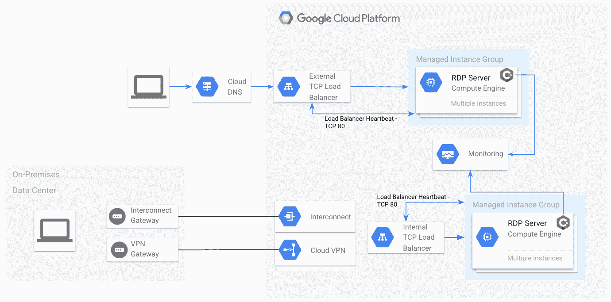
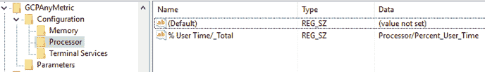
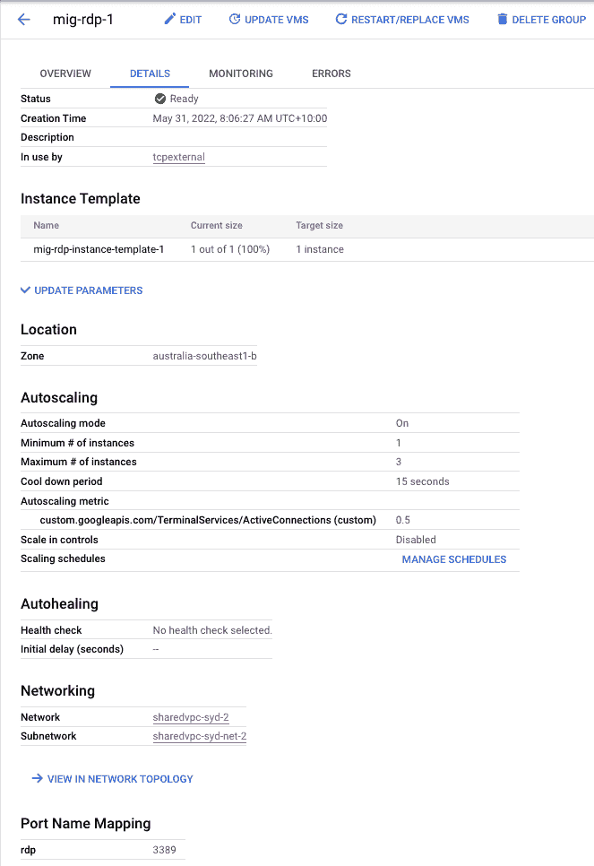
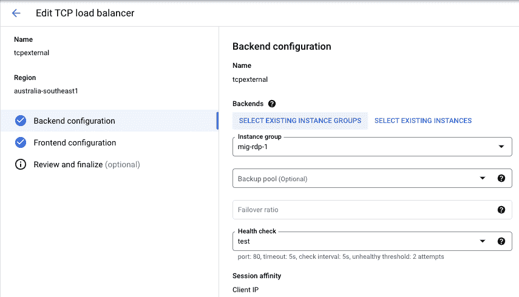

# 在 Google 云和托管实例组中使用任何 Windows 性能指标

> 原文：<https://medium.com/google-cloud/obtaining-any-windows-performance-metric-in-google-cloud-a5ec1432ea6e?source=collection_archive---------1----------------------->

Mike Francis，谷歌云的云转型架构师

最近，我面临一个问题“我们如何通过使用谷歌云帮助客户降低运行 Windows 终端服务的成本”。

回顾客户当前的解决方案，我发现这是一个非常典型的架构。该客户将 Windows 终端服务用于需要访问传统胖 Windows 客户端应用程序的远程办公室工作人员。客户使用 VPN 来保护到其数据中心的连接；他们有一组最终用户连接到的 Windows 终端服务器。

从运营的角度来看，他们似乎有很多机会可以降低运营成本。一些突出的例子是:

*   消除管理多台 Windows 服务器的需要。
*   自动化 Windows 终端服务器的生命周期管理。
*   让最终用户连接到某种形式的负载平衡，将他们连接到终端服务器，而不是特定的连接。这将简化客户端的可支持性。

从另一个成本角度来看，问题浮出水面“我们如何利用谷歌云的弹性和固有的自动化来按需提供 Windows 终端服务；所以顾客只为他们使用的东西付费。

从概念上来说，我想到了 Google Cloud 必须具备的自动扩展应用程序的能力，即结合使用 Google Cloud 负载平衡器和托管实例组，根据需求自动扩展一组虚拟机，然后在不需要时再将它们扩展回来。下图说明了概念模型:

这个概念让我明白，从 Windows 机器收集性能数据并将其发布到 Google Cloud Operations 的一些功能有点局限性。让我解释一下。

我希望在概念上遵循我之前提到的模型，在该模型中，负载平衡器跟踪应用程序请求的数量，并根据指标阈值的违反情况，托管实例组扩展一组虚拟机以支持更高的负载。当负载减少时，就会减少虚拟机的数量。

所以我想，我需要做的就是跟踪有多少个连接被连接到一个终端服务器，当那个连接超过一个阈值时，托管实例组将添加另一个终端服务器。这听起来在概念上是可以做到的；我可以使用谷歌云负载平衡器将终端服务器置于前端，根据最少使用的后端服务器自动平衡新会话。

当时我发现谷歌云运营对它将监控的 Windows 指标有一些限制；它有一个具体指标的列表；终端服务器活动会话不在其中。于是我开始研究如何让这一切发生。如何监控未被捕获的 windows 指标，如果可以捕获，是否可以使用它来触发受管实例组更改规模。

我发现我们在 Google Cloud 中支持自定义指标，并且有几个选项:

*   使用 OpenCensus(现在的 OpenTelemetry)
*   直接使用云监控 API

我选择了后者，因为这似乎是获得我当时想要的东西的最简单的途径。事后看来，我可能会更深入地研究 OpenTelemetry，因为再次回顾它，它似乎比我最初想象的要简单。

既然我已经决定直接使用云监控 API，我需要使用一种受支持的语言。因为我最终想要一个 windows 服务，所以我选择使用 C#。我从未用 C#开发过任何东西，我想“这有什么难的，1994 年我就很擅长 C，我肯定能学会”。

由于客户希望在短期内看到架构的概念证明，我创建了一个名为 GCPAnyMetric 的 C#应用程序，它使用 Google Cloud dot Net 库对 Google Cloud Operations 进行身份验证，并推送指标数据。在我的代码中，我在注册表中定义了我想从 Windows 中收集的指标，以及将出现在 Google Cloud Operations 中的该指标的标签。对于 Windows 终端服务活动会话，我将其映射到 Terminal Services/Active connections 的 Google Cloud 自定义指标标签，如下所示。

GCPAnyMetric 中的代码将允许我定义任何 Windows 指标，并定义一个谷歌云操作自定义指标标签。您可以在下面我的测试 Windows 机器的注册表中看到这个配置。

屏幕截图中的 Windows 指标是处理器\%用户时间。由于此计数器有多个实例，因此“/”表示此 case _Total 中的实例。注册表项的数据元素是 Google Cloud Operations 自定义指标标签。

随着终端服务活动会话指标现在被转发到 Google Cloud Operations，我在 Google Compute Engine 上创建了一个支持终端服务器的 Windows 模板，并配置了一个托管实例组。如下所示:

您可以在上面的屏幕截图中看到，我已经将我的自定义指标定义为自动缩放指标。在这个特定的概念验证中，我将自动扩展的高水位标记设置为 0.5(换句话说，1 个会话将突破阈值)，因为我想说明自动扩展。

定义了我的模板，安装了 GCPAnyMetric，并配置为转发终端服务活动会话指标，定义了带自动缩放的托管实例组，解决方案就快完成了。

然后我添加了一个 Google Cloud TCP 负载平衡器，它监听 3389 并转发给我的后端托管实例组。负载平衡器的配置如下所示:

# 结果

概念验证能够展示以下内容:

*   基于负载自动扩展 Windows 终端服务。
*   单个前端目标 IP 简化了客户端配置。
*   单个 Windows 终端服务器模板，可以进行更新和修补，并进行常规管理，然后托管实例组将根据需要部署该模板。
*   该模型意味着任何 Windows 指标都可以用于自动扩展托管实例组。

# 业务成果

使用此解决方案，客户可以实现:

*   通过消除物理服务器降低资本成本。
*   使用 Google 计算引擎按需许可降低了 Windows 许可成本。
*   利用托管实例组的自动升级功能减少操作工作量。

# GCPAnyMetric

我已经在 Github 上发布了 GCPAnyMetric，请随意下载和改进。你可以在这里找到 GCPAnyMetric