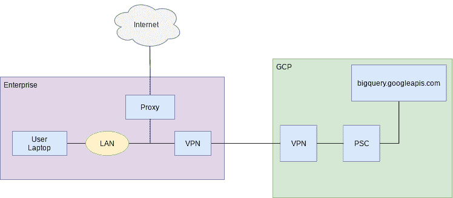
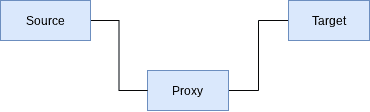
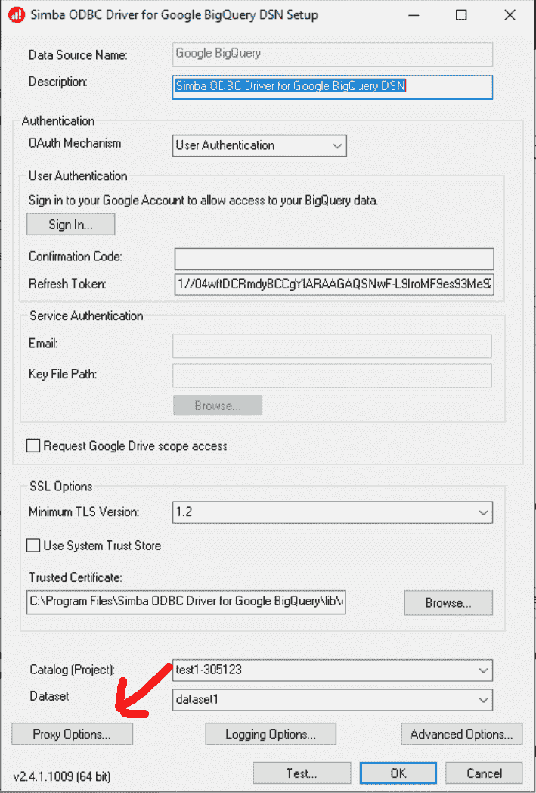
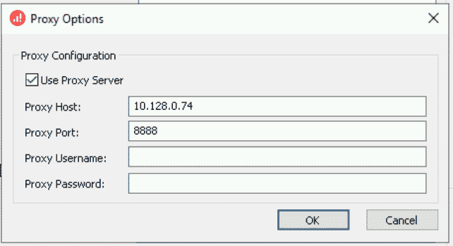
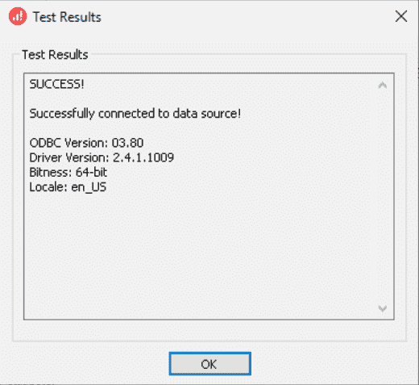

# ODBC、专用服务连接和代理

> 原文：<https://medium.com/google-cloud/odbc-private-service-connect-and-proxies-fe041077b867?source=collection_archive---------0----------------------->


最近，一个客户给了我一个难题。客户端有一个连接到 GCP 的本地网络，如下图所示。



客户网络上的笔记本电脑与局域网相连，当它们想访问互联网时，要通过一个出站代理服务器。内部网络也通过 VPN 连接到 GCP VPC，该配置了一个[私有服务连接](https://cloud.google.com/vpc/docs/private-service-connect) (PSC)实例，提供到 BigQuery 的路由，该路由不涉及互联网上的路由。客户端还使用 [VPC 服务控件](https://cloud.google.com/vpc-service-controls)到*来阻止*任何从互联网对 BigQuery 的访问，因为 BigQuery 数据库托管着极其敏感的数据。

在笔记本电脑上，客户端使用一个 SQL 应用程序，该应用程序使用 [Simba ODBC 驱动程序](https://cloud.google.com/bigquery/docs/reference/odbc-jdbc-drivers)访问 BigQuery。当客户端运行他们的应用程序时，它无法连接到 BigQuery。当我们检查这个难题时，我们发现 Simba ODBC 被硬编码为通过向`bigquery.googleapis.com`发送 HTTPS 请求来访问 BigQuery。由于该域名解析为公共 IP 地址，笔记本电脑通过内部代理向互联网发送出站请求。GCP 收到后拒绝了这一请求，因为它是通过因特网而不是通过 VPC 在国内发出的。这一限制是由 PSC 设置的。

我们想要实现的是将来自笔记本电脑的 BigQuery API 请求路由到 PSC 进行处理。我们考虑了许多方法。

第一个是编辑本地笔记本电脑上的 hosts 文件，将域名解析`bigquery.googleapis.com`指向 PSC 的 RFC 1918 IP 地址。这是可行的，但是要求用户编辑文件的工作量和风险被认为太高了。

第二种可能性是覆盖整个企业的 DNS 名称服务器配置，创建从`bigquery.googleapis.com`到 PSC 的 RFC 1918 地址的映射。再次，这是经过测试和工作，但有一些不愉快的副作用。Simba ODBC 文档要求映射:

*   bigquery.googleapis.com
*   bigquerystorage.googleapis.com
*   oauth2.googleapis.com
*   [www.googleapis.com](http://www.googleapis.com)
*   accounts.google.com

如果我们改变企业范围的 DNS 映射，那么我们实际上是要求**整个**企业中的所有**流量通过 PSC 为这些名称进行路由，这可能会产生比我们想要实现的更广泛的影响，而不仅仅是为了我们自己的 ODBC 使用。**

经过更深入的调查，一种新的方法出现了。Simba ODBC 驱动程序允许配置 HTTP 代理。这意味着，当驱动程序希望发出一个 API 请求(例如对 BigQuery)时，驱动程序将把请求发送给 HTTP 代理，HTTP 代理将代表驱动程序发出请求，而不是直接发出请求*。*

*我们可以形象地看到这一点。当源系统向目标系统发出 HTTP 请求时，源系统通常会直接发出请求。*

**

*当引入代理时，画面变为:*

**

*如前所述，源*认为*它正在向目标发送请求，但是请求被发送到代理，代理向前发送请求。代理可以选择改变*实际*路线的走向。这意味着代理可以将源*认为*正在发送给`bigquery.googleapis.com`的请求发送到其他地方。这样做的价值在于，不需要在源位置进行任何配置更改。*

*如果我们将它添加到我们的图中，我们现在可以看到在 GCP 中引入了一个代理，它成为 Simba ODBC 驱动程序的目标，该驱动程序知道将请求路由到 PSC。*

**

*这感觉像是一个优雅的解决方案。一个缺点是我们需要配置和管理代理。现在让我们浏览一个示例配置，看看它是如何工作的。*

1.  *在 IP 地址 10.1.0.1 创建专用服务连接定义。*
2.  *创建一个运行 Linux 的计算引擎，作为我们的代理。*
3.  *安装代理服务器。在我们的例子中，我们将使用 [tinyproxy](http://tinyproxy.github.io/) :*

```
*sudo apt-get install tinyproxy*
```

*4.编辑`/etc/tinyproxy/tinyproxy.conf`文件*

*加注释*

*`Allow 127.0.0.1`*

*变原注释为软件一部分*

*`Filter "/etc/tinyproxy/filter"`*

*变原注释为软件一部分*

*`FilterDefaultDeny Yes`*

*5.编辑`/etc/tinyproxy/filter`*

*指定我们希望允许的域名。所有其他域名将被阻止。这将确保没有恶意访问可以使用代理。*

```
*^bigquery\.googleapis\.com$
^oauth2\.googleapis\.com$*
```

*6.编辑`/etc/hosts`并更改:*

```
*10.1.0.1 bigquery.googleapis.com
10.1.0.1 oauth2.googleapis.com*
```

*这将导致这些域名的解析指向 10.1.0.1 的 PSC 条目。*

*7.停止 tinyproxy 以使更改生效。*

```
*sudo service tinyproxy stop*
```

*8.重新启动 tinyproxy 以启动服务请求。*

```
*sudo service tinyproxy start*
```

*9.在 Windows 机器上，打开 ODBC 定义并设置代理条目:*

**

*为`Proxy Host`指定计算引擎的 IP 地址，为`Proxy Port`指定 8888。*

**

*单击 test 按钮，我们应该会看到结果:*

**

*10.使用 ODBC SQL 工具查看表的内容，例如 [RazorSQL](https://razorsql.com/) 。*

***总结**:按照这个方法，我们已经展示了我们可以配置 Simba ODBC 驱动程序来使用我们已经安装在计算引擎上的 HTTP 代理。计算引擎上域名解析导致源自 Simba ODBC 的 API 调用被发送到私有服务连接 IP 地址，从而无需通过互联网且无需在托管 Simba ODBC 驱动程序的机器上“修补”DNS 名称就能得到满足。*