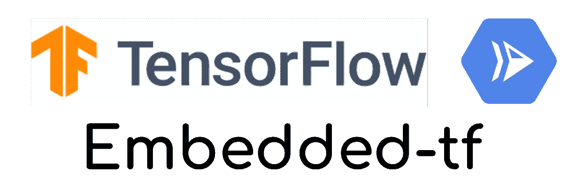

# 利用云运行和嵌入式 tf 进行按需小批量预测

> 原文：<https://medium.com/google-cloud/on-demand-small-batch-predictions-with-cloud-run-and-embedded-tf-469242d66c3b?source=collection_archive---------0----------------------->

机器学习是一个广阔的领域。大多数人都专注于训练、模型和超参数调整。然而，服务部分是重要的，因为没有它，所有之前做的工作都是无用的。

您可以**以在线或批处理模式**为您的模型提供服务，允许您这样做的无服务器产品或多或少会根据您的要求和您的使用案例进行调整(查看[我的演讲](https://www.youtube.com/watch?v=0x7gSuJ_Ugk))。

# 数百名训练有素的模特

对于我的使用案例，我们有一个独特的 Tensorflow 模型来计算建筑物的能源效率，但每个站点都有一个培训工作，因为**我们没有足够的培训数据来对所有不同的情况进行通用培训**。

该项目始于 2 年前，今天，**我们有超过 500 个不同的受训模型，预计在未来 12 个月内将达到 3000 个**。预测数据每天生成一次，团队要求我在以下方面提供帮助:

> 如何高效地托管和服务所有这些模型？

*当然，而* ***限制了对现有项目*** *的影响。*

# 一个大查询 ML 解决方案

输入数据已经存储在 BigQuery 中，模型是用 Tensorflow 编写的。第一个想法是在[**big query ML**](https://cloud.google.com/bigquery-ml/docs/bigqueryml-intro)**上**主持模特。****

这是正确的解决方案，但在我们的环境中有两个问题:

*   **BigQuery ML 允许** [**每天只创建 1000 个模型**](https://cloud.google.com/bigquery-ml/quotas) 。几个月后，根据我们的业务预测，不可能部署所有(重新)训练的模型。
*   **BigQuery ML 对现有项目的影响很多** :
    **1 .**训练结束后，将训练好的模型存入 GCS。对于批量预测工作来说，这已经足够了。
    使用 BigQuery ML，训练后的模型必须在训练后加载到 BigQuery ML 中。
    **2。**为了启动批量预测作业，执行 API 调用。
    与 BigQuery ML 一样，这个调用被改变为执行了一个查询*(微小的改变)。*
    **3。**流程的其余部分使用以 JSON 行格式存储在 GCS 文件中的预测。
    使用 BigQuery ML，预测结果可以存储:
    -存储在表格中(带有 *insert select* 请求)，然后导出到 GCS。
    -或者在查询执行后直接存储在 GCS 上的文件中。
    在这两种情况下，文件格式必须与现有格式相同。

*让我们寻找另一种方式。*

# 人工智能平台解决方案

[**AI 平台**](https://cloud.google.com/ai-platform) **是围绕 ML 和 AI 的一套工具、组件和服务。**您托管了笔记本、数据准备组件、培训服务、优化器、(…)以及在线或批处理模式的预测服务。

## 在线预测

[在线预测](https://cloud.google.com/ai-platform/prediction/docs/online-predict)是可能的，因为**每次预测的数据量很低**。在线请求不会打破每个查询的配额和大小限制。

然而， **AI 平台有** [**在线模式**](https://cloud.google.com/ai-platform/training/docs/quotas#resource_quotas) **部署的 100 个模型的限制。**

## 批量预测

[批量预测](https://cloud.google.com/ai-platform/prediction/docs/batch-predict)没有这个限制，因为每一个只为自己的工作创建预测环境，然后全部破坏并停止。

这里又有一个限制:**只能并行执行 25 个预测作业**(在文档中找不到*参考)。*

2 年前，BigQuery ML 才刚刚起步，负责项目的团队**选择了批量预测模式**。每天晚上，一个进程创建所有的批量预测作业。当达到 25 的限制时，AI 平台会返回一个`429` HTTP 错误代码，表示超过了配额。**进程等待一段时间，稍后再次尝试，希望之前的任务已经完成。**

开始时它工作得很好，但是现在，随着每晚超过 500 批(以及更多即将到来的)每批约 6 分钟的预测作业，**持续时间成为一个问题。**团队寻找另一种经济实惠的解决方案。

# 面向所有人的云计算

我已经写了一篇关于使用 Cloud Run 和 Tensorflow 的文章。当前的问题类似，我选择**让我的初始解决方案更加模块化和动态化**。

云运行的强大来自于容器的灵活性。你可以在里面做你想做的事情。

*   安装二进制文件和系统库
*   运行/终止多个进程
*   存储本地文件

…只有一些限制:

*   **容器必须响应 HTTP 请求**，实例只有在处理请求时**才是活动的。因为实例的 vCPU 在其余时间是空闲的，**您不能执行请求处理之外的处理**。**
*   **容器必须是无状态的**:您可以将本地文件存储在内存文件系统中，但是**当实例停止时，文件就会丢失。**
    **你也不能储存大于允许内存的文件。**

# 封装 Tensorflow 服务器

由于这种灵活性， [**我开发了 *Embedded-tf***](https://github.com/guillaumeblaquiere/embedded-tf) ，一个 Go 服务器，它执行以下步骤:

*   **从 GCS 桶本地下载模型**
*   **用加载的模型启动 Tensorflow 服务器**
*   对于每个输入文件

1.  **下载内存中的输入文件**
2.  **将输入文件**格式化为 Tensorflow 服务器期望的 JSON 格式
3.  **执行预测**并在主体中设置响应
4.  **将正文中的响应**格式化为 JSON 行输出
5.  **将输出**上传到铲斗/路径输出

*   **关闭 Tensorflow 服务器**并清理本地数据

*输出文件层次遵循输入文件层次*

您只需将 Embedded-tf 容器部署到 Cloud Run，并使用 3 个查询参数调用它。这些参数[与 AI 平台批量预测](https://cloud.google.com/ai-platform/prediction/docs/batch-predict#configuring_a_batch_prediction_job)作业预期的参数相同。

*   **模型**:模型的 GCS 位置。*相当于 ModelURI*
*   **输入**:带有预测输入数据的文件的 GCS 位置。*相当于输入路径*
*   **输出**:存储带有预测的输出文件的 GCS 位置。*相当于输出路径*

**输入输出文件也是 AI 平台批量预测预期的 JSON 格式**(暂时*只支持 JSON*)。

有了这些参数和内容一致性，**对现有项目的影响很小:**只有 API 调用需要更改，数据和参数都不需要更改。

## 权衡和限制

然而，使用云运行管理平台带来了一些约束和限制。

**资源限制** 托管云运行资源有限。你只有 **1 或 2 个 vCPU** ，没有定制硬件(GPU，TPU)和最大 2Gb 的内存**。**

因此，**内存占用是一个问题**:

*   模型文件存储在 **`/tmp `目录(内存文件系统)**。
*   输入和输出文件内容**在内存**中保持不变。
*   应用程序**(Go web 服务器)和为请求服务的短暂 Tensorflow 服务器**也会对内存产生影响。

总数**不能超过实例**上允许的内存。

*我已经为逐个处理输入文件进行了优化，结果是不能同时处理一个以上的输入文件。但是，如果* ***您有大型模型或输入，或者如果您的模型使用大量内存和/或 GPU，Embedded-tf 可能不适合您*** *在托管云上运行* ***。***

**并发**
从设计上来说， **Embedded-tf 是** **当时只能处理一个请求(因而是 1 个模型)**，特别是对于限制内存的问题。

[在 Cloud Run 上部署服务时，将](https://cloud.google.com/run/docs/configuring/concurrency#command-line) `[concurrency](https://cloud.google.com/run/docs/configuring/concurrency#command-line)` [参数设置为 1](https://cloud.google.com/run/docs/configuring/concurrency#command-line) 。

# 不限型号

现在，Embedded-tf 允许团队执行**批量预测，而无需提供或部署**。模型是在短暂的 Tensorflow 服务器上即时下载和加载的！

除了这种灵活性，因为我们的数据量是可以接受的，处理时间更短。只有几秒钟**而不是平均 6 分钟**。的确，有了 AI 平台批处理，所有的环境都必须被创建和破坏。在这里，不再是这种情况，而是一个**动态加载，并从云运行的强大功能开始。**

总之，**处理更平滑，预测更快，因此成本更低**！这一切没有以前的限制，对现有项目影响很小！

你呢？你的用例符合 E [mbedded-tf](https://github.com/guillaumeblaquiere/embedded-tf) 吗？如果是这样，请在评论中告诉我。如果没有，打开一个问题，我们将讨论如何最好地解决它！