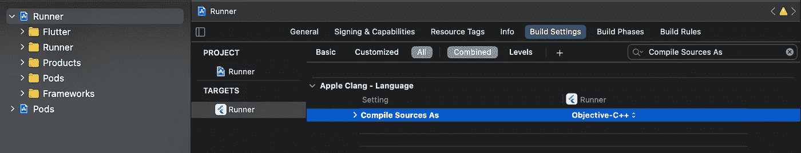

# 设备上的机器学习:在你的 Flutter 应用中训练和运行 TensorFlow Lite 模型

> 原文：<https://medium.com/google-cloud/on-device-machine-learning-train-and-run-tensorflow-lite-models-in-your-flutter-apps-15ea796e5ad4?source=collection_archive---------0----------------------->

## 使用 TensorFlow 和 Keras 中的深度迁移学习构建、训练和运行图像分类器神经网络


[卡斯珀](https://unsplash.com/@casparrubin)在 [Unsplash](https://unsplash.com/?utm_source=medium&utm_medium=referral) 上的照片

> 注意:在我写这篇文章的时候，Python 的最新版本是 3.9。但是，Tensorflow 目前只兼容 Python 版本 3.5–3.8。如果你有一个不兼容的 Python 版本，并且不想降级，你可以使用 [Google Colab](https://colab.research.google.com/) ，这是一个基于云的免费在线 Jupyter 笔记本环境。

## 本文将分为 2 个模块:

*   **训练**一个使用迁移学习的卷积神经网络能够`***detect thirty plus different types of Fruits and Vegetables***`。
*   创建 Flutter UI 并导入。tflite 文件到项目中，然后测试它并修复可能的错误。

# 模块 1:使用 TensorFlow 和 Keras 训练神经网络

**什么是 Tensorflow？** → TensorFlow 是一个开源库，可以训练和运行深度神经网络(这是一系列机器学习和深度学习)，用于图像识别、单词嵌入、自然语言处理等。下载→[https://www.tensorflow.org/install](https://www.tensorflow.org/install)


到本文结束时，你将能够制作这个应用程序并在你的手机上运行

> 首先下载包含所有图像的**数据集**。**我们的神经网络将从这些图像中训练、学习和验证**。你可以从 kaggle.com 点击 [**这里**](https://www.kaggle.com/kritikseth/fruit-and-vegetable-image-recognition) 下载我要用的那个。然后提取。zip 文件和**在**同一个目录**下创建一个 Python Jupyter 笔记本**。

> 可以从我的 GitHub Repo→[https://git.io/JLhpv](https://git.io/JLhpv)中找到并克隆完整的项目供个人使用
> 
> **开始编程吧(Python Jupyter 笔记本):**

代码单元格 1(导入模块)

*   `**os**`模块将为我们提供**函数**，用于读取目录内容和写入目录。
*   将`**base_dir**` 变量设置为包含训练图像的数据集的位置。


代码单元 2(预处理，我们准备原始数据以适合构建和训练模型)

*   `**IMAGE_SIZE = 224**` →我们要将数据集中的图像设置为的图像尺寸。
*   `**BATCH_SIZE = 64**` →我们一次输入神经网络的图像数量。
*   `**rescale=1./255**` 减小文件大小，减少训练时间。
*   数据集有一个测试集和一个训练集。验证集通常用于验证我们的神经网络，为我们提供神经网络表现如何的准确性度量。所以对于`**validation_split=0.2**`，我们告诉 Keras 用 20%进行验证，80%进行培训
*   然后我们有两个生成器(`**train_generator**`和`**val_generator**`)，它们获取目录&的路径，生成批量的扩充数据，在这种情况下给出输出:*找到属于 36 个类的 2872 个图像，找到属于 36 个类的 709 个图像。*


代码单元格 3(创建一个包含所有标签的 labels.txt 文件)

*   打印数据集的所有键和类(标签),重新检查是否一切正常。
*   旋舞需要两个文件:***labels . txt****和****model . tflite****。*
*   代码中的`**‘w’**`创建一个名为***labels . txt****的新文件，该文件具有标签*，如果已经存在，则覆盖它。


代码单元 3 的输出

既然我们已经成功地预处理了原始数据，**是时候开始使用迁移学习来构建我们实际的神经网络了**。


图片作者:Yashwardhan Deshmukh

**迁移学习→** 它是一种机器学习方法，我们**在已经预先训练好的神经网络的基础上构建一个神经网络。**

基本上，神经网络已经在一些其他任务上受过训练，因此它有助于更有效地理解第二项任务的模式。你可以把它想象成教一个新生的孩子(传统的数学学习)和一个成年人(迁移学习)。

在这里，我们将使用 [**MobileNetV2**](https://ai.googleblog.com/2018/04/mobilenetv2-next-generation-of-on.html) ，这是一个预训练的 CNN(卷积神经网络)架构，可以很好地执行设备上的机器学习，可以预测多达 80 个不同的类别。


代码单元 4(创建迁移学习的基础模型)

*   我们从抓取 MobileNetV2 开始。
*   由于我们不想重新训练预训练的 CNN，而是添加到它上面，所以使用了`**include_top=False**` →这将冻结所有权重，在这种情况下，用于进行预测的模型的全连接输出层不会被加载，从而允许添加和训练新的输出层。


代码单元格 5(向 NN 添加层)

*   `**base_model.trainable=False**` → 冻结我们基础模型的所有神经元。
*   神经网络在一系列层中起作用，因此现在我们将添加我们自己的层:

1.  `**Conv2D**`是一个 2D 卷积层，它创建了一个卷积核，这是一个带有层输入的风，有助于产生输出张量。基本上，它试图理解图像的模式。`[*‘relu’*](https://keras.io/api/layers/activations/#relu-function)` 代表整流线性单元激活功能。
2.  `**Dropout**` 层防止神经网络**过拟合**，即过于精确到神经网络只能识别数据集中存在的图像而不能识别其他图像的程度。
3.  `**GlobalAveragePooling2D**` 层计算上一层各特征图的平均输出，从而大幅减少数据，为最后一层做模型准备。
4.  层是深度连接的层，其中每个神经元接收来自其前一层的所有神经元的输入。*'****36 '***这里代表班级的人数。`[*‘softmax’*](https://keras.io/api/layers/activations/#softmax-function)`将实数向量转换为分类概率向量。


代码单元 6(在离开模型进行训练之前编译模型)

*   我们使用`**model.compile**` **→** ，其中定义了损失函数、优化器和度量，因为需要一个**编译的模型**来训练(因为训练使用损失函数和优化器)。
*   我们将使用`**Adam**`，它是一个流行的优化器，专门为训练深度神经网络而设计。


代码单元 7(训练！)

*   `**epochs**` →学习算法迭代并遍历整个训练数据集的次数。数值越高，神经网络越精确，但是……数值太高会导致 ***过拟合*** ，即过于精确，以至于神经网络只能识别数据集中存在的图像，而不能识别其他图像。


代码单元 7 的输出(训练过程，需要一些时间，去做瑜伽)


代码单元 8(将训练好的神经网络转换成 Tensorflow Lite 文件)

*   `**saved_model_dir = ‘’**` **→** 其中“”表示当前目录。
*   `**tf.saved_model.save(model, saved_model_dir)**`→保存到当前目录。
*   接下来的两行**将我们的模型转换成. tflite 模型，**由 flutter 用于设备上的 ML。
*   最后，我们将转换后的模型写入目录，**为二进制**所以添加`***‘wb’***` 而不是仅仅`***‘w’***` ***。***
*   如果您使用的是 Google Colab，请将其添加为额外的代码单元格:

```
#use these codes to download files locally if using google colab
from google.colab import files
files.download(‘model.tflite’)
files.download(‘labels.txt’)
```

现在我们已经有了***‘model . tflite’***和***‘labels . txt’***文件，我们可以将它们导入到一个 Flutter 项目中了！如果你不知何故搞砸了，你可以从我的 GitHub Repo 的 assets 文件夹下载这些文件→【https://git.io/JLhpv 

# 模块 2:在 Flutter 应用程序中导入和使用 model.tflite。

转到' *Visual Studio 代码>视图>命令调色板> Flutter 新应用程序项目'*或者直接转到终端，导航到目录，然后键入'`flutter create project_name` *'*

接下来，转到*‘pub spec . YAML’，添加以下依赖项，并保存:*

```
dependencies:
  flutter:
    sdk: flutter
  **tflite:** ^1.1.1
  **image_picker:** ^0.6.7+4
```

> 为了使 tflite 能够工作*，在* `*android/app/build.gradle*` *中，在* `*android*` *块中添加以下设置。*

```
aaptOptions {
        noCompress 'tflite'
        noCompress 'lite'
    }
```

> 为了使 image_picker 工作，在 `*/ios/Runner/Info.plist*` *中的*，添加以下内容到您的* `*Info.plist*` *文件中。**

```
<key>NSCameraUsageDescription</key>
<string>Need Camera Access</string>
<key>NSMicrophoneUsageDescription</key>
<string>Need Microphone Access</string>
<key>NSPhotoLibraryUsageDescription</key>
<string>Need Photo Accesss</string>
```

现在是时候创建一个简单的应用程序了，它显示用户的图像和预测，如下所示:


它也预测香蕉？！

*   在' *main.dart* '文件中，返回带有参数 *home: Home()，*的 MaterialApp
*   然后创建一个新的“ *home.dart* ”文件，该文件具有有状态类 home()。这将是我们的主页。**让我们开始制作功能性的颤振 App:**


假设您已经导入了素材、tflite、image_picker 和 dart:io

`***_loading***` →用于检查是否选择了图像，`**_image**` →选择的图像，`**_output**` →预测完成，`**picker**` →允许我们从图库或摄像机中选择图像。

接下来，我们将为这个类编写 6 种不同的方法:


前两种方法

*   *前 2 种方法:*

1.  `**initState()**` →这是*第一个方法*，当创建 Home 小部件时调用，即启动应用程序并导航到 Home()，在实际构建小部件本身之前，initState()函数内的任何内容都将首先被调用或初始化，小部件稍后构建。在这种情况下，我们将使用 *loadModel()，*加载我们的模型，这是稍后将编写的另一个方法。之后，我们将传入一个值。
2.  `**dispose()**` **→** 这种方法处理和清除我们的记忆。


最后 4 种方法

*   *最后 4 种方法:*

3.`**classifyImage()**` →该方法对图像运行分类模型。 *numResults* 是我们拥有的类的数量，然后添加 setState 来保存更改。

4.`**loadModel()**` →这个函数将加载我们的模型，因此我们将它放在 *initS* 方法中。

5.`**pickImage()**` →该功能用于从相机中抓取图像。

6.`**pickGalleryImage()**` →该功能用于从用户图库中抓取图像。

## **扑 UI 时间！**

> 这部分代码是基本的 UI。对于那些了解它如何工作的人可以跳过它，自己写！


用户界面的第一部分

首先，我们必须制作**应用程序栏**，然后制作保存图像的**容器**。在这里，我们将使用**三元运算符** ( `condition **?** true statement **:** false statement`)到**来显示一个图像和一个文本小部件，前提是 _loading 设置为 true，_output 设置为 not null** ，否则我们将显示一个空白容器。

```
 @override
  Widget build(BuildContext context) {
    return Scaffold(
      appBar: AppBar(
        backgroundColor: Colors.black,
        title: Text(
          **'Fruits and Veggies Neural Network'**,
          style: TextStyle(
              color: Colors.white,
              fontWeight: FontWeight.w200,
              fontSize: 20,
              letterSpacing: 0.8),
        ),),
```

> 那是 AppBar。现在让我们制作一个容器来保存用户选择的图像！

```
 body: Container(
        color: Colors.black.withOpacity(0.9),
        padding: EdgeInsets.symmetric(horizontal: 35, vertical: 50),
        child: Container(
          alignment: Alignment.center,
          padding: EdgeInsets.all(30),
          decoration: BoxDecoration(
            color: Color(0xFF2A363B),
            borderRadius: BorderRadius.circular(30),
          ),
          child: Column(
            mainAxisAlignment: MainAxisAlignment.center,
            children: [
              Container(
                child: Center(
                 ** child: _loading == true
                      ? null** **//show nothing if no picture selected**
                      : Container(
                          child: Column(
                            children: [
                              Container(
                                height: 250, width: 250,
                                child: ClipRRect( 
```

> ClipRRect 用于为图像提供圆形边框。

```
 borderRadius:
                                  BorderRadius.circular(30),
                                  **child:** **Image.file(
                                    _image,**
                                    fit: BoxFit.fill,
                                  ),),),
                              Divider(
                                height: 25,thickness: 1,
                              ),
                            **  _output != null
                                  ? Text(**
                                     ** 'The object is: ${_output[0]
                                                      ['label']}!',**
                                      style: TextStyle(
                                          color: Colors.white,
                                          fontSize: 18,
                                          fontWeight:
                                          FontWeight.w400),
                                    )
                                  **: Container(),**
                              Divider(
                                height: 25,
                                thickness: 1,
                              ),],),),),),
                                                      //code contd..
```

接下来，我们制作两个手势检测器，它们分别引用 pickImage 和 pickGalleryImage 函数。

> 注意:`onTap`里面的`pickImage`(不带括号)是一个函数引用，基本意思是不立即执行，是在用户点击特定的 widget 之后执行。(回拨)
> 
> `pickImage()`是一个函数调用，它被立即执行。


UI 的第二部分，手势检测器！

```
 Container(
                child: Column(
                  children: [
                    GestureDetector(
                      **onTap: pickImage,** //no parenthesis
                      child: Container(
                        width: 
                        MediaQuery.of(context).size.width - 200,
                        alignment: Alignment.center,
                        padding:
                        EdgeInsets.symmetric(horizontal: 24,
                                             vertical: 17),
                        decoration: BoxDecoration(
                            color: Colors.blueGrey[600],
                            borderRadius:
                            BorderRadius.circular(15)),
                        child: Text(
                          **'Take A Photo'**,
                          style: TextStyle(color: Colors.white,
                                           fontSize: 16),
                        ),),),
                    SizedBox(
                      height: 30,
                    ),
                    GestureDetector(
                      **onTap: pickGalleryImage,** //no parenthesis
                      child: Container(
                        width: 
                        MediaQuery.of(context).size.width - 200,
                        alignment: Alignment.center,
                        padding:
                        EdgeInsets.symmetric(horizontal: 24,
                                             vertical: 17),
                        decoration: BoxDecoration(
                            color: Colors.blueGrey[600],
                            borderRadius:
                            BorderRadius.circular(15)),
                        child: Text(
                          **'Pick From Gallery',**
                          style: TextStyle(color: Colors.white,
                                                  fontSize: 16),
                        ),),),],),),],),),),);}}
```

*搞定！现在保存并在模拟器或真实手机上运行它！*

自己测试一下；每当从相机胶卷中选择或实时点击一张类似神经网络已经学习过的任何类别的图像时，应用程序都应该输出结果！

> 这只是深度学习的一个非常基本的用途。它真的向我们展示了人工神经网络对人类来说是多么大的福气，如果掌握了它，人类就可以实现从未想象过的事情……也许有一天会有飞行服或汽车？

# 调试时间！

> **一些常见的错误(包括我个人遇到的)，以及如何修复:**

1.  `**‘Lexical or Preprocessor Issue ‘…’ file not found’**`
2.  `**‘IOS Xcode Build error : ‘metal_delegate.h’ file not found’**`
3.  `**‘vector’ file not found**`
4.  `**‘tensorflow/lite/kernels/register.h’ file not found**`

在我写这篇文章的时候，这些错误在尝试使用 Xcode 在 iOS 设备上签名和构建应用程序时非常常见。

> **修复:**

1.  导航到`project_file/ios`，用任意文本编辑器打开`podfile.lock`，将 TensorFlowLiteC 的值设置为(2.2.0)，如下所示


文字编辑器

2.然后启动*终端*并键入以下内容:

```
cd project_directory_here/
cd ios/
pod install
```


终端输出

3.最后，进入`project_file/ios`文件夹，在 Xcode 中启动`Runner.xcworkspace`，然后是`click Runner > Targets > Runner > Build Settings, search Compile Sources As, change the value to Objective-C++`



这应该可以修复没有找到的“矢量”文件

> 要修复第四个错误，请从 Xcode 的 errors 部分显示的`TflitePlugin.mm`文件中取消对`//#define CONTRIB_PATH`的注释。

> 感谢阅读，我希望你学到了一些东西！任何意见、疑问或建议对我来说都是非常有价值的。
> 
> [*GitHub*](https://github.com/yaashwardhan)