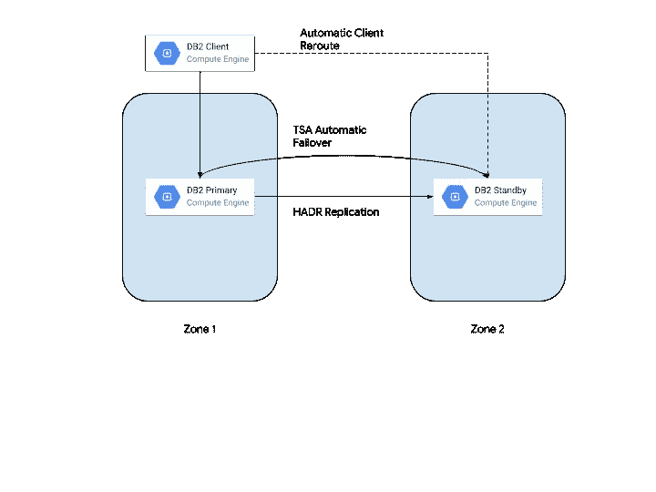

# 1 小时迁移#2:让您的高可用性 DB2 主备用部署适应 GCP 的工作环境

> 原文：<https://medium.com/google-cloud/one-hour-migrations-2-adapting-your-highly-available-db2-primary-standby-deployment-to-work-in-c51a19c23c8?source=collection_archive---------0----------------------->

也称为:带有 TSA、HADR 和 ACR 的 HA DB2，或者用英语说:

*   高可用性:高可用性
*   TSA: Tivoli 系统自动化
*   HADR:高可用性灾难恢复(IBM)
*   ACR:自动客户端重新路由

## 谁会觉得这有用

考虑在 GCP 上部署高可用性 DB2 实例的人。

## 挑战

假设您有一个高可用性、HADR 配置的本地 DB2 实例，它利用 TSA 实现故障转移。您希望将它们迁移到云中。轻松点。或者是？以下是一些需要考虑的事情:

1.  在偶数个服务器的情况下，TSA 可以使用三种方法来确定“平局决胜”，即哪个实例现在应该是主实例。存储平局决胜在云中可能会成为问题，因为所有实例都需要读写访问。IBM 还提供了一个云决胜器，它不支持 GCP(到目前为止也仅限于 2 个实例)。这让我们把网络决胜局作为剩下的选择。
2.  在云中，虚拟 IP 地址实际上…毫无意义。如果您将 TSA 配置为在发生故障转移时获取虚拟 IP，这可能会在内部产生很好的效果，但云网络基础架构以神秘的方式移动，不会适应这种情况。

## 解决方案？

下图描述了 GCP 上的一个示例解决方案架构:

1.  为网络平局决胜配置您的 TSA，因为云和存储平局决胜不适用。
2.  虚拟 IP 的云替代方案:您可以考虑在 HADR 中插入有趣的脚本，这些脚本将在发生故障转移时调用 GCP api，而不是拉出虚拟 IP。也许您可以使用别名 IP 并将其移动到主实例。理论上听起来不错，但不能保证它在某些灾难情况下会有效(这正是我们在这里试图克服的)。也许是控制负载平衡器的某种方法？这带来了一系列不可预测的行为、竞争条件和一个未解决的问题，即如何向负载均衡器发出信号，表明实例准备好了(即主实例)还是没有准备好(即从实例)。此外，最重要的是，据我所知，IBM 可能不会对您可能遇到的行为和问题负责。
3.  幸运的是，IBM 提供了 ACR(自动客户端重新路由)。这意味着 DB2 实例可以“告诉”客户机集群中的其他实例，当发生故障转移时，客户机可以自动连接到其他实例。这是 DB2 服务器上的一个配置。
4.  我们可以超越 ACR DB2 服务器端设置。为什么？让我们想象以下场景。所有客户机都知道如何连接到主服务器地址，事实上，它们在连接时也会收到备用服务器的地址。如果您的主服务器故障切换到备用服务器，然后您启动一个新的客户端。该客户端可能被配置为连接到主地址。在这种情况下，客户端将无法连接，因为该地址不可达。您可以将客户端配置为知道服务器，并且它不需要从主服务器获取地址。(查一个例子:[https://www . IBM . com/support/knowledge center/en/SSE pgg _ 10 . 1 . 0/com . IBM . DB2 . luw . apdv . CLI . doc/doc/c 0056196 . html](https://www.ibm.com/support/knowledgecenter/en/SSEPGG_10.1.0/com.ibm.db2.luw.apdv.cli.doc/doc/c0056196.html))

## 结论

我希望这对管理 DB2 部署和考虑迁移到云(特别是 GCP)的专业人员有用。像往常一样，考虑您的选项、要求和限制，以了解什么解决方案可能适合您和您的组织。我计划在不久的将来有一个关于 cloud.google.com/solutions[的更详细的官方解决方案文档。](http://cloud.google.com/solutions)