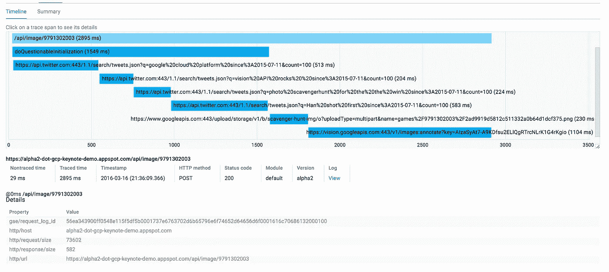

# 用照片寻宝游戏绕着谷歌云平台跑一圈

> 原文：<https://medium.com/google-cloud/one-lap-around-google-cloud-platform-with-photo-scavenger-hunt-ca0487b620d3?source=collection_archive---------4----------------------->

在最近的一次黑客马拉松上，我们一小群人写了[照片寻宝游戏](https://play.google.com/store/apps/details?id=com.bradabrams.photoscavengerhunt&hl=en)——一个简单的手机游戏，它给你四条线索，你必须拍照才能匹配。线索越难，分数越高。

在 [GCP NEXT](https://cloudplatformonline.com/NEXT2016.html) 今天，我们有机会演示如何构建、部署、扩展和诊断托管在 [App Engin](http://cloud.google.com/appengine/) e 上的这款应用的服务器端

服务器非常简单。用 [nodejs](http://cloud.google.com/nodejs/) 编写的 [App Engine](https://cloud.google.com/appengine/) frontend，将线索存储在一个 mongoDB 中，当然还会使用 [Vision API](https://cloud.google.com/vision/) 自动检查图像以寻找匹配的线索。

代码非常简单。我们使用 [gcloud-node 库](https://github.com/GoogleCloudPlatform/gcloud-node)来存储上传到[云存储](https://cloud.google.com/storage/)中的图像(第 6 行)。

接下来，我们使用[视觉 API](https://cloud.google.com/vision/) 获取上传图像中的**事物**列表。当我们在那里时，我们确认没有不良图像。

现在让我们用一个可爱的图像从命令行运行它

这里我们看到，Vision API 正确地找到了浣熊(置信度为 94.3%)。顺便说一句，出于好奇，貉科是浣熊、长毛象、金龟子和棕熊的一个家族。

现在我们只需要将这个应用程序部署到服务器上。这可能是一个复杂的过程，包括启动机器、确定操作系统、数据库、负载平衡器、安全组等。

但是 App Engine 只允许我编码，所以我所要做的就是 gcloud 应用部署

幕后发生的事情是我们把源代码推到 GCP。这是标准的应用引擎。

但真正强大和新颖的是，对于我们最新的语言——NodeJS、Ruby、Java 8 和其他语言——它也被打包成 docker 容器，并在部署之前存储在私有的 [Google 容器注册表](https://cloud.google.com/container-registry/)中。

我甚至不用在我的机器上安装 docker 就能做到这一点！

不仅如此，我们构建的容器化应用程序可以部署在容器生态系统中的任何地方:在我们的云中或内部。当然也可以由 Kubernetes 来编排！

这使得应用引擎开发者成为容器世界中的一流参与者。

让我们转到已经在我们的云项目中运行的负载测试虚拟机。通过内置在[云控制台](https://console.cloud.google.com)中的搜索，很容易找到虚拟机。

我们现在只需在浏览器中单击右键，就可以 SSH 到机器中。没有容易被猜到的密码，没有钥匙留在你的机器周围，只是从浏览器快速无缝访问。

当 loadgen 脚本运行时，让我们检查一下我们上传的图像。如您所知，我们将其存储在云存储中。我们只需导航到云控制台中的存储部分，就会看到…哦，不，权限被拒绝。

我当然没有许可。我作为开发者登录到这里。作为开发人员，我不需要访问生产数据——上传的用户图片。这是 [Cloud IAM](https://cloud.google.com/iam/) 的一个功能——一个强大的功能，它让管理员可以精细地控制谁可以访问 GCP 的哪些资源。

幸运的是，我在这个窗口中以管理员身份登录，所以我可以授予 Greg 读取图像的开发人员权限。

现在，当涉及到我的项目的安全性时，我是偏执狂，所以我想验证我做得是否正确。作为管理员，我可以使用 Activity Stream 来查看项目中的所有变更——便于跟踪生产问题或法规遵从性问题。您可以使用活动流全面审计项目中的活动。

现在，作为开发人员，我可以看到云存储中的图像。这是我们之前拍摄的一只可爱的小河马。

现在让我们看看加载脚本是如何进行的。在 App Engine 部分，我们可以看到每秒请求数的峰值。

但是我想知道我们现在有多少个虚拟机..负载平衡器运行得如何？我可以看一些图表，但是作为一名开发人员，我喜欢直接从命令行进行更多的控制。

点击云壳图标，我可以访问一个免费的，持久的机器。预配置了所有最新的工具，已经过验证并且是最新的，当然，从浏览器的任何地方都可以访问。

你只需要一个浏览器。

我可以用它来列出所有正在加速的实例。鉴于这是一个全功能的 linux 机器，我可以用很酷的方式来 grep 和格式化这些数据。在这里，您可以看到实例的数量在增加。

看起来我从[堆栈驱动错误报告](https://cloud.google.com/error-reporting/)中得到一个错误。让我们来看看是什么导致了这个错误。

您可以看到，在我刚刚部署的应用程序的 alpha2 版本上，错误刚刚开始发生，但它已经发生了很多次。“错误:超出 twitter 速率限制”。似乎是我应该处理的事情。

错误报告是我们今天推出的一项新服务，它收集项目中所有服务的所有错误，并进行高级分组和频率分析，以仅向您显示最相关的服务器错误和一些诊断信息(堆栈跟踪、日志),从而帮助跟踪根本原因**。**

看起来这是唯一一个新的，但我们真的应该以后再看看其他的。

在这种情况下，正确的做法是先回滚，然后再问问题。我们知道我推送的版本有问题，所以让我们回滚到一个已知的良好状态。App Engine 使路由所有流量变得简单。

但现在我想知道这里到底发生了什么。我们的 Alpha1 看起来工作正常，但是 Alpha2 出现了错误。让我们使用 [Stackdriver Trace](https://cloud.google.com/trace/) 来比较每个 RPC，看看有什么不同。

[Stackdriver Trace](https://cloud.google.com/trace/) 是一个分布式跟踪工具，可以帮助你精确地跟踪你的服务器时间被用在了哪里。您可以在这个跟踪报告页面中看到，我们新的“错误”版本 Alpha2(用橙色标记为 B)也有更长的延迟。

如果我们从 99%中检查其中一个样本跟踪，我们会看到对 vision API 的调用，以及在此之前对 GCS 的调用——这很有意义，我们编写了这些调用，但是所有这些对 twitter 的调用是什么呢……哦，它们是 doQuestionableInitialization()的一部分。

方法！我知道我应该对此有所怀疑。您会记得我们最初的代码是这样的:

所以 doQuestionableInitialization()代码对 twitter 进行了一些虚假调用。虽然你不希望错误发生，但 Goole 云平台让我们可以轻松处理这种错误。我们能够:

> —发现此问题并通过错误报告获得警报
> —使用应用引擎版本立即回滚我们的更改
> —通过跟踪找到根本原因

我希望绕着谷歌云平台快速跑了一圈，让你有了在自己的应用上尝试一下的欲望！在 https://cloud.google.com 获得 300 美元的免费试用。

如果您有任何问题或意见，请告诉我。