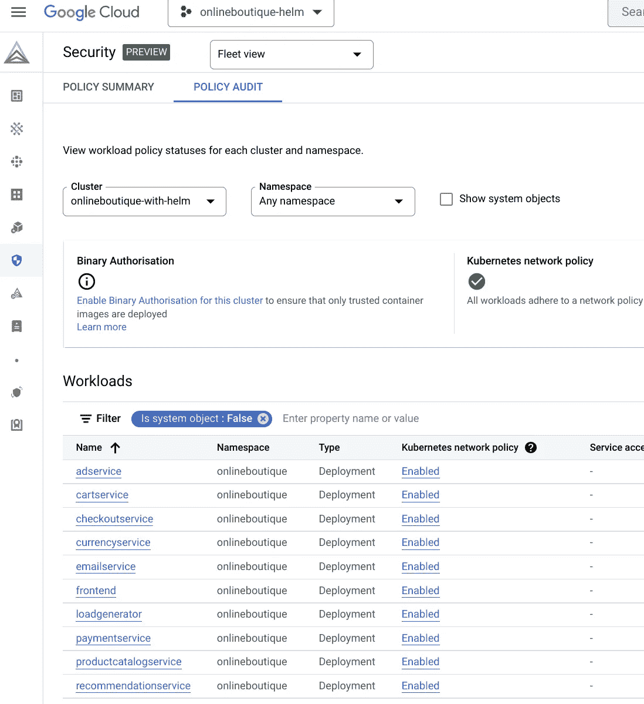
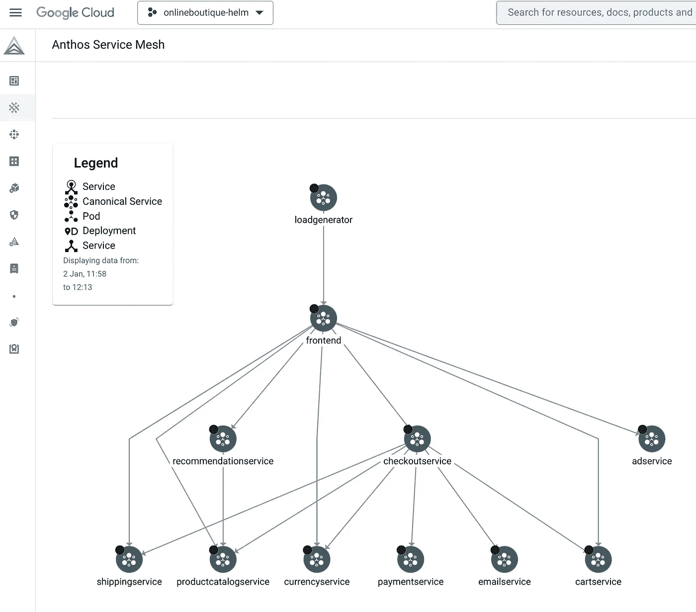
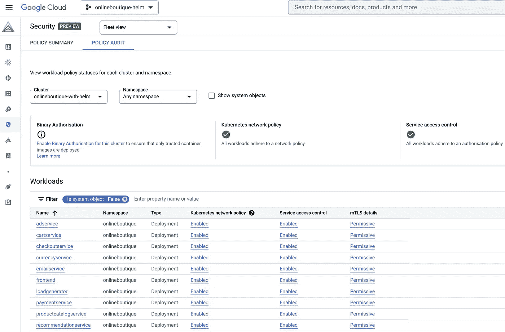
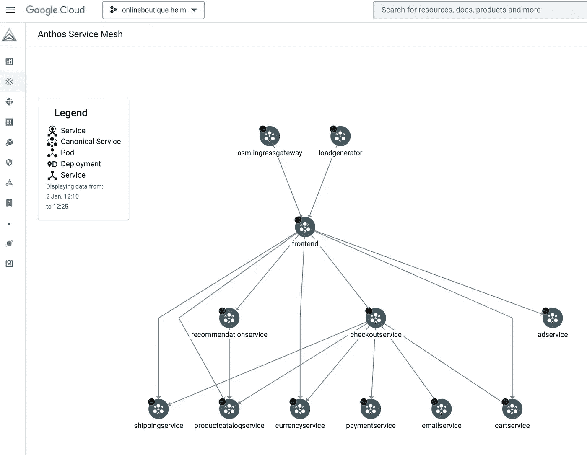
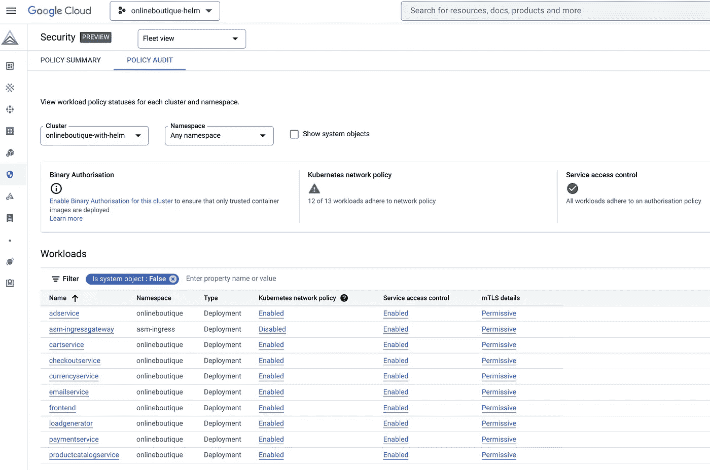
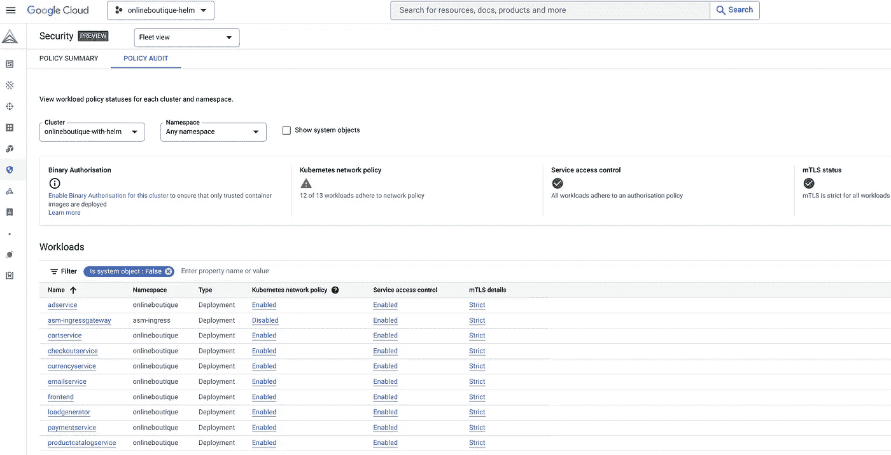
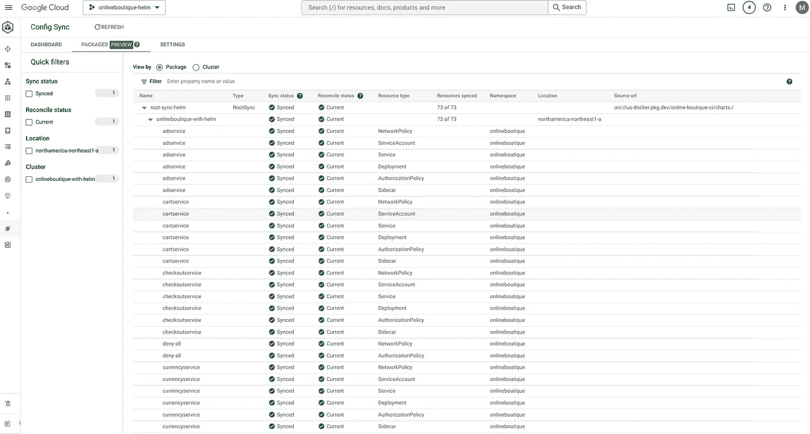

# 使用 Helm 通过 Service Mesh、GitOps 等简化和保护在线精品店的部署！

> 原文：<https://medium.com/google-cloud/online-boutiques-helm-chart-to-simplify-the-setup-of-advanced-scenarios-with-service-mesh-and-246119e46d53?source=collection_archive---------0----------------------->


*2023 年 1 月 16 日更新，在谷歌云控制台中使用新的配置同步用户界面，列出同步的资源及其状态。*

从 0.4.2 版本开始，在线精品有了自己的掌舵图，在 [GitHub 库](https://github.com/GoogleCloudPlatform/microservices-demo/tree/main/helm-chart)和公共工件注册库:`us-docker.pkg.dev/online-boutique-ci/charts/onlineboutique`。

这个掌舵图的意图是简化在线精品店的部署方式，特别是对于高级场景:用`NetworkPolicies`，用“钹店”的品牌；未经`frontend` app 公开曝光；用`ServiceAccounts`；同`AuthorizationPolicies`；等等。

让我们看看如何在这篇博客文章中使用这个掌舵图，从默认设置到更复杂的场景，我们希望在服务网格中部署一个安全的在线精品店。最后，我们将看到如何通过配置同步以 GitOps 的方式部署这个舵图。

# 部署默认在线精品店

创建 GKE 集群:

```
PROJECT_ID=FIXME-WITH-YOUR-PROJECT-ID
CLUSTER=onlineboutique-with-helm
ZONE=northamerica-northeast1-a
PROJECT_NUMBER=$(gcloud projects describe ${PROJECT_ID} --format='get(projectNumber)')
gcloud services enable container.googleapis.com
gcloud container clusters create ${CLUSTER} \
    --zone ${ZONE} \
    --machine-type=e2-standard-4 \
    --workload-pool ${PROJECT_ID}.svc.id.goog \
    --enable-dataplane-v2 \
    --labels mesh_id=proj-${PROJECT_NUMBER}
```

通过掌舵图部署在线精品店:

```
ONLINEBOUTIQUE_NAMESPACE=onlineboutique
helm upgrade onlineboutique oci://us-docker.pkg.dev/online-boutique-ci/charts/onlineboutique \
    --install \
    --create-namespace \
    -n ${ONLINEBOUTIQUE_NAMESPACE}
```

如果您稍等片刻，当`Pods`部署完成后，您可以点击以下网址访问在线精品网站:

```
echo -n "http://" && kubectl get svc frontend-external -n ${ONLINEBOUTIQUE_NAMESPACE} -o json | jq -r '.status.loadBalancer.ingress[0].ip'
```

恭喜你。您刚刚通过在线精品店的头盔图部署了默认设置！

# 使用`NetworkPolicies`保护在线精品店

现在，让我们通过添加预定义的细粒度`NetworkPolicies`(每个应用一个)来增加这一默认在线精品设置的安全性:

```
helm upgrade onlineboutique oci://us-docker.pkg.dev/online-boutique-ci/charts/onlineboutique \
    --install \
    --create-namespace \
    -n ${ONLINEBOUTIQUE_NAMESPACE} \
    --set networkPolicies.create=true
```

如果您运行以下命令，您可以看到`NetworkPolicies`已部署:

```
kubectl get networkpolicies -n ${ONLINEBOUTIQUE_NAMESPACE}
```

输出类似于:

```
NAME                    POD-SELECTOR                AGE
adservice               app=adservice               4m42s
cartservice             app=cartservice             4m42s
checkoutservice         app=checkoutservice         4m42s
currencyservice         app=currencyservice         4m42s
deny-all                <none>                      4m42s
emailservice            app=emailservice            4m42s
frontend                app=frontend                4m42s
loadgenerator           app=loadgenerator           4m42s
paymentservice          app=paymentservice          4m42s
productcatalogservice   app=productcatalogservice   4m42s
recommendationservice   app=recommendationservice   4m42s
redis-cart              app=redis-cart              4m42s
shippingservice         app=shippingservice         4m42s
```

您可以点击以下网址，确认您仍然可以访问在线精品店网站:

```
echo -n "http://" && kubectl get svc frontend-external -n ${ONLINEBOUTIQUE_NAMESPACE} -o json | jq -r '.status.loadBalancer.ingress[0].ip'
```

通过在[车队](https://cloud.google.com/anthos/fleet-management/docs)中注册您的 GKE 集群，您甚至可以在谷歌云控制台中看到您的安全状况刚刚得到改善:

```
gcloud services enable gkehub.googleapis.com

gcloud container fleet memberships register ${CLUSTER} \
    --gke-cluster ${ZONE}/${CLUSTER} \
    --enable-workload-identity
```

在你的谷歌云控制台中导航到 **Anthos > Security** 页面，你可以看到 **Kubernetes 网络策略**在**策略审计**选项卡上的在线精品名称空间中被启用:



# 在服务网格中部署在线精品

现在，让我们在您的 GKE 集群上启用的 Anthos 服务网格中部署在线精品。

首先，让我们在 GKE 集群上启用 Anthos 服务网格:

```
gcloud services enable anthos.googleapis.com \
    mesh.googleapis.com

gcloud container fleet mesh enable

gcloud container fleet mesh update \
    --management automatic \
    --memberships ${CLUSTER}
```

等待托管 Anthos 服务网格在您的 GKE 集群上成功启用(`controlePlaneManagement`和`dataPlaneManagement`与`state: ACTIVE`):

```
gcloud container fleet mesh describe
```

为了在这个服务网格中拥有在线精品店，我们需要标记它的`Namespace`:

```
kubectl label namespace ${ONLINEBOUTIQUE_NAMESPACE} istio-injection=enabled
```

让我们在网上精品店的`Deployments`上强制注入 Istio 的 sidecar 代理:

```
kubectl rollout restart deployments \
    -n ${ONLINEBOUTIQUE_NAMESPACE}
```

如果您稍微等一下，直到`Pods`被重新部署，您可以通过点击以下 URL 访问在线精品网站:

```
echo -n "http://" && kubectl get svc frontend-external -n ${ONLINEBOUTIQUE_NAMESPACE} -o json | jq -r '.status.loadBalancer.ingress[0].ip'
```

然后，通过在 Google Cloud 控制台中导航到 **Anthos >服务网格**页面，您可以看到相关的**拓扑**:



恭喜你。您刚刚通过 Helm chart 在您的服务网格中部署了在线精品店！

为了遵循 Istio 的最佳实践，我们甚至可以部署细粒度的`Sidecars`，每个应用一个，以便优化每个应用的 sidecar 代理的 CPU 和内存资源利用率:

```
helm upgrade onlineboutique oci://us-docker.pkg.dev/online-boutique-ci/charts/onlineboutique \
    --install \
    --create-namespace \
    -n ${ONLINEBOUTIQUE_NAMESPACE} \
    --set networkPolicies.create=true \
    --set sidecars.create=true
```

如果您运行以下命令，您可以看到`Sidecars`已部署:

```
kubectl get sidecars -n ${ONLINEBOUTIQUE_NAMESPACE}
```

输出类似于:

```
NAME                    AGE
adservice               36h
cartservice             36h
checkoutservice         36h
currencyservice         36h
emailservice            36h
frontend                36h
loadgenerator           36h
paymentservice          36h
productcatalogservice   36h
recommendationservice   36h
redis-cart              36h
shippingservice         36h
```

# 使用`AuthorizationPolicies`保护在线精品店

现在，让我们通过添加预定义的精细粒度`AuthorizationPolicies`，为服务网格设置中的在线精品店添加更多安全性，每个应用一个:

```
helm upgrade onlineboutique oci://us-docker.pkg.dev/online-boutique-ci/charts/onlineboutique \
    --install \
    --create-namespace \
    -n ${ONLINEBOUTIQUE_NAMESPACE} \
    --set networkPolicies.create=true \
    --set sidecars.create=true \
    --set serviceAccounts.create=true \
    --set authorizationPolicies.create=true
```

如果您运行以下命令，您可以看到`AuthorizationPolicies`已部署:

```
kubectl get authorizationpolicies -n ${ONLINEBOUTIQUE_NAMESPACE}
```

输出类似于:

```
NAME                    AGE
adservice               22m
cartservice             22m
checkoutservice         22m
currencyservice         22m
deny-all                12m
emailservice            22m
frontend                22m
paymentservice          22m
productcatalogservice   22m
recommendationservice   22m
redis-cart              22m
shippingservice         22m
```

*注意:为了定义这些细粒度的* `*AuthorizationPolicies*` *，我们也需要为每个应用创建一个* `*ServiceAccount*` *，而不是为所有应用使用* `*default*` `*ServiceAccount*` *。*

您可以点击以下网址，确认您仍然可以访问在线精品店网站:

```
echo -n "http://" && kubectl get svc frontend-external -n ${ONLINEBOUTIQUE_NAMESPACE} -o json | jq -r '.status.loadBalancer.ingress[0].ip'
```

通过在您的谷歌云控制台中导航到 **Anthos > Security** 页面，您可以看到**服务访问控制**已在在线精品名称空间中启用:



# 在 Istio 的入口网关后部署在线精品店

为了遵循 Istio 的最佳实践，让我们保护我们在线精品店的应用程序和 Istio 的入口网关。

让我们部署一个 Istio 的入口网关:

```
INGRESS_NAMESPACE=asm-ingress
kubectl create namespace ${INGRESS_NAMESPACE}
kubectl label namespace ${INGRESS_NAMESPACE} istio-injection=enabled
kubectl label namespace ${INGRESS_NAMESPACE} name=${INGRESS_NAMESPACE}
kubectl apply -f https://github.com/GoogleCloudPlatform/anthos-service-mesh-samples/raw/main/docs/ingress-gateway-asm-manifests/base/deployment-service.yaml -n ${INGRESS_NAMESPACE}
kubectl apply -f https://github.com/GoogleCloudPlatform/anthos-service-mesh-samples/raw/main/docs/ingress-gateway-asm-manifests/base/gateway.yaml -n ${INGRESS_NAMESPACE}
kubectl apply -f https://github.com/GoogleCloudPlatform/anthos-service-mesh-samples/raw/main/docs/ingress-gateway-asm-manifests/with-authorization-policies/authorizationpolicy.yaml -n ${INGRESS_NAMESPACE}
```

现在，让我们更新在线精品部署，以便将`frontend`应用程序置于入口网关之后:

```
helm upgrade onlineboutique oci://us-docker.pkg.dev/online-boutique-ci/charts/onlineboutique \
    --install \
    --create-namespace \
    -n ${ONLINEBOUTIQUE_NAMESPACE} \
    --set networkPolicies.create=true \
    --set sidecars.create=true \
    --set serviceAccounts.create=true \
    --set authorizationPolicies.create=true \
    --set frontend.externalService=false \
    --set frontend.virtualService.create=true \
    --set frontend.virtualService.gateway.name=asm-ingressgateway \
    --set frontend.virtualService.gateway.namespace=${INGRESS_NAMESPACE} \
    --set frontend.virtualService.gateway.labelKey=asm \
    --set frontend.virtualService.gateway.labelValue=ingressgateway
```

等待入口网关名称空间中的`Pod`成功部署。然后，您可以点击以下 URL，通过入口网关端点访问在线精品网站:

```
echo -n "http://" && kubectl get svc asm-ingressgateway -n ${INGRESS_NAMESPACE} -o json | jq -r '.status.loadBalancer.ingress[0].ip'
```

通过在 Google Cloud 控制台中导航到 **Anthos >服务网格**页面，您可以看到关联的**拓扑**现在包含入口网关:



并且，通过导航到 Google Cloud 控制台中的 **Anthos > Security** 页面，在 **Policy Audit** 选项卡上，您可以看到**服务访问控制**也在入口网关名称空间中启用:



最后一件事，本质上与在线精品店无关，但这是一个在服务网格中增加更多安全性的快速胜利，通过为服务网格中您的应用程序之间的通信添加`STRICT`MTL:

```
cat << EOF | kubectl apply -f -
apiVersion: security.istio.io/v1beta1
kind: PeerAuthentication
metadata:
  name: default
  namespace: istio-system
spec:
  mtls:
    mode: STRICT
EOF
```

通过在你的谷歌云控制台中导航到 **Anthos >安全**页面，你可以看到 **mTLS 状态**在你的服务网格中被启用:



# 通过配置同步以 GitOps 方式部署在线精品

Config Sync 是一个 GitOps 工具，您可以将其用于 GKE 集群，它允许您将 GKE 集群与来自 Helm registry(在我们的例子中是 Google Artifact Registry)的 Helm chart 同步。让我们来看看你是如何做到这一点的。

首先，在 GKE 集群上启用配置同步:

```
gcloud beta container fleet config-management enable

cat <<EOF > acm-config.yaml
applySpecVersion: 1
spec:
  configSync:
    enabled: true
EOF

gcloud beta container fleet config-management apply \
    --membership ${CLUSTER} \
    --config acm-config.yaml
```

等待在您的 GKE 集群上成功启用配置同步(作为`NOT_CONFIGURED``Status`):

```
gcloud beta container fleet config-management status
```

然后，部署`RootSync`配置，在您的 GKE 集群中同步这个掌舵图:

```
cat << EOF | kubectl apply -f -
apiVersion: configsync.gke.io/v1beta1
kind: RootSync
metadata:
  name: root-sync-helm
  namespace: config-management-system
spec:
  spec:
  sourceFormat: unstructured
  sourceType: helm
  helm:
    repo: oci://us-docker.pkg.dev/online-boutique-ci/charts
    chart: onlineboutique
    releaseName: onlineboutique
    namespace: onlineboutique
    auth: none
    values:
      networkPolicies:
        create: true
      sidecars:
        create: true
      serviceAccounts:
        create: true
      authorizationPolicies:
        create: true
      frontend:
        externalService: false
        virtualService:
          create: true
          gateway:
            name: asm-ingressgateway
            namespace: ${INGRESS_NAMESPACE}
            labelKey: asm
            labelValue: ingressgateway
EOF
```

通过导航到谷歌云控制台中的 **Kubernetes 引擎>配置&策略>配置**页面，您可以看到通过配置同步从在线精品掌舵图同步的所有 73 个资源:



下面是这个掌舵图部署的所有资源的列表，以及我们在这篇博客文章中使用的值:

```
AuthorizationPolicy adservice
AuthorizationPolicy cartservice
AuthorizationPolicy checkoutservice
AuthorizationPolicy currencyservice
AuthorizationPolicy deny-all
AuthorizationPolicy emailservice
AuthorizationPolicy frontend
AuthorizationPolicy paymentservice
AuthorizationPolicy productcatalogservice
AuthorizationPolicy recommendationservice
AuthorizationPolicy redis-cart
AuthorizationPolicy shippingservice
Deployment adservice
Deployment cartservice
Deployment checkoutservice
Deployment currencyservice
Deployment emailservice
Deployment frontend
Deployment loadgenerator
Deployment paymentservice
Deployment productcatalogservice
Deployment recommendationservice
Deployment redis-cart
Deployment shippingservice
NetworkPolicy adservice
NetworkPolicy cartservice
NetworkPolicy checkoutservice
NetworkPolicy currencyservice
NetworkPolicy deny-all
NetworkPolicy emailservice
NetworkPolicy frontend
NetworkPolicy loadgenerator
NetworkPolicy paymentservice
NetworkPolicy productcatalogservice
NetworkPolicy recommendationservice
NetworkPolicy redis-cart
NetworkPolicy shippingservice
Service adservice
Service cartservice
Service checkoutservice
Service currencyservice
Service emailservice
Service frontend
Service paymentservice
Service productcatalogservice
Service recommendationservice
Service redis-cart
Service shippingservice
ServiceAccount adservice
ServiceAccount cartservice
ServiceAccount checkoutservice
ServiceAccount currencyservice
ServiceAccount emailservice
ServiceAccount frontend
ServiceAccount loadgenerator
ServiceAccount paymentservice
ServiceAccount productcatalogservice
ServiceAccount recommendationservice
ServiceAccount redis-cart
ServiceAccount shippingservice
Sidecar adservice
Sidecar cartservice
Sidecar checkoutservice
Sidecar currencyservice
Sidecar emailservice
Sidecar frontend
Sidecar loadgenerator
Sidecar paymentservice
Sidecar productcatalogservice
Sidecar recommendationservice
Sidecar redis-cart
Sidecar shippingservice
VirtualService frontend
```

# 结论

在线精品店的掌舵图允许部署默认的基本设置以及更高级、复杂和安全的服务网络设置。

我们刚刚看到了如何使用其细粒度的`NetworkPolicies`、`Sidecars`、`ServiceAccounts`和`AuthorizationPolicies`来部署在线精品。我们还看到了如何通过 Istio 入口网关展示在线精品店的`frontend`应用。

最后但同样重要的是，我们也看到了如何通过配置同步以 GitOps 方式同步这个舵图。

您可以从中获得灵感，针对自己的工作负载改进自己的安全状况。

# 更多示例

你也可以在下面的博客中找到利用这个掌舵图的高级场景:

*   [带 Kubernetes 1.24+](/google-cloud/b5bd26253a4c) 的 gRPC 健康探头
*   [使用谷歌云扳手与网上精品样品](/google-cloud/f7248e077339)
*   [使用谷歌云存储(Redis)和 GKE 的在线精品样品](/google-cloud/use-google-cloud-memorystore-redis-with-the-online-boutique-sample-on-gke-82f7879a900d)
*   [使用谷歌云存储(Redis)和 GKE 的在线精品样品](/google-cloud/use-google-cloud-memorystore-redis-with-the-online-boutique-sample-on-gke-82f7879a900d)
*   [无缝加密从服务网格中的任何应用到 Memorystore (Redis)的流量](/google-cloud/64b71969318d)

*原帖*[*Mathieu-Benoit . github . io*](https://mathieu-benoit.github.io/)*。*