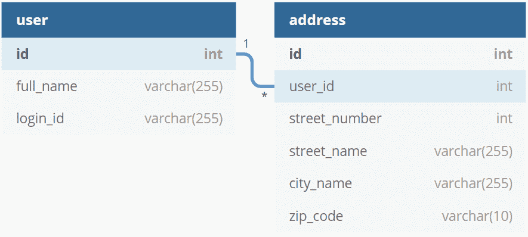

# 通过双写进行在线数据库迁移:这并不适合所有人

> 原文：<https://medium.com/google-cloud/online-database-migration-by-dual-write-this-is-not-for-everyone-cb4307118f4b?source=collection_archive---------2----------------------->

## (更准确地说:几乎没有人)

# TL；博士；医生

当在模式之间、数据库之间或者数据中心或云之间进行迁移时，在线数据库迁移是一种重要的(如果不是最重要的)方法。在线数据库迁移(也称为零停机数据库迁移)有许多变体:一种流行的是双写，在我看来，当数据一致性至关重要时，这是一种“危险”的方法。这篇博客对两种不同的在线数据库迁移变体(基于双写和变更数据捕获(CDC ))进行了合理化，以突出使用双写在线数据库迁移时所涉及的风险；这篇博客的长度反映了开始写博客时的“危险”。

我的目标是让您在选择数据库迁移道路上的双写分叉之前三思，并仅指出您将不得不面对和解决的最棘手的技术问题。

# 在线数据库迁移

简而言之，在线数据库迁移的目标是从一个或多个源数据库迁移到一个或多个目标数据库，使源数据库停机时间最短，从而使客户端停机时间最短。理想情况下，停机时间为零，尽管不可能在所有情况下都为零，因为在线迁移完成后，客户端必须重新连接到目标数据库。典型的迁移是从内部数据中心到云或云之间，甚至是云中的迁移。

## 关键要求和期望

为了尽可能轻松地使迁移变得可预测和可靠，许多数据库迁移项目都提出了以下关键要求:

*   **迁移完成**:源数据库中的所有数据都被完全迁移(如果不是所有数据都要迁移，则是源数据库的一个定义的子集)
*   **迁移一致**:目标数据库完全一致(事务一致性)，无数据丢失、无数据重复、无事务重排
*   **迁移是可重复的**:可以重新创建目标数据库，并从头开始迁移(例如，减少不可预见的错误)
*   **迁移不会影响客户端操作**:在持续迁移期间，客户端操作不会受到任何影响(例如，不会停机)
*   **迁移不影响客户端代码**:客户端代码无需更改即可支持迁移，从而避免任何实施工作(也就是设计、测试等)。)
*   **可以测试迁移**:迁移测试必须是可能的，尤其是源模式不同于目标模式的迁移，不影响生产客户端访问源数据库

## 简要术语

*   **源，目标数据库**。源数据库具有当前数据集，目标数据库是源数据库中的数据迁移到的数据库。目标数据库与源数据库的模式可能相同，也可能不同。如果源数据库和目标数据库中的模式不同，则需要进行数据转换。
*   **一级数据库**。在任何时候，源数据库或目标数据库都是事实的来源，也就是客户端访问的主数据库。在给定的数据库迁移中，会有一个时间点，目标数据库将成为主数据库，并成为客户的权威数据源。

在讨论在线数据库迁移的双重写入变体之前，CDC(变更数据捕获)在线数据库迁移过程(不依赖于双重写入)将作为比较基准进行总结。CDC 在线数据库迁移过程被广泛使用，并且是一个经过充分测试的变体。简要概述一下 CDC 在线数据库迁移过程，可以使后面对这两种变体的比较更加容易。

# 基线:CDC 在线数据库迁移流程

CDC 在线数据库迁移的基本架构如下图所示:

CDC 在线数据库迁移架构

在源数据库上操作的一个或多个客户端不受将数据迁移到目标数据库的独立迁移系统的影响。迁移系统依靠事务日志来观察数据库变化。迁移完成后，客户端可以切换到目标数据库。

CDC 在线数据库迁移过程(在此详细讨论:[【6】](https://cloud.google.com/solutions/database-migration-concepts-principles-part-2))有以下步骤(假设在本博客中讨论一个源数据库和一个目标数据库，在生产环境中同样支持多个源数据库和目标数据库):

*   **创建一个目标数据库**。与源数据库相比，这可能是相同或不同的数据库引擎，并且与源数据库相比，它可能具有相同或不同的(修改的模式)。
*   **使用迁移技术**创建迁移逻辑。这可以是数据库提供的内置功能(如逻辑复制)，也可以是一个独立的迁移系统，如 [Striim](https://www.striim.com/) 或 [Fivetran](https://fivetran.com/) (从大量可用的迁移技术中举出两个例子)。
*   **执行初始加载**。这是将事务一致的源数据库快照传输(可能包括数据转换)到目标数据库。
*   **使用 CDC** 执行连续迁移。变更数据捕获(CDC)是一种机制，它读取数据库的事务日志，并按提交顺序将已提交的源数据库事务应用到目标数据库(可能包括数据转换)。该过程从拍摄初始快照的数据库时间开始，以确保捕获和迁移初始加载期间所有并发进行的事务。在博客的结尾，讨论了事务日志访问的替代方法，以防源数据库不公开这些内容。
*   **完成排水**。当客户端从源数据库(以前的主数据库)切换到目标数据库(当前的主数据库)的日期和时间临近时，将停止对源数据库的写访问。事务日志中尚未迁移到目标数据库的剩余事务必须迁移(“排出”)到目标数据库。如果仔细配置，排空会在几秒钟内发生。
*   **割接客户端**。此时，目标数据库拥有来自源数据库的所有数据，并且它们的状态是等价的。事务一致性，客户端连接到目标数据库，访问它并继续生产工作负载。

关键在于，在初始加载和持续迁移期间，客户端可以继续访问数据库，而没有任何限制，也不需要修改任何客户端代码。这意味着客户端和数据库迁移是同时进行的。源或目标数据库唯一不可用的情况是在排空和转换阶段，这个阶段可能非常短。根据策略，在客户端重新连接到目标数据库之前，可以在目标数据库上进行额外的测试，出于安全原因，这会增加客户端的停机时间。

需要注意的一个重要方面是，客户机不会受到迁移的影响，而且为了完成近乎零停机时间的数据库迁移，根本不需要修改它们的代码库。

还需要注意的是，这种变体支持不同数据库引擎和模式之间的迁移，而不必修改访问源数据库的客户机。当然，目标数据库的客户机必须知道(代码方面)模式的不同以及目标数据库上查询和事务处理的不同。目标数据库的客户端的新版本已经实现，并且可以在在线数据库迁移期间进行测试，而不会影响源数据库。

上面的过程没有描述可选的[回退过程](https://cloud.google.com/solutions/database-migration-concepts-principles-part-2#fallback_processes)(在本博客的上下文中为了简洁起见),该过程对于许多迁移是重要的，以便处理不可预见的问题，即使在切换到新的目标数据库几个星期后迁移已经完成。

# 双写在线数据库迁移过程

双写变体的整体架构如下图所示:

双写在线数据库迁移架构

一个或多个客户端从源数据库和目标数据库中读取和写入数据，并实现数据库迁移功能。

各种参考资料概述了在线数据库迁移的双写迁移变体，例如，[大规模在线迁移](https://stripe.com/blog/online-migrations)[【1】](https://stripe.com/blog/online-migrations)，[无停机时间的安全数据库迁移模式](http://www.aviransplace.com/2015/12/15/safe-database-migration-pattern-without-downtime/)[【2】](http://www.aviransplace.com/2015/12/15/safe-database-migration-pattern-without-downtime)，或[使用双写方法的零停机时间表迁移](https://engineering.gusto.com/old-write/)[【3】](https://engineering.gusto.com/old-write/)。请注意，在撰写本文时，[【2】](http://www.aviransplace.com/2015/12/15/safe-database-migration-pattern-without-downtime)是间歇可用的，您可能需要去[互联网档案馆检索内容](https://web.archive.org/web/20200507140845/http://www.aviransplace.com/2015/12/15/safe-database-migration-pattern-without-downtime/)。

基于上述参考文献[【2】](http://www.aviransplace.com/2015/12/15/safe-database-migration-pattern-without-downtime)，整个双写迁移过程如下(由于该参考文献的步骤最为详细，所有步骤均直接引用自[【2】](http://www.aviransplace.com/2015/12/15/safe-database-migration-pattern-without-downtime))。其他资源遵循相同或相似的流程:

*   步骤 1:构建“新的”数据库模式并将其部署到生产环境中。
*   步骤 2:向您的应用程序添加一个新的 DAO，它写入“新”数据库。
*   步骤 3:开始写入“新”数据库，但使用“旧”数据库作为主数据库。
*   步骤 4:启用读取路径。更改特性切换以允许从两个数据库中读取。
*   步骤 5:使“新”数据库成为主数据库。将特性切换为首先写入新数据库(您仍然从两个数据库中读取，但是现在更喜欢新的数据库)。
*   第 6 步:停止写入“旧”数据库(从两者中读取)。
*   步骤 7:急切地将数据从“旧”数据库迁移到“新”数据库。
*   第八步:删除“旧”刀。

这些步骤在参考资料中有详细的解释和讨论，在这里逐字引用会占用太多的空间，但是，在继续阅读下面的博客之前，我鼓励你花几分钟时间至少阅读[【2】](http://www.aviransplace.com/2015/12/15/safe-database-migration-pattern-without-downtime/#ixzz3vsEunxmA)，以防你想更详细地理解概述的步骤。

[【3】](https://engineering.gusto.com/old-write/)概述了在同一个数据库内的表之间迁移，而不是在数据库之间迁移数据的特殊情况。虽然有些方面是相似的，但有些方面是不同的。下面分别列出了不同之处。

# 准备工作—系统属性

除非您像在 [[3]](https://engineering.gusto.com/old-write/) 中所讨论的那样将同一个数据库中的表从源表迁移到目标表(根据我的经验，我认为这是一种罕见的情况)，并且您正在不同的数据库服务器(实例)中的数据库之间进行迁移，否则了解以下系统属性非常重要:

*   **分布式交易**。只有当您使用分布式事务管理器在所选的两个服务器之间进行协调，并且这些服务器可以参与分布式事务协议时，跨数据库事务才可用。在所有其他情况下，事务不会跨越两个数据库，对两个数据库的任何访问都不会序列化(因此不会自动确保数据一致性)。对两个数据库的顺序或并发访问都不会被所涉及的两个数据库串行化)。
*   **一致备份**。由于这两个数据库相互独立，除非在创建备份时停止对这两个数据库的写访问，否则不可能有这两个数据库的一致备份。两个备份(每个数据库一个)只有在任何数据库的备份过程中没有更改时才是一致的。
*   **高可用性和灾难恢复**。这些数据库是相互独立的。高可用性或灾难恢复。如果一个数据库(源数据库或目标数据库)发生故障转移，那么故障转移过程独立于另一个数据库。在高可用性或灾难恢复期间，通常存在停机的可能性以及一组丢失的事务，这可能违反数据一致性(在没有分布式事务的情况下)。在这种情况下，两个数据库不同步，在继续迁移之前必须先同步。例如，目标数据库的故障转移会丢失源数据库中存在的事务。必须再次确定和迁移丢失的事务。
*   **联网和延迟**。这两个数据库通常可能运行在具有不同网络属性(如吞吐量或路由结构)的不同环境中。这种差异可能会影响客户端和数据库访问接口之间的延迟。在没有分布式事务的情况下，从客户端的角度来看，这可能会导致源数据库和目标数据库之间的事务被无意地重新排序，从而导致数据不一致。

在大批量生产环境中，上述属性非常重要，因为它们可能会影响如何实现在线数据库迁移，以便运行时的任何问题都不会损害数据完整性和数据一致性。在我看来，解决上述问题是复杂的，并且在双写变体的环境中是一个困难的工程问题。

# 准备工作—示例用例:用户和地址

以下基于关系模型的用例用于说明在线数据库迁移过程中的特定方面。为了使这篇博客简短，并帮助说明一组基本的查询行为，本文保持了简单。在具有更复杂数据模型(关系或非关系)的生产数据库中，分析和实现额外的查询行为可能很重要。

样本用例:用户及其地址

模式由两个实体组成，用户和地址，用户可以有零个、一个或多个地址。地址不能单独存在，而是用户的一部分。address.user_id 与 user.id 具有外键关系。这两列分别表示用户和帐户的特征，为了便于说明，这两列保持最小。

虽然用例是以关系模式的形式表达的，但是下面的讨论适用于所有数据模型，因为关系模型能够有效地表示所有其他已知的数据模型(尽管不一定有效)。

# 双写数据库迁移过程的探讨

以下讨论以数据一致性为指导原则。任何选择或论证都是为了确保在迁移之后和客户端切换到目标数据库之前，目标数据库是完整和一致的。在下文中，每个讨论主题都讨论了双写变体以及 CDC 变体。

## 客户代码修改

双重写入需要修改客户端代码(参见上面的步骤 2)。客户端代码有几个职责:实现业务逻辑、访问源数据库、访问目标数据库，如果源和目标模式不同，它必须在返回结果之前实现两个数据库之间的转换和结果的转换。

每个代码修改都需要测试，这意味着必须开发和维护测试和测试数据集，以确认没有发生回归(在业务逻辑和迁移逻辑中！)).困难之处在于，在双写迁移的情况下，目标数据库是不断变化的，并且不会因为每次迁移或业务逻辑代码变化而重置，因此必须相应地维护任何测试数据库。

基于业务逻辑改进或迁移逻辑更改，可能需要修改代码。参考资料表明，双写迁移可能需要数周或数月时间。在这段时间内，除了必要的迁移逻辑更改之外，可能还需要修改业务逻辑。由于这些是正交功能，因此也必须测试它们的独立性和隔离性。

如果源数据库和目标数据库具有不同的模式，那么一旦目标数据库成为数据的主要来源，客户端代码就必须在目标模式上工作，因此必须相应地进行修改。此时(在目标数据库成为主数据库之后)，客户机代码首先访问目标数据库，然后访问源数据库。现在，任何转换都必须从目标模式转换到源模式。这与之前客户端首先写入源数据库的方向相反。

目标数据库可能仅出于转换目的而保留了部分模式，这些部分必须被删除 [[1]](https://stripe.com/blog/online-migrations) 。可以将客户端代码中的目标模式更改延迟到迁移完成之后，以限制迁移过程中的代码更改。

*CDC 数据库迁移*:访问源数据库的客户端代码不需要修改，迁移后访问目标数据库的客户端代码只在目标数据库与源数据库模式不同时才需要修改。客户端代码的修改可以独立于数据库迁移(以及访问源数据库的客户端代码版本)来实现和测试。

## 多个并发客户端

如果多个客户端同时访问源数据库，则必须在所有客户端之间实施和协调双写迁移，以确保客户端在访问正确和一致的数据时不会相互冲突。这需要迁移逻辑来确定性地找出客户端访问的数据是要被迁移还是已经被迁移。

*CDC 数据库迁移*:客户端逻辑不需要修改；任意数量的并发客户机都可以访问源数据库。

## 数据访问路径管理

客户端必须能够确定它将要访问的数据是否已经迁移(步骤 3)。如果没有，那么它必须访问源数据库和目标数据库。数据库迁移需要修改三个操作:插入、更新和删除。

*   插入:数据必须插入到两个数据库中
*   更新:仅当数据之前被迁移时，才更新目标数据库(除了源数据库之外)中的数据
*   删除:仅当数据之前被迁移时，才删除目标数据库中的数据(除了源数据库之外)

这些参考资料没有概述如何实施数据路径管理，以允许客户确定数据迁移是否已经发生。它可以是对目标数据库的动态查询，以确定有问题的数据是否存在。另一种方法是对托管元数据使用查找功能，对于给定的标识符(例如主键)，该功能返回数据是否被迁移。如果查找功能基于持久映射(例如，在数据库表中)，那么如果其中一个查询迁移了数据，并且随后的查询试图更新该数据，则对同一主键的并发查询可能会失败，因为执行第二个查询的代码可能没有获得访问路径中的改变。

无论路径管理实现如何，查找都必须是确定性的，以便客户端获得正确的答案。下面基于示例用例更详细地讨论更复杂的查询情况。

由于数据库的角色发生了变化(步骤 5 ),读取操作的访问路径和写入路径都必须改变，以便代码首先访问主数据库。

*CDC 数据库迁移*:由于客户端没有被修改，只访问源或目标数据库，所以不需要数据访问路径管理。

## 过程

当数据一致性是最重要的目标时，在整个迁移过程中，必须清楚迁移过程中的哪些数据库是包含任何时间点一致和完整的真实来源状态的主数据库。

在任何迁移过程用例中，源数据库在迁移开始前是主数据库，而目标数据库在迁移完成后是主数据库。当迁移正在进行时，哪一个是迁移过程中的主节点？在 CDC 数据库迁移变体中，源数据库是整个迁移过程中的主要数据库。只有在完成后，目标才会成为主短节点，然后客户端才会从源切换到目标。这是明确的。

在双写变体中，基于上述过程，实际上不清楚是什么情况。步骤 3 清楚地说明了源数据库是主数据库。第 5 步声明将目标数据库作为主数据库(并承认源数据库可能会变得不一致，因为对源数据库的写入只是“最大努力”)。但是，只有在第 7 步才会进行回填，也就是说，尚未迁移的数据会从源迁移到目标。这意味着在第 5 步，即使目标成为主目标，它也没有完整的数据集。此外，步骤 6 声明停止写入源数据库。在这一点上，没有一个数据库拥有完整和一致的数据集，因为这两个数据库是相互融合的。只有在步骤 7(回填)之后，目标数据库才是完整的，即所有数据都已迁移。当没有数据库具有完整和一致的数据集时，这种变体可能会导致业务逻辑错误(见下一段)。

从我的角度来看，我将确保在任何迁移过程中，在任何时间点，其中一个数据库都是主数据库，保存完整和一致的数据集，以便实际实现和提供数据一致性。

参考资料中提到了“更改读/写路径”,以更改数据库先写入还是先读取的顺序。当数据一致性很重要时，首先访问哪个数据库的顺序并不重要，因为主数据库必须是完整和一致的。

## 迁移逻辑功能的详细信息

虽然最初的预期是双写变体只需要执行两次相同的访问逻辑(读取、插入、更新、删除),一次在源数据库上，一次在目标数据库上，但当开始处理各种详细的数据库访问用例时，这并不成立。在下文中，我将讨论其中的一些，以说明客户端代码所需更改的复杂性。每次发生双重写入时，访问路径管理可能必须根据其实施进行更新(参见上面的讨论)。

目标是将数据从源数据库迁移到目标数据库，同时保持数据的一致性。在任何时候，数据都必须一致，所有读访问都必须返回正确的结果—目标数据库的存在不能引入不一致。

首先，讨论插入件:

*   **主键行插入(无关系)**。在源数据库和目标数据库中，都可以以相同的方式通过主键插入一行。在这个用例中，一个新的用户可以作为一个单独的插入来添加。
*   **主键行插入(具有显式关系)**。对于源数据库和目标数据库，按主键插入的具有外键关系的单行可以不同。在这个用例中，给定用户的新地址是对源数据库的一次插入。然而，在目标数据库中，代码必须首先检查用户是否存在，因为地址与用户有外键关系。否则，必须先从源迁移用户，然后才能插入地址。
*   **【主键行插入(带有隐含关系)**。对于源数据库和目标数据库，具有隐式关系的按主键插入的单行可以不同。隐式关系不是由模式定义的，而是由客户端通过代码来管理的。如果插入操作要求相关数据存在(一个或多个关系)，则目标数据库的代码必须检查数据是否存在，如果数据不在目标数据库中，则必须确保其迁移。隐式关系很难找到，因为通过检查数据库模式无法找到，只能通过理解客户端代码中的业务逻辑来找到。
*   **主键行批量插入**。目标上的批量插入只适用于那些不涉及关系的插入用例。一旦涉及关系，就必须进行检查(参见上面要点中的讨论)。

接下来，我们将讨论更新:

*   **主键行更新(所有列)**。如果所有的列都被更新，那么在目标数据库中必须进行检查以确保该行首先出现。如果没有，必须先迁移，然后更新。可选地，更新可以被转换成插入。选择哪种方式取决于额外的上下文(比如 update 语句中的数据库触发器或谓词，或者事务日志内容的相关性)。
*   **主键行更新(列的子集)**。如果要更新列的子集，在更新发生之前，必须首先迁移行。
*   **用关系更新主键行**。具有显式或隐式关系(如外键)的行更新必须确保强制相关数据(一个或多个)首先出现，以便不违反参照完整性。此外，要更新的行必须首先存在或迁移。
*   **主键行批量更新**。只有当要更新的所有行都存在时，目标数据库上的批量更新才有效。任何需要额外逻辑的更新都不能作为批量更新的一部分。

下一个讨论是关于删除:

*   **主键行删除(无关系)**。无论该行是否存在，都可以在目标数据库上进行删除。如果不存在，删除将会成功。但是，上下文很重要:如果目标数据库上的事务日志也必须与源数据库上的一致，那么必须在迁移数据之前进行删除，以便在目标数据库上实际执行删除。其他示例是可能需要删除实际发生的触发器。
*   **【删除主键行】(具有隐式或显式关系)**。一个删除或一行可能必须触发其他行的删除。例如，如果用户被删除，所有地址都必须被删除。在模式中指定关系的情况下，数据库监控这些关系；在隐式关系的情况下，代码本身必须确保正确的遍历和删除。
*   **主键行批量删除**。和以前一样，只有在删除时不需要执行额外的逻辑时，批量删除才有效。

接下来是读取权限:

*   **从源读取作为主数据库**。如果源数据库是主数据库，则所有读取操作都在源数据库上执行，因为它具有真实的来源，并代表一致的数据库状态。
*   **从作为主数据库的目标中读取**。如果目标数据库拥有完整且一致的数据集，那么它只能是主数据库。在源关闭之前，这意味着源和目标都是 100%一致的(也就是说，是彼此的完美拷贝，或者完全同步)。不同模式情况下的数据一致性)。上面取自 [[2]](http://www.aviransplace.com/2015/12/15/safe-database-migration-pattern-without-downtime) 的过程并没有实现这一点:它使目标数据库成为主数据库(步骤 5)，而没有迁移所有数据(步骤 7)。我认为参考资料中的术语“primary”是指首先写入哪个数据库，没有 wrt 的意思。数据一致性——这是数据库架构中术语“主”的习惯用法。
*   从两个数据库中读取？参考文献[【2】](http://www.aviransplace.com/2015/12/15/safe-database-migration-pattern-without-downtime)提到通过访问两个数据库并基于模式中的时间戳组合(“合并”)结果来获得读取结果(步骤 4)。这有几个含义:首先，必须给每个表添加一个时间戳，并且时间戳必须取自两个数据库的同一个时钟。除非数据库在同一个数据库实例中，否则这是不可能的。其次，这意味着源数据库和目标数据库都没有一致的(完整的)数据集。我不清楚为什么会出现这种情况，以及如何管理一致性(我怀疑第 3 步中的讨论意味着可以忽略对目标数据库的写失败)。然而，因为参考文献[【2】](http://www.aviransplace.com/2015/12/15/safe-database-migration-pattern-without-downtime)提到了它，所以在这里提到它是很重要的，因为数据一致性的含义。

更新、插入、删除和更新之外的操作:

*   **聚合**。任何形式的聚合都依赖于完整的数据集(或聚合查询范围内的完整子集)。如果查询计算唯一地址的数量，则所有用户和所有地址都必须是可访问的。在双写情况下，只有在任何时间点源或目标是一致和完整的主数据库时，才支持和可能做到这一点。如果双写变体在任何时候都不能确保单一一致的数据库，那么在数据迁移期间，聚合查询将返回不准确的结果。或者，必须重写聚合查询，以便通过访问两个数据库来获得它们的结果。
*   **加入**。就像聚合操作一样，一个连接只在一致和完整的数据集上提供正确的数据。

副作用操作:

*   **存储过程、触发器等**。在某些情况下，数据库模式具有数据库本地的存储过程、触发器或附加操作。单个实现必须确定它们是否可以在源数据库和目标数据库上并发操作。如果它们不能同时在两个数据库上工作(也就是说，在目标数据库上处理不完整的数据)，则必须在目标数据库(非主数据库)上关闭它们，直到数据完整和一致。但是，如果关闭，任何数据都会迁移、更新等。不会导致一致性所需的任何副作用(例如，存储过程更新数据库本身)。这将使双写迁移无法使用。
*   **外部数据库访问**。一些数据库模式使用触发器与下游系统通信，或者使用外部表访问上游系统。和以前一样，特定的实现必须确定在迁移期间是否可以在目标数据库上启用这些功能，以及是否发生了一致的行为。
*   **交易日志**。一些用例依赖于事务日志。观察数据库中所做的更改，并触发下游功能。为了让这些用例工作，源数据库和目标数据库中的操作必须以相同的方式执行，以便事务日志也是等价的。例如，如上所述，如果之前没有迁移数据，则目标上的更新不能转换为插入。

关系:

*   **一级关系**:如上所述，一级关系——两个表之间的关系——是隐式或显式的，必须由访问目标数据库的代码来处理。
*   **多级关系**:像一级关系一样，多级关系必须由访问目标数据库的客户端代码来处理。在具有许多多层关系的模式中，可能需要复杂的遍历来确保在需要数据可用的操作期间迁移所需的数据。在最坏的情况下，如果数据集表示紧密连接的图，则需要迁移的第一个操作可能必须迁移所有数据才能继续(例如，插入或更新)。

参考文献[【3】](https://engineering.gusto.com/old-write/)指出，即使目标数据库是主数据库，也不可能在代码库中找到所有访问源数据库的操作。如果源数据库脱机，这可能会导致生产中出现错误。在我看来，在开始数据库迁移之前，我会首先考虑重构客户端代码，以确保所有操作都可以强制在目标上独占执行(例如通过代码切换)。一种类型的重构是分别对两个数据库进行显式的访问路径管理。进一步的重构是将所有访问操作隔离在一个单独的体系结构层中，该体系结构层可以作为一个单独的组件进行配置和审查。

*CDC 数据库迁移*。除了对外部数据源进行写访问的副作用操作之外，CDC 数据库迁移变体中不存在上述任何问题。必须分析对外部数据进行写访问的操作，以便了解在迁移期间关闭这些操作是否可以避免任何下游系统问题(因为源数据库已经在处理这些问题)。如果无法关闭，可能需要对其进行重构，以使数据库迁移成为可能。

## 数据模型和转换

数据库迁移并不总是在相同的数据模型之间进行(例如，关系到关系，或者面向文档到面向文档)。不同数据模型之间的迁移是一个有效的用例(感谢 Martin 在博客首次发布后的评论中强调了这一点)。在这些用例中，当数据从源数据库复制到目标数据库时，必须从一种数据模型转换到另一种数据模型。在双写变体的情况下，客户端代码必须完成这一点。例如，当从关系模型迁移到面向文档的模型时，可能需要收集不同表中的行，并将其组合到目标数据库的单个文档中。

*疾控中心数据库迁移。* CDC 数据库迁移技术通常支持在源数据库和目标数据库之间传输的数据的数据转换。这包括数据模型之间的结构转换。支持的程度取决于特定的产品或实现——如果您的用例需要，您将不得不检查这些功能。

## 没有主键的表

可能存在没有主键的表。当要保证数据一致性时，这使得数据库迁移变得困难或不可能，因为没有主键的表不能被分析(例如，是否存在行？相同的值可以出现在两行或更多行中吗？)而不理解在那些表上操作的代码。

建议确保所有表都有主键，并在开始数据库迁移之前重构代码和模式。第二种不太可取的方法是，在客户机停机期间，在作为初步设置的常规迁移开始之前，首先完全迁移没有主键的表。这确保了客户端逻辑不必迁移无密钥数据，而只执行后续更改(插入、更新或删除)。

## 一致性

由于在双写变体的情况下一致性固有的复杂性，因此将单独讨论一致性。下面的讨论假设两个数据库中的一个在任何时间点都是主数据库，并且一旦目标数据库是主数据库，源数据库就与之一致(真实拷贝)。如果不是这种情况，则一致性不是由一个数据库的数据库状态(其内容)给出的，而是由跨数据库的读访问操作结果给出的，并且只有当它们的组合数据状态一致时(见上面的讨论)。

*   **部分交易中止(交易协调)**。正如在前面的准备工作中所讨论的，事务不能跨越源数据库和目标数据库(除非实现了同一个数据库中的表之间的迁移)。这意味着，例如，源数据库和目标数据库中主键行的更新是两个不同的事务:一个在源数据库上，一个在目标数据库上( [[2]](http://www.aviransplace.com/2015/12/15/safe-database-migration-pattern-without-downtime) 明确指出了这一点)。为了使数据库保持一致，两个事务都必须成功或失败。虽然分布式事务可以保证这种行为，但是在没有分布式事务的情况下，客户端代码必须保证这种行为。这意味着，如果另一个数据库的事务成功，客户机必须能够从源事务失败或目标事务失败中恢复。此外，当发生事务失败时，这种恢复必须在同一对象(主键)上存在并发事务的情况下工作(这是并发性和可串行化的核心数据库逻辑)。如果实现正确，它会在客户端代码中复制两阶段分布式事务协议。
*   **顺序交易重排序**。如果一个客户机对同一个用户(同一个主键)相继发出两个更新，将会执行四个事务。但是，在没有分布式事务的情况下，目标数据库中两个事务的顺序可能与源数据库中的顺序相反，从而导致数据不一致，因为源数据库和目标数据库中的用户状态会有所不同。只有当客户端代码明确确保在源数据库和目标数据库上按顺序执行同一主键上的顺序事务时，才能避免这种情况。
*   **并发交易重新排序**。例如，如果两个不同的客户端同时对同一个用户(同一个主键)发出 update，则会执行四个事务。由于事务是相互独立的，因此它们可以以不同的顺序在源数据库和目标数据库上执行。除非客户端代码实现跨客户端协调，否则可能会出现数据不一致，因为源数据库和目标数据库的状态可能不同。
*   **需要数据迁移的并发事务**。其中一个用例是客户端对一个用户(相同的主键)发起两个并发更新，而该用户尚未迁移到目标数据库。这两个更新都将决定必须首先迁移用户(参见上面的更新讨论)。当第一个客户机在执行更新之前首先迁移用户时，第二个客户机可能尝试做同样的事情(因为它是并发执行的，并且不知道迁移同时发生)，由于数据已经被第一个客户机迁移，所以经历失败的插入(迁移)。客户端代码必须明确涵盖这种情况。一种可能的方法是重新执行第二客户机的更新事务。
*   **有关系的并发交易**。与前面的讨论类似，客户端发出的并发事务可能需要迁移相关数据。一个用例是在迁移用户时，其地址也必须迁移。如前所述，并发事务可能会尝试这样做两次。一个不同的用例是 n:1 关系，其中“1”端只需迁移一次，而“n”端中的每一个都需要迁移 n 次(每行一次)。在这种情况下，必须为“1”端已经被迁移的情况准备 n-1 个事务。

验证源和目标之间一致性的主题出现了:

*   最有用的方法是分布式事务，因为它会自动捕捉许多可能的违规。
*   另一种方法是让每个事务在应用更改之前检查它是否遇到一致的数据集，并在做出更改后留下一致的数据集。如果遇到或留下不一致的状态，客户端将中止事务(然而，这将遇到如上所述的更大的事务协调问题)。
*   还有一种方法是定期比较源数据库和目标数据库。然而，问题出现了:如果检测到不一致怎么办？如何缓解和解决这些问题？
*   各种参考文献(例如[【3】](https://engineering.gusto.com/old-write/))建议持续监控或持续统计分析。虽然这可能检测到不一致(也可能检测不到，因为不能 100%保证找到所有不一致)，但问题是如何对发现的不一致做出反应，以及如何补偿或修复它们。如果用户或下游系统读取了不一致的数据，并根据读取的数据修改了数据，该怎么办？

这些参考文献清楚地表明，数据一致性是一个主要问题，但它们也表明，只是尽了最大努力，而不能保证能够发现所有的不一致，更不用说对不一致数据进行修复或后续处理了。在这种情况下，可能会存在许多不一致的地方，并且只有在切换到目标系统很久之后才变得可见，并且可能只有当客户或用户开始抱怨并且数据一致性错误被归档时才可见。

在 *CDC 数据库迁移*中，变体一致性是通过流程及其保证建立的(就像事务日志记录的恰好一次处理)。如果其中一个相关的数据库或系统出现故障，并且系统故障导致目标数据库不一致，那么缓解方法很简单:删除目标数据库并重新开始。这是可能的，因为在切换之前源是主数据库，在切换之前没有客户端逻辑依赖于目标数据库。在双写的情况下，重新设置并从头开始也是可能的，但前提是源数据库是主数据库，并且一旦目标数据库成为主数据库，它在每次事务后都与目标数据库 100%一致。当然，任何外部依赖关系也必须重置。如果在迁移过程中客户端正在使用目标数据库，则可能无法重置。

下一节讨论回填。它也可能是一致性讨论的一部分，但是，由于其自身的复杂性，单独讨论它是合适的。

## 后面充填物

在双写变体中，只有当客户端访问尚未迁移的数据时，数据才会迁移到目标数据库，并且客户端代码包含要执行的迁移逻辑。但是，不能保证每个数据项都在数据库迁移完成的特定时间段内被客户端访问。由于在给定的迁移期间，客户端可能无法访问数据，因此需要单独的流程来迁移这些数据项。这个独立的过程独立于客户端逻辑，以便迁移剩余的数据。这个过程被称为“回填”。

回填需要确定源数据库中尚未迁移到目标数据库的数据集:它基本上必须执行两个数据集之间的差异。这是一个完全独立的开发工作。有许多方法可以实现这一点，访问路径管理可能有助于这一过程。例如，[【1】](https://stripe.com/blog/online-migrations)报告创建数据库快照(不指访问路径管理)和使用 Hadoop 集群。

无论回填如何确定需要从源迁移到目标的数据项，它也必须在线，这意味着源或目标数据库在此过程中都不会停顿。它需要考虑到:

*   **并发客户端数据迁移**。当回填正在进行时，并且当它确定它需要迁移数据项时，该数据项可能已经被并发地迁移或者正在并发客户端事务中被并发地迁移的过程中。这种并发处理必须保证数据的一致性，在这种情况下，该数据项的回填必须失败，以避免干扰。
*   **数据关系**。客户端代码本质上理解并知道数据关系(例如，用户具有外键关系中的地址)。作为独立代码的回填需要确保在其逻辑中实现完全相同的数据语义。这不仅适用于显式关系，也适用于隐式关系。根据迁移代码的实现和结构，回填可能会重用相同的代码。如果它实现自己的代码，迁移功能是重复的，并且需要与相应的客户端代码保持同步。
*   **客户端代码逻辑**。一些客户端代码逻辑可能不仅会迁移数据，还会更新其他表，例如跟踪数据更改的历史表。回填必须实现完全相同的逻辑。

基于以上关于回填的简要讨论，考虑不将回填过程实现为具有其自己的独立逻辑的独立过程，而是找到一种使回填过程触发客户端代码的方法，使得它确定的数据项的迁移使用客户端逻辑，而不是其自己的逻辑，将是有趣的。这很大程度上取决于客户端逻辑是如何实现的，但是，好处是回填过程不会复制客户端代码中已经存在的逻辑。

我找到的参考文献中没有一篇详细讨论了回填，以至于不清楚上面所有的内容实际上是如何处理和实现的。

## 后备选项

在某些情况下，在新的主数据库上出现不可预见的问题的情况下，尤其是在客户端重新连接并开始访问新的主数据库之后，从目标数据库(新的主数据库)到源数据库(以前的主数据库)准备了可能的[回退](https://cloud.google.com/solutions/database-migration-concepts-principles-part-2#fallback_processes)。就数据一致性而言，这只有在源数据库继续与主数据库保持同步的情况下才有效。

在双写变体中，这意味着客户端必须继续写入两个数据库(主数据库和源数据库)，以便源数据库与主数据库保持同步。所有上述讨论的问题仍然存在，现在可以说方向相反。

*疾控中心数据库迁移*。在这个变体中，建立了从主数据库到源数据库的反向迁移过程。客户端在新的主数据库上运行，无需对其代码进行任何更改，即可将数据从主数据库持续复制到源数据库。

## 模式更新

客户端逻辑可能需要模式更新来解决业务逻辑代码和相关数据管理中的变化，而与迁移逻辑无关。虽然可以在迁移过程中更改模式，但这增加了复杂性，因为不仅要更新客户端代码和数据库模式，还要更新双写迁移逻辑。根据迁移所处的阶段，更改可能会有所不同。我的建议是，如果可能的话，在迁移期间避免对迁移中涉及的任何数据库进行模式更新，并将其推迟到迁移完成之后。

作为迁移逻辑本身的一部分，可能需要不同类型的模式更新。在[【1】](https://stripe.com/blog/online-migrations)中，决定将一组(现有的)订阅从源模式转移到目标模式，同时在目标模式上实现一个包含相同数据的订阅表(基本上是在迁移期间复制数据:保留在以前的数据结构中，并添加到目标数据库中的新数据结构中)。一旦迁移完成，订阅表成为主要源，订阅数组就被删除。这是一个模式变更(以及相应的代码变更)被推迟到迁移完成之后的例子。

*CDC 数据库迁移*:一般情况下，CDC 数据库迁移可以检测和处理模式变化；这取决于部署的具体技术是否以及在多大程度上是可能的。但是，模式更改可能需要更改转换规则，以便在将数据应用到目标数据库之前转换来自源数据库的数据。因为这样的变更是影响迁移逻辑的转换代码变更，所以我建议将模式变更推迟到迁移完成之后(如果可能的话)。

## 系统故障

双写变体涉及几个系统:

*   客户
*   源数据库
*   目标数据库

这些系统中的每一个都可能独立于任何其他系统发生故障。如果一个客户端出现故障，那么这将停止数据库迁移。失败对迁移没有影响，只是推迟了迁移。

如果源数据库或目标数据库出现故障，那么问题就来了，客户机应该如何处理。由于客户端代码正在执行数据迁移，并负责确保数据一致性，所以唯一的选择是停止客户端代码，直到两个数据库都再次可用。最大的问题是不可用的数据库是否必须从备份中恢复。如果是从备份中恢复的，如果备份没有捕获停机前的最新更改，可能会发生数据丢失。在这种情况下，必须首先同步两个数据库(这可能是基于特定上下文的主要任务)。

顺便提一下，停机不一定是崩溃。也可能是不可用，这意味着数据库本身重新启动，或者发生了升级窗口。通常，停机会导致数据库不可访问。

*CDC 数据库迁移*:在 CDC 数据库迁移案例中，客户端宕机不会影响数据库迁移。如果源数据库出现故障，客户端会受到影响，但目标数据库不会受到影响。如果源数据库必须从备份中恢复，它可能会丢失事务。再次同步目标数据库的最简单的方法有两种情况:(a)如果目标数据库可以从同一个备份中恢复，那么这确保了源和目标是同步的。(b)如果目标数据库不能从相同的备份中恢复(例如，因为它具有不同的模式)，则迁移可以通过移除目标数据库并创建新的数据库来从头开始。如果目标数据库经历了中断，同样的过程发生:如果它没有经历数据丢失，它可以简单地继续。如果发生数据丢失，迁移可以重新开始，或者在迁移技术保留 CDC 记录的情况下重新进行。与双写情况相比，CDC 数据库迁移案例中的恢复过程要简单得多，而且从客户端影响的角度来看，目标数据库宕机不会影响数据库迁移。

## 完成

到目前为止，讨论主要集中在迁移之前和迁移期间的阶段。然而，在某个时候，数据库迁移完成，必须进行清理。

当目标数据库成为主数据库时，数据库迁移本身就完成了(意味着它包含完整和一致的数据集)。一旦新主服务器可用，客户端将重新连接到新主服务器，所有访问都在新主服务器上执行。在允许客户机访问新的主服务器之前，最好有一个一致的数据库备份作为定义的起点。

源数据库仍被部署，但未被使用。虽然可以保留它，但是一旦第一个事务在新的主服务器上提交，它就会不一致。因为它是不一致的，所以它可以被拒绝，并且它所使用的资源可以被移除。在源数据库保持同步以实现回退选项的情况下，只有当不再需要回退选项时，数据库迁移才完成。

然而，影响最大的是为了执行数据库迁移而添加到客户机代码中的双写迁移代码。不再需要这些代码，最好的做法是删除不再执行的代码(因为这是代码变更，所以需要测试)。可能会想到为将来的数据库迁移项目保留代码。虽然这肯定是一个考虑因素，但更好的策略可能是删除代码，并在事后考虑代码重构，以改进代码库，而不是为了将来的数据库迁移。

*CDC 数据库迁移*。当目标数据库成为主数据库并且客户端重新连接到它时，数据库迁移就完成了。源数据库也可以关闭(除非因回退选项而延迟)。然而，因为客户机的代码从未被修改来执行迁移，所以不需要改变、移除或重构。

## 同一数据库中的表之间的迁移

当在同一个数据库中的表之间迁移时，对源表和目标表的更改可以发生在单个事务中，消除了所有分布式事务问题，以及当必须使用独立事务来访问源表和目标表时可能出现的失败情况。

在与源表的外键关系的上下文中，可能会出现与特定模式相关的错误:当一个表有外键关系(除源表或目标表之外的表)时，这是一个必须解决的依赖关系。在新表成为主表(事实的来源)的过程中，外键关系必须在模式定义中重新定义。这是一个单独的步骤，可能会遇到外键不存在的错误情况。此外，如果目标表上的主键定义发生了变化，外键关系也必须相应地发生变化。[【3】](https://engineering.gusto.com/old-write/)提到了可能的错误情况。

还可能存在对源表的非基于模式的依赖(例如外部数据包装)。这些不像模式定义中表达的依赖关系那样容易发现，当然也必须解决。

*CDC 数据库迁移*:在 CDC 数据库迁移中，数据库内的表之间的迁移也是可能的，没有任何限制。在这种情况下，还必须解决与外键(以及表之间的其他依赖关系)相关的问题。

## 测试

参考资料中没有详细讨论测试迁移的主题，但是测试需要单独讨论。测试必须确认数据库迁移一旦开始就成功完成。测试过程中的任何错误都必须修复，然后重新开始测试。

然而，可能有一些边缘情况没有被测试立即捕捉到，只有在测试数据迁移发生时才会显现出来。在这种情况下，有不同的选择:

*   停止迁移，修复迁移代码，测试修复(并更新测试套件)，重置以及从头重新开始迁移
*   停止迁移，修复代码，修复数据，然后继续迁移

第一种选择是更可靠的方法，因为目标数据库中的数据一致性得到了保证，不需要手动修改。重启将包含对错误的修复，但是，这需要从头开始迁移的能力。

第二种选择充满了可能的下游问题:这种选择依赖于能够在迁移期间纠正数据的能力。由于修复代码和修复数据是与生产并发的，所以每次修复代码时可能会出现更多的错误。只有当客户端不访问目标数据库进行生产，并且客户端(继续运行)能够处理停止的迁移时，这种替代方法才有效。如果不能，那么这种替代方案就不起作用，相反，在代码和数据固定的情况下，迁移必须继续。

*CDC 数据库迁移*:由于目标数据库从来不是主数据库，并且客户端不受影响，因此数据库迁移可以在任何时候从头开始重新启动，以解决可能出现的任何问题。

# 观察:数据一致性不确定性

所有参考资料都明确强调了数据一致性的重要性。同时，这三个参考文献都不确定客户机代码会从源数据库生成一致的目标数据库。描述为监控生产中的访问问题和数据问题而采取的方法的参考资料表明了这种缺乏信心:

*   [【1】](https://stripe.com/blog/online-migrations)表达了源数据库和目标数据库之间数据一致性的不确定性:“*我们需要确保从新订阅表中读取数据是安全的:我们的订阅数据需要保持一致。我们将使用 GitHub 的* [*科学家*](https://github.com/github/scientist) *来帮助我们验证我们的读取路径。*“首先，这意味着可能会出现不一致，也就是说,“很明显”执行迁移的客户端代码很可能不会创建一致的目标数据库。一个单独的系统(Scientist)被放置在适当的位置，比较源和目标数据库，当读取“相同”数据项时警告任何差异。但是，它没有解释如何处理差异，以及如何找到并修复产生不一致的代码。所有这些都必须在运行迁移期间发生，因为目标是执行在线迁移(也就是零宕机)。因此，在解决不一致的同时，可能会产生额外的不一致。此外，为了找到所有的不一致，检测不一致的系统必须完全覆盖所有可能的不一致。
*   [【1】](https://stripe.com/blog/online-migrations)也表达了目标数据库成为主数据库后的担忧:“*对于每个代码路径，我们需要使用一种整体方法来确保我们的更改是安全的。我们不能只是用旧记录代替新记录:每一条逻辑都需要仔细考虑。如果我们错过了任何案例，我们可能会以数据不一致而告终。幸运的是，我们可以运行更多的科学家实验来提醒我们在这个过程中任何潜在的不一致。*“这意味着对数据一致性的持续关注，客户端代码可能没有正确处理所有访问。
*   [【2】](http://www.aviransplace.com/2015/12/15/safe-database-migration-pattern-without-downtime)意识到代码可能会失败并声明“*请注意，在此步骤中,“旧”数据库处于一致状态，而“新”数据库可能会不一致，因为对其的写入可能会失败，而“旧”数据库写入会成功。在进入下一步之前，让这一步运行一段时间(几天甚至几周)是很重要的。这将使您确信新代码的写入路径按预期工作，并且“新”数据库配置正确，所有复制都已就绪。*“这意味着生产受到监控，以检测任何问题。由于无法保证错误何时出现，因此建议进行更长时间的观察，以期待错误的出现(如果有的话)。像在其他参考文献中一样，它没有描述任何缺失或不一致的数据是如何被校正的。
*   [【3】](https://engineering.gusto.com/old-write/)*声明“*在几天的时间里，我们密切关注我们的错误报告服务(Bugsnag ),发现产品中不正确的单次读取，并在它们出现时修复它们。*“这(像其他引用一样)表明数据是否一致和正确的不确定性，缺陷系统是否能够记录错误，以及缺陷是否在生产中得到修复。如前所述，bug 修复可能指的是代码，如果使用了不一致的数据，bug 是否会导致下游问题还不清楚。*
*   [【3】](https://engineering.gusto.com/old-write/)采用了额外的监控来检查正确性:“*我们还添加了一个常规审计来验证我们的豁免表是否有 0 行，我们的订阅表是否只包含已处理的订阅！*“数据从豁免表(一个源表)中迁移出来后，它是空的，如果所有代码位置都正常工作，它必须保持为空。因为不确定是否所有的代码位置都被重构了，所以有必要监控放弃表来查看是否发生了任何不正确的写操作。

我想强调的是，参考文献明确指出任何代码错误都必须被修复，但没有讨论不正确的数据对下游处理的影响以及如何纠正不正确的数据。我认为，一般来说，只有在非常简单的数据模型的情况下，数据才能被纠正。如果存在几十或几百个表或集合，数据更正可能是不可能的，尤其是在错误率很高的情况下。

# 何时可以考虑双写在线数据库迁移？

上面的讨论指出了使数据库迁移的双写变体成为可行的、可靠的和可信赖的选择所必须解决的许多方面。是否存在上述方面根本不适用或仅适用于其中一部分的特定用例？以下是我的一些推测:

*   数据集可以将数据表示为封闭且完整的数据结构。例如，关于用户的所有数据都在一个文档中，并且该文档与任何其他文档之间没有引用。所有的访问都只能通过主键进行，客户端每次都会读写整个文档。系统中没有聚合或联接查询。另一个例子是一个键/值存储，其中数据项在一个 K/V 中是自包含的(感谢 Antonio 向我提到这个具体的例子)。在这种情况下，双重写入需要考虑的方面较少。例如，需要解决的是并发访问监控、系统故障处理、回填，也就是与单个查询处理无关的所有方面。
*   另一个用例可能是一个极其简单的数据模型和模式，它允许完全独立于访问数据集的任何客户端代码来理解数据集。在这种情况下，有可能在每次迁移或修改数据集的数据库访问之后实现验证。我不确定有多少生产系统属于这一类。这里一个有趣的注意事项是[【1】](https://stripe.com/blog/online-migrations)的用例有一个简单的模式，然而它的迁移必须解决这里讨论的许多方面。
*   一个非常不同的用例是这样一种情况，客户端代码可以通过构造来保证数据的一致性。这意味着代码完全解决了上述所有方面的问题，并且没有留下数据不一致的可能性(无论是其本身，还是任何外部事件，如系统故障)。难的是要确保事实确实如此，并证明这一点。

当然，可能会有额外的用例，其中双写变体可以工作；以上要点并不代表完整的清单。

# 双写过程变化

在博客首次发布后，Martin 和 Antonio 向我提到了一个变体(谢谢！).

变体在源和目标数据库 wrt 之间有严格的分离。他们的访问模式。在变体中，客户端总是从目标读取数据，没有例外。如果数据存在，则该值是最后一个一致的值。如果该值不存在，则首先从源数据库中迁移。所有客户端都无一例外地写入目标，但必须先读取数据，以确保数据已从源数据库中迁移出来。

这种变化简化了客户端代码，因为与前面显示的过程相比，不需要访问路径切换。但是，上面讨论的所有其他“问题”仍然适用(可能略有不同)。

# 为什么 CDC 数据库迁移更可靠？

有趣的是，CDC 数据迁移属于保证数据一致性的代码范畴。主要原因是数据库迁移逻辑独立于客户机逻辑，也就是说，迁移逻辑是由单独的迁移系统实现的。它的功能基于源和目标数据库的一致行为(查询接口上的事务日志和事务一致性)。如果这样的迁移系统保证了有序的，并且即使在系统失败的情况下，每个源数据库到目标数据库的改变也只发生一次，那么它就产生了一致的目标数据库。

不应该低估这一点:迁移系统中出现的任何错误都可以独立于访问源数据库的客户机来解决。一般来说，一旦修复了一个错误，就可以重新开始迁移，从目标数据库中删除任何可能的不一致数据。

# 如果源数据库没有 CDC 的事务日志怎么办？

并不是所有的数据库都支持 CDC 接口，也就是说，一个事务日志只有一次，事务是有序的，并且有一组完整的更改。这并不意味着双写变体是唯一的选择。取而代之的是，可以考虑以下情况:增量批处理读取器。

增量批处理读取器使用数据库查询接口不断读取源数据库表，并提取自读取器上次读取更改以来已修改的行。随着批处理读取器不断读取，更改被提取出来，并可以应用到目标数据库。

要做到这一点，必须在每个表中添加一个“标志”(即列)，该表为每一行存储一个值，当行发生变化时，该值会更新。基于此，增量读取器可以确定自上次读取以来更改的行。例如，事务 id 或时间戳。例如，读取器读取大于事务 id 的所有行，并存储读取的最高事务 id。下次它再次读取时，这次是从存储的事务 id 中读取。

删除也必须被处理。两个主要的选择是由删除标志指示的逻辑删除，或者在单独的表中捕获删除。

在这种情况下，必须修改客户端，以便在附加列中存储一个附加值(每个表有一个附加列)。虽然它需要修改客户机代码，但逻辑比双写变体简单得多，也不那么脆弱，因为它只更新与常规数据模型相关的值，而不必实现迁移逻辑。在目标数据库端，客户机可以通过在查询投影子句中省略这些列来忽略附加列。

# 结论

上面的讨论比较了在线数据库迁移的两种变体，并概述了与基于 CDC 的变体相比，使用双写变体时的许多风险。所讨论的问题和风险并不是 100%完整的列表，根据特定的迁移，可能还需要解决其他问题和风险。

我的建议是:在着手进行在线数据库迁移时，在选择双写变体之前，首先仔细分析 CDC 变体，以便根据工作量、风险以及可能出现且必须解决的任何错误情况做出决定。最重要的是，数据完整性和一致性必须是指导原则，除非这在您的环境中根本不起作用。

我的结论是，不要把双写变体作为数据库迁移的常规方法，而是作为一种边缘方法，并且只有在所有其他选项都无效或被排除的情况下。即使这样，我也会试图通过代码设计来确保数据一致性，而不是通过监控和修复生产系统中的迁移错误。

# 附加讨论(2020 年 8 月 27 日增加)

Brian Bulkowski [在 LinkedIn](https://www.linkedin.com/feed/update/urn:li:ugcPost:6681197070679891968?commentUrn=urn%3Ali%3Acomment%3A%28ugcPost%3A6681197070679891968%2C6681724506010112000%29) 上发表评论，引用如下:

*有趣的文章，但我认为它夸大了双重写作的危险。根据我的经验，数据库用户知道他们是否更新，或者他们是否对数据子集进行正确的查询。(按预期删除前一年的作品)。查看数据库并知道双重写入是首选还是 CDC 是非常容易的。*

*如果你正确实现了基本模式，你就不需要依赖 ACID 来实现一致性，这是银行根据 Eric Brewer*[*—http://high scalability . com/blog/2013/5/1/myth-Eric-Brewer-on-why-banks-are-BASE-not-ACID-avail ability . html*](http://highscalability.com/blog/2013/5/1/myth-eric-brewer-on-why-banks-are-base-not-acid-availability.html)*所做的。*

*本文没有解释“数据湖”范例，在这种范例中，数据被一次性写入大型存储(云、hdfs 本地等)，然后可以在任何地方的任何数据库中重放。同样，这是单次幂等写，对于分析来说非常强大。既不是 CDC 也不是双写。*

*最后— CDC 暗含异步，Stonebraker 在红皮书 5 中提出，对于运营门店而言，“主动主动”比异步 CDC 更强大、更常见。我相信你的论点适用于主动-主动。*

谢谢你的评论，让我可以指出更多的细节。我的回答分三部分。

## 自动柜员机操作:基地

布莱恩引用:[http://high scalability . com/blog/2013/5/1/myth-Eric-brewer-on-why-banks-is-base-not-acid-avail ability . html](http://highscalability.com/blog/2013/5/1/myth-eric-brewer-on-why-banks-are-base-not-acid-availability.html)。

本文的背景是一台可以在分区模式下运行的 ATM(在向走向它的客户提供服务时没有网络连接)。该实现依赖于 ATM 来(a)保存分类账，(b)忽略该分类账丢失的能力，以及(c)不受限制地调节(加法和减法)数据结构。在这种超级约束用例中，数据集的协调很容易实现。例如，如果负余额是不允许的，这个协议和设置将不再工作，因为 ATM 将不得不被连接以检查负余额。例如，如果无法协调不同 ATM 的同时取款或存款，那么这个协议和设置将不再有效。

将这一点推广到任何用例都是不可能的，因为一般来说，数据结构没有这种约束。博客上下文中的自动柜员机讨论对应于目标数据库不可用而源数据库可用的情况。

*   在一般情况下，源数据库的任何作者都必须保留所有操作的分类帐，以便知道当目标数据库离线时源数据库中发生了什么(巨大的工程工作)。
*   该分类帐必须以这样一种方式编写，即以后对同一主键数据集的任何并发访问都是可序列化的(以便在对帐期间以正确的顺序应用更改)。这将需要全球时间服务。
*   根据双写的实施情况，在断开连接时，源可能有也可能没有最新的一致状态。
*   否则，一致性就会受到损害，因为应用程序将在源数据库的过时状态下工作。任何分类帐对帐都会重置目标数据库并丢失所有更新的状态。
*   如果是这样，那么应用程序在访问源数据库时会看到一致的状态。
*   假设编写分类帐将是事务一致的(例如，它位于相同的源数据库中—因为分布式事务通常不可用)，并且它可以通过对目标数据库应用相同的操作来进行协调，那么我们就有了一个好的系统，当且仅当在目标数据库备份并再次运行(！)目标系统的任何应用程序修改访问。
*   这正是 CDC 的工作方式(带有调节的变化)。因此，这将实现应用程序必须实现的穷人的 CDC 系统。

因此，从我的角度来看，如果应用程序用例允许定义一致的对账，那么这个 ATM 离线逻辑就是 CDC。

## 数据湖

Brian 没有提供任何参考资料，但是，该句子陈述了"*数据被写入大型存储(云、hdfs 本地等)一次，然后可以在任何地方的任何数据库中重放"。*

有两种情况:

*   数据被写入大存储器，并且永远不会再被改变。在这种情况下，“重放”意味着创建一个副本，并可能转换数据以满足目标数据库的模式。
*   如果写入的数据将被更改(或可能被更改)，那么问题就来了，重放将如何工作以随着时间的推移拾取单个的更改。要么定期将整个完整的数据集复制到目标，要么应用增量方法。定期进行完全复制在许多方面可能并不适用于所有情况(包括延迟)。唯一可行的增量方法是疾病预防控制中心。

因此，从我的角度来看，如果回复是连续的，那么 CDC 也是数据湖情况下唯一可用的选项。

## 主动-主动复制

Brian 表示“*最后，CDC 意味着异步，Stonebraker 在红皮书 5 中提出，对于运营商店而言，“主动主动”比异步 CDC 更强大、更常见。我相信你的论点适用于主动-主动。”*

*   红皮书在这里:[数据库系统阅读—第五版](http://www.redbook.io/pdf/redbook-5th-edition.pdf)，斯通布雷克的文章从第 12 页开始。Stonebraker 讨论了在线故障转移，指出以主动-主动模式将副本与主数据库同步优于主动-被动模式。
*   虽然在复制环境中确实如此，但这也需要主服务器和副本服务器之间的事务协调。如果副本变得不可用，主服务器上的事务将失败，这将停止应用程序处理。
*   零停机时间迁移的意义就在于:源可以继续处理，而目标可以持续前进，但是不需要事务协调。这就是 CDC 的用武之地:CDC 支持重放对目标数据库的源更改，以确保事务提交顺序的一致性 Stonebraker 没有讨论这个选项。

因此，在我看来，斯通布雷克的观点不适用于这种情况

# 参考

*   [1] [大规模在线迁移](https://stripe.com/blog/online-migrations)
*   [2] [无停机安全数据库迁移模式](http://www.aviransplace.com/2015/12/15/safe-database-migration-pattern-without-downtime/#ixzz3vsEunxmA) ( [互联网存档链接](https://web.archive.org/web/20200507140845/http://www.aviransplace.com/2015/12/15/safe-database-migration-pattern-without-downtime/))
*   [3] [使用双写方法实现零停机表迁移](https://engineering.gusto.com/old-write/)
*   [4][https://www . quora . com/How-big-companies-migrate-from-a-database-to-anode-data-I-e-database-independent/answer/西达尔特-阿南德](https://www.quora.com/How-big-companies-migrate-from-one-database-to-another-without-losing-data-i-e-database-independent/answer/Siddharth-Anand)
*   [5][https://cloud . Google . com/solutions/database-migration-concepts-principles-part-1](https://cloud.google.com/solutions/database-migration-concepts-principles-part-1)
*   [6][https://cloud . Google . com/solutions/database-migration-concepts-principles-part-2](https://cloud.google.com/solutions/database-migration-concepts-principles-part-2)
*   [7][https://www . slide share . net/aviran wix/road-to-continuous-delivery-wix com](https://www.slideshare.net/aviranwix/road-to-continuous-delivery-wixcom)

# 放弃

Christoph Bussler 是谷歌公司(Google Cloud)的解决方案架构师。这里陈述的观点是我自己的，而不是谷歌公司的。