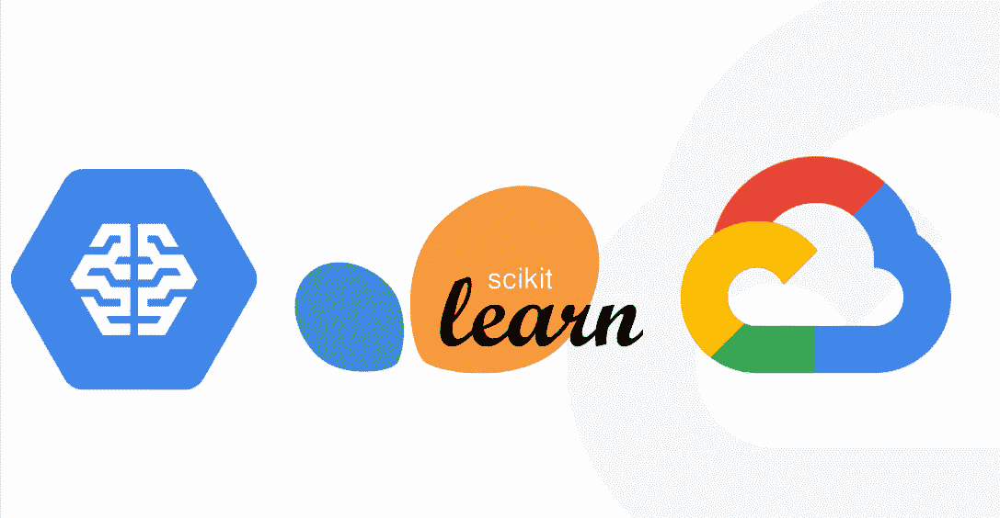

# 在 GCP 使用 scikit-learn 和云机器学习引擎的在线预测 API

> 原文：<https://medium.com/google-cloud/online-predictions-api-using-scikit-learn-and-cloud-machine-learning-engine-on-gcp-10f86585e11e?source=collection_archive---------1----------------------->

有时，数据科学家需要公开他们的机器学习模型，以供团队的其他成员(例如后端开发人员)或最终用户直接使用。在这些情况下，实现 API 是有用的。

这篇文章将解释训练一个模型的步骤，在[谷歌云存储](https://cloud.google.com/storage/)上存储分类器，以及使用[云机器](https://cloud.google.com/ml-engine/) …