# OpenCensus 和 Firestore Native

> 原文：<https://medium.com/google-cloud/opencensus-and-firestore-native-34bc1e3a962f?source=collection_archive---------1----------------------->

## 混搭

**2018–11–02 更新** w/ Kubernetes 部署(见结尾)

在我最受欢迎的一个故事中，我从使用数据存储的 Google 示例应用引擎 Flex 应用开始，比较了 Flex 和 Kubernetes 之间的部署。最近，我采用了相同的样本，并添加了 [OpenCensus](https://opencensus.io) 。离开一段时间后，我想重温一下 OpenCensus，并决定试驾一下 [Cloud Firestore](https://firebase.google.com/docs/firestore/) (原生)。

因此，OpenCensus 和 Firestore Native 是双向的:输出到 [Stackdriver](https://cloud.google.com/stackdriver/) 和 [Prometheus](https://prometheus.io/) 。随着旋转通过 [zpages](https://opencensus.io/core-concepts/z-pages/) 。

## 设置

```
PROJECT=[[YOUR-PROJECT]]
BILLING=[[YOUR-BILLING]]gcloud projects create ${PROJECT}gcloud beta billing projects link ${PROJECT} \
--billing-account=${BILLING}gcloud services enable firestore.googleapis.com --project=${PROJECT}
```

我们最初将在 GCP 之外运行客户端代码，如果我做得好，我们也将把它部署到 Kubernetes。出于这些原因和良好实践，我们将根据我们的需求创建一个服务帐户:

```
ROBOT=firestore-oc
EMAIL=${ROBOT}@${PROJECT}.iam.gserviceaccount.comgcloud iam service-accounts create $ROBOT \
--display-name=$ROBOT \
--project=$PROJECTgcloud iam service-accounts keys create ./key.json \
--iam-account=${ROBOT}@${PROJECT}.iam.gserviceaccount.com \
--project=$PROJECTfor ROLE in datastore.user cloudtrace.agent monitoring.metricWriter
do
  gcloud projects add-iam-policy-binding $PROJECT \
  --member=serviceAccount:${EMAIL} \
  --role=roles/${ROLE}
done
```

> **NB** Firestore 的 IAM 角色被称为`datastore.user`反映了它的祖先。
> 
> **NB** 生成一个密钥(`key.json`)并存储在当前目录中。当您调用客户机时，您需要引用这个密钥文件。

## 客户

我提到过这个客户是一个混搭:

*   带有数据存储示例的 Google App Engine Flex[[链接](https://github.com/GoogleCloudPlatform/golang-samples/tree/master/appengine_flexible/datastore) ]
*   OpenCensus Quickstart Go [ [链接](https://opencensus.io/quickstart/go)
*   Firestore Golang 文档[ [链接](https://godoc.org/cloud.google.com/go/firestore)

第 28–31 行定义了代表我们将存储在 Firestore 中的文档的`visit`类型。

第 39–46 行定义了 OpenCensus 对象。

> 在我看来，这个术语令人困惑，尤其是当你与不同的工具(例如 OpenCensus、Prometheus 和 Stackdriver)交互时，每个工具都有自己的术语。在 OpenCensus 中，我们用元数据`Record`一个`Measure`可能`Tagging`这些。我们必须将每个`Measure`聚合成一个或多个`Views`。`Views`是`Exported`一个或多个监控工具，如 Stackdriver、Prometheus。

第 56–60 行创建一个 Firestore 客户端，并确保在我们完成后关闭该客户端。

第 63–65 行是我们注册的地方(这里是上面定义的`latencyView`)。

第 67–75、77–82 行分别为 Stackdriver(监控)和 Prometheus 定义了导出器。很可能你会使用一个或多个不同的出口商，并且有越来越多的[列表](https://opencensus.io/guides/exporters/supported-exporters/)已经集成了 OpenCensus。

> 集成平台的列表因语言而异。我认为我们有理由假设有一个目标来确保每个解决方案在所有语言中都能工作。

第 85–86 行记录了出口商。

第 92–95 行将 Stackdriver (Trace)注册为客户端跟踪的导出器。

> **NB** Stackdriver 是一个跨多个解决方案的品牌，包括 Stackdriver 监控、Stackdriver 日志记录、Stackdriver 跟踪、Stackdriver 错误报告。而普罗米修斯则专注于监控。提供踪迹的普罗米修斯的好伙伴是耶格[ [链接](https://www.jaegertracing.io) ]。

第 97–124 行创建了 3 个 go 例程，每个例程运行一个 http 服务器。第一个是运行在 root ( `/`)端口`8080`上的 Firestore 的普通前端。第二个是端口`9100`上`/metrics`的普罗米修斯(基于拉的)指标导出器。第三个是`/rpcz`上的 OpenCensus zpages [ [link](https://opencensus.io/core-concepts/z-pages/) 和`7777`上的`/tracez`。作为监视和跟踪解决方案的轻量级伴侣，zpages 提供了调试和监视我们的应用程序的极好方法。

第 127-158 行定义了 Firestore 的一个普通前端(暴露在端口`8080`上的`/`)。每次刷新检索添加到 Firestore 的 10 个最新文档(按时间戳),并向 Firestore 添加一个新文档。由于缺少一些随机和有趣的东西，文档由 guids 来控制。在本节中，我们开始将跟踪跨度串连在一起。

> **NB** 第 133 行中名为`handler`的跨度消耗上下文并返回(修改后的)上下文。返回的上下文传播该范围，以便使用该上下文创建的后续范围被视为其子范围。在第 145 行，名为`RecordVisit-Outside`的跨度是用这个修改后的上下文创建的，但是它不返回修改后的上下文。因此，后续跨度将是`handler`的子跨度，而不是`RecordVisit-Outside`的子跨度。当我们打开 Stackdriver Trace 时，我们将看到这一点。

第 160–195 行定义了`recordVisit`，这个函数创建一个新的`visit`文档，并将它保存到 Firestore。第 166-174 行是奇迹发生的地方。这段代码摘自 OpenCensus 文档。我们取函数的调用开始时间(忽略花费在日志记录上的时间)，然后定义一个延迟函数。延迟的函数将在函数调用结束时运行，此时，我们将再次获取时间并计算出所用的时间，将此持续时间记录为我们的 OpenCensus 度量，标记它(可能与函数名重复)并记录它。第 188–192 行定义了一个名为`RecordVisit-Inside`的跨度，它将是`handler`的子跨度(不是`RecordVisit-Outside`)。在这里，我们还获得了一个指向集合`visits`的 Firestore `CollectionRef`，一个 Firestore `DocumentRef` 是使用一个新的键(guid)创建的，然后文档(在第 176–179 行创建)被持久化。

第 197–241 行定义了`queryVisits`，该函数查询 Firestore `visits`集合中最近的 10 个文档。唯一新颖的特性是使用 Firestore 查询在抓取前 10 名之前对收集的`visits`进行排序。

唷！

## 乐趣

我们启用了 Firestore，但没有创建它。如果我没弄错的话，您必须通过云控制台来完成此操作，用正确的值替换`${PROJECT}`，浏览:`[https://console.cloud.google.com/firestore/?project=${PROJECT](https://console.cloud.google.com/firestore/?project=${PROJECT})}`并选择 3 号门“纯模式下的云 Firestore”:

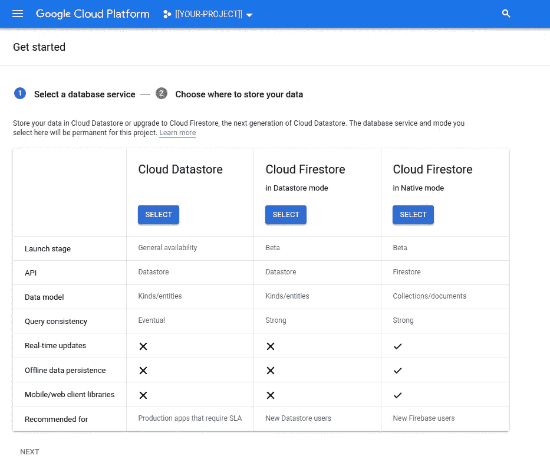

单击“下一步”，在“创建数据库”之前选择最适合您的位置。如果一切正常，您应该会看到 Firestore 控制台。保持此选项卡打开:

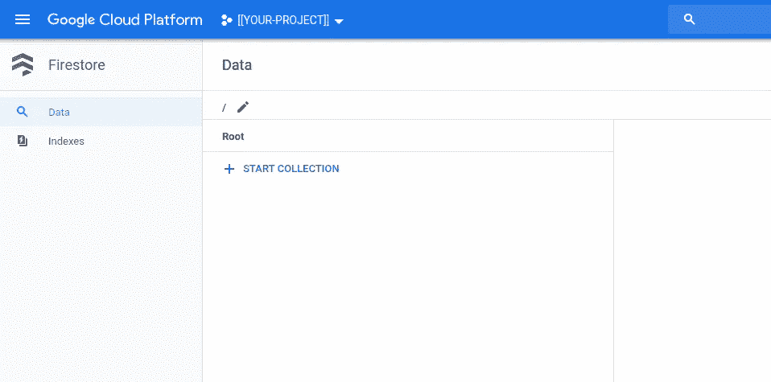

运行客户端(服务器？):

```
PROJECT_ID=${PROJECT} \
GOOGLE_APPLICATION_CREDENTIALS=path/to/key.json \
go run firestore.go
```

如果一切顺利，您应该能够在各自的端点上与服务器进行交互:

## Firestore 客户端(`localhost:8080/`

第一次不是很有趣:

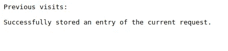

试几下吧！

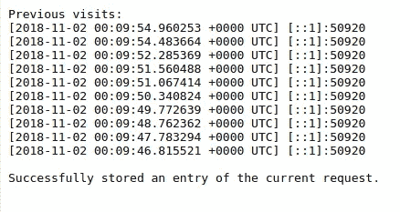

当然，在 10 之后，值将继续变化，但是列表长度将保持为 10。

如果您现在刷新 Firestore 控制台页面，您应该会看到所有新创建的文档:

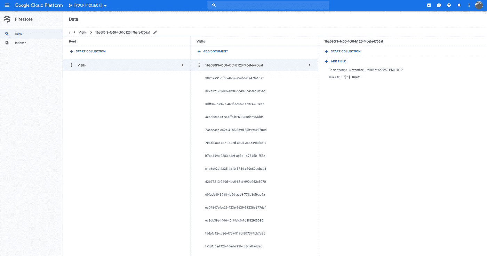

## 页面(http://localhost:7777)

`/rpcz`上的 RPC 统计:

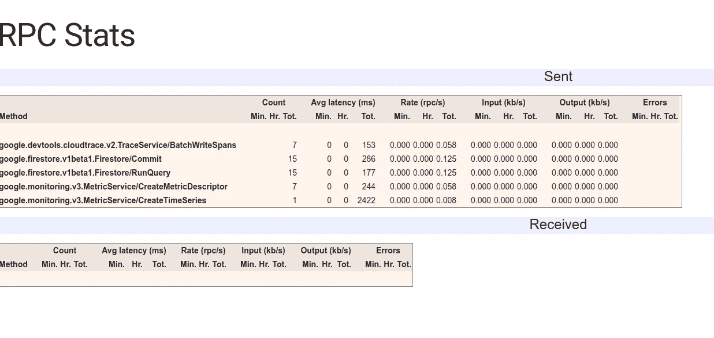

并追踪`/tracez`的统计数据:

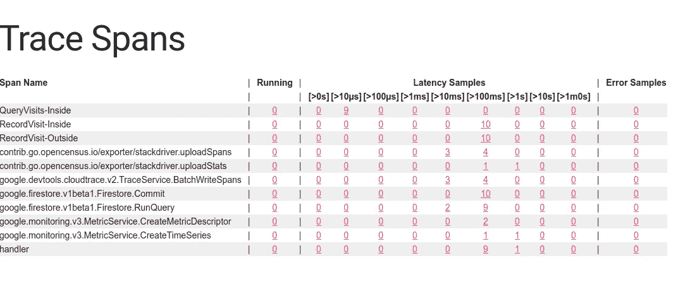

## 普罗米修斯度量端点(http://localhost:9100/metrics)

约定将指标端点放在端口`9100`上的`/metrics`:

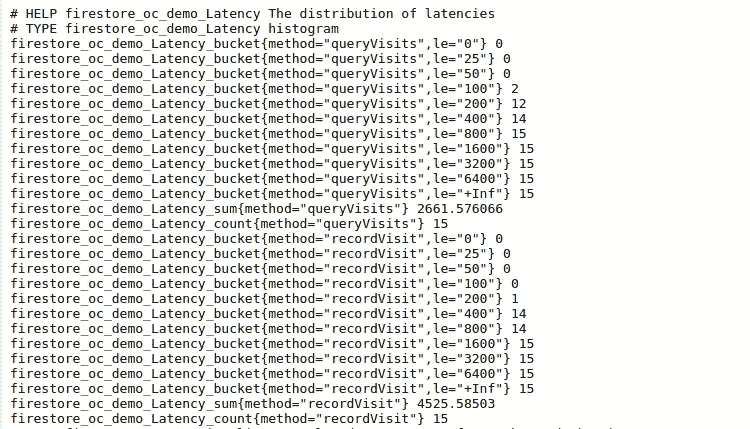

虽然您的值会有所不同，但是请注意前缀`firestore_oc`，这是我们在创建导出器时提供给它的名称空间的值。`demo_latency`是 OpenCensus 测量名称(`demo/Latency`)的普罗米修斯形式，我们定义的直方图呈现为一个桶，其桶大小为 I(！)在我的代码中使用，但**不是**这里使用的值【为这个疏忽道歉】。

## 堆栈驱动程序跟踪

浏览到控制台页面，查看 Stackdriver Trace: `cloud.console.google.comn/traces/?project=${PROJECT}`同样，请用您的值替换`${PROJECT}`。这将提供一个类似于以下内容的控制台:

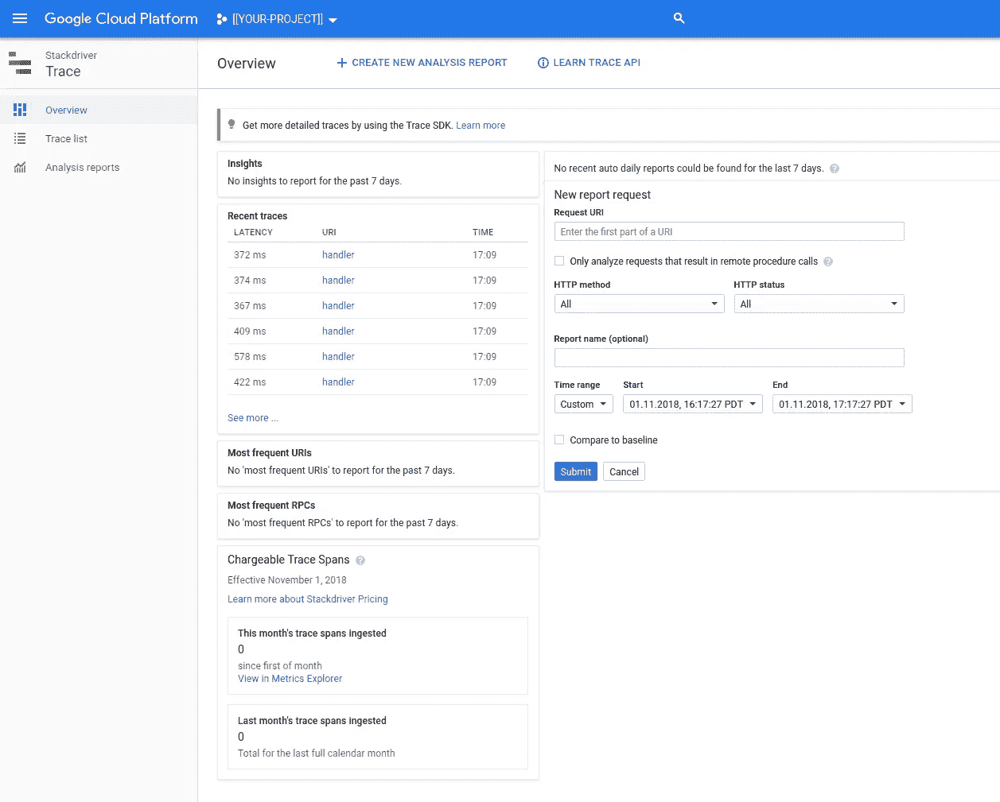

注意“最近轨迹”的 URI 为`handler`，这是我们给自己创建的第一个轨迹跨度起的名字。单击以下任一项:

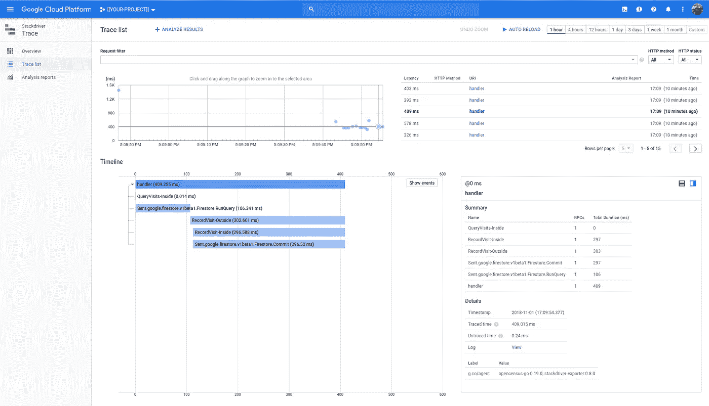

这里发生了很多事。我不会试图涵盖一切。这里你可以看到`handler`是如何成为我们的父 span 的。`RecordVisit-Outside`和`RecordVisit-Inside`是它的子节点。请注意，Firestore 有一些跨度是自动为我们提供的:`Firestore.RunQuery`和`Firestore.Commit`。这是非常有用的，而且随着 Trace 和 OpenCensus 的发展，需要更少的开发人员干预和更多的开箱即用的魔法。

## 堆栈驱动程序监控

如果还没有，您将需要将您的项目添加到新的 Stackdriver 工作区，或者将您的项目添加到现有的 Stackdriver 工作区。对于像这样的一次性项目，我也创建了一个新的(一次性)工作空间。你的选择。

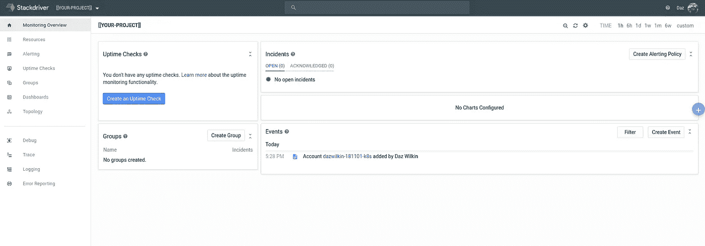

从“Resources”中选择“Metrics Explorer ”,您应该能够浏览现在包括名为`firestore_oc/demo/Latency`的(自定义指标)和多个`firestore_oc/grpc.io`前缀指标的指标。

我在上面暗示了这些自动生成的指标。Google 已经装备了它的 gRPC 库，因此，在 OpenCensus 中使用这些库可以免费获得指标。

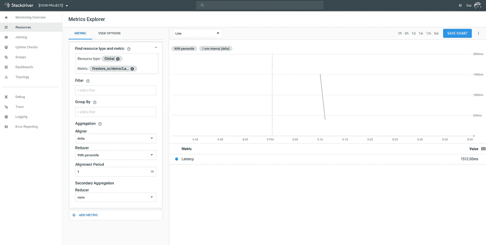

坦率地说，我不理解这个图表。

Prometheus Metrics Exporter 实现了我的预期。它显示了延迟值直方图。在我们的代码中，我们创建了一个直方图视图。Stackdriver 为我们提供了一个度量(这又是一个命名挑战)，但是这个度量代表 OpenCensus 度量(不是视图)。因此，如果我看到与每次刷新 Firestore 客户端时记录的每个延迟相对应的一系列点，这将是有意义的(暂且不提名称)。但是，这个似乎没有做到这一点。

**假设** : Stackdriver 有这个 60s 的报告周期。也许我只是需要更多的数据？

让我们看看:

```
for TEST in {1..1000}
do
  curl [http://localhost:8080/](http://localhost:8080/)
  sleep 0.5s
done
```

嗯……也许就是这样:

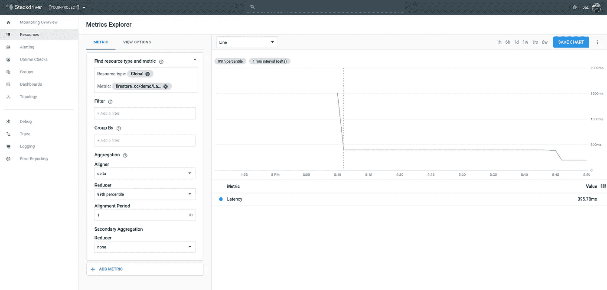

## 结论

我直到昨天才使用 Firestore，所以这篇文章部分是关于 Firestore 的。我的主要动机是重新连接 OpenCensus，所以我们转换了一个现有的基于数据存储的应用程序来使用 Firestore，然后放了一个 OpenCensus bow。

仅此而已！

# 整理

您可以不可撤销地删除整个项目:

```
gcloud projects delete ${PROJECT} --quiet
```

或者，您可以删除访问集合:

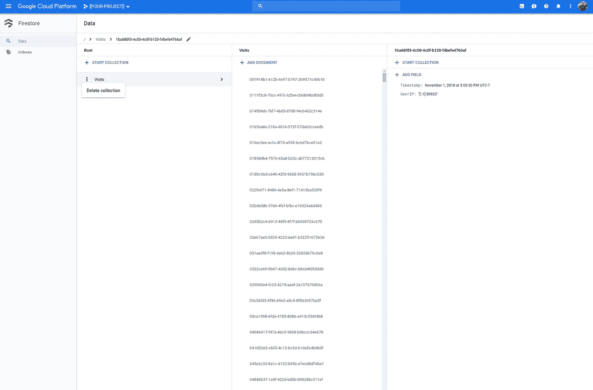

我觉得(！？)您不能从项目中完全删除 Firestore。嗯嗯:

```
gcloud services disable firestore.googleapis.com \
--project=${PROJECT}
Operation "operations/acf.89e3a772-66c5-4ab8-bf08-03a1db8fbf6a" finished successfully.
```

但是:

```
gcloud services list \
--project=$PROJECT \
| grep firestore
firestore.googleapis.com                Cloud Firestore API
```

## 库伯内特斯

使解决方案可移植的微小代码更改(通过移除 Linux 的“uuidgen”依赖性):

```
import (
    ...
    "github.com/google/uuid"
    ...
)func recordVisit ... {
    ...
    u, err := uuid.NewRandom()
    if err != nil {
        log.Println(err)
    }
    key := u.String()
    log.Printf("Key: %v", key)
    ...
}
```

这些更改应该在代码功能没有任何明显变化的情况下编译和运行。

Dockerfile:

然后构建它，运行它，如果它能按预期工作，就把它推到注册表中:

```
DOCKERHUB=[[YOUR-DOCKERHUB-USERNAME]]
TAG="firestore-oc:181102"docker build \
--file=Dockerfile \
--tag=${DOCKERHUB}/${TAG} \
.docker run \
--interactive \
--tty \
--publish=7777:7777 \
--publish=8080:8080 \
--publish=9100:9100 \
--env=PROJECT_ID=${PROJECT} \
--env=GOOGLE_APPLICATION_CREDENTIALS=/keys/key.json \
--volume=$PWD/key.json:/keys/key.json \
${TAG}docker push ${DOCKERHUB}/${TAG}
```

我们需要在 Kubernetes 中反映服务帐户键，并为映像创建一个部署:

```
kubectl create secret generic firestore-oc \
--from-file=key.json=./key.181102.json
```

Deployment.yaml(包括服务):

> **NB** 别忘了换掉`${DOCKERHUB}`、`${TAB}`和`${PROJECT}`。

并且:

```
kubectl apply --filename=deployment.yaml
```

第一个测试是将端口转发到部署创建的单个 pod:

```
kubectl port-forward $(\
  kubectl get pod \
  --selector=app=firestore-oc \
  --output=jsonpath="{.items[0].metadata.name}") \
8080:8080 \
7777:7777 \
9100:9100
```

一切都应该和以前一样，你应该可以访问`:8080`、`:7777/rpcz`(或`:7777/tracez`)和`:9100/metrics`上的服务。

然后，如果您愿意，我们可以通过公开的节点端口，通过计算引擎实例之一来访问服务:

```
NODE=$(\
  kubectl get nodes \
  --output=jsonpath="{.items[0].metadata.name}")CLIENT=$(\
  kubectl get services/firestore-oc \
  --output=jsonpath='{.spec.ports[?(@.name=="client")].nodePort}')
ZPAGES=$(\
  kubectl get services/firestore-oc \
  --output=jsonpath='{.spec.ports[?(@.name=="zpages")].nodePort}')
METRIX=$(\
  kubectl get services/firestore-oc \
  --output=jsonpath='{.spec.ports[?(@.name=="metrics")].nodePort}')gcloud compute ssh ${NODE} \
--ssh-flag="-L 8080:localhost:${CLIENT}" \
--ssh-flag="-L 7777:localhost:${ZPAGES}" \
--ssh-flag="-L 9100:localhost:${METRIX}" \
--project=$PROJECT
```

如果您正在使用 Kubernetes 引擎，并且也想提供一个 HTTP/S 负载均衡器，那么您可以`apply`下面的`ingress.yaml`只公开(为了简单起见)客户端应用程序:

```
---
apiVersion: extensions/v1beta1
kind: Ingress
metadata:
  name: firestore-oc
spec:
  backend:
    serviceName: firestore-oc
    servicePort: 8080
...
```

完成后，如果您创建集群只是为了探索这个问题，那么您可能(不可挽回地！)用以下内容删除:

```
gcloud container clusters delete ${CLUSTER} \
--project=${PROJECT} \
--region=${REGION}
```