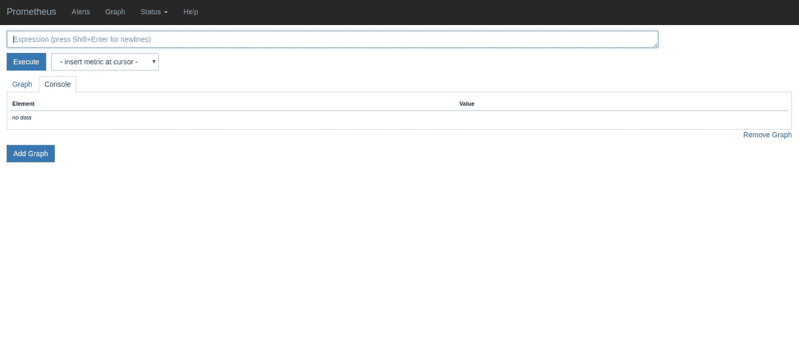
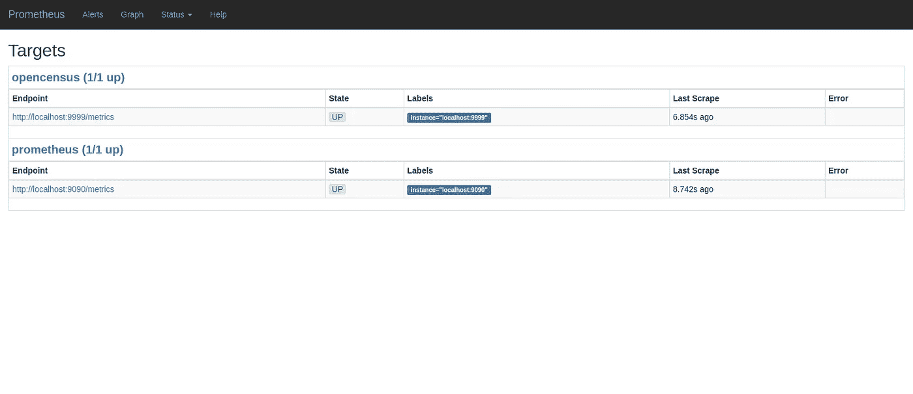
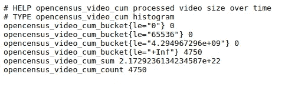
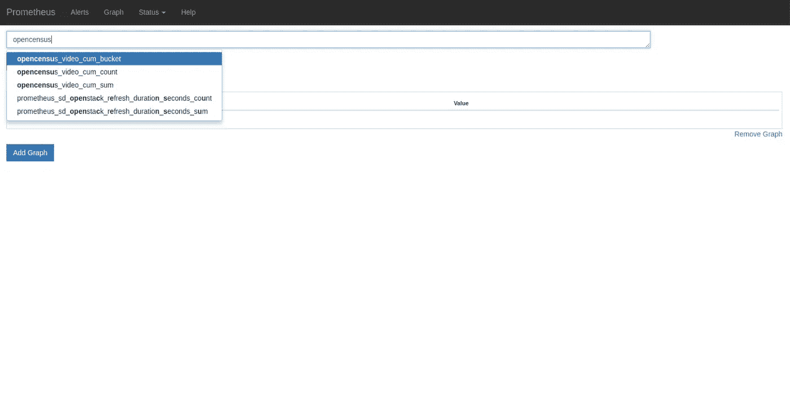
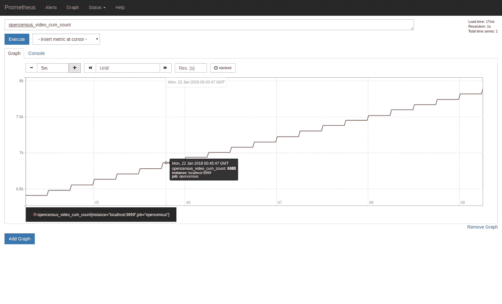
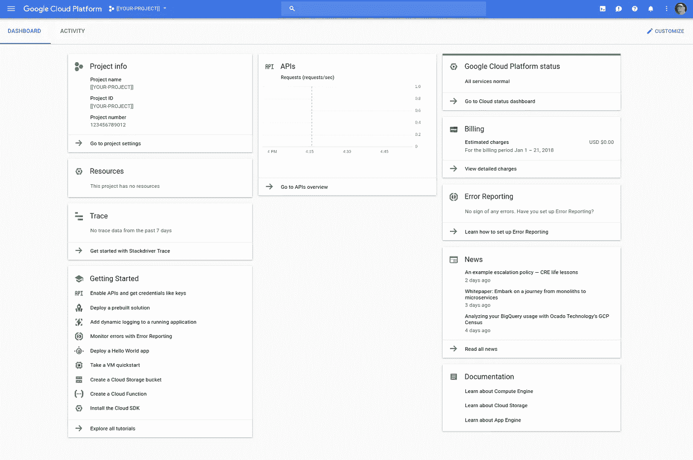
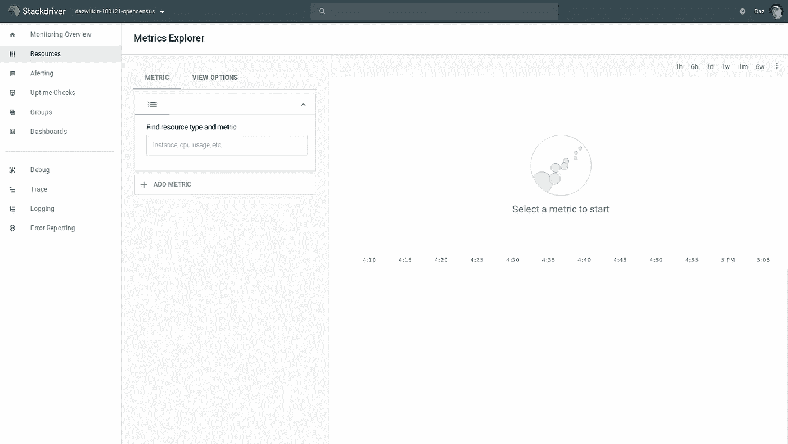
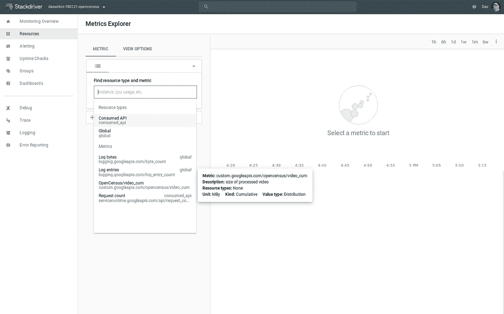
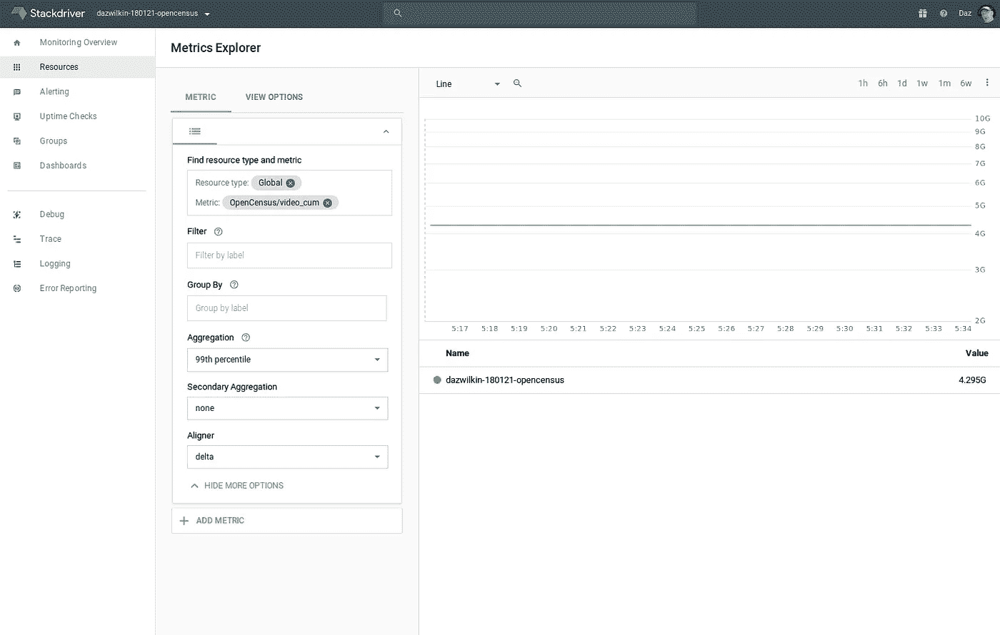

# 开放人口普查，带普罗米修斯和斯塔克德瑞

> 原文：<https://medium.com/google-cloud/opencensus-and-prometheus-66812a7503f?source=collection_archive---------0----------------------->

> 2018**–02–13**:自从写了这个帖子，Golang SDK 就在发展，这里提到的 bug 也解决了。我写了一篇新的[帖子](/@DazWilkin/return-to-opencensus-42623f1b55b8)来反映@JDB 对图书馆的更新。请阅读那个帖子。感谢 [JBD](https://medium.com/u/1737b4e67578?source=post_page-----66812a7503f--------------------------------) ！

我的一个客户的建筑师告诉我 OpenCensus 的存在。我想我应该在我将 Kubernetes 部署到我的 Raspberry Pi 集群的时候检查一下(见 Alex Ellis 的精彩[帖子](https://gist.github.com/alexellis/fdbc90de7691a1b9edb545c17da2d975))。

OpenCensus 是谷歌发起的一个项目，“自动从你的应用程序中收集轨迹和指标，在本地显示，并将其发送给任何分析工具”。

我将向您展示使用 Golang 与 [Prometheus](https://prometheus.io/) 和 [Stackdriver](https://cloud.google.com/stackdriver/) 的两种工作方式……这是一个小骗局，因为区别实际上是一行代码的更改，但这展示了该工具的实用性。

## 设置

```
PROJECT=[[YOUR-PROJECT]] # Only needed for Stackdriver
DIR="/tmp/OpenCensus"mkdir -p ${DIR}/go
export GOPATH=${DIR}/go
export PATH=${PATH}:${GOPATH}/bingo get -u go.opencensus.io/...
```

## 公开普查

Golang SDK 中有一个 [bug](https://github.com/census-instrumentation/opencensus-go/pull/191) ，当创建多个度量时会出现这个 bug。目前，这里的普罗米修斯[样本](https://github.com/census-instrumentation/opencensus-go/blob/master/examples/stats/prometheus/main.go)简化为使用一个单一的测量；这是对示例的一个小改动，这样它就可以工作了:

你可以在`${DIR}/go/src`下的任何地方创建这个文件。惯例是，如果你有一个，你就在`github.com/[YOUR-GITHUB]`下创建它。但是，如果你愿意，你可以简单地在`${DIR}/go/src`下创建一个名为 prometheus.go 的文件。

从该目录中:

```
go run [YOUR-FILENAME].go
```

应报告:

```
2018/01/21 16:02:37 Serving at :9999
```

然后你可以卷曲或浏览到终点:

```
curl localhost:9999/metrics# HELP opencensus_video_cum processed video size over time
# TYPE opencensus_video_cum histogram
opencensus_video_cum_bucket{le="0"} 0
opencensus_video_cum_bucket{le="65536"} 0
opencensus_video_cum_bucket{le="4.294967296e+09"} 0
opencensus_video_cum_bucket{le="+Inf"} 11
opencensus_video_cum_sum 3.753271169191e+19
opencensus_video_cum_count 11
```

这个(指标)数据是普罗米修斯的[出口商](https://prometheus.io/docs/instrumenting/exporters/)格式，这意味着我们可以将普罗米修斯服务器指向这个端点。因此，让我们创建一个 Prometheus 配置并运行一个 Prometheus 服务器。请让您的代码运行。

## 普罗米修斯

Prometheus 是用 prometheus.yml 文件配置的(按照惯例)。以下文件是一个简单的配置。它定义了两个 scrape _ configs。首先是让普罗米修斯监控自己(`localhost:9090`)。第二是让普罗米修斯监控我们刚刚创建的公开普查措施。我建议您在创建 Go 文件的同一个目录中创建这个文件。

现在，从该目录运行以下 Docker 命令，启动使用此配置的 Prometheus 服务器:

```
docker run \
--net=host \
--publish=9090:9090 \
--volume=$PWD/prometheus.yml:/etc/prometheus/prometheus.yml \
prom/prometheus
```

然后，您应该能够浏览(不要使用 curl)Prometheus 服务器:

[http://localhost:9090](http://localhost:9090)



普罗米修斯“图”

要确认 Prometheus 服务器正在监控自身和 OpenCensus 端点，请单击“状态”,然后单击“目标”,或者:

[http://localhost:9090/targets](http://localhost:9090/targets)



普罗米修斯“目标”

这表明普罗米修斯正确地(`State==”UP”`)监控着“公开普查”目标(在`localhost:9999/metrics`)和它自己“普罗米修斯”(在`localhost:9090/metrics`)。例如，您可以单击这些 URL 中的任何一个来查看 OpenCensus 指标:

[http://localhost:9999/metrics](http://localhost:9999/metrics)



OpenCensus“示例”

Golang 示例包括一个 go-routine，它在几毫秒的随机时间后测量随机大小的视频。每次你刷新`localhost:9999/metrics`，你会看到，例如，opencensus_video-cum_count 增加。我们将使用这个值来显示 Prometheus 的内置图形。

返回到[http://localhost:9090/graph](http://localhost:9090/graph)，开始输入“opencensus”。选择“opencensus_video_cum_count”:



普罗米修斯:过滤“公开普查”

点击“执行”并选择“图形”:



普罗米修斯" opencensus_video_cum_count "

当你完成后，你可以 CTRL-C 来终止 Prometheus 服务器和你的 Golang 样本。

## 堆栈驱动程序

Stackdriver (accounts)必须通过控制台创建。因此，我们将采取不同的轨迹，使用谷歌云控制台(console.cloud.google.com)创建一个项目，然后创建一个 Stackdriver 帐户。然后，我们将更改 Golang 示例中的几行，重新运行它并显示向 Stackdriver 报告的度量。

创建一个谷歌云平台项目:

[https://console.cloud.google.com/projectcreate](https://console.cloud.google.com/projectcreate)



Google 云控制台“[[您的项目]]”

然后创建一个 Stackdriver 帐户:

[https://console.cloud.google.com/monitoring?project=](https://console.cloud.google.com/monitoring?project=dazwilkin-180121-opencensus)[[你的项目]]

一旦 Stackdriver 控制台准备就绪，选择“Resources”和“Metric Explorer”:



Stackdriver:度量浏览器

这一次，我们将使用 OpenCensus Stackdriver [示例](https://github.com/census-instrumentation/opencensus-go/blob/master/examples/stats/stackdriver/main.go)作为我们代码的基础。我们将修改 Golang 导入(“stackdriver”而不是“prometheus”)并创建一个 stackdriver。NewExporter 而不是 Prometheus . new exporter。stack driver exporter 需要配置我们的 GCP 项目 ID:

```
exporter, err := stackdriver.NewExporter(stackdriver.Options{
  ProjectID: "[[YOUR-PROJECT]]",
 })
```

> 度量和视图的代码保持不变，这正是我们所期望的。

Prometheus 和 Stackdriver 模型还有一个不同之处。普罗米修斯是一个基于民意调查的解决方案。Prometheus 希望轮询端点(如`localhost:9999`)以获取指标数据。Stackdriver 是一个基于推送的解决方案。

因此，我们还将删除 Prometheus 示例中使用的 http 服务器，它按需提供度量，并让 Stackdriver 示例运行一段时间，在生成度量时将度量记录到 Stackdriver 中。

下面的代码运行 15 分钟:

> **NB** 别忘了用你的 Google 云平台项目 ID 替换第 18 行的项目 ID 值。

和以前一样，您可以运行示例:

```
go run [YOUR-FILENAME].go
```

Stackdriver 示例运行后，返回 Stackdriver 控制台，刷新页面并搜索以“OpenCensus”开头的指标:



堆栈驱动度量资源管理器“OpenCensus”

经过足够长的时间后，一些指标变得可用，单击 refresh，您应该会在图上看到数据:



stack driver " open census/video _ cum "

**结论**

OpenCensus 提供了一个引人注目的解决方案，用于为您的代码提供度量和跟踪(我们在这里没有涉及跟踪)。该解决方案支持多种语言(包括 Golang)，并支持 Prometheus 和 Stackdriver 进行监控。它还支持 Zipkin 和 Stackdriver 进行跟踪。看看吧！

一如既往，欢迎反馈。