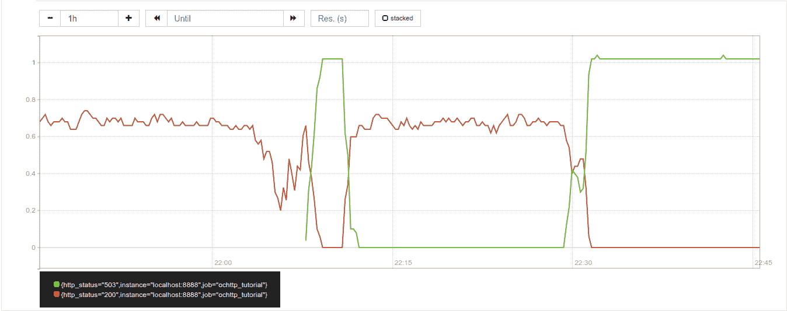
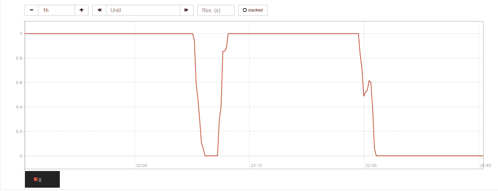

# OpenCensus 和 SLOs

> 原文：<https://medium.com/google-cloud/opencensus-and-slos-93bfe54e25f3?source=collection_archive---------0----------------------->

OpenCensus 页面[事件调试工作流程](https://opencensus.io/guides/debugging/incidents/)给出了使用 OpenCensus 和相关开源工具的路线图，以准备支持生产中的应用程序，快速响应事件，评估范围和严重性，并确定原因。该页面包括一个关于使用 OpenCensus 监控服务水平目标的简短讨论，我想在这里更详细地研究一下。页面中使用的示例应用程序在 Go [HTTP 服务器集成](https://opencensus.io/guides/http/go/net_http/server/)指南中提供。OpenCensus HTTP 集成的好处在于，只需初始化导出器并注册 HTTP 集成视图，就可以获得应用程序代码的基本工具。Prometheus 用作监控后端，用于存储和可视化 OpenCensus 收集的指标数据。其他监控后端，如 [Stackdriver](https://cloud.google.com/stackdriver/) ，也可以通过使用可插入的 OpenCensus 导出库或代理导出器与该应用程序一起使用。然而，Prometheus 有一种方便的查询语言，可以用公式表示出用于计算服务水平指标的表达式。这就是我将在这里展示的。

谷歌[网站可靠性工程](http://shop.oreilly.com/product/0636920041528.do)书将[服务水平目标](https://landing.google.com/sre/sre-book/chapters/service-level-objectives/) (SLO)定义为“由 SLI 测量的服务水平的目标值或值的范围。”服务水平指标(SLI)是“所提供的服务水平的某个方面的定量测量”OpenCensus 页面上给出的示例是在一分钟间隔内计算的成功 HTTP 响应与总响应的比率:

```
SLI = QPS_200 / QPS
```

其中 QPS_200 是每秒有 2xx(成功)响应的请求(查询), QPS 是每秒的请求总数。这是一个非常简单的 SLI，但有局限性。正如 OpenCensus 页面中提到的，黑盒探测器是更好的选择，可以更好地代表用户体验。无论如何，现在让我们从服务器上测量的成功率开始，看看它是如何处理 SLO 违规的。

# 模拟 SLO 违规

让我们假设我们将 SLO 设为 99.9%。也就是说，如果少于 99.9%的请求在一分钟内被成功返回，那么我们就离开了 SLO。页面中的示例程序总是模拟成功的结果，这不是很令人兴奋，所以让我们更改它以生成一些错误。我们可以从均匀随机分布中产生误差，但这不像区域断电展开。低级别的后台错误可以很容易地通过重试来处理，通常不会导致停机。如果我们只离开 SLO 一分钟，对商业的影响不会太严重。大多数停机都是由于错误的配置推送、软件错误、相关服务故障或未包含的局部故障造成的。

让我们考虑未包含的局部故障。这些会导致级联故障的重大事故，对业务产生重大影响。例如，假设您有一个服务器故障，将流量转移到第二台服务器。但是，第二台服务器已经承载了大量负载，因此也会失败。失去两台服务器后，突然转移的负载会导致更多服务器停机。我们可以用[随机行走](https://www.mit.edu/~kardar/teaching/projects/chemotaxis(AndreaSchmidt)/random.htm)对此建模，而不是误差的随机均匀分布。二维空间中的随机行走就像一只昆虫在地面上随机游荡，不可预测地远离它的原点。我们可以用一个变量中随机增量的累积来模拟一维的随机行走。这就像现实生活一样，我们会得到随机的变化，它会逐渐偏离正常状态，越过一个可接受的点，到达一个不太可能回到原来可接受状态的值。

基于 OpenCensus [Go HTTP 服务器指南](https://opencensus.io/guides/http/go/net_http/server/)中的示例代码，我们添加了一个模拟随机行走的函数。如果它超过了给定的阈值，那么我们返回一个失败。示例 Go 代码的第一个修改应该添加在 import 语句之后:

```
type randomWalkBool struct { maxInc, intVal, threshold int}func (rw *randomWalkBool) nextValue() bool { rw.intVal += rand.Intn(rw.maxInc) — rw.maxInc / 2 return rw.intVal < rw.threshold}
```

该结构中的 intVal 字段存储一个累积量，该累积量随着对函数 nextValue()的每次调用而随机变化。我们可以在主函数中实例化它，增量大小如下:

```
func main() { rwSuccess := randomWalkBool{999, 0, 400}
```

我花了一点实验来得出模拟失败的参数值，因为我没有研究随机行走的统计理论。当我们收到一个 HTTP 请求时，如果下一个值高于阈值，我们将返回一个服务器错误:

```
originalHandler := http.HandlerFunc(func(w http.ResponseWriter, r *http.Request) { … if !rwSuccess.nextValue() { http.Error(w, “You got unlucky”, http.StatusServiceUnavailable) return }
```

# 在 Prometheus 中绘制服务水平指标

请求速率可以使用 [Prometheus 查询语言](https://prometheus.io/docs/prometheus/latest/querying/basics/)在 1 分钟的时间间隔内通过以下表达式进行计算:

```
rate(ochttp_tutorial_opencensus_io_http_server_response_count_by_status_code[1m])
```

请求率的图表视图如下所示。



**截图:普罗米修斯控制台**中的请求率视图

绿线是错误率，红线是成功请求率。SLI 的简单计算由直接翻译 SLI 公式的表达式给出:

```
rate(ochttp_tutorial_opencensus_io_http_server_response_count_by_status_code{http_status=~”2.*”}[1m]) / rate(ochttp_tutorial_opencensus_io_http_server_response_count_by_status_code[1m])
```

这方面的图表如下所示。


**截图:SLI 的简单计算**

这是一个有点令人失望的连续值 1.0 打破 be 没有价值。普罗米修斯最佳实践页面上的[直方图和摘要](https://prometheus.io/docs/practices/histograms/)提出了一个更好的公式:

```
sum(rate(ochttp_tutorial_opencensus_io_http_server_response_count_by_status_code{http_status=~”2.*”}[1m])) / sum(rate(ochttp_tutorial_opencensus_io_http_server_response_count_by_status_code[1m]))
```

这将生成以下图表:



**截图:SLI 更好的计算**

那看起来好多了。但是等等。我们出 SLO 了！下一步将是设置警报，这样你就可以发现你不在 SLO，并迅速做出反应。